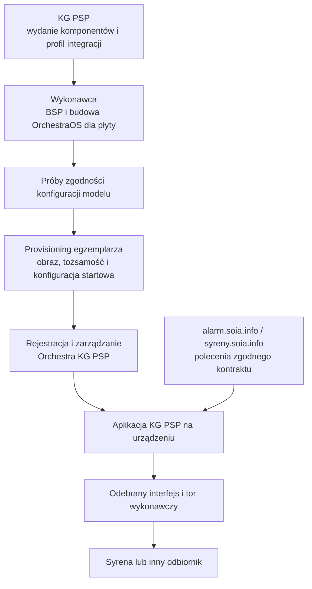

[← Wytyczne SOiA](README.md)

# Platforma sterownika i provisioning KG PSP

**Nowy sterownik włączany do zarządzanego systemu KG PSP ma działać na zgodnym obrazie Linux opartym na Yocto Project i OrchestraOS.** Wykonawca przygotowuje system dla swojej płyty z komponentów wydania udostępnionego przez KG PSP na wniosek. KG PSP dostarcza aplikację realizującą logikę poleceń. Sprzęt, system bazowy, aplikacja i połączenie z syreną podlegają odrębnym, powiązanym sprawdzeniom.

To wymaganie platformy i interoperacyjności, a nie wskazanie marki mikrokomputera. Nazwy OrchestraOS, Orchestra Manager, Orchestra SDN i RAUC określają środowisko KG PSP, z którym urządzenie ma współpracować. Przygotowanie konkretnego zamówienia obejmuje udokumentowane interfejsy, warunki dostępu i kryteria równoważności zgodne z [Z11](zalaczniki/Z11-ZAPISY-DO-OPZ.md).

## Role w systemie

| Warstwa | Odpowiedzialność |
| --- | --- |
| alarm.soia.info i syreny.soia.info | Operacyjne zarządzanie uruchamianiem syren w granicach procedur i uprawnień; właściwy kontrakt poleceń. |
| Orchestra Manager i właściwa droga SDN | Techniczna ewidencja, konfiguracja, telemetria, dostęp i utrzymanie sterowników. |
| OrchestraOS i BSP | Rozruch konkretnej płyty, obsługa sprzętu, ochrona, usługi i środowisko aplikacji. |
| Aplikacja KG PSP | Walidacja polecenia, adresata, czasu i historii, arbitraż oraz wybór funkcji wykonawczej. |
| Interfejs sprzętowy | Udokumentowany dostęp do modemu, audio/PTT, I/O i diagnostyki; dopasowanie zapewnia wykonawca. |
| Syrena lub inny element wykonawczy | Fizyczny efekt zgodny z profilem i odbiorem obiektu. |

Manager nie jest źródłem niezależnej decyzji alarmowej. Flota aktualizacyjna nie wyznacza obszaru alarmowania. Zmiana grupy urządzenia nie zmienia automatycznie jego TERC, uprawnień lub mapy wyjść. Chwilowa niedostępność zarządzania nie powinna zatrzymywać lokalnej aplikacji ani wykonania poprawnego polecenia dostarczonego działającym kanałem.

## Pakiet komponentów przekazywany wykonawcy

Wniosek wykonawcy identyfikuje zamówienie, model i rewizję płyty, procesor, wyposażenie oraz wymagany profil. KG PSP wskazuje wydanie komponentów, zakres praw i właściwe środowisko integracji. Numer formularza, dane dostępowe i kanał przekazania są ustalane poza publikacją.

| Część pakietu | Wymagany zapis |
| --- | --- |
| Komponenty Yocto i OrchestraOS | Wersje źródeł, warstwy, receptury, manifest i niezbędne zależności. |
| Profil sprzętowy i bezpieczeństwa | Obsługiwane funkcje, ochrona rozruchu, kluczy, portów i serwisu. |
| Kontrakt interfejsów | Metody, pola, uprawnienia, statusy i błędy widziane przez aplikację KG PSP. |
| Warunki pracy aplikacji | Środowisko, trwałe dane, autostart, zasoby i sposób instalacji pakietu KG PSP. |
| Zarządzanie i aktualizacje | Przyłączenie do instancji Orchestra, zaufanie, RAUC, A/B i odtworzenie. |
| Odbiór | Wektory i pakiet kontrolny, scenariusze oraz sposób utrwalenia dowodów. |

Yocto Project jest środowiskiem budowy systemu Linux dla określonego sprzętu; BSP opisuje obsługę płyty. Sam taki sam procesor nie zapewnia zgodności obrazu. Wykonawca dostosowuje rozruch, jądro, sterowniki, partycje i lokalne interfejsy. Przekazuje instrukcję odtworzenia budowy, własne zmiany, manifest, obrazy, skróty i SBOM. Potwierdza działanie pakietu KG PSP bez zmiany jego logiki.

Źródła i prawo do ich budowy nie są prywatnym kluczem podpisującym produkcyjne wydania. Podpisanie i przyjęcie obrazu odbywa się zgodnie z domeną zaufania KG PSP. Aktualizacja jest wersjonowana; nieudany rozruch uruchamia kontrolowany powrót przy zachowaniu tożsamości i historii poleceń. Ochronę rozruchu sprawdza się osobno od podpisu paczki aktualizacyjnej.

## Przyjęcie modelu i przygotowanie egzemplarza

Najpierw sprawdza się konfigurację modelu: płytę, OS/BSP, interfejsy, zasoby, aktualizację i pracę aplikacji. Dopiero ta konfiguracja jest podstawą przygotowania egzemplarzy. Istotna zmiana rewizji lub podzespołu wymaga oceny zakresu ponownych prób.

Provisioning egzemplarza obejmuje dopuszczony obraz, indywidualną tożsamość, konfigurację startową, rejestrację i przypisanie. ZTP upraszcza uruchomienie dzięki wcześniejszemu przygotowaniu; nie oznacza automatycznego zaufania do dowolnego urządzenia, które pojawiło się w sieci.

| Stan przygotowania | Co potwierdza |
| --- | --- |
| Model zgodny | Konfiguracja przeszła właściwe próby. |
| Egzemplarz przygotowany | Znana sztuka ma obraz, własną tożsamość i konfigurację startową. |
| Online w Orchestra | Działa właściwe uwierzytelnione połączenie zarządcze. |
| Aplikacja gotowa | Dostępne są czas, zasoby, interfejsy i właściwy kontrakt. |
| Instalacja odebrana | Potwierdzono wymagane kanały i rzeczywisty tor obiektu. |

Powyższe określenia są etapami odbioru, nie deklaracją nazw statusów obecnego API. Pierwsze połączenie i rejestracja nie wyzwalają próby dźwiękowej. Numer SIM, adres IP, numer seryjny, ID Orchestra i ID syreny są różnymi atrybutami; ewidencja zawiera ich powiązanie.

## Utrzymanie i zakończenie eksploatacji

Zarządzanie ma działać przed instalacją aplikacji, z ograniczonymi rolami i bez publicznej powłoki. Rejestracja, cofnięcie uprawnień, wymiana certyfikatów, zmiana płyty i wycofanie urządzenia mają określoną procedurę i ślad audytowy. Uprawnienie do utrzymania nie jest uprawnieniem do wysłania alarmu.

Dane tożsamości, publiczne klucze weryfikacji feedu i klucze podpisywania obrazów stanowią odrębne domeny. Klucze prywatne urządzeń nie są współdzielone. Publiczna kotwica weryfikacji może być wspólna dla floty.

Mechanizm wdrażania aplikacji należy wskazać dla instancji KG PSP. Opis funkcji produktu, np. zarządzania kompozycjami kontenerów, nie dowodzi jej aktywacji w danej instancji. Aktualizacja OS, pakietu aplikacji i lokalnych zasobów audio jest rozróżniana i potwierdzana po wykonaniu.

## Źródła i status

Podstawa: wizja SOIA.KGPSP v0.3 i wymagania wspólne platformy v0.2 z 10.09.2026, udostępnione w dokumentacji KG PSP. Publikacja opisuje wymagany model integracji; nie jest protokołem odbioru floty.

Dokumentacja techniczna: [Yocto — budowa obrazu](https://docs.yoctoproject.org/brief-yoctoprojectqs/index.html), [BSP](https://docs.yoctoproject.org/bsp-guide/index.html), [OrchestraOS](https://cthings.co/orchestra-os), [RAUC](https://rauc.readthedocs.io/en/latest/basic.html). Wersję implementacji wyznacza pakiet KG PSP, a nie bieżąca wersja strony dokumentacji.
