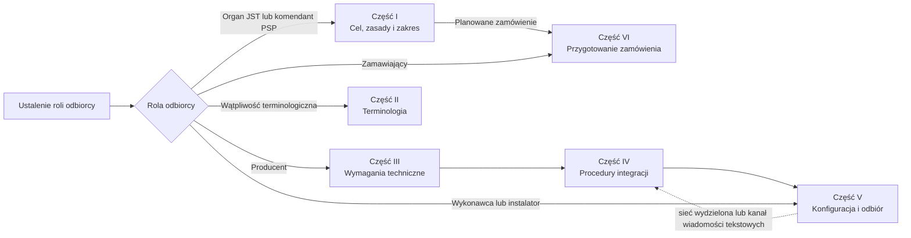

# Podręcznik SOiA

## Zasady podłączania syren alarmowych i innych urządzeń do systemu ostrzegania i alarmowania

---

## Przedmiot i cel dokumentu

Dokument określa zasady podłączania syren alarmowych i innych urządzeń sygnalizacyjnych do systemu
ostrzegania i alarmowania (SOiA). Jego celem jest zapewnienie, aby urządzenia wykonywały wyłącznie
zweryfikowane polecenia, we właściwym czasie i na właściwym obszarze, niezależnie od producenta
urządzenia.

Dokument opiera się na zasadzie rozdzielenia odpowiedzialności: **rolą producenta jest dostarczenie
syreny lub urządzenia sygnalizacyjnego, natomiast rolą państwa jest prowadzenie systemu
ostrzegania.** Urządzenia różnych producentów powinny podłączać się do SOiA według jednolitych
reguł i w jednakowy sposób wykonywać to samo polecenie.

## Sposób korzystania z dokumentu

Zakres zalecanej lektury zależy od roli odbiorcy i celu wykorzystania dokumentu.

**Organy wykonawcze jednostek samorządu terytorialnego oraz komendanci PSP** — w pierwszej
kolejności część I, a przed wszczęciem postępowania zakupowego również część VI.

**Producenci sterowników i syren** — część III zawierająca wymagania, następnie część IV opisująca
integrację oraz część V określająca zakres sprawdzeń.

**Wykonawcy i instalatorzy** — część V obejmująca kartę konfiguracji i sprawdzenia odbiorowe;
w przypadku sieci wydzielonej albo kanału wiadomości tekstowych również opis poziomu 2 w części IV.

**Zamawiający** — część VI, poprzedzona zestawieniem klas zdolności, które określają zakres
zamawianych funkcji.

Definicje pojęć i zasady terminologiczne zawiera część II.

## Jak czytać zakres i horyzont dokumentu

> [!important] Dokument opisuje stan docelowy
> Architektura, wymagania i procedury opisują stan docelowy SOiA, do którego prowadzą zakupy, integracje i kolejne etapy wdrożenia. Opisy stanu istniejącego oraz okresu przejściowego wyjaśniają drogę dojścia i nie obniżają wymagań docelowych.

| Oznaczenie | Jak je rozumieć |
|---|---|
| **STAN ISTNIEJĄCY** | kontekst, zastane instalacje i sposoby działania, które mają współistnieć z SOiA |
| **OKRES PRZEJŚCIOWY 2026–2027** | rozwiązanie czasowe stosowane przed osiągnięciem modelu docelowego |
| **STAN DOCELOWY** | model i właściwości, do których prowadzą wymagania |
| **ZDOLNOŚĆ PLANOWANA** | funkcja przewidziana rozwojowo, lecz niewłączona do bieżącej usługi centralnej |
| **ŹRÓDŁO ROZSTRZYGAJĄCE** | tabela `W-*` / `S-*`, profil maszynowy, podpisane wytyczne albo inny wskazany dokument mający pierwszeństwo przed objaśnieniem |

Objaśnienia, przykłady i diagramy ułatwiają interpretację, ale nie tworzą nowych wymagań i nie zmieniają wymagań istniejących. W przypadku różnicy pierwszeństwo ma źródło rozstrzygające.

Odwołania w formie `§` dotyczą odrębnego dokumentu normatywnego, który nie jest częścią publicznej strony GitHub Pages. Podręcznik przywołuje go wyłącznie jako odrębne źródło części normatywnej.

---

## Zasady redakcyjne i zakres informacyjny

**Pierwszeństwo objaśnienia.** Każde zestawienie poprzedza opis jego celu i sposobu interpretacji.
Tabele stosuje się w przypadkach, w których zwiększają jednoznaczność informacji.

**Spójność informacji.** Wartości techniczne określa się w jednym miejscu, a pozostałe części
dokumentu zawierają odwołania. Wartości rozstrzygające są publikowane maszynowo pod adresem
produkcyjnym SOiA; wartości przytoczone w podręczniku mają charakter informacyjny.

**Neutralność technologiczna.** W dokumencie nie wskazuje się nazw firm, marek, modeli ani
oprogramowania, również przy opisie stanu faktycznie osiągniętego. Elementy rozwiązania określa się
przez ich funkcje i wymagane właściwości.

**Ochrona danych operacyjnych.** Numery, hasła, wykazy numerów uprawnionych i parametry sieci nie
są zamieszczane w podręczniku. Dane te przechowuje się w karcie konfiguracji, poza obiegiem
publikacyjnym.

**Jawność ograniczeń.** Dokument nie przypisuje systemowi funkcji, których system nie realizuje.
Ograniczenia wskazuje się wprost, również wtedy, gdy mogą zostać ocenione jako niekorzystne.

---

## Powiązanie załączników z częściami podręcznika

Numeracja załączników pozostaje zgodna z odwołaniami zawartymi w części normatywnej. Poniższe
zestawienie wskazuje ich umiejscowienie w strukturze podręcznika.

| Załącznik | Część podręcznika |
|---|---|
| [nr 1 — Słownik pojęć](zalaczniki/Z1-SLOWNIK.md) | II |
| [nr 2 — Informacja dla organów](zalaczniki/Z2-INFORMACJA-DLA-ORGANOW.md) | I |
| [nr 3 — Wymagania minimalne](zalaczniki/Z3-WYMAGANIA-MINIMALNE.md) | III |
| [nr 4 — Katalog sygnałów](zalaczniki/Z4-KATALOG-SYGNALOW.md) | III |
| [nr 5 — Profile sterownika](zalaczniki/Z5-PROFILE-STEROWNIKA.md) | III |
| [nr 6 — Poziom 0](zalaczniki/Z6-POZIOM-0-PUBLICZNY-WYKAZ.md) | IV |
| [nr 7 — Poziom 1](zalaczniki/Z7-POZIOM-1-REJESTRACJA.md) | IV |
| [nr 8 — Poziom 2](zalaczniki/Z8-POZIOM-2-APN-I-SMS.md) | IV |
| [nr 9 — Karta konfiguracji](zalaczniki/Z9-KARTA-KONFIGURACJI.md) | V |
| [nr 10 — Scenariusze sprawdzeń](zalaczniki/Z10-TESTY-I-ODBIOR.md) | V |
| [nr 11 — Wytyczne do OPZ](zalaczniki/Z11-ZAPISY-DO-OPZ.md) | VI |
| [nr 12 — Podstawa prawna](zalaczniki/Z12-PODSTAWA-PRAWNA.md) | VII |

---

## Spis treści

- **Część I. Cel, zasady i zakres systemu**
  - [Załącznik nr 2 — Informacja dla organów ochrony ludności i jednostek samorządu terytorialnego](zalaczniki/Z2-INFORMACJA-DLA-ORGANOW.md)
- **Część II. Terminologia i zasady interpretacji**
  - [Załącznik nr 1 — Słownik pojęć](zalaczniki/Z1-SLOWNIK.md)
- **Część III. Wymagania techniczne i funkcjonalne dla urządzeń**
  - [Załącznik nr 3 — Wymagania minimalne dla urządzenia](zalaczniki/Z3-WYMAGANIA-MINIMALNE.md)
  - [Załącznik nr 4 — Katalog sygnałów i plików referencyjnych](zalaczniki/Z4-KATALOG-SYGNALOW.md)
  - [Załącznik nr 5 — Profile sterownika i maszyna stanów](zalaczniki/Z5-PROFILE-STEROWNIKA.md)
- **Część IV. Procedury podłączenia i integracji**
  - [Załącznik nr 6 — Poziom 0: publiczny wykaz poleceń](zalaczniki/Z6-POZIOM-0-PUBLICZNY-WYKAZ.md)
  - [Załącznik nr 7 — Poziom 1: rejestracja i kanał powiadomienia](zalaczniki/Z7-POZIOM-1-REJESTRACJA.md)
  - [Załącznik nr 8 — Poziom 2: sieć wydzielona i kanał wiadomości tekstowych](zalaczniki/Z8-POZIOM-2-APN-I-SMS.md)
- **Część V. Konfiguracja, instalacja i odbiór**
  - [Załącznik nr 9 — Karta konfiguracji urządzenia](zalaczniki/Z9-KARTA-KONFIGURACJI.md)
  - [Załącznik nr 10 — Scenariusze sprawdzeń i protokół odbioru](zalaczniki/Z10-TESTY-I-ODBIOR.md)
- **Część VI. Przygotowanie i realizacja zamówienia**
  - [Załącznik nr 11 — Wytyczne do opisu przedmiotu zamówienia](zalaczniki/Z11-ZAPISY-DO-OPZ.md)
- **Część VII. Ramy prawne i źródła normatywne**
  - [Załącznik nr 12 — Podstawa prawna](zalaczniki/Z12-PODSTAWA-PRAWNA.md)

---

## Część I. Cel, zasady i zakres systemu

Ta część przedstawia cel, zasady działania i zakres SOiA w sposób przeznaczony dla osób
podejmujących decyzje organizacyjne i zakupowe. Szczegółowe wymagania techniczne zawierają dalsze
części podręcznika.

**Załączniki w tej części:**

- [Załącznik nr 2 — Informacja dla organów ochrony ludności i jednostek samorządu terytorialnego](zalaczniki/Z2-INFORMACJA-DLA-ORGANOW.md)

---

## Część II. Terminologia i zasady interpretacji

Jednoznaczna terminologia jest warunkiem prawidłowego przygotowania zamówienia, wdrożenia
i odbioru instalacji. W szczególności potoczne określenie „włączenie syreny” obejmuje kilka
odrębnych czynności technicznych i prawnych, które należy rozróżniać.

**Załączniki w tej części:**

- [Załącznik nr 1 — Słownik pojęć](zalaczniki/Z1-SLOWNIK.md)

---

## Część III. Wymagania techniczne i funkcjonalne dla urządzeń

Ta część określa wymagania wobec urządzenia, katalog wykonywanych sygnałów oraz dopuszczalne
sposoby sprzężenia sterownika z syreną.

**Załączniki w tej części:**

- [Załącznik nr 3 — Wymagania minimalne dla urządzenia](zalaczniki/Z3-WYMAGANIA-MINIMALNE.md)
- [Załącznik nr 4 — Katalog sygnałów i plików referencyjnych](zalaczniki/Z4-KATALOG-SYGNALOW.md)
- [Załącznik nr 5 — Profile sterownika i maszyna stanów](zalaczniki/Z5-PROFILE-STEROWNIKA.md)

---

## Część IV. Procedury podłączenia i integracji

Część IV opisuje trzy kumulatywne poziomy podłączenia. Poziom 0 jest dostępny bez zgody i stanowi
podstawowy sposób integracji; poziomy wyższe rozszerzają go o kolejne kanały, nie zastępując
poziomów niższych.

> [!important] Mapa kanałów w stanie docelowym
> Tor danych pobiera podpisany IoT Feed i pozostaje podstawą poziomu 0. Kanał niezwłocznego powiadomienia nie przenosi komendy — skraca czas wykrycia nowej wersji Feedu. Kanał SMS jest odrębnym kanałem wykonawczym z własnym profilem i kontrolami. Urządzenie może korzystać z wielu kanałów, lecz ta sama komenda nie może spowodować wielokrotnej emisji.

**Załączniki w tej części:**

- [Załącznik nr 6 — Poziom 0: publiczny wykaz poleceń](zalaczniki/Z6-POZIOM-0-PUBLICZNY-WYKAZ.md)
- [Załącznik nr 7 — Poziom 1: rejestracja i kanał powiadomienia](zalaczniki/Z7-POZIOM-1-REJESTRACJA.md)
- [Załącznik nr 8 — Poziom 2: sieć wydzielona i kanał wiadomości tekstowych](zalaczniki/Z8-POZIOM-2-APN-I-SMS.md)

---

## Część V. Konfiguracja, instalacja i odbiór

Ta część zawiera formularz konfiguracji urządzenia oraz zakres sprawdzeń wykonywanych podczas
odbioru. Zakres sprawdzeń odpowiada klasom zdolności i elementom objętym zamówieniem.

**Załączniki w tej części:**

- [Załącznik nr 9 — Karta konfiguracji urządzenia](zalaczniki/Z9-KARTA-KONFIGURACJI.md)
- [Załącznik nr 10 — Scenariusze sprawdzeń i protokół odbioru](zalaczniki/Z10-TESTY-I-ODBIOR.md)

---

## Część VI. Przygotowanie i realizacja zamówienia

Ta część jest przeznaczona dla jednostek samorządu terytorialnego przygotowujących zakup.
W konkretnym postępowaniu podstawowym mechanizmem egzekwowania wymagań wobec wykonawcy jest ich
prawidłowe ujęcie w dokumentach zamówienia i w umowie. Niniejszy projekt nie zastępuje analizy
prawnej ani opisu przedmiotu zamówienia dostosowanego do danego postępowania.

**Załączniki w tej części:**

- [Załącznik nr 11 — Wytyczne do opisu przedmiotu zamówienia](zalaczniki/Z11-ZAPISY-DO-OPZ.md)

---

## Część VII. Ramy prawne i źródła normatywne

Ta część przedstawia akty wskazane w materiale źródłowym jako podstawa lub kontekst projektu oraz
opisuje przyjęty sposób weryfikacji ich statusu.

**Załączniki w tej części:**

- [Załącznik nr 12 — Podstawa prawna](zalaczniki/Z12-PODSTAWA-PRAWNA.md)

---

## Tryb zgłaszania uwag

Projekt wskazuje Biuro Informatyki i Łączności Komendy Głównej Państwowej Straży Pożarnej jako
adresata uwag. Przed rozpowszechnieniem dokumentu należy potwierdzić właściwego adresata i kanał
przekazywania uwag. Zgłoszenie dotyczące wymagania albo scenariusza sprawdzenia powinno zawierać
jego identyfikator, na przykład `W-B02` albo `S-93`.

*Wersja redakcyjna V2 opracowana na podstawie pliku `PODRECZNIK.md` z 23 sierpnia 2026 r.
Wersja merytoryczna materiału źródłowego: 0.4.*
