# Podręcznik SOiA

## Zasady podłączania syren alarmowych i innych urządzeń do systemu ostrzegania i alarmowania

---

## Przedmiot i cel dokumentu

Dokument określa zasady podłączania syren alarmowych i innych urządzeń sygnalizacyjnych do systemu
ostrzegania i alarmowania (SOiA). Jego celem jest zapewnienie, aby urządzenia wykonywały wyłącznie
zweryfikowane polecenia, we właściwym czasie i na właściwym obszarze, niezależnie od producenta
urządzenia.

Dokument opiera się na zasadzie rozdzielenia odpowiedzialności: **rolą producenta jest dostarczenie
syreny lub urządzenia sygnalizacyjnego, natomiast rolą państwa jest prowadzenie systemu
ostrzegania.** Urządzenia różnych producentów powinny podłączać się do SOiA według jednolitych
reguł i w jednakowy sposób wykonywać to samo polecenie.

## Sposób korzystania z dokumentu

Zakres zalecanej lektury zależy od roli odbiorcy i celu wykorzystania dokumentu.

**Organy wykonawcze jednostek samorządu terytorialnego oraz komendanci PSP** — w pierwszej
kolejności część I, a przed wszczęciem postępowania zakupowego również część VI.

**Producenci sterowników i syren** — część III zawierająca wymagania, następnie część IV opisująca
integrację oraz część V określająca zakres sprawdzeń.

**Wykonawcy i instalatorzy** — część V obejmująca kartę konfiguracji i sprawdzenia odbiorowe;
w przypadku sieci wydzielonej albo kanału wiadomości tekstowych również opis poziomu 2 w części IV.

**Zamawiający** — część VI, poprzedzona zestawieniem klas zdolności, które określają zakres
zamawianych funkcji.

Definicje pojęć i zasady terminologiczne zawiera część II.

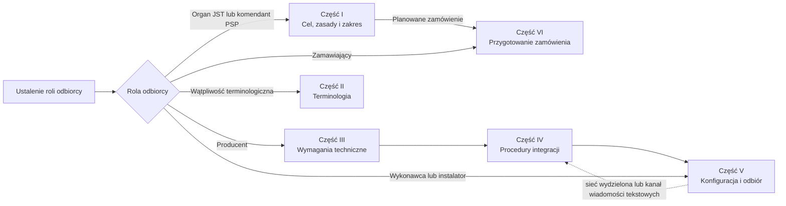

## Jak czytać zakres i horyzont dokumentu

> [!important] Dokument opisuje stan docelowy
> Architektura, wymagania i procedury opisują stan docelowy SOiA, do którego prowadzą zakupy, integracje i kolejne etapy wdrożenia. Opisy stanu istniejącego oraz okresu przejściowego wyjaśniają drogę dojścia i nie obniżają wymagań docelowych.

| Oznaczenie | Jak je rozumieć |
|---|---|
| **STAN ISTNIEJĄCY** | kontekst, zastane instalacje i sposoby działania, które mają współistnieć z SOiA |
| **OKRES PRZEJŚCIOWY 2026–2027** | rozwiązanie czasowe stosowane przed osiągnięciem modelu docelowego |
| **STAN DOCELOWY** | model i właściwości, do których prowadzą wymagania |
| **ZDOLNOŚĆ PLANOWANA** | funkcja przewidziana rozwojowo, lecz niewłączona do bieżącej usługi centralnej |
| **ŹRÓDŁO ROZSTRZYGAJĄCE** | tabela `W-*` / `S-*`, profil maszynowy, podpisane wytyczne albo inny wskazany dokument mający pierwszeństwo przed objaśnieniem |

Objaśnienia, przykłady i diagramy ułatwiają interpretację, ale nie tworzą nowych wymagań i nie zmieniają wymagań istniejących. W przypadku różnicy pierwszeństwo ma źródło rozstrzygające.

Odwołania w formie `§` dotyczą oddzielnego pliku `PODRECZNIK_v2_WYTYCZNE.md`. Plik ten nie jest częścią strony GitHub Pages; podręcznik przywołuje go wyłącznie jako odrębne źródło części normatywnej.

---

## Zasady redakcyjne i zakres informacyjny

**Pierwszeństwo objaśnienia.** Każde zestawienie poprzedza opis jego celu i sposobu interpretacji.
Tabele stosuje się w przypadkach, w których zwiększają jednoznaczność informacji.

**Spójność informacji.** Wartości techniczne określa się w jednym miejscu, a pozostałe części
dokumentu zawierają odwołania. Wartości rozstrzygające są publikowane maszynowo pod adresem
produkcyjnym SOiA; wartości przytoczone w podręczniku mają charakter informacyjny.

**Neutralność technologiczna.** W dokumencie nie wskazuje się nazw firm, marek, modeli ani
oprogramowania, również przy opisie stanu faktycznie osiągniętego. Elementy rozwiązania określa się
przez ich funkcje i wymagane właściwości.

**Ochrona danych operacyjnych.** Numery, hasła, wykazy numerów uprawnionych i parametry sieci nie
są zamieszczane w podręczniku. Dane te przechowuje się w karcie konfiguracji, poza obiegiem
publikacyjnym.

**Jawność ograniczeń.** Dokument nie przypisuje systemowi funkcji, których system nie realizuje.
Ograniczenia wskazuje się wprost, również wtedy, gdy mogą zostać ocenione jako niekorzystne.

---

## Powiązanie załączników z częściami podręcznika

Numeracja załączników pozostaje zgodna z odwołaniami zawartymi w części normatywnej. Poniższe
zestawienie wskazuje ich umiejscowienie w strukturze podręcznika.

| Załącznik | Część podręcznika |
|---|---|
| nr 1 — Słownik pojęć | II |
| nr 2 — Informacja dla organów | I |
| nr 3 — Wymagania minimalne | III |
| nr 4 — Katalog sygnałów | III |
| nr 5 — Profile sterownika | III |
| nr 6 — Poziom 0 | IV |
| nr 7 — Poziom 1 | IV |
| nr 8 — Poziom 2 | IV |
| nr 9 — Karta konfiguracji | V |
| nr 10 — Scenariusze sprawdzeń | V |
| nr 11 — Wytyczne do OPZ | VI |
| nr 12 — Podstawa prawna | VII |

---

## Spis treści

- **Część I. Cel, zasady i zakres systemu**
  - Załącznik nr 2 — Informacja dla organów ochrony ludności i jednostek samorządu terytorialnego
- **Część II. Terminologia i zasady interpretacji**
  - Załącznik nr 1 — Słownik pojęć
- **Część III. Wymagania techniczne i funkcjonalne dla urządzeń**
  - Załącznik nr 3 — Wymagania minimalne dla urządzenia
  - Załącznik nr 4 — Katalog sygnałów i plików referencyjnych
  - Załącznik nr 5 — Profile sterownika i maszyna stanów
- **Część IV. Procedury podłączenia i integracji**
  - Załącznik nr 6 — Poziom 0: publiczny wykaz poleceń
  - Załącznik nr 7 — Poziom 1: rejestracja i kanał powiadomienia
  - Załącznik nr 8 — Poziom 2: sieć wydzielona i kanał wiadomości tekstowych
- **Część V. Konfiguracja, instalacja i odbiór**
  - Załącznik nr 9 — Karta konfiguracji urządzenia
  - Załącznik nr 10 — Scenariusze sprawdzeń i protokół odbioru
- **Część VI. Przygotowanie i realizacja zamówienia**
  - Załącznik nr 11 — Wytyczne do opisu przedmiotu zamówienia
- **Część VII. Ramy prawne i źródła normatywne**
  - Załącznik nr 12 — Podstawa prawna

---

## Część I. Cel, zasady i zakres systemu

Ta część przedstawia cel, zasady działania i zakres SOiA w sposób przeznaczony dla osób
podejmujących decyzje organizacyjne i zakupowe. Szczegółowe wymagania techniczne zawierają dalsze
części podręcznika.

### Załącznik nr 2 — Informacja dla organów ochrony ludności i jednostek samorządu terytorialnego

Załącznik jest przeznaczony dla wójtów, burmistrzów, prezydentów miast, starostów oraz komendantów
powiatowych i miejskich Państwowej Straży Pożarnej. Przedstawia cel systemu, skutki jego wdrożenia
dla jednostek samorządu terytorialnego oraz ograniczenia funkcjonalne. Wymagania techniczne
określono w załączniku nr 3.

---

#### 1. Stan istniejący i potrzeba standaryzacji

Eksploatowane instalacje syren alarmowych są zróżnicowane pod względem producentów, sposobów
sterowania, interfejsów oraz zapisanych materiałów dźwiękowych. Zróżnicowanie to utrudnia
jednoczesne i jednolite wykonanie alarmu obejmującego obszar więcej niż jednej jednostki samorządu
terytorialnego.

Odrębnym ryzykiem jest długotrwałe uzależnienie właściciela instalacji od jednego dostawcy,
wynikające z braku otwartych interfejsów i interoperacyjności. Zmiana dostawcy może wówczas wymagać
wymiany znacznej części infrastruktury.

SOiA ogranicza oba ryzyka przez ujednolicenie elementów wspólnych dla wszystkich urządzeń oraz
pozostawienie konkurencji w zakresie jakości, ceny, trwałości i sposobu realizacji urządzenia.

---

#### 2. Zasada rozdzielenia odpowiedzialności

Rolą producenta jest dostarczenie syreny albo innego urządzenia sygnalizacyjnego zgodnego
z wymaganiami interoperacyjności. Rolą państwa jest prowadzenie systemu ostrzegania
i alarmowania. Jednolite znaczenie poleceń określa kontrakt SOiA.

Wspólny standard podłączenia umożliwia współdziałanie urządzeń różnych producentów. Jednostka
samorządu terytorialnego może rozbudowywać instalację o urządzenia innych marek bez zmiany systemu
centralnego, a sąsiadujące jednostki mogą wykonywać ten sam sygnał w sposób spójny.

---

#### 3. Dobrowolność przystąpienia i wymóg pełnej zgodności

Wytyczne nie ustanawiają obowiązku przyłączenia syreny do SOiA. Podmiot podejmujący decyzję
o przystąpieniu stosuje jednak wymagania w całości, ponieważ ich częściowe spełnienie może
prowadzić do niespójnego wykonania tego samego polecenia przez różne urządzenia.

**Momentem przystąpienia jest zgłoszenie urządzenia do rejestracji.** Do tej chwili urządzenie
pobierające publiczny wykaz jest po prostu odbiorcą informacji udostępnianej powszechnie.

---

#### 4. Przebieg procesu alarmowania

Proces rozdziela czynności decyzyjne wykonywane przez uprawnione osoby od automatycznych czynności
dystrybucji, weryfikacji i wykonania polecenia. System nie ogłasza alarmu samodzielnie.

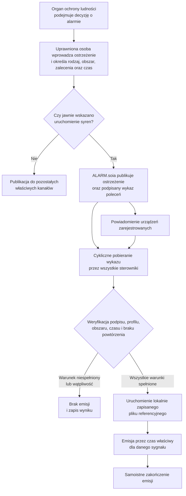

Polecenie wskazuje rodzaj sygnału, lecz nie przenosi pliku dźwiękowego. Plik referencyjny jest
instalowany w urządzeniu podczas uruchomienia instalacji.

---

#### 5. Poziomy podłączenia do SOiA

SOiA przewiduje trzy kumulatywne poziomy podłączenia urządzenia.

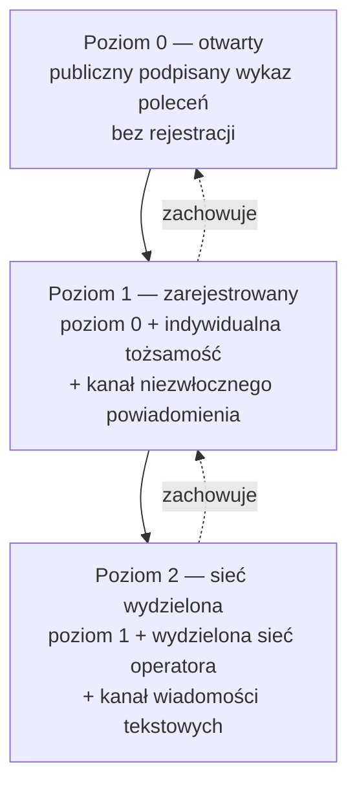

**Poziom 0** umożliwia pobieranie publicznego wykazu poleceń przez Internet i nie wymaga
rejestracji, zgody ani zawiadomienia Komendy Głównej PSP. Mogą z niego korzystać podmioty publiczne
i niepubliczne, pod warunkiem poprawnego skonfigurowania obszaru oraz weryfikacji poleceń.

**Poziom 1** jest przeznaczony dla urządzeń podmiotów publicznych dopuszczonych przez administratora
SOiA. Urządzenie otrzymuje indywidualną tożsamość kryptograficzną i kanał niezwłocznego
powiadomienia. Profil jednostki porządkuje zgłoszenia, lecz dopuszczenie jest rozstrzygane odrębnie
dla każdego urządzenia po potwierdzeniu jego tożsamości, lokalizacji i obszaru działania.

**Poziom 2** uzupełnia poziom 1 o pracę w wydzielonej sieci operatora oraz kanał wiadomości
tekstowych.

Poziom wyższy nie zastępuje poziomu niższego. Cykliczne pobieranie podpisanego wykazu pozostaje
obowiązkowe, dlatego niedostępność kanału powiadomienia wpływa na czas reakcji, lecz nie znosi
możliwości pobrania i wykonania polecenia z poziomu 0. Rejestracja nie jest warunkiem technicznego
działania urządzenia na poziomie 0 podczas oczekiwania na rozstrzygnięcie administratora.

---

#### 6. Zakres zakupów po stronie jednostki samorządu terytorialnego

Zakres zakupów i świadczeń przewidzianych w projekcie przedstawia poniższe zestawienie.

| Zakres | Sposób zapewnienia |
|---|---|
| Syrena, sterownik, montaż, uruchomienie i serwis | przedmiot zamówienia jednostki samorządu terytorialnego |
| Łączność urządzenia | w okresie przejściowym 2026–2027 — karty operatorów wybranych przez jednostkę; docelowo projekt przewiduje karty zapewniane centralnie przez KG PSP |
| System centralny | element SOiA; nie wymaga zakupu pulpitu dyspozytorskiego ani oprogramowania serwerowego producenta syreny |
| Pliki referencyjne sygnałów | udostępniane przez KG PSP; instalowane w urządzeniu podczas uruchomienia |

Urządzenie powinno umożliwiać późniejszą wymianę karty abonenckiej i zmianę konfiguracji bez
wymiany sprzętu.

Zakres funkcji określa się w zamówieniu przez wskazanie klas zdolności:

- **klasa I — rdzeń:** wymagana dla każdego urządzenia przyłączanego do SOiA;
- **klasa II — tor audio:** wymagana, gdy sterownik samodzielnie odtwarza dźwięk;
- **klasa III — profil głosowy:** stosowana, gdy zamówienie obejmuje wypowiadanie treści słownej.

Dla sterowania syreną cyfrową przez jej udokumentowany interfejs wystarczająca jest klasa I.
Modernizacja instalacji z odtwarzaniem dźwięku przez sterownik wymaga klas I i II. Klasa III
dotyczy zdolności opcjonalnej; projekt wskazuje, że system nie przenosi obecnie treści głosowej.

Załącznik nr 11 zawiera propozycje minimalnych wymagań funkcjonalnych do wykorzystania przy
opracowaniu opisu przedmiotu zamówienia. Nie stanowi kompletnego opisu gotowego do bezpośredniego
zastosowania. Zamawiający odpowiada za dostosowanie wymagań do przedmiotu, warunków i podstawy
prawnej konkretnego postępowania, w tym za ograniczenie ryzyka zależności od jednego dostawcy.

---

#### 7. Integracja istniejących instalacji syren

Projekt nie wymaga automatycznej wymiany istniejących syren. Dobór wariantu integracji należy
poprzedzić oceną stanu instalacji, dostępnych interfejsów, dokumentacji producenta, warunków
gwarancji oraz bezpieczeństwa technicznego.

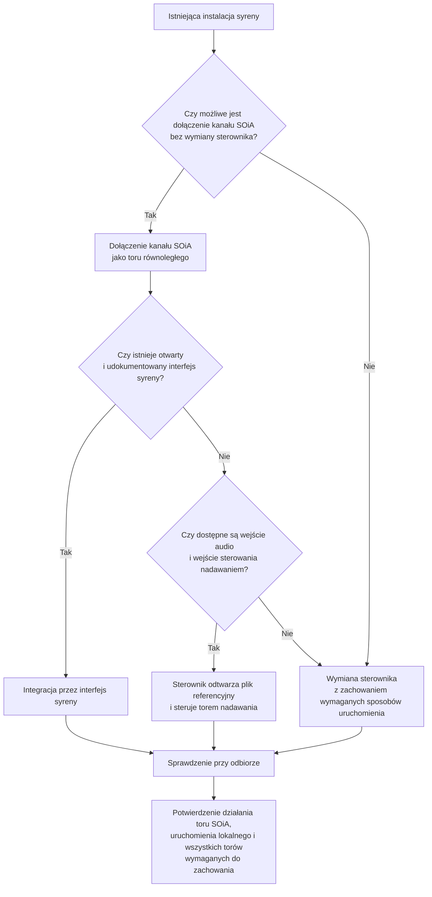

Dołączenie kanału SOiA nie powinno wyłączać ani ograniczać istniejącego systemu dyspozytorskiego,
pulpitu lokalnego, przycisku ręcznego ani kanału radiowego. Wszystkie tory powinny pracować
równolegle, a możliwość uruchomienia lokalnego powinna pozostać niezależna od łączności.

Zachowanie dotychczasowych sposobów uruchomienia podlega sprawdzeniu przy odbiorze zgodnie
z załącznikiem nr 10 oraz powinno zostać odzwierciedlone w postanowieniach umowy przygotowanych
z wykorzystaniem załącznika nr 11.

W wariancie audio sterownik odtwarza lokalnie plik referencyjny, podaje sygnał na wejście audio
syreny i równolegle uruchamia jej tor nadawania. Dopuszczalność tego wariantu wymaga potwierdzenia
zgodności z dokumentacją urządzenia, wymaganiami bezpieczeństwa oraz warunkami konkretnej umowy.

---

#### 8. Ograniczenia funkcjonalne systemu

Prawidłowe określenie zakresu wdrożenia wymaga uwzględnienia następujących ograniczeń:

| Ograniczenie | Znaczenie operacyjne |
|---|---|
| SOiA nie zastępuje decyzji organu ochrony ludności | system przenosi i wykonuje decyzję podjętą przez właściwy organ; nie ogłasza alarmu samodzielnie |
| Potwierdzenie wykonania nie jest potwierdzeniem słyszalności | zasięg i skuteczność akustyczna podlegają projektowi instalacji oraz sprawdzeniom lokalnym |
| Trwająca emisja nie podlega zdalnemu zatrzymaniu | rozpoczęta sekwencja jest wykonywana do końca; odwołanie alarmu stanowi odrębny sygnał akustyczny |
| Jedno polecenie powoduje jedną emisję | ponowienie sygnału wymaga odrębnej decyzji i odrębnego polecenia |
| Obecny zakres nie obejmuje wywoływania jednostek ochrony przeciwpożarowej | dotychczasowe środki wywoływania pozostają odrębne; rozszerzenie zakresu wymaga osobnego etapu |
| Polecenie nie przenosi pliku dźwiękowego | pliki referencyjne muszą zostać zainstalowane i zweryfikowane podczas uruchomienia instalacji |
| System nie przenosi obecnie treści głosowej | klasa III opisuje opcjonalną zdolność urządzenia, a nie aktualnie dostępną usługę centralną |
| Kanał publiczny nie zapewnia informacji zwrotnej o stanie urządzenia | sprawność potwierdza się w toku odbioru, sprawdzeń okresowych i czynności właściciela instalacji |
| Nie ustanowiono liczbowego progu czasu reakcji | czas od wydania polecenia do rozpoczęcia emisji podlega pomiarowi i zapisowi; zastosowanie ma wymóg niezwłoczności |
| Brak wszystkich kanałów łączności uniemożliwia odebranie nowego polecenia | urządzenie nie może uruchamiać emisji na podstawie domniemania lub treści przeterminowanej |

---

#### 9. Podział odpowiedzialności

Projekt przyjmuje następujący podział odpowiedzialności:

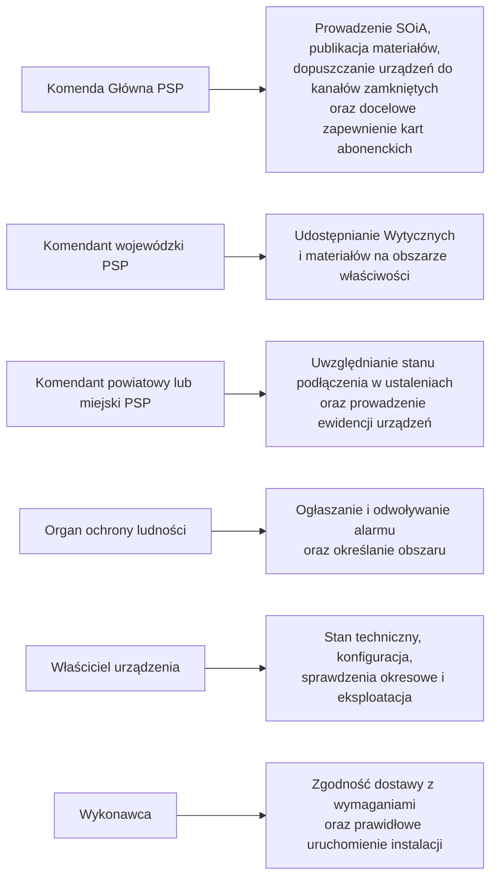

Odpowiedzialność za stan techniczny i eksploatację instalacji pozostaje po stronie jej właściciela;
nie przechodzi na dostawcę systemu centralnego. Projekt przewiduje ponadto centralne przygotowanie
i publiczne udostępnienie polskiego głosu do syntezy mowy, co wymaga odrębnej realizacji.

---

#### 10. Zalecane działania wdrożeniowe

Jednostka samorządu terytorialnego planująca zakup powinna określić wymagane klasy zdolności,
przeanalizować propozycje zawarte w załączniku nr 11 i uwzględnić w opisie przedmiotu zamówienia
wymagania ograniczające zależność od jednego dostawcy.

W przypadku istniejącej instalacji należy ocenić warianty opisane w rozdziale 7 oraz pozyskać
dokumentację interfejsu sterowania. Brak wystarczającej dokumentacji może przemawiać za oceną
wariantu audio, z uwzględnieniem warunków technicznych, gwarancyjnych i umownych.

Działające urządzenie może korzystać z poziomu 0 bez uprzedniej rejestracji. Zgłoszenie urządzenia
publicznego do poziomu 1 albo 2 może być prowadzone równolegle, bez wstrzymywania technicznego
działania na poziomie 0.

Publiczny wykaz poleceń jest dostępny również dla podmiotów niepublicznych. Warunkiem bezpiecznego
wykorzystania jest pełna weryfikacja polecenia przed jego wykonaniem. Rejestracja oraz kanały
zamknięte pozostają przeznaczone dla podmiotów publicznych, a wykorzystanie poziomu 0 bez
rejestracji odbywa się poza zakresem dopuszczenia do kanałów zamkniętych.

---

## Część II. Terminologia i zasady interpretacji

Jednoznaczna terminologia jest warunkiem prawidłowego przygotowania zamówienia, wdrożenia
i odbioru instalacji. W szczególności potoczne określenie „włączenie syreny” obejmuje kilka
odrębnych czynności technicznych i prawnych, które należy rozróżniać.

### Załącznik nr 1 — Słownik pojęć

Załącznik określa terminologię stosowaną w odniesieniu do SOiA. Nie obejmuje pojęć
ogólnotechnicznych; definiuje terminy mające w systemie znaczenie szczególne oraz terminy, których
zamienne używanie może prowadzić do niejednoznaczności.

Każdemu hasłu przypisano jedno znaczenie. Określenia niezalecane wskazano pod adnotacją
*Określenia niezalecane*. Pozostałe części dokumentu powinny stosować terminologię z niniejszego
załącznika.

---

#### System i jego komponenty

W obszarze ostrzegania i alarmowania funkcjonują przedsięwzięcia o podobnych oznaczeniach.
Poniższe rozróżnienia służą zapewnieniu ich jednoznacznej identyfikacji.

**SOiA**
System ostrzegania i alarmowania — całość rozwiązania, obejmująca tworzenie komunikatu
ostrzegawczego, jego dystrybucję kanałami i wykonanie na urządzeniach w terenie.
*Określenia niezalecane*: „system syren”, „platforma alarmowa”.

**ALARM.soia**
System oparty na standardzie CAP, integrujący i publikujący komunikaty ostrzegawcze do urządzeń
IoT, telefonów, aplikacji i pozostałych kanałów. Jest jedynym miejscem, w którym powstaje polecenie
dla syreny. Działa według zasady **„jeden alert — wiele urządzeń naraz”**: uprawniona osoba wydaje
ostrzeżenie raz, a system zapewnia, że identyczna treść trafia jednocześnie do wszystkich kanałów.
Dostępny pod adresem `alarm.soia.info`, gdzie publikowana jest także jego dokumentacja.
*Określenia niezalecane*: `CAP_ALERT` — nazwa robocza z wcześniejszego etapu prac; `demo.soia.info` oraz
„serwer demonstracyjny” — **nazwy wycofane**, nadal obecne w starszych materiałach.

**ZKWSD.soia**
Zarządzanie Kryzysowe — System Wspomagania Decyzji SOiA. Odrębna aplikacja obiegu zdarzeń między
centrami zarządzania kryzysowego, w kaskadzie RCB → WCZK → PCZK/MCZK → GCZK → PSP.
**Nie jest to system sterowania syrenami** i te dwie nazwy nie są zamienne.
*Określenia niezalecane*: `SOiA-ALERT` — nazwa wycofana.

**Odbiorca komunikatu**
Kanał albo urządzenie, do którego trafia opublikowane ostrzeżenie: telefon przez wiadomość tekstową
i aplikację, komputer przez portal publiczny i strony, tablet, syrena alarmowa oraz urządzenia
z modułem sieciowym — domofony, tablice informacyjne, systemy radiowe, huby domowe, znaki zmiennej
treści i inne. Syrena jest **jednym z odbiorców**, a nie osobnym systemem.

**PL-CAP**
Krajowy profil interoperacyjności ostrzegania, oparty na standardzie OASIS CAP 1.2. Określa
format komunikatu ostrzegawczego, jego walidację i dystrybucję.

**IoT Feed**
Jednokierunkowy, podpisany wykaz poleceń wykonawczych, publikowany przez ALARM.soia i pobierany
przez sterowniki. Nie jest komunikatem CAP i nie jest dowodem, że alarmowanie faktycznie nastąpiło.

**`PL-CAP-DIST-IOT`**
Formalna nazwa profilu, w którym publikowany jest IoT Feed. Występuje w treści koperty i służy
sterownikowi do sprawdzenia, że rozmawia z właściwym kontraktem.

> [!note] PL-CAP, IoT Feed i urządzenie — dla odbiorcy nietechnicznego
> PL-CAP opisuje ostrzeżenie przeznaczone do wielu kanałów. IoT Feed jest podpisanym wykazem poleceń dla urządzeń korzystających z toru danych. ALARM.soia publikuje Feed, a sterownik automatycznie go pobiera, weryfikuje i interpretuje; JST nie wykonuje tych czynności ręcznie. Obecność ostrzeżenia w części informacyjnej nie uruchamia syreny. Wykonanie następuje wyłącznie po dostarczeniu polecenia właściwym kanałem oraz jego kwalifikacji i weryfikacji przez urządzenie zgodnie z profilem tego kanału.

---

#### Uczestnicy i zakresy odpowiedzialności

**Organ ochrony ludności**
Organ właściwy do ogłoszenia alarmu w rozumieniu ustawy o ochronie ludności i obronie cywilnej —
w szczególności wójt, burmistrz, prezydent miasta, starosta i wojewoda. To on ogłasza alarm;
system jedynie przenosi jego decyzję.

**Administrator SOiA**
Osoba lub komórka rozstrzygająca o dopuszczeniu **każdego zgłoszonego urządzenia z osobna** do
kanałów zamkniętych, przydzielająca tożsamość, kartę abonencką i numer. Decyzja administratora nie
jest czynnością techniczną i nie następuje automatycznie po złożeniu zgłoszenia.

**Przystąpienie**
Zgłoszenie urządzenia do rejestracji — chwila, od której podmiot stosuje Wytyczne w całości.
Do tego momentu urządzenie pobierające publiczny wykaz poleceń jest odbiorcą informacji
udostępnianej powszechnie. Stosowanie Wytycznych jest dobrowolne; przystąpienie nie jest.
*Określenia niezalecane*: „podłączenie” w znaczeniu prawnym — podłączyć można się bez przystąpienia.

**Profil gminy**
Konto zakładane jednostce samorządu terytorialnego, w którym rejestruje ona własne urządzenia.
Porządkuje wnioski i wiąże je z podmiotem odpowiedzialnym; **nie zastępuje decyzji** administratora
o dopuszczeniu pojedynczego urządzenia.

**Właściciel urządzenia**
Podmiot odpowiadający za instalację, jej stan techniczny i skutki działania — jednostka samorządu
terytorialnego, jednostka ochrony przeciwpożarowej, zakład pracy albo osoba prywatna.

**Wykonawca**
Podmiot montujący i uruchamiający instalację. Może być tożsamy z producentem sterownika, ale
nie musi.

---

#### Urządzenia i elementy instalacji

**Punkt alarmowy**
Miejsce, w którym zainstalowano syrenę wraz z jej sterownikiem i zasilaniem. Jeden punkt alarmowy
może obejmować więcej niż jedną syrenę.

**Syrena**
Urządzenie wytwarzające sygnał akustyczny. Sama nie podejmuje decyzji.

**Sterownik**
Warstwa pośrednia między SOiA a syreną: odbiera polecenia dowolnym kanałem, weryfikuje je,
prowadzi własną maszynę stanów i uruchamia wyjście wykonawcze. To sterownik, a nie system
centralny, wie, jak fizycznie uruchomić daną syrenę.
*Określenia niezalecane*: „moduł GSM”, „bramka” — to elementy sterownika, nie jego synonimy.

**Bramka**
Urządzenie pośredniczące w transmisji — w kanale SMS przyjmuje komendę i przekazuje ją do
sterownika. Nie interpretuje treści polecenia.

**Profil sterownika**
Sposób, w jaki sterownik zamienia znaczenie polecenia na fizyczne działanie. Wyróżnia się profil
**elektroniczny** (odtworzenie pliku dźwiękowego przez wzmacniacz), **silnikowy** (sterowanie
układem wykonawczym syreny mechanicznej) oraz **modernizacyjny (retrofit)** (dołączenie kanału SOiA
do istniejącej instalacji przez adapter).

**Klasa urządzenia**
Kategoria **odbiorcy polecenia**, zapisana w treści IoT Feed. Sterownik wykonuje wyłącznie polecenia
skierowane do jego klasy.

**Klasa zdolności**
Zakres wymagań, którym urządzenie podlega — **klasa I** (rdzeń, obowiązuje zawsze), **klasa II**
(tor audio, gdy sterownik sam odtwarza dźwięk), **klasa III** (profil głosowy, opcjonalna).
Zamawiający wskazuje w zamówieniu klasy zdolności, których wymaga.

> [!warning] Rozróżnienie pojęć
> *Klasa urządzenia* określa, **do kogo** skierowane
> jest polecenie, i wynika z kontraktu. *Klasa zdolności* określa, **jakich zdolności wymaga się** od urządzenia,
> i wynika z Wytycznych. Terminu „klasa” nie należy używać bez właściwego określenia.

**Poziom podłączenia**
Zakres kanałów, którymi urządzenie łączy się z SOiA. **Poziom 0** to publiczny IoT Feed bez
rejestracji, **poziom 1** dokłada kanał niezwłocznego powiadomienia po dopuszczeniu przez administratora,
**poziom 2** dokłada prywatną sieć APN i kanał SMS. Poziomy są **kumulatywne**: wyższy dokłada
kanał, nie zastępuje niższego.
*Określenia niezalecane*: „tryb podstawowy/rozszerzony” — sugeruje, że jeden wyklucza drugi.

**Karta konfiguracji**
Dokument przekazywany instalatorowi, zawierający wartości właściwe dla jednej instalacji: numery,
hasło sterujące, mapę komend i identyfikator urządzenia. Nie jest publikowany i nie stanowi
części dokumentacji rozsyłanej.

---

#### Polecenia wykonawcze, sygnały alarmowe i emisja

Poniższe pojęcia rozróżniają czynności, które w języku potocznym mogą być określane zbiorczo jako
„włączenie syreny”. Ich konsekwentne stosowanie jest wymagane przy przygotowaniu zamówienia
i implementacji.

**Komenda**
Pojedyncze polecenie wykonawcze w IoT Feed, opatrzone własnym identyfikatorem. Komenda **nie jest
alarmem** — jest technicznym poleceniem wynikającym z alarmu ogłoszonego przez organ.

**Kod sygnału**
Symbol wskazujący, **który** sygnał akustyczny ma zabrzmieć. Kod nie zawiera dźwięku ani jego
parametrów — wskazuje pozycję w katalogu sygnałów.

**Sygnał alarmowy**
Dźwięk o strukturze i czasie trwania określonym w rozporządzeniu o alarmach i komunikatach
ostrzegawczych. Rozporządzenie określa cztery: ogłoszenie alarmu dla ludności cywilnej, odwołanie
alarmu, alarm dla jednostki ochrony przeciwpożarowej oraz alarm ćwiczebny lub treningowy.

Urządzenie MUSI umieć wyemitować **wszystkie cztery**. System wydaje obecnie wyłącznie sygnały
skierowane **do ludności**; alarm dla jednostki ochrony przeciwpożarowej pozostaje poza obecnym
zakresem SOiA i jest wywoływany dotychczasowymi środkami. Zdolność urządzenia i zakres usługi
to dwie różne rzeczy.

**Plik referencyjny**
Wzorcowy plik dźwiękowy zatwierdzony przez KG PSP, opatrzony sumą kontrolną. Jedyna obowiązująca
postać sygnału; modyfikacja brzmienia, długości lub struktury jest niedopuszczalna.

**System nie przenosi plików referencyjnych.** Udostępnia się je do pobrania na stronie SOiA,
a wgrywa **przy instalacji**. Źródłem rozstrzygającym dla sumy kontrolnej są Wytyczne z dnia
28 maja 2025 r. — dokument podpisany, a nie strona internetowa, z której plik pobrano.

**Emisja**
Pojedyncze, konkretne odtworzenie sygnału przez syrenę — od załączenia wyjścia do jego wyłączenia.
Jedna komenda oznacza **jedną** emisję. Emisja kończy się sama, po czasie wynikającym z sygnału.

**Okno rozpoczęcia**
Przedział czasu, w którym wolno rozpocząć emisję. Poza tym oknem sterownik nie uruchamia syreny,
nawet jeśli alarm nadal obowiązuje. Czas obowiązywania alarmu, okno rozpoczęcia i czas emisji
to **trzy różne rzeczy**. Obowiązująca długość okna publikowana jest maszynowo pod adresem
produkcyjnym (§ 4 ust. 2 aktu); od niej wyprowadzony jest próg dryfu zegara z W-A13.

**Odwołanie akcji nierozpoczętej**
Polecenie „nie zaczynaj”, skuteczne wyłącznie wobec emisji, która jeszcze się nie rozpoczęła.
Nie zatrzymuje emisji trwającej.
*Określenie niezalecane*: „stop”. Jest to operacja odrębna od zatrzymania emisji.

**Odwołanie alarmu**
Prawnie określony **sygnał akustyczny** oznaczający koniec zagrożenia: ciągły dźwięk syreny
trwający trzy minuty. Odwołanie alarmu jest **emisją, nie ciszą** — to jedno z najczęstszych
nieporozumień w tym obszarze.

**Zatrzymanie emisji**
Polecenie „przerwij trwający sygnał”, wydane z systemu. **Nie istnieje** — żaden kanał go nie
przenosi. Rozpoczęta sekwencja wykonuje się do końca; sprawdzono to na urządzeniu, a właściwość tę
przyjęto jako wymaganie.
*Określenia niezalecane*: „STOP”, „stop zdalny” — sugerują istnienie polecenia, którego nie ma.

**Odcięcie lokalne**
Czynność **na obiekcie**, przerywająca tor wykonawczy niezależnie od łączności i od oprogramowania:
element obsługowy, rozłącznik albo odjęcie zasilania. Ma pierwszeństwo przed poleceniem zdalnym
i jest wymagane niezależnie od kanału.

Rozróżnienie jest wiążące: **zatrzymania nie ma, odcięcie jest zawsze.** Pierwsze byłoby funkcją
systemu, drugie jest uprawnieniem człowieka stojącego przy urządzeniu.

**Zakończenie emisji**
Naturalne wygaśnięcie sygnału po upływie jego czasu. Nie wymaga żadnego polecenia i nie jest
zdarzeniem sterowanym z zewnątrz.

---

#### Obszar działania i reguły przypisania terytorialnego

**TERYT**
Krajowy rejestr podziału terytorialnego. W SOiA stosuje się wyłącznie kody jednostek podziału
(TERC): dwie cyfry oznaczają województwo, cztery powiat, siedem gminę.

**Cyfra rodzaju**
Siódma cyfra kodu gminy, rozróżniająca gminę miejską, wiejską i miejsko-wiejską oraz — w tej
ostatniej — samo miasto i sam obszar wiejski. Jest **znacząca**: dwa kody o wspólnych sześciu
cyfrach mogą opisywać tereny rozłączne.

**Reguła zawierania**
Zasada rozstrzygająca, czy polecenie dotyczy danego urządzenia: kod obszaru w poleceniu musi być
równy kodowi urządzenia albo wobec niego nadrzędny. Zależność w drugą stronę nie wystarcza —
ostrzeżenie dla jednej gminy nie uruchamia syreny opisanej kodem całego powiatu.

**Obszar urządzenia**
Lista **siedmiocyfrowych** kodów gmin, na których syrena fizycznie oddziałuje. Konfiguracja kodem
województwa lub powiatu jest niedopuszczalna i musi zostać przez sterownik odrzucona albo
zgłoszona jako błąd — urządzenie tak skonfigurowane pominie alerty rysowane po jego terenie.

---

#### Model zaufania i zasady weryfikacji

Model zaufania SOiA opiera się na jednej zasadzie: **sam fakt, że wiadomość dotarła zaufaną
drogą, nie uprawnia do uruchomienia syreny.** Uprawnia dopiero zweryfikowana treść.

**Podpis**
Kryptograficzne potwierdzenie, że treść IoT Feed pochodzi z ALARM.soia i nie została zmieniona po
drodze. Szyfrowanie połączenia go nie zastępuje.

**Identyfikator klucza**
Oznaczenie klucza użytego do podpisu, pozwalające sterownikowi wybrać właściwy klucz publiczny
i przejść wymianę klucza bez przerwy w działaniu. Nieznany identyfikator powoduje odmowę
wykonania polecenia.

**Świeżość**
Termin ważności treści IoT Feed. Po jego upływie sterownik nie wykonuje żadnego zawartego tam
polecenia, choćby połączenie działało poprawnie.

**Ochrona przed powtórzeniem**
Mechanizm gwarantujący, że to samo polecenie — odebrane ponownie, innym kanałem albo po restarcie
urządzenia — nie spowoduje drugiej emisji. Musi przetrwać zanik zasilania.

**Fail-closed**
Zasada, według której każda wątpliwość skutkuje **niewykonaniem** polecenia. Nierozpoznany kod
obszaru, nieznany identyfikator klucza, przeterminowana treść, niepełny format — każde z nich
oznacza brak emisji. Niedopuszczalne jest wykonanie polecenia na podstawie domniemania.

**Klucz podpisujący**
Klucz, którym system podpisuje wydawaną treść. Jest **jeden**, pozostaje po stronie KG PSP i nigdy
nie trafia do urządzenia. Nie należy go mylić z **tożsamością urządzenia**, która jest indywidualna
dla każdego egzemplarza i którą urządzenie dowodzi, kim jest.

**Źródło czasu**
Zewnętrzne odniesienie służące do synchronizacji zegara urządzenia. Projekt wskazuje państwowe
serwery czasu jako źródło podstawowe i wymaga co najmniej dwóch niezależnych źródeł. Nawigacja
satelitarna może stanowić źródło uzupełniające.

**Dryf**
Rozbieżność zegara urządzenia wobec czasu odniesienia. Po przekroczeniu progu urządzenie odmawia
wykonania polecenia, ponieważ ocena okna rozpoczęcia zależy od wiarygodnego czasu urządzenia.

**Niezwłoczność**
Obowiązująca miara czasu od wydania polecenia do rozpoczęcia emisji: najszybciej, jak jest to
technicznie możliwe. **Progu liczbowego nie ustanowiono**, ponieważ nie istnieje norma, z której
dałoby się go wyprowadzić; czas mierzy się przy odbiorze i zapisuje bez oceny.

**Zamknięta grupa abonencka**
Grupa numerów w sieci operatora — ruch odbywa się wyłącznie między numerami
należącymi do grupy. Ogranicza, kto może wysłać wiadomość; nie potwierdza, kto ją wysłał.

**Hasło sterujące**
Ciąg poprzedzający komendę SMS, weryfikowany przez urządzenie. Zabezpiecza przed skutkiem
wiadomości wysłanej omyłkowo wewnątrz grupy. Nie jest podpisem.

**Numery uprawnione**
Wykaz numerów uprawnionych do wydania komendy danemu urządzeniu i otrzymujących potwierdzenia.
*Określenia niezalecane*: „lista zaufanych”, „numery autoryzowane” — sugeruje zaufanie szersze niż uprawnienie do jednej syreny.

**Potwierdzenie**
Wiadomość zwrotna urządzenia. Rozróżnia się **przyjęcie komendy** i **wykonanie** — są to dwa różne
zdarzenia i żadne z nich nie dowodzi, że sygnał był słyszalny.

---

> [!note] Trzy domeny zaufania
> W dokumencie występują trzy odrębne domeny zaufania. W pierwszej `keyId` wskazuje właściwy klucz podpisujący. Klucz podpisujący pozostaje po stronie podpisującej, a odpowiadający mu klucz publiczny służy urządzeniu do weryfikacji podpisu IoT Feed. Indywidualna tożsamość urządzenia służy do rozpoznawania go w kanałach zamkniętych. Klucze aktualizacji i bezpiecznego rozruchu chronią oprogramowanie urządzenia. Tych domen nie należy łączyć ani używać zamiennie.

#### Terminologia wycofana

Poniższe określenia pojawiają się w starszych materiałach i nie należy ich używać.

**„Alarm główny”, „alarm OSP”**
Nazewnictwo z uchylonego rozporządzenia z 2013 r. Obowiązujące nazwy to „alarm dla ludności
cywilnej” i „alarm dla jednostki ochrony przeciwpożarowej”.

**`demo.soia.info`, „serwer demonstracyjny”**
Wcześniejsze oznaczenie adresu produkcyjnego. Obowiązuje `alarm.soia.info`.

**„Manifest audio”, „podpisany wykaz plików referencyjnych”**
Pojęcie z wcześniejszego etapu prac, gdy zakładano, że system będzie rozprowadzał zawartość
dźwiękową. **Nie powstało i nie powstanie** — system przenosi polecenie, nie dźwięk.

**„STOP”, „stop zdalny”, „polecenie zatrzymania”**
Sugerują istnienie funkcji, której nie ma. Zobacz **Zatrzymanie emisji** i **Odcięcie lokalne**.

**„Syrena podłączona do systemu producenta”**
Nie jest to poziom podłączenia do SOiA. Urządzenie sterowane wyłącznie z platformy producenta
pozostaje poza systemem, dopóki nie odbiera i nie weryfikuje poleceń SOiA którymś z opisanych
kanałów.

---

## Część III. Wymagania techniczne i funkcjonalne dla urządzeń

Ta część określa wymagania wobec urządzenia, katalog wykonywanych sygnałów oraz dopuszczalne
sposoby sprzężenia sterownika z syreną.

### Załącznik nr 3 — Wymagania minimalne dla urządzenia

#### Zakres i sposób stosowania załącznika

Załącznik określa zdolności wymagane do podłączenia urządzenia do SOiA i zapewnienia jego
przewidywalnego działania. Nie określa mocy akustycznej, zasięgu ani zasad doboru głośników;
zagadnienia te należą do projektu instalacji i pozostają w zakresie odpowiedzialności zamawiającego.

Każde wymaganie ma identyfikator, pod którym można je przywołać w opisie przedmiotu zamówienia
i w protokole odbioru.

**Moc wymagania.** **MUSI** oznacza warunek konieczny — urządzenie niespełniające go nie jest
urządzeniem zgodnym z SOiA. **POWINIEN** oznacza wymaganie zalecane, którego pominięcie wymaga
świadomej decyzji zamawiającego i którego nie należy pomijać milcząco.

**Klasa zdolności** określa funkcjonalny zakres stosowania wymagania:

| Klasa | Zakres | Warunek stosowania |
|---|---|---|
| **I** | rdzeń | zawsze, dla każdego urządzenia przyłączanego do SOiA |
| **II** | tor audio | gdy sterownik **sam odtwarza dźwięk**; nie dotyczy sterowania syreną cyfrową przez jej własny interfejs |
| **III** | profil głosowy | opcjonalnie, gdy urządzenie ma wypowiadać treść słowną |

Symbole **D** i **P** nie są klasami zdolności. Oznaczają zakres przedmiotu zamówienia lub adresata
wymagania:

| Symbol | Zakres | Warunek stosowania |
|---|---|---|
| **D** | dostawa i montaż | gdy przedmiotem zamówienia jest **kompletny zestaw**; nie stosuje się do dostawy samego sterownika |
| **P** | wobec producenta syreny | nie jest wymaganiem wobec sterownika — trafia do zamówienia na syrenę |

Zamawiający wskazuje w zamówieniu wymagane klasy zdolności oraz właściwe symbole zakresu. Klasa I
stanowi podstawowy i obowiązkowy zakres zgodności z SOiA. Sterowanie syreną cyfrową przez jej
udokumentowany interfejs wymaga klasy I; modernizacja, w której sterownik odtwarza dźwięk, wymaga
klas I i II; klasę III stosuje się wyłącznie po objęciu zamówieniem funkcji głosowych.

Podział na klasy zachowuje neutralność technologiczną. Weryfikacja podpisu i porównanie kodów gmin
mogą być realizowane na mikrokontrolerze; klasa I nie wymaga zastosowania komputera klasy
aplikacyjnej.

> [!note] Jak czytać tabelę wymagań
> Najpierw ustala się przedmiot dostawy, następnie wybiera klasy zdolności i symbole zakresu. `MUSI` oznacza warunek konieczny, a `POWINIEN` wymaga świadomej decyzji zamawiającego przy pominięciu. Klasy I–III opisują zdolności urządzenia, natomiast D i P wskazują zakres dostawy albo adresata. Na końcu wymaganie łączy się z właściwym scenariuszem odbiorowym; objaśnienie nie zastępuje tekstu wiersza W-*.

#### Wyłączenia z zakresu załącznika

**Nazwy własne.** Załącznik nie wskazuje firm, marek, modeli ani oprogramowania, również przy opisie
stanu faktycznie osiągniętego. Elementy rozwiązania określa się przez funkcje i właściwości, aby
zachować neutralność technologiczną oraz zasadę interoperacyjności z § 1.

**Konstrukcja urządzenia.** Gabaryty, materiał obudowy, sposób montażu i rozmieszczenie podzespołów
nie są wymaganiami. Dobiera je wykonawca. Przedmiotem wymagań są funkcje, a wartości liczbowe
stosuje się wyłącznie w przypadkach, w których są konieczne do jednoznacznej weryfikacji funkcji.

Trzon wymagań pozostaje wyprowadzony ze **stanu faktycznie zrealizowanego**, a nie z wymagań
postawionych w postępowaniu: opisuje poziom, który rynek już dostarczył. Zestawienie tych wymagań
z dokumentacją dostarczonego zestawu prowadzone jest odrębnie, w dokumencie roboczym, który nie
stanowi części materiału przeznaczonego do rozpowszechniania.

**Rozróżnienie istotne przy zakupie.** Sterownik może być **platformą sprzętową,
a nie centralą alarmową**: wiele urządzeń tej klasy wprost wyłącza ze swojej dokumentacji logikę
alarmową, protokoły aplikacyjne i uwierzytelnianie. Wymagania z części A, B i C dotyczą więc
**oprogramowania**, a nie wyłącznie sprzętu. Dostawa samej platformy sprzętowej nie oznacza
spełnienia wymagań SOiA.

---

#### A. Weryfikacja polecenia

Weryfikacja polecenia stanowi podstawowy mechanizm zapobiegający uruchomieniu syreny bez spełnienia
warunków wykonania. Poziom 0 nie wymaga rejestracji urządzenia, dlatego poprawność implementacji
tego mechanizmu musi zostać potwierdzona w ramach badań zgodności i odbioru.

Zasada nadrzędna brzmi: **sam fakt, że wiadomość dotarła zaufaną drogą, nie uprawnia do uruchomienia
syreny.** Uprawnia dopiero zweryfikowana treść. Dotyczy to każdego kanału bez wyjątku — sieci
wydzielonej, zamkniętej grupy abonenckiej, radiostacji i połączenia przewodowego tak samo jak
publicznego Internetu.

> [!important] SMS, IoT Feed i powiadomienie — trzy różne funkcje
> Wymagania podpisu oraz pól podpisanej treści w tej części opisują IoT Feed używany w torze danych. Kanał powiadomienia tylko informuje o zmianie Feedu i wyzwala jego pobranie. SMS jest odrębnym kanałem wykonawczym SYRENY.soia; jego profil i kontrole opisują część D oraz załącznik nr 8. Niezależnie od kanału urządzenie stosuje właściwą dla niego walidację, ochronę przed powtórzeniem, regułę obszaru, kontrolę czasu i zasadę fail-closed.

| ID | Moc | Klasa zdolności | Wymaganie |
|---|---|---|---|
| W-A01 | MUSI | **I** | Zweryfikować podpis odebranej treści przed jakimkolwiek działaniem wykonawczym |
| W-A02 | MUSI | **I** | Odrzucić całą treść przy niepowodzeniu weryfikacji — nie wykonywać jej części |
| W-A03 | MUSI | **I** | Rozpoznawać identyfikator klucza i odrzucać treść podpisaną kluczem nieznanym |
| W-A04 | MUSI | **I** | Obsłużyć okres nakładania się klucza bieżącego i poprzedniego, żeby wymiana klucza nie przerywała pracy |
| W-A05 | MUSI | **I** | Sprawdzić zgodność profilu, środowiska i wersji słowników |
| W-A06 | MUSI | **I** | Odrzucić treść po upływie jej terminu ważności, niezależnie od stanu łączności |
| W-A07 | MUSI | **I** | Wykonać wyłącznie polecenia skierowane do własnej klasy urządzenia |
| W-A08 | MUSI | **I** | Odrzucić kod sygnału, którego nie zna, **nie przerywając obsługi pozostałych poleceń** |
| W-A09 | MUSI | **I** | Rozpocząć emisję wyłącznie w oknie rozpoczęcia wskazanym w poleceniu |
| W-A10 | MUSI | **I** | Zapewnić, że to samo polecenie — odebrane ponownie, innym kanałem albo po restarcie — nie spowoduje drugiej emisji |
| W-A11 | MUSI | **I** | Zachować ochronę przed powtórzeniem po zaniku zasilania |
| W-A12 | MUSI | **I** | Traktować każdą wątpliwość jako powód niewykonania polecenia (fail-closed) |
| W-A13 | MUSI | **I** | Odmówić wykonania polecenia przy dryfie zegara przekraczającym **30 sekund** względem czasu odniesienia |
| W-A14 | POWINIEN | **I** | Zapisywać w rejestrze zdarzeń wynik każdej weryfikacji, także zakończonej odmową, wraz z przyczyną |
| W-A15 | MUSI | **I** | Utrzymywać czas z co najmniej **dwóch niezależnych źródeł**, posiadać zegar podtrzymywany na czas ich niedostępności, znać **wiek własnej ostatniej synchronizacji** i sygnalizować jego przekroczenie ponad dobę |
| W-A16 | POWINIEN | **I** | Na kanale umożliwiającym odpowiedź — potwierdzić **przyjęcie** polecenia, odrębnie od jego **wykonania** |
| W-A17 | MUSI | **I** | Odrzucić treść przekraczającą **ogłoszony limit rozmiaru** — wykazu jako całości i pojedynczego polecenia — traktując przekroczenie jako błąd, a nie jako brak poleceń |

Wymaganie W-A08 bywa pomijane, a jest krytyczne dla przyszłości: katalog sygnałów będzie się
rozszerzał, a urządzenie, które na nieznany kod reaguje zawieszeniem albo odrzuceniem całej treści,
przestanie działać w dniu rozszerzenia słownika.

##### Uzasadnienie progu 30 sekund i znaczenie źródeł czasu

Ocena dopuszczalności rozpoczęcia emisji zależy od znacznika czasu w poleceniu i od zegara
urządzenia. Istotna rozbieżność czasu może spowodować odrzucenie prawidłowego polecenia.

Próg 30 sekund przyjęto jako wartość istotnie mniejszą od trzyminutowego okna rozpoczęcia.
Odpowiada on jednej szóstej długości tego okna i ogranicza wpływ dryfu na kwalifikację polecenia.

> [!note] Państwowe źródła czasu
> Zgodnie z przyjętym modelem urządzenie konfiguruje co najmniej dwa państwowe serwery NTP wskazane w obowiązującym profilu. Próg dryfu 30 sekund pozostaje bez zmian. Zegar podtrzymywany zachowuje ciągłość podczas niedostępności serwerów, ale nie zastępuje źródła odniesienia. Urządzenie zna wiek ostatniej synchronizacji i sygnalizuje jego przekroczenie zgodnie z W-A15.

Moduł pozycjonowania pozostaje wymaganiem urządzenia służącym między innymi ustaleniu położenia. W tym dokumencie nie jest przedstawiany jako podstawowe źródło czasu, ponieważ przyjętym źródłem odniesienia są państwowe serwery NTP.

##### Uzasadnienie limitów rozmiaru danych

Rdzeń może być realizowany na mikrokontrolerze o ograniczonej pamięci. Brak ogłoszonej górnej
granicy rozmiaru wykazu stanowiłby jednocześnie ryzyko bezpieczeństwa i dostępności, ponieważ
odpowiedź przekraczająca zasoby urządzenia mogłaby przerwać jego działanie.

Dlatego limity są ogłaszane maszynowo pod adresem produkcyjnym, na zasadach z § 4 Wytycznych,
a urządzenie odrzuca treść, która je przekracza. Wartości proponowane do przyjęcia: **8 kB** dla
pojedynczego polecenia i **2 MB** dla całego wykazu — z zapasem na obszar obejmujący kilkaset gmin.

Z tego wynika też wskazówka konstrukcyjna, a nie wymaganie: urządzenie o małej pamięci powinno
weryfikować i przetwarzać wykaz **strumieniowo**, nie buforując go w całości.

**Kanał tekstowy ma odrębne ograniczenie.** Polecenie musi mieścić się w jednej wiadomości
— 160 znaków w podstawowym alfabecie. Składnia poleceń używa więc wyłącznie znaków tego alfabetu:
**polskie znaki diakrytyczne przełączają kodowanie i skracają wiadomość do 70 znaków**, co przy
dłuższym poleceniu wymusiłoby podział. Wiadomości wieloczęściowe są niedopuszczalne (W-D24), ponieważ wiadomość
wieloczęściowa potrafi dotrzeć niekompletna albo w innej kolejności, a polecenie sklejane
z fragmentów przestaje być poleceniem, którego treść dało się zweryfikować.

---

#### B. Obszar działania

Reguła obszaru rozstrzyga, czy polecenie dotyczy tego konkretnego urządzenia. Błąd w tym miejscu
oznacza albo milczenie syreny podczas realnego zagrożenia, albo uruchomienie alarmu tam, gdzie
zagrożenia nie ma. Oba są poważne, ale drugi jest trudniejszy do odwrócenia.

Kod obszaru w poleceniu musi być równy kodowi urządzenia albo wobec niego nadrzędny. Zależność
w drugą stronę nie wystarcza: ostrzeżenie dla jednej gminy nie uruchamia syreny opisanej kodem
całego powiatu.

| ID | Moc | Klasa zdolności | Wymaganie |
|---|---|---|---|
| W-B01 | MUSI | **I** | Przechowywać obszar działania jako listę **siedmiocyfrowych** kodów gmin |
| W-B02 | MUSI | **I** | Odrzucić albo zgłosić jako błąd konfigurację kodem dwucyfrowym lub czterocyfrowym |
| W-B03 | MUSI | **I** | Odrzucić kod sześciocyfrowy, bez cyfry rodzaju, jako niepełny |
| W-B04 | MUSI | **I** | Uwzględniać cyfrę rodzaju gminy: kod gminy miejsko-wiejskiej obejmuje jej miasto i jej obszar wiejski, a te dwa są względem siebie rozłączne |
| W-B05 | MUSI | **I** | Pomijać kody miejscowości i ulic — mają własną numerację i porównanie prefiksowe daje trafienia przypadkowe |
| W-B06 | MUSI | **I** | Uznać polecenie za dotyczące urządzenia, gdy pasuje co najmniej jeden kod obszaru |
| W-B07 | MUSI | **I** | Traktować kod nierozpoznany — o innej długości albo nienumeryczny — jako brak dopasowania; nigdy nie „naprawiać” go przez obcięcie ani dopełnienie |
| W-B08 | POWINIEN | **I** | Udostępniać skonfigurowany obszar do odczytu w rejestrze zdarzeń i w eksporcie konfiguracji |

Wymaganie W-B02 wynika z realnego ograniczenia systemu i nie jest formalnością. Dyżurny może zadać
obszar alertu, rysując kształt na mapie. Taki alert niesie kody wszystkich objętych **gmin**, a nie
kod powiatu — bo jawny kod jednostki oznaczałby całą jednostkę, także tam, gdzie kształt jej nie
objął. Urządzenie skonfigurowane kodem powiatu na taki alert **nie zareaguje**. Ciche przyjęcie
takiej konfiguracji jest błędem, który ujawni się dopiero podczas zagrożenia.

---

#### C. Sygnały akustyczne i komunikaty

Urządzenie ma odtwarzać sygnał wzorcowy, a nie własną interpretację opisu słownego. Wzorcem są
pliki referencyjne zatwierdzone przez KG PSP; ich modyfikacja jest niedopuszczalna, a zgodność
sprawdza się sumą kontrolną, nie odsłuchem.

**System nie przenosi dźwięku.** Pliki udostępnia się do pobrania ze strony SOiA, a wgrywa
**przy instalacji** — dokładnie tak, jak robiono to dotychczas. W instalacji, w której pliki
znajdują się w pamięci samej syreny, sterownik nie przechowuje ich w ogóle i **nie podlega
wymaganiom klasy II**.

| ID | Moc | Klasa zdolności | Wymaganie |
|---|---|---|---|
| W-C01 | MUSI | **I** | Umieć wyemitować **wszystkie cztery** sygnały akustyczne określone w rozporządzeniu, niezależnie od tego, które są w danym czasie wyzwalane centralnie |
| W-C02 | MUSI | **II** | Odtwarzać wyłącznie niezmodyfikowane pliki referencyjne |
| W-C03 | MUSI | **I** | Potwierdzić sumę kontrolną pliku przed jego instalacją, **względem wartości podanej w Wytycznych z dnia 28 maja 2025 r.** |
| W-C04 | MUSI | **II** | Obsługiwać format plików referencyjnych: WAV PCM 16 bit mono, próbkowanie nie mniejsze niż 8 kHz |
| W-C05 | MUSI | **I** | Zachować czas trwania sygnału w tolerancji ±5 % względem wzorca |
| W-C06 | MUSI | **I** | Zachować strukturę czasową sygnału — modulację oraz liczbę i długość przerw |
| W-C07 | MUSI | **II** | Utrzymać poziom w granicach ±3 dB względem wzorca, bez przesterowania, w zadeklarowanym i udokumentowanym punkcie pomiarowym |
| W-C08 | MUSI | **I** | Zakończyć emisję samoistnie po czasie właściwym dla sygnału, bez polecenia z zewnątrz |
| W-C09 | MUSI | **I** | Traktować odwołanie alarmu jako **emisję sygnału**, a nie jako zaprzestanie emisji |
| W-C10 | MUSI | **II** | Przechowywać komplet plików referencyjnych z zapasem na **dwie wersje pakietu** — co najmniej 32 MB pamięci trwałej przeznaczonej na pakiet dźwiękowy |
| W-C11 | POWINIEN | **III** | Umożliwiać odtworzenie komunikatu nagranego oraz komunikatu wygenerowanego z tekstu w języku polskim |
| W-C12 | POWINIEN | **III** | Wykonywać syntezę mowy **lokalnie na urządzeniu**, bez łączności z usługą zewnętrzną |
| W-C13 | POWINIEN | **III** | Syntezować komunikat **do bufora przed rozpoczęciem odtwarzania**, nigdy w trakcie emisji |
| W-C14 | POWINIEN | **III** | Zapewniać powtarzalność: ten sam tekst przy tej samej wersji modelu daje ten sam dźwięk |
| W-C15 | POWINIEN | **III** | Przypinać i odnotowywać w rejestrze zdarzeń wersję modelu i głosu |
| W-C16 | POWINIEN | **III** | Umożliwiać nadpisanie wymowy nazw miejscowości, skrótów, jednostek, liczb, dat i godzin |
| W-C17 | MUSI | **III** | Zapewnić, że komunikat głosowy **nigdy nie opóźnia ani nie zastępuje** sygnału akustycznego z pliku referencyjnego |

##### Uzasadnienie pojemności określonej w wymaganiu W-C10

Cztery pliki o łącznym czasie 600 sekund, w formacie PCM 16 bitów przy 8 kHz mono, zajmują 9,6 MB.
Zapas na dwie wersje pakietu wymaga niespełna 20 MB. Minimalna pojemność 32 MB wynika z tego
obliczenia i zapewnia dodatkowy margines eksploatacyjny.

##### Status wymagań klasy III

Kontrakt SOiA nie przenosi obecnie treści głosowej. Wymagania W-C11–W-C16 opisują zatem zdolność
opcjonalną, której system centralny obecnie nie uruchamia.

Pominięcie klasy III nie ogranicza funkcji alarmowania akustycznego. Uwzględnienie tej klasy
oznacza przygotowanie urządzenia do przyszłej obsługi treści głosowej, a nie zakup aktualnie
dostępnej usługi centralnej.

**Drogą podstawową jest treść przygotowana wcześniej.** Dla syreny większość komunikatów jest znana
z góry — ostrzeżenia typowe, komunikaty ewakuacyjne, informacje porządkowe. Wygenerowanie ich raz,
na komputerze, i odtwarzanie z pamięci znosi całe wymaganie obliczeniowe: urządzenie potrzebuje
wtedy wyłącznie odtwarzacza, czyli klasy II. Synteza na urządzeniu jest potrzebna dokładnie tam,
gdzie treść jest zmienna: nazwa miejscowości, godzina, kierunek, numer sektora.

##### Uzasadnienie lokalnego wykonywania syntezy mowy

Komunikat głosowy jest potrzebny dokładnie wtedy, kiedy najbardziej prawdopodobna jest awaria
łączności — podczas zdarzenia masowego, przy przeciążonej sieci albo przy zaniku zasilania
w okolicy. Synteza wykonywana zdalnie jest w takim przypadku zależna od dostępności usługi
i łączności. Synteza lokalna ogranicza tę zależność oraz potrzebę przekazywania treści do usługi
zewnętrznej.

**Poziom odniesienia sprzętowego dla klasy III.** Wymagania W-F07 i W-F08 podają poziom wyższy niż
sam próg wykonalności syntezy — bo wynikają ze **stanu faktycznie zrealizowanego**, a nie z minimum
obliczeniowego. Poniższe wartości opisują, gdzie leży sam próg. Synteza neuronowa wymaga systemu 64-bitowego,
czterordzeniowego procesora klasy aplikacyjnej, co najmniej 512 MB pamięci operacyjnej — praktycznie
1 GB — i co najmniej 512 MB wolnej pamięci masowej. Model powinien pozostawać załadowany w pamięci,
aby czas jego inicjalizacji nie opóźniał komunikatu alarmowego. Projekt nie wymaga akceleratora
sprzętowego — obliczenia mają wykonywać się na procesorze ogólnego
przeznaczenia, bo uzależnienie od układu neuronowego konkretnego producenta byłoby nowym
uzależnieniem.

**Kategorie rozwiązań.** Projekt nie wskazuje konkretnego narzędzia, lecz opisuje dwie kategorie
technologiczne.

*Synteza neuronowa*: model kilkudziesięciu megabajtów, uruchamiany na procesorze, syntezujący
szybciej niż w czasie rzeczywistym na sprzęcie opisanej klasy. Naturalność zbliżona do mowy ludzkiej.

*Synteza formantowa*: wielokrotnie mniejsza — dane dla języka polskiego mieszczą się w niecałym
megabajcie — i wielokrotnie szybsza, wykonalna nawet na mikrokontrolerze. Głos wyraźnie syntetyczny,
ale zrozumiały i praktycznie niezawodny. Dla komunikatu ostrzegawczego liczy się zrozumiałość, nie
naturalność, więc jest to rozwiązanie dopuszczalne, a nie tylko zapasowe.

**Licencja stanowi element wymagania.** W materiale źródłowym wskazano, że przegląd rynku
przeprowadzony w sierpniu 2026 r. wykazał ograniczoną dostępność polskich głosów o warunkach
licencyjnych odpowiednich do zamierzonego zastosowania. Wniosek ten wymaga udokumentowania
i ponownego potwierdzenia przed podpisaniem projektu.

Projekt przewiduje centralne zamówienie polskiego głosu przez KG PSP i jego publiczne
udostępnienie. Do czasu odrębnej realizacji zapis ten należy traktować jako działanie planowane.
Wykonawca może zastosować własne rozwiązanie, o ile wykaże odpowiednie prawa licencyjne.

**Aktualizacja modelu jest zmianą, nie poprawką.** Zmieniona wymowa nazwy miejscowości w komunikacie
alarmowym to realny problem — stąd wymóg przypięcia wersji z W-C15.

---

#### D. Kanały i łączność

Uniwersalność sterownika polega na tym, że przyjmuje polecenia z wielu niezależnych źródeł
i traktuje je jednakowo. Kanał zmienia sposób dostarczenia, nigdy znaczenie polecenia ani zakres
weryfikacji z części A.

| ID | Moc | Klasa zdolności | Wymaganie |
|---|---|---|---|
| W-D01 | MUSI | **I** | Pobierać wykaz poleceń z publicznego punktu dostępu nie rzadziej niż co 30 s |
| W-D02 | MUSI | **I** | Stosować warunkowe pobranie i obsługiwać odpowiedź „bez zmian” |
| W-D03 | MUSI | **I** | Honorować odpowiedź o przekroczeniu limitu zapytań wraz ze wskazanym czasem wstrzymania |
| W-D04 | MUSI | **I** | Stosować kontrolowane wycofanie po błędach i losowe rozproszenie momentu odpytania |
| W-D05 | MUSI | **I** | Utrzymywać cykliczne pobieranie **także wtedy**, gdy działa kanał niezwłocznego powiadomienia |
| W-D06 | MUSI | **I** | Umożliwiać podłączenie do sieci lokalnej obiektu przewodowo, bez modemu i bez karty abonenckiej |
| W-D07 | MUSI | **I** | Obsługiwać **co najmniej cztery niezależne tory sieciowe przewodowe**, zarządzalne z poziomu systemu: identyfikacja toru, odczyt stanu i parametrów łącza oraz administracyjne włączenie i wyłączenie każdego z nich |
| W-D08 | MUSI | **I** | Posiadać interfejs bezprzewodowy pracujący co najmniej w dwóch pasmach, z obsługą aktualnego standardu zabezpieczeń |
| W-D09 | MUSI | **I** | Posiadać **odrębny interfejs stacji radiowej** — port sieciowy albo szeregowy przeznaczony do podłączenia stacji dyspozytorskiej jako kolejnego źródła polecenia. Interfejs ten jest niezależny od toru audio i od sterowania nadawaniem |
| W-D10 | MUSI | **I** | Posiadać interfejs radiowy dalekiego zasięgu małej przepływności, interoperacyjny z serwerem sieciowym wskazanym przez zamawiającego |
| W-D11 | MUSI | **I** | Posiadać moduł komunikacji komórkowej z obsługą wiadomości tekstowych, **bez blokady operatorskiej karty abonenckiej** |
| W-D12 | MUSI | **I** | Umożliwiać wymianę karty abonenckiej oraz samodzielną konfigurację parametrów dostępu do sieci |
| W-D13 | MUSI | **I** | Przy odbiorze polecenia tekstowego stosować łącznie: wykaz numerów uprawnionych, walidację treści, rejestrację zdarzenia z numerem nadawcy, czasem, treścią polecenia i wynikiem oraz możliwość wyłączenia tej funkcji |
| W-D14 | MUSI | **I** | Nie wykonywać tego samego polecenia tekstowego powtórnie w zdefiniowanym oknie i odnotować odrzucenie |
| W-D15 | MUSI | **I** | Przyjmować **konfigurowalny** adres punktu dostępu, adres kanału powiadomienia i numery uprawnione |
| W-D16 | MUSI | **I** | Posiadać wielokonstelacyjny moduł pozycjonowania satelitarnego z odczytem współrzędnych i statusu ustalenia pozycji |
| W-D17 | POWINIEN | **I** | Kontynuować pracę na kanale zapasowym przy utracie kanału podstawowego, bez zmiany zakresu weryfikacji |
| W-D18 | MUSI | **I** | Stosować **hasło sterujące unikalne dla urządzenia**; hasło wspólne dla floty jest niedopuszczalne |
| W-D19 | MUSI | **I** | Rejestrować i sygnalizować **odrzucenie polecenia tekstowego** — nieznany numer, błędne hasło, polecenie spoza mapy — wraz z numerem nadawcy i czasem |
| W-D20 | MUSI | **I** | Przyjąć bez wymiany sprzętu kartę abonencką i konfigurację sieci wydzielonej wprowadzane w fazie docelowej |
| W-D21 | MUSI | **D** | Posiadać gniazdo wymiennej karty abonenckiej **dostępne bez demontażu urządzenia z uchwytu**, z mocowaniem zabezpieczającym kartę przed wysunięciem przy drganiach; dokumentacja wskazuje, czy wymiana wymaga wyłączenia urządzenia |
| W-D22 | POWINIEN | **D** | Obsługiwać kartę klasy przemysłowej — o rozszerzonym zakresie temperatur pracy i podwyższonej wytrzymałości zapisu względem karty konsumenckiej |
| W-D23 | POWINIEN | **D** | Obsługiwać kartę zdalnie prowizjonowaną, w postaci wymiennej lub wlutowanej |
| W-D24 | MUSI | **I** | Przyjmować polecenie tekstowe wyłącznie jako **pojedynczą wiadomość** — do 160 znaków podstawowego alfabetu, bez sklejania wiadomości wieloczęściowych — i odrzucać wszystko, co tego warunku nie spełnia |
| W-D25 | MUSI | **I** | Weryfikować w poleceniu tekstowym **znacznik czasu i monotoniczny licznik**; odrzucać wiadomość, której znacznik odbiega od czasu urządzenia bardziej niż o dopuszczalny margines albo której licznik nie jest wyższy od ostatnio przyjętego |

##### Wymagania dotyczące kart abonenckich

Karta abonencka jest eksploatowana przez wiele lat w urządzeniu narażonym na zmiany temperatury
i drgania. Jej fizyczna wymiana wymaga obsługi w miejscu instalacji, co ma wpływ na koszty
i organizację utrzymania.

**Klasa przemysłowa.** Istnieje osobna norma dla kart maszynowych, obejmująca formaty wlutowane
oraz klasy temperaturowe wykraczające poza zakres kart konsumenckich, wraz z podwyższoną
wytrzymałością zapisu. Dla urządzenia pracującego w nieogrzewanym obiekcie ma to znaczenie
praktyczne.

**Możliwość zdalnej zmiany operatora.** Waga tego wymagania ujawnia się dopiero przy skali
docelowej. Przejście z kart własnych jednostek samorządu na karty KG PSP w sieci wydzielonej
oznacza — przy karcie zwykłej — **fizyczną wymianę karty w każdym urządzeniu**, czyli ogólnokrajową
kampanię terenową przy około dwudziestu trzech tysiącach lokalizacji. Karta zdalnie prowizjonowana
zamienia tę kampanię w operację wykonywaną zdalnie.

Wymaganie jest zalecane, a nie bezwzględne, bo dostępność takich kart u operatorów bywa różna
i podlega negocjacji handlowej. Zamawiający powinien jednak policzyć koszt jego pominięcia: jest to
koszt jednego wyjazdu serwisowego pomnożony przez liczbę zainstalowanych urządzeń.

**Dostępność gniazda.** Wymaganie W-D21 wygląda na oczywiste, dopóki nie okaże się, że wymiana karty
wymaga zdjęcia szafki ze ściany albo — co bywa równie kłopotliwe — pełnego wyłączenia instalacji
z eksploatacji. Dlatego dokumentacja ma tę drugą okoliczność wskazać wprost.

Wymaganie W-D06 zasługuje na komentarz, bo bywa pomijane przy projektowaniu. Wiele syren stoi na
obiektach, które mają już sieć — remiza, urząd gminy albo szkoła. Połączenie przewodowe może w takim
przypadku stanowić stabilny tor podstawowy, a łączność komórkowa — tor zapasowy. Wymóg użycia karty
abonenckiej nie powinien wykluczać możliwości pracy przez istniejącą sieć lokalną.

##### Zasady funkcjonowania kanału tekstowego w okresie przejściowym 2026–2027

Projekt zakłada, że w okresie przejściowym 2026–2027 jednostki samorządu terytorialnego korzystają
z kart abonenckich własnych operatorów, a nie z kart KG PSP w sieci wydzielonej. Zamknięta grupa
abonencka nie jest wówczas dostępna, a kanał tekstowy zabezpieczają reguły konfigurowane
na urządzeniu, hasło sterujące, znacznik czasu i licznik.

Brak zamkniętej grupy zmienia rozkład ryzyka, ponieważ sieć nie ogranicza możliwości wysłania
wiadomości do numeru urządzenia wyłącznie do uczestników grupy. Ze względu na możliwość podszycia
się pod numer nadawcy na niektórych trasach sama lista numerów uprawnionych nie jest wystarczająca.
Wymaganie W-D18 przewiduje zatem hasło unikalne dla każdego urządzenia, aby kompromitacja jednego
sekretu nie obejmowała całej floty.

W okresie przejściowym, jeżeli dostępny jest tor IP, kanał tekstowy powinien mieć charakter
uzupełniający. Odrzucone polecenie z nieznanego numeru stanowi zdarzenie bezpieczeństwa i podlega
rejestracji zgodnie z W-D19.

Przejście do fazy docelowej nie zmienia składni poleceń ani kontraktu. Zmienia się karta abonencka
i numery uprawnione, dlatego W-D20 wymaga, żeby urządzenie kupione dziś przyjęło konfigurację fazy
docelowej bez wymiany sprzętu.

##### Zakres funkcjonalny interfejsu stacji radiowej

Wymaganie W-D09 opisuje **punkt wpięcia**, a nie protokół konkretnego producenta. Stacja radiowa
dostarcza polecenie, sterownik weryfikuje je tak samo jak polecenie z każdego innego kanału.
Adapter stacji deklaruje, jakie funkcje obsługuje i jak mapuje sygnały; nie tworzy własnej
semantyki alarmu. Interfejs ten ma być otwarty dla niezależnego wykonawcy — ograniczenie go do
jednej, zamkniętej funkcji aplikacyjnej producenta jest sprzeczne z częścią I — Swobodą wyboru dostawcy.

Interfejsu stacji radiowej **nie wolno mylić z torem audio i sterowaniem nadawaniem syreny**
(W-E02 i W-E05). Pierwszy służy do przyjęcia polecenia z zewnątrz, drugie — do wysterowania
syreny. Są to osobne funkcje na osobnych złączach i urządzenie musi mieć oba.

---

#### E. Wysterowanie syreny

Sterownik obsługuje oba profile wykonawcze, bo o tym, który zostanie użyty, decyduje instalacja,
a nie model urządzenia. Wymagania elektryczne są tu wiążące, bo od nich zależy zgodność brzmienia
z wzorcem i bezpieczeństwo pracy.

| ID | Moc | Klasa zdolności | Wymaganie |
|---|---|---|---|
| W-E01 | MUSI | **I** | Zapewniać co najmniej dwa niezależne sposoby wysterowania syreny |
| W-E02 | MUSI | **II** | Posiadać wyjście audio liniowe o poziomie nie niższym niż 1,0 V RMS, **z zadeklarowaną tolerancją** i **regulacją poziomu realizowaną programowo** — nie elementem regulacyjnym na płycie — o impedancji wyjściowej nie większej niż 50 Ω, stosunku sygnału do szumu nie gorszym niż 90 dB i zniekształceniach nie większych niż 0,1 %, z dwoma kanałami przypisywanymi programowo niezależnie |
| W-E03 | MUSI | **I** | Zapewniać co najmniej **sześć niezależnych torów stykowych** bezpotencjałowych w układzie NO/NC/COM, o obciążalności nie mniejszej niż 8 A przy 250 V AC i trwałości łączeniowej nie mniejszej niż milion cykli |
| W-E04 | MUSI | **I** | Zapewnić co najmniej jedno wyjście do obwodu 230 V z izolacją galwaniczną nie mniejszą niż **4 kV** między obwodem sterowania a torem mocy oraz fizyczną izolację chroniącą przed porażeniem podczas prac serwisowych |
| W-E05 | MUSI | **II** | Zapewnić **niezależne sterowanie nadawaniem** — zwarciowe wejście nadawania syreny — działające równolegle z wyjściem audio i sterowane osobno od niego, z udokumentowanymi parametrami elektrycznymi |
| W-E06 | MUSI | **I** | Nie sterować obwodem mocy syreny silnikowej bezpośrednio z wyjść ogólnego przeznaczenia — wyłącznie przez certyfikowaną, izolowaną warstwę wykonawczą |
| W-E07 | MUSI | **I** | Ograniczać maksymalny czas ciągłego zasilania układu wykonawczego syreny silnikowej |
| W-E08 | MUSI | **I** | Posiadać lokalne, sprzętowe **odcięcie** toru wykonawczego, niezależne od łączności i od oprogramowania, mające pierwszeństwo przed poleceniem zdalnym |
| W-E09 | MUSI | **I** | Nie wznawiać samoczynnie przerwanej emisji po niekontrolowanym restarcie |
| W-E10 | MUSI | **II** | Umożliwiać wysterowanie istniejącej syreny **jako systemu nagłośnieniowego** — przez podanie sygnału liniowego na jej wejście audio przy jednoczesnym zwarciu jej wejścia nadawania — bez korzystania z jakiegokolwiek interfejsu programowego producenta syreny |
| W-E11 | POWINIEN | **I** | Wykrywać stan układu wykonawczego — obecność obciążenia, gotowość wzmacniacza, stan stycznika |
| W-E12 | POWINIEN | **I** | Rozróżniać w rejestrze zdarzeń przyjęcie polecenia, zaplanowanie akcji, aktywowanie wyjścia, wykrycie obciążenia i zakończenie emisji |
| W-E13 | MUSI | **I** | Zapewnić, że **pojedyncze uszkodzenie obwodu obiektowego** — zwarcie albo przeciążenie wyjścia — nie wyłącza urządzenia ani nie uniemożliwia pracy toru wykonawczego |
| W-E14 | MUSI | **I** | Wykrywać na wejściu uruchomienia lokalnego impuls o czasie trwania nie dłuższym niż **200 ms** i podać w dokumentacji częstotliwość próbkowania wejść |

Rozróżnienie określone w W-E12 ma znaczenie przy ustalaniu przyczyny braku emisji.
Potwierdzenie, że wyjście zostało aktywowane, **nie jest dowodem słyszalności** — i żaden zapis
w tym załączniku takiego dowodu nie zastępuje.

Wymagania W-E13 i W-E14 wynikają z obserwacji rzeczywistej konstrukcji. Brak indywidualnego
zabezpieczenia wyjść może spowodować, że pojedynczy błąd okablowania albo uszkodzenie izolacji
wyłączy cały sterownik. Zbyt mała częstotliwość próbkowania wejścia może natomiast uniemożliwić
wykrycie krótkiego impulsu uruchomienia lokalnego.

##### Tryby sprzężenia sterownika z syreną

Sposób, w jaki sterownik uruchamia syrenę, zależy od tego, co syrena potrafi. Wytyczne uznają trzy
tryby za równoprawne — każdy musi wystarczać do pełnego alarmowania, a zamawiający wybiera stosownie
do instalacji.

**Tryb cyfrowy — przez interfejs syreny.** Syrena ma własny odtwarzacz i sloty dźwiękowe, a sterownik
wywołuje jej udokumentowane polecenia: odtwórz wskazany slot, podaj stan. Połączenie realizowane
jest standardową warstwą fizyczną — szeregową, sieciową, uniwersalną albo wejściami i wyjściami ogólnego
przeznaczenia — a nie złączem autorskim. Warunkiem stosowania tego trybu jest otwarta dokumentacja
producenta syreny (W-I11 do W-I14). **W tym trybie sterownik nie odtwarza dźwięku i nie podlega
klasie II.**

**Tryb audio — syrena jako system nagłośnieniowy.** Sterownik sam odtwarza plik referencyjny i podaje
sygnał liniowy na wejście audio syreny, jednocześnie zwierając jej wejście nadawania. Syrena pełni
wtedy rolę wzmacniacza z przetwornikiem i nie musi wiedzieć nic o SOiA, o slotach ani o katalogu
sygnałów. **Ten tryb wymaga klasy II.**

Tryb audio ogranicza zależność od nieudokumentowanego interfejsu programowego producenta. Wymaga
dwóch fizycznych punktów integracji: wejścia liniowego i sterowania nadawaniem. Jego zastosowanie
podlega ocenie zgodności z dokumentacją, warunkami gwarancji i wymaganiami bezpieczeństwa.
Wierność sygnału zapewnia w tym wariancie sterownik odtwarzający zweryfikowany plik referencyjny.

**Tryb stykowy — syrena silnikowa.** Sterownik zamyka obwód przez tor stykowy, a modulację realizuje
programem sterującym układem wykonawczym. Wymaga certyfikowanej, izolowanej warstwy mocy
i ograniczenia czasu pracy ciągłej.

Kryteria odbioru sprawdzają **tryb faktycznie zastosowany w danej instalacji**, a nie deklarowany
w ofercie.

##### Zasada niepodzielności emisji

Zgodnie z przyjętym wymaganiem rozpoczęta sekwencja sygnału jest wykonywana do końca. Jedno
zakwalifikowane polecenie oznacza jedną pełną emisję, a jej rozpoczęciu można zapobiec wyłącznie
przed wejściem urządzenia w stan `EMITTING`.

Urządzenie MUSI dokończyć rozpoczętą sekwencję i MUSI odrzucić próbę jej przerwania poleceniem
zdalnym. Jednolite zachowanie urządzeń jest warunkiem interoperacyjności określonej w § 1.

**Odcięcie z W-E08 to co innego niż zatrzymanie.** Jest czynnością na obwodzie wykonawczym —
przerwaniem zasilania wzmacniacza albo układu rozruchowego — a nie poleceniem przerwania sekwencji.
Dla syreny silnikowej oznacza zatrzymanie wirnika pracującego pod obciążeniem, ze wszystkimi tego
skutkami mechanicznymi, więc jest środkiem awaryjnym, a nie zwykłą operacją.

Jeżeli alarm ogłoszono omyłkowo po rozpoczęciu emisji, sekwencja trwa przez pełny czas właściwy
dla danego sygnału. Działaniem operacyjnym jest odwołanie alarmu, stanowiące odrębny sygnał ciągły
trwający trzy minuty.

---

#### F. Platforma sterownika

Wymagania platformowe wynikają z tego, że urządzenie ma pracować kilkanaście lat i przyjmować
aktualizacje. **Rdzeń nie wymaga komputera** — mieści się na mikrokontrolerze. Komputera wymaga
dopiero profil głosowy, i dlatego wartości liczbowe opisujące platformę występują wyłącznie
w klasie III — poza pojemnością pakietu dźwiękowego z W-C10, która jest wyliczeniem, a nie parametrem
platformy.

| ID | Moc | Klasa zdolności | Wymaganie |
|---|---|---|---|
| W-F01 | MUSI | **I** | Posiadać **udokumentowaną ścieżkę aktualizacji bezpieczeństwa przez cały deklarowany okres wsparcia**: z podpisem, wersjonowaniem i możliwością odtworzenia dowolnej wydanej wersji |
| W-F02 | MUSI | **I** | Umożliwiać aktualizację **bez dostępu do publicznego Internetu**, z zachowaniem podpisów |
| W-F03 | MUSI | **I** | Mieć konfigurację utwardzoną: wyłączone zbędne usługi, ograniczone porty, lokalną zaporę, brak kont i haseł domyślnych |
| W-F04 | MUSI | **I** | Udostępniać zdalny dostęp administracyjny wyłącznie z uwierzytelnieniem kluczem; hasło nie może być jedynym mechanizmem |
| W-F05 | MUSI | **I** | Przechowywać klucze w sposób **nieeksportowalny** — w układzie dyskretnym albo bezpiecznej enklawie procesora — oraz weryfikować integralność rozruchu |
| W-F06 | MUSI | **I** | Posiadać sprzętowy układ nadzoru pracy, samoczynnie restartujący urządzenie przy zawieszeniu oprogramowania |
| W-F07 | MUSI | **III** | Mieć procesor 64-bitowy o co najmniej **czterech rdzeniach** i taktowaniu nie mniejszym niż **1,5 GHz** |
| W-F08 | MUSI | **III** | Mieć co najmniej **4 GB** pamięci operacyjnej i co najmniej **32 GB** pamięci trwałej klasy przemysłowej |
| W-F09 | MUSI | **I** | Prowadzić zapis logów bieżących w pamięci ulotnej z cykliczną synchronizacją i rotacją, żeby nie zużyć przedwcześnie pamięci trwałej — **przy zachowaniu trwałości wymaganej w W-G11** |
| W-F10 | MUSI | **I** | Przyjmować podpisane aktualizacje w układzie dwóch obrazów, z automatycznym powrotem do poprzedniej wersji przy nieudanej aktualizacji i **z zachowaniem materiału kryptograficznego** |
| W-F11 | POWINIEN | **I** | Udostępniać udokumentowany lokalny interfejs integracyjny do sterowania funkcjami urządzenia |
| W-F12 | POWINIEN | **I** | Umożliwiać właścicielowi uruchamianie własnych komponentów jako usług systemowych albo w kontenerach |
| W-F13 | MUSI | **D** | Udostępniać w zestawie porty rozszerzeń ogólnego przeznaczenia oraz **co najmniej sześć wejść dwustanowych i sześć wyjść** ogólnego przeznaczenia, z podaniem parametrów elektrycznych i przepustowości portów |
| W-F14 | MUSI | **I** | Udostępnić **udokumentowaną procedurę przekazania właścicielowi zdolności podpisywania obrazów** albo depozyt kluczy podpisujących — tak, żeby weryfikacja rozruchu z W-F05 nie zamykała urządzenia trwale u producenta |

##### Uzasadnienie neutralności technologicznej wymagania W-F01

Wcześniejsza wersja tego wymagania żądała systemu z repozytoriami bezpieczeństwa i menedżerem
pakietów. Był to opis **jednego ze sposobów**, a nie wymaganie wynikowe — i wykluczał rozwiązania
oparte na wymianie całego obrazu systemu, które dla urządzenia stojącego bez obsługi kilkanaście lat
są **lepsze**, bo nie pozostawiają miejsca na częściową, przerwaną aktualizację.

Liczy się skutek: że w piątym i dziesiątym roku eksploatacji istnieje droga wgrania poprawki
bezpieczeństwa, że poprawka jest podpisana i że da się wrócić do wersji poprzedniej.

##### Relacja wymagań W-F05 i W-F14 do zasady swobody wyboru dostawcy

Wymaganie W-F05 żąda sprzętowej ochrony kluczy i weryfikacji rozruchu. Wymagania W-I02 i W-I07
żądają, żeby właściciel mógł zmienić punkt zaufania i wymienić materiał kryptograficzny **bez
udziału producenta**. W praktyce spotykanej na rynku te dwa oczekiwania bywają sprzeczne: kotwica
zaufania zapisywana jest w bezpiecznikach jednorazowych, po czym urządzenie zostaje trwale zamknięte
i właściciel nie może uruchomić własnego obrazu **nigdy**.

W-F14 ma pogodzić sprzętową weryfikację rozruchu z możliwością zmiany punktu zaufania przez
właściciela. Wykonawca przedkłada procedurę przekazania zdolności podpisywania albo składa klucze
do depozytu. Wybrany sposób musi zapewniać właścicielowi możliwość utrzymania urządzenia bez
trwałej zależności od producenta.

Brak realizacji W-F14 może uniemożliwić praktyczne wykonanie W-I02 i zmianę punktu zaufania
przez cały okres eksploatacji.

---

#### G. Tryby pracy, diagnostyka i rejestr zdarzeń

Urządzenie musi jednoznacznie określać i sygnalizować swój stan. Pozostawienie trybu serwisowego
po zakończeniu prac konserwacyjnych może uniemożliwić wykonanie późniejszego polecenia zdalnego.

| ID | Moc | Klasa zdolności | Wymaganie |
|---|---|---|---|
| W-G01 | MUSI | **I** | Rozróżniać tryby: pracy operacyjnej, ćwiczebny, serwisowy, zablokowany, ograniczony i awaryjny |
| W-G02 | MUSI | **I** | Blokować w trybie serwisowym i zablokowanym wykonanie polecenia zdalnego, zachowując możliwość testu lokalnego |
| W-G03 | MUSI | **I** | **Nie przełączać się samoczynnie** z trybu serwisowego lub zablokowanego do operacyjnego po restarcie |
| W-G04 | MUSI | **I** | Odnotowywać zmianę trybu w rejestrze zdarzeń wraz z czasem i przyczyną |
| W-G05 | MUSI | **I** | Prowadzić lokalny rejestr zdarzeń obejmujący co najmniej: źródło polecenia, wynik weryfikacji, decyzję wykonania, zmianę stanu wyjścia, restart wraz z przyczyną, zmianę trybu, aktualizację i wymianę materiału kryptograficznego |
| W-G06 | MUSI | **I** | Udostępniać rejestr zdarzeń w formacie otwartym, możliwym do odczytu bez oprogramowania producenta |
| W-G07 | MUSI | **I** | Nie ujawniać w rejestrze kluczy prywatnych ani pełnych wartości sekretów |
| W-G08 | MUSI | **I** | Sygnalizować **bez otwierania obudowy i bez podłączania komputera** co najmniej: pracę z zasilania rezerwowego, niski stan magazynu energii, gotowość operacyjną oraz brak łączności |
| W-G08a | MUSI | **I** | Rozróżniać w sygnalizacji stan gotowości od stanu braku łączności — tak, żeby dało się je odróżnić bez odczytu rejestru |
| W-G09 | POWINIEN | **I** | Umożliwiać eksport pełnej konfiguracji urządzenia w formacie otwartym |
| W-G10 | POWINIEN | **I** | Umożliwiać wykonanie testu cichego, niepowodującego emisji zewnętrznej |
| W-G11 | MUSI | **I** | Zachować rejestr zdarzeń **trwale, lokalnie i niezależnie od łączności**; restart urządzenia nie może usuwać zapisów, których nie zdążono wysłać |
| W-G12 | MUSI | **I** | Zapewnić rejestrowi pojemność i okres przechowywania nie krótszy niż **dwanaście miesięcy** zwykłej eksploatacji, z nadpisywaniem najstarszych zapisów po jego wyczerpaniu |

##### Uzasadnienie zewnętrznej sygnalizacji stanu urządzenia

Wcześniejsze brzmienie W-G08 dopuszczało umieszczenie wszystkich wskaźników wewnątrz szafy
z obwodem 230 V. Odczyt stanu wymagał wówczas otwarcia szafy przez osobę posiadającą odpowiednie
kwalifikacje. Wymóg sygnalizacji zewnętrznej usuwa tę barierę.

Kanał publiczny nie zapewnia obecnie informacji zwrotnej o obecności urządzenia. Widoczna
z zewnątrz sygnalizacja umożliwia personelowi obiektu wykrycie długotrwałego braku łączności
bez otwierania obudowy i bez podłączania komputera.

Wymagania W-G11 i W-G12 wynikają z tej samej obserwacji. Rejestr utrzymywany wyłącznie w pamięci
ulotnej, którego niewysłane zapisy znikają po restarcie, nie jest rejestrem — a urządzenie odcięte
od łączności traci wtedy zdolność do udowodnienia, co się stało. Oszczędzanie pamięci trwałej,
o którym mówi W-F09, jest słuszne, ale oznacza **cykliczną synchronizację**, a nie rezygnację
z trwałości.

---

#### H. Zasilanie i warunki środowiskowe

Wymagania z tej części dotyczą **całego zestawu** zainstalowanego w obiekcie. Zanik zasilania jest
jednym z najczęstszych scenariuszy towarzyszących zagrożeniu, więc podtrzymanie nie jest dodatkiem,
lecz warunkiem sensowności całej instalacji.

| ID | Moc | Klasa zdolności | Wymaganie |
|---|---|---|---|
| W-H01 | MUSI | **D** | Zapewnić ciągłość pracy zestawu przez co najmniej **10 godzin** od zaniku zasilania sieciowego **w chwili odbioru** oraz co najmniej **8 godzin na koniec deklarowanego okresu gwarancji**; profil obciążenia przyjęty do wyznaczenia tych wartości obejmuje ciągłą emisję sygnału |
| W-H02 | MUSI | **D** | Określić model degradacji magazynu energii i przedłożyć świadectwo badania albo obliczenie dla profilu obciążenia z W-H01 |
| W-H03 | MUSI | **I** | Monitorować stan zasilania podstawowego i rezerwowego oraz odnotowywać jego zmiany |
| W-H04 | MUSI | **I** | Wykonać kontrolowane zamknięcie pracy przy wyczerpaniu zasilania rezerwowego |
| W-H05 | MUSI | **I** | Po powrocie zasilania odtworzyć stan trwały i **nie wykonywać polecenia, którego okno rozpoczęcia już minęło** |
| W-H06 | MUSI | **D** | Pracować w zakresie temperatur co najmniej od +10 °C do +40 °C przy wilgotności do 95 % bez kondensacji, w pomieszczeniu zamkniętym |
| W-H07 | POWINIEN | **D** | Udostępniać wykonanie o **rozszerzonym zakresie temperatur pracy**, co najmniej od −20 °C do +55 °C, dla zamawiających, u których warunki obiektowe nie mieszczą się w zakresie z W-H06 |
| W-H08 | POWINIEN | **I** | Sygnalizować przewidywany pozostały czas pracy na zasilaniu rezerwowym |
| W-H09 | MUSI | **I** | Osiągać gotowość operacyjną nie później niż **60 sekund** od załączenia zasilania oraz po zakończonej aktualizacji |

##### Uzasadnienie wymagań W-H01 i W-H09

Wymaganie W-H01 określa minimalny czas podtrzymania zarówno w chwili odbioru, jak i na koniec
okresu gwarancji. Profil obciążenia przyjęty do obliczeń musi obejmować emisję, a nie wyłącznie
stan czuwania.

Wymaganie W-H09 ustanawia maksymalny czas przywrócenia gotowości operacyjnej po załączeniu
zasilania lub zakończeniu aktualizacji, aby ograniczyć ryzyko pominięcia polecenia w okresie
rozruchu urządzenia.

##### Zakres odpowiedzialności za warunki obiektowe

Wytyczne **nie wchodzą w obszar warunków obiektowych**. Nie nakazują ogrzewania remizy, nie stawiają
wymagań budynkowi i nie rozstrzygają, kto ma za to zapłacić.

Urządzenie **deklaruje zakres, w którym pracuje** — i to jest wymaganie. Zapewnienie warunków
mieszczących się w tym zakresie, albo zamówienie wykonania o zakresie szerszym (W-H07), należy
do właściciela obiektu i projektanta instalacji. Przy odbiorze odnotowuje się zmierzoną temperaturę
pomieszczenia, ale jest to **zapis stanu**, a nie warunek dopuszczenia — protokół dokumentuje,
w jakich warunkach urządzenie postawiono, i tyle.

---

#### I. Swoboda wyboru dostawcy

Urządzenie kupowane jest raz, a eksploatowane kilkanaście lat, w czasie których zmieni się operator
łączności, dostawca serwisu, a być może i system centralny. Wymagania z tej części chronią
właściciela przed sytuacją, w której każda taka zmiana wymaga zgody producenta.

| ID | Moc | Klasa zdolności | Wymaganie |
|---|---|---|---|
| W-I01 | MUSI | **I** | Działać w pełnym zakresie funkcji alarmowania **bez połączenia z platformą producenta** |
| W-I02 | MUSI | **I** | Umożliwiać zmianę adresu punktu dostępu, kanału powiadomienia i punktu zaufania bez udziału producenta |
| W-I03 | MUSI | **I** | Umożliwiać wyłączenie i włączenie poszczególnych kanałów |
| W-I04 | MUSI | **I** | Umożliwiać wymianę karty abonenckiej bez utraty gwarancji i bez wizyty serwisu producenta |
| W-I05 | MUSI | **I** | Nie wymagać stałego abonamentu u producenta dla podstawowego alarmowania |
| W-I06 | MUSI | **I** | Nie stosować materiału kryptograficznego współdzielonego między urządzeniami |
| W-I07 | MUSI | **I** | Udostępniać procedurę wymiany i odwołania materiału kryptograficznego |
| W-I08 | MUSI | **I** | Dostarczyć dokumentację interfejsów elektrycznych, audio i integracyjnych **wraz ze schematem elektrycznym** w zakresie umożliwiającym samodzielny serwis |
| W-I09 | POWINIEN | **I** | Dostarczyć wykaz składników oprogramowania oraz zasady zgłaszania i usuwania podatności |
| W-I10 | POWINIEN | **I** | Wykazać w odbiorze możliwość przełączenia urządzenia na alternatywny punkt dostępu |
| W-I15 | MUSI | **D** | Dostarczyć **deklarację zgodności**, wykaz zastosowanych norm zharmonizowanych oraz sprawozdania z badań kompatybilności elektromagnetycznej, badań radiowych i badań bezpieczeństwa |
| W-I11 | MUSI | **P** | **Producent syreny** — udostępnić otwarty, udokumentowany interfejs sterowania: wykaz poleceń wraz ze składnią, mapę slotów, format i sposób wgrania plików dźwiękowych, kody odpowiedzi i błędów, sposób odczytu stanu oraz parametry elektryczne złącza |
| W-I12 | MUSI | **P** | **Producent syreny** — zrealizować ten interfejs na standardowej warstwie fizycznej: szeregowej, sieciowej, uniwersalnej albo na wejściach i wyjściach ogólnego przeznaczenia; złącza i protokoły autorskie bez opublikowanej specyfikacji nie spełniają wymagania |
| W-I13 | MUSI | **P** | **Producent syreny** — określić warunki licencyjne dopuszczające integrację przez podmiot trzeci, bez opłat za samo podłączenie i bez utraty gwarancji |
| W-I14 | MUSI | **P** | **Producent syreny** — udostępnić wejście liniowe audio oraz zwarciowe wejście nadawania, umożliwiające wysterowanie syreny w trybie audio niezależnie od jej interfejsu programowego |

Wymaganie W-I01 oznacza, że zakończenie działalności producenta albo wyłączenie jego usługi nie może
pozbawić instalacji zdolności alarmowania. Wszystkie elementy niezbędne do podstawowego działania
muszą znajdować się w urządzeniu i w dokumentacji przekazanej właścicielowi.

Wymaganie W-I15 dopisano po stwierdzeniu, że dokumentacja produktu odebranego w liczbie kilku
tysięcy sztuk zawierała **puste rubryki** w miejscach: dyrektywy, normy zharmonizowane, badania
kompatybilności elektromagnetycznej, badania radiowe i deklaracja zgodności. Formalnie niczego nie
naruszono, bo żadne wymaganie tych dokumentów nie żądało. Teraz żąda.

##### Granica integracyjna między sterownikiem a syreną

Wymagania W-I11–W-I14 są skierowane do producenta syreny, a nie do producenta sterownika.
Interoperacyjność systemu centralnego nie jest wystarczająca, jeżeli granica między sterownikiem
a syreną pozostaje zamknięta.

Wiele syren ma wbudowany odtwarzacz, pamięć slotów i własną automatykę. Brak udokumentowanego
sposobu ich wywołania tworzy długotrwałą zależność od jednego dostawcy. Dokumentacja powinna być
wystarczająca do wykonania integracji przez niezależnego wykonawcę; sama deklaracja dostępności
interfejsu, bez specyfikacji protokołu, warunków licencyjnych i testu zgodności, nie jest
wystarczająca.

W postępowaniu zakupowym podstawowym mechanizmem egzekwowania tych wymagań wobec wykonawcy jest
umowa zawierana przez zamawiającego. Niniejszy projekt nie tworzy samodzielnie obowiązków po
stronie producenta syreny; dlatego wymagania te ujęto również w załączniku nr 11.

Wymaganie W-I14 jest zabezpieczeniem na wypadek, gdy pozostałe zawiodą. Nawet syrena o całkowicie
zamkniętym oprogramowaniu daje się podłączyć do SOiA, jeżeli ma wejście liniowe i wejście nadawania —
sterownik wykorzystuje ją wtedy po prostu jako system audio.

---

#### J. Współistnienie z systemem istniejącym

Dołączenie kanału SOiA **nie może wyłączyć ani ograniczyć tego, co działa dzisiaj**. Zasada dotyczy
przede wszystkim instalacji istniejących, ale nie tylko ich — także nowa instalacja musi zachować
możliwość uruchomienia lokalnego, niezależną od jakiejkolwiek łączności.

Prace przy instalacji nie mogą powodować okresowej utraty zdolności alarmowania. W razie błędnej
konfiguracji, braku zasięgu albo awarii nowego kanału dotychczasowy tor powinien pozostać dostępny.
Uruchomienie lokalne musi być niezależne od dostępności sieci.

| ID | Moc | Klasa zdolności | Wymaganie |
|---|---|---|---|
| W-J01 | MUSI | **I** | Nie wyłączać ani nie ograniczać dotychczasowych sposobów uruchomienia syreny — istniejącego systemu dyspozytorskiego, pulpitu lokalnego, przycisku ręcznego ani kanału radiowego |
| W-J02 | MUSI | **I** | Zachować możliwość **uruchomienia lokalnego**, działającego przy całkowitym braku łączności z SOiA |
| W-J03 | MUSI | **I** | Nie warunkować dołączenia kanału SOiA wyłączeniem, przeprogramowaniem ani utratą gwarancji istniejącego systemu |
| W-J04 | MUSI | **I** | Przy zbiegu poleceń wykonać do końca **wyłącznie to, które pierwsze rozpoczęło sekwencję**; polecenie odebrane w trakcie emisji odrzucić i odnotować, bez kolejkowania i bez drugiej emisji |
| W-J05 | MUSI | **I** | Zachować pierwszeństwo lokalnego odcięcia i trybu serwisowego **niezależnie od toru**, z którego przyszło polecenie |
| W-J06 | MUSI | **I** | Po dołączeniu kanału SOiA potwierdzić w odbiorze, że **dotychczasowy sposób uruchomienia nadal działa** |
| W-J07 | POWINIEN | **I** | Odnotowywać w rejestrze zdarzeń tor, z którego przyszło polecenie |
| W-J08 | MUSI | **I** | **Ponowić** polecenie odrzucone na podstawie W-J04 po zakończeniu bieżącej emisji, jeżeli jego okno rozpoczęcia pozostaje otwarte, i odnotować zarówno odroczenie, jak i ponowienie |

Wymaganie W-J04 ogranicza ryzyko automatycznego wykonania kolejnej emisji w trakcie trwania
poprzedniej. Zakolejkowanie dwóch niezależnych poleceń mogłoby utworzyć sześciominutową sekwencję
niezgodną ze strukturą sygnałów określoną w przepisach.

Wymaganie W-J08 dotyczy sytuacji, w której podczas emisji z toru istniejącego zostaje odebrane
odwołanie alarmu z SOiA. Materiał źródłowy określa takie polecenie jako odrzucone bez kolejkowania,
a jednocześnie nakazuje jego ponowienie po zakończeniu emisji, jeżeli okno pozostaje otwarte.

> [!caution] Wymaga decyzji przed akceptacją — W-J04 i W-J08
> Przed podpisaniem projektu należy jednoznacznie zdefiniować relację między odrzuceniem,
> odroczeniem, zakazem kolejkowania i ponowieniem polecenia w W-J04 oraz W-J08. Redakcja V2
> zachowuje brzmienie i intencję materiału źródłowego, ale nie rozstrzyga modelu wykonawczego.

Wymaganie W-J06 przenosi zasadę z deklaracji do odbioru. Bez sprawdzenia, że stary tor nadal działa,
zapis W-J01 pozostałby obietnicą.

---

#### K. Zestaw instalacyjny

Wymagania z poprzednich części dotyczą **funkcji**. Ta część opisuje, co wchodzi w skład dostawy
i czego wymaga montaż — bo przedmiotem zamówienia bywa nie sam sterownik, tylko kompletny zestaw
gotowy do zamocowania na obiekcie. Nie opisuje natomiast **konstrukcji**: gabaryty, materiał
obudowy i rozmieszczenie podzespołów dobiera wykonawca.

##### Topologia zestawu instalacyjnego

Zestaw pracuje zwykle w dwóch częściach, w różnych warunkach, i to rozdzielenie jest **celowe**.
Część wewnętrzna — sterownik wraz z zasilaniem buforowym i magazynem energii — pracuje
w pomieszczeniu zamkniętym. Część zewnętrzna — urządzenie radiowe wraz z antenami — pracuje
na elewacji albo na maszcie, w pełnej ekspozycji atmosferycznej. Pozwala to trzymać elektronikę
i akumulator w łagodnych warunkach, a na zewnątrz wystawiać wyłącznie urządzenie do tego
przeznaczone.

| ID | Moc | Klasa zdolności | Wymaganie |
|---|---|---|---|
| W-K01 | MUSI | **D** | Być dostarczany jako **kompletny zestaw** gotowy do zamocowania: część wewnętrzna, część zewnętrzna, magazyn energii, komplet anten i akcesoria montażowe |
| W-K02 | MUSI | **D** | Zawierać **listę zawartości zestawu** umożliwiającą kontrolę kompletności dostawy przed montażem, z rozróżnieniem pozycji pakunkowych i elementów fabrycznie zabudowanych oraz z **procedurą postępowania przy stwierdzeniu niezgodności** |
| W-K03 | MUSI | **D** | Wskazywać w dokumentacji **elementy zapewniane przez instalatora** — okablowanie, puszki, dławnice, kotwy, konstrukcje wsporcze — żeby ich brak nie był mylony z niekompletnością dostawy |
| W-K04 | MUSI | **D** | Zapewnić części zewnętrznej stopień ochrony i zakres temperatur właściwy dla pracy na wolnym powietrzu, nie gorszy niż **IP67** oraz **−40 °C do +70 °C** |
| W-K05 | MUSI | **D** | Zapewnić łączność między częścią wewnętrzną a zewnętrzną przewodem sieciowym oraz zasilanie części zewnętrznej z części wewnętrznej |
| W-K20 | MUSI | **D** | Zawierać w zestawie **ochronniki przepięciowe** torów sygnałowego i zasilającego prowadzonych między częścią zewnętrzną a wewnętrzną |
| W-K21 | MUSI | **D** | Traktować część zewnętrzną jako element istotny dla bezpieczeństwa: podać sposób jej utwardzenia, ścieżkę aktualizacji jej oprogramowania, sposób uwierzytelnienia sterownika do jej interfejsów oraz sposób nadzoru jej zasilania |
| W-K22 | MUSI | **D** | Podać dopuszczalny **budżet napięciowy zasilania części zewnętrznej pod obciążeniem** oraz maksymalną długość trasy; wartość mierzy się przy odbiorze |
| W-K23 | MUSI | **D** | Zawierać w zestawie **fizyczny element uruchomienia lokalnego** wraz ze wskazaniem miejsca jego montażu |
| W-K24 | MUSI | **D** | Podać dla magazynu energii **datę produkcji i datę ostatniego ładowania odświeżającego**; napięcie mierzy się przed pierwszym uruchomieniem |
| W-K25 | MUSI | **D** | Zapewnić, że pierwsze załączenie **nie wyzwala zabezpieczenia obwodu obiektowego**, albo podać wymaganą charakterystykę tego zabezpieczenia |
| W-K26 | MUSI | **D** | Wskazać wymagane umiejscowienie anten części wewnętrznej i przewidzieć **zapis zmierzonej jakości toru radiowego** w dokumentacji odbiorowej |

##### Przyłącza

Sposób, w jaki instalator podłącza się do urządzenia, decyduje o tym, czy instalację da się
później serwisować bez producenta.

| ID | Moc | Klasa zdolności | Wymaganie |
|---|---|---|---|
| W-K06 | MUSI | **D** | Udostępniać **oznaczoną, ponumerowaną listwę przyłączeniową** dla wszystkich sygnałów obiektowych: zasilania, wejść dwustanowych, wyjść, torów stykowych i toru audio |
| W-K07 | MUSI | **D** | Dołączać do dokumentacji **mapę listwy** wiążącą numer zacisku z sygnałem i z oznaczeniem barwnym złączki, wraz z wymogiem oznaczenia obu końców przewodu obiektowego przez instalatora |
| W-K08 | MUSI | **D** | Umożliwiać podłączenie bez lutowania i bez narzędzi specjalistycznych producenta |
| W-K09 | MUSI | **D** | Zapewnić dostęp do gniazda karty abonenckiej i do magazynu energii **bez demontażu urządzenia z uchwytu** |
| W-K10 | POWINIEN | **D** | Umożliwiać otwarcie obudowy bez kolizji z instalacją obiektową |

Wymaganie W-K07 jest tym, które w praktyce najbardziej się liczy. Mapa zacisków w dokumentacji
oznacza, że każdy elektryk z uprawnieniami podłączy instalację i każdy serwisant ją później
odczyta. Jej brak zamienia prostą czynność w zależność od jednej firmy. Wcześniejsza wersja żądała
oznaczenia barwnego **przewodu** — było to niewykonalne, bo przewody obiektowe dobiera instalator;
producent oznacza złączkę, instalator oba końce przewodu.

##### Bezpieczeństwo elektryczne

| ID | Moc | Klasa zdolności | Wymaganie |
|---|---|---|---|
| W-K11 | MUSI | **D** | Być urządzeniem **I klasy ochronności** z obowiązkowym przewodem ochronnym, podłączanym przed przewodami roboczymi |
| W-K12 | MUSI | **D** | Zawierać wewnątrz obudowy **zabezpieczenie nadprądowe** obwodu zasilającego o charakterystyce dobranej do prądu udarowego i zdolności zwarciowej nie mniejszej niż **6 kA**, dostępne bez narzędzi specjalistycznych |
| W-K13 | MUSI | **D** | Zapewnić **fizyczną przegrodę albo osłonę** oddzielającą obwody sieciowe od obwodów niskiego napięcia na listwie przyłączeniowej, chroniącą przed dotykiem podczas prac serwisowych |
| W-K14 | MUSI | **D** | Wymagać indywidualnego zaizolowania żył niewykorzystanych w przewodach wielożyłowych |
| W-K15 | MUSI | **D** | Zawierać w dokumentacji **listę kontrolną przed pierwszym załączeniem**, obejmującą kontrolę mechaniczną i elektryczną |

Wymaganie W-K13 zaostrzono po stwierdzeniu, że zaciski z napięciem sieciowym i zaciski
niskonapięciowe potrafią leżeć na jednej listwie, bez żadnej przegrody. Serwisant podłączający tor
audio pracuje wtedy na tej samej listwie, na której jest faza.

##### Instalacja

| ID | Moc | Klasa zdolności | Wymaganie |
|---|---|---|---|
| W-K16 | MUSI | **D** | Dołączać **instrukcję instalacji** obejmującą kolejność prac, dobór mocowania do rodzaju podłoża, montaż magazynu energii, montaż anten i uruchomienie |
| W-K17 | MUSI | **D** | Wskazywać wymagane **kwalifikacje personelu** — osobno dla prac przy napięciu sieciowym, dla kotwienia obudowy o znacznej masie i dla prac na wysokości — wraz z wykazem środków ochrony indywidualnej i warunkami przerwania pracy |
| W-K18 | MUSI | **D** | Przewidywać przy pierwszym załączeniu **sprawdzenie bezprzerwowego przejścia na zasilanie rezerwowe** i powrotu do zasilania sieciowego |
| W-K19 | POWINIEN | **D** | Zawierać wzór protokołu przekazania instalacji |

---

#### Zestawienie liczbowe

| Część | Wymagań | z tego MUSI |
|---|---|---|
| A — weryfikacja polecenia | 17 | 15 |
| B — obszar działania | 8 | 7 |
| C — sygnały i komunikaty | 17 | 11 |
| D — kanały i łączność | 25 | 22 |
| E — wysterowanie syreny | 14 | 12 |
| F — platforma sterownika | 14 | 12 |
| G — tryby i diagnostyka | 13 | 11 |
| H — zasilanie i środowisko | 9 | 7 |
| I — swoboda wyboru dostawcy | 15 | 13 |
| J — współistnienie | 8 | 7 |
| K — zestaw instalacyjny | 26 | 24 |
| **Razem** | **166** | **141** |

Rozkład według klas zdolności: **I — 111**, **II — 7**, **III — 9**; znaki adresata: **D — 35**, **P — 4**.

W porównaniu z wersją 0.2 dodano osiemnaście wymagań: szesnaście na podstawie zestawienia
dotychczasowych zapisów z dokumentacją faktycznie dostarczonego produktu oraz dwa w związku
z określeniem granic rozmiaru polecenia. Dziewięć wymagań przeredagowano z powodu niewykonalności,
sprzeczności wewnętrznych lub możliwości ich formalnego spełnienia bez realizacji celu. Siedem
wymagań dostosowano do poziomu rozwiązań dostępnych na rynku.

---

### Załącznik nr 4 — Katalog sygnałów i plików referencyjnych

#### Cel i zakres załącznika

W obiegu funkcjonują trzy sposoby oznaczania tego samego dźwięku: opis w rozporządzeniu, nazwa
pliku referencyjnego i kod stosowany w kanałach technicznych. Załącznik przedstawia ich
jednoznaczne powiązanie, w tym równoważność oznaczeń „modulowany trzy minuty”,
`1_alarm_ludnosci.wav` i `SIREN_ALARM_MODULATED_3M`.

Załącznik jest też jedynym miejscem, w którym te powiązania są zapisane w tekście. Wartości
maszynowe — wykaz plików, sumy kontrolne, wersje — publikowane są pod adresem produkcyjnym SOiA
i to one są rozstrzygające przy wdrożeniu.

---

#### Cztery sygnały akustyczne

Rozporządzenie Ministra Spraw Wewnętrznych i Administracji z dnia 14 maja 2025 r. w sprawie alarmów
i komunikatów ostrzegawczych określa w załączniku cztery sygnały akustyczne syreny. Nie ma ich
więcej i nie wolno tworzyć własnych.

**Alarm dla ludności cywilnej — ogłoszenie.** Modulowany dźwięk syreny alarmowej trwający trzy
minuty. To jest jeden z sygnałów skierowanych do ludności
i wyzwalanych centralnie.

**Alarm dla ludności cywilnej — odwołanie.** Ciągły dźwięk syreny alarmowej trwający trzy minuty.
Rozporządzenie umieszcza go w kolumnie „odwołanie alarmu”, co bywa źródłem nieporozumienia:
odwołanie alarmu **jest emisją dźwięku, a nie jej zaprzestaniem**. Cisza nie odwołuje niczego.

**Alarm dla jednostki ochrony przeciwpożarowej.** Trzykrotnie wzrastający i opadający dźwięk syreny
z przerwami trzydziestosekundowymi, łącznie trzy minuty. Służy do wezwania strażaków, a nie do
ostrzegania ludności — to inny odbiorca i inne uprawnienie do uruchomienia.

**Alarm ćwiczebny lub treningowy.** Ciągły dźwięk syreny trwający jedną minutę. Różni się od odwołania
alarmu **wyłącznie czasem trwania** — jedna minuta zamiast trzech. Jest to najłatwiejsza do pomylenia
para w całym katalogu i warto o tym pamiętać przy konfiguracji urządzenia.

Rozporządzenie dopuszcza obok sygnału akustycznego zapowiedź słowną powtarzaną trzykrotnie, oraz
odrębnie sygnał wizualny w postaci żółtego trójkąta. Kontrakt SOiA nie przenosi dziś treści słownej,
a sygnalizacja wizualna pozostaje poza zakresem Wytycznych.

---

#### Pliki referencyjne

Wytyczne Komendanta Głównego Państwowej Straży Pożarnej z dnia 28 maja 2025 r. w sprawie
przygotowania, dystrybucji oraz eksploatacji cyfrowych sygnałów alarmowych syren ustanawiają dla
każdego z czterech sygnałów **plik wzorcowy**, opatrzony sumą kontrolną. Pliki te są jedyną
obowiązującą postacią sygnału.

Wszystkie mają format **WAV PCM 16 bit mono** przy próbkowaniu **8 kHz**. Urządzenie musi obsłużyć
ten format; wyższe próbkowanie jest dopuszczalne, niższe nie.

| Sygnał | Plik | Czas | Struktura | Charakterystyka |
|---|---|---|---|---|
| Ogłoszenie alarmu — ludność cywilna | `1_alarm_ludnosci.wav` | 180 s | ciąg przebiegów wzrastająco-opadających, bez przerw | okres przebiegu ok. 5 s, pasmo modulacji ok. 350–900 Hz |
| Alarm dla jednostki ochrony ppoż. | `2_alarm_osp.wav` | 180 s | trzy bloki przebiegu rozdzielone przerwami 30 s | okres przebiegu ok. 5 s, pasmo ok. 350–900 Hz |
| Alarm ćwiczebny lub treningowy | `3_alarm_cwiczebny.wav` | 60 s | dźwięk ciągły | ton ok. 600 Hz, dopuszczalnie 550–650 Hz |
| Odwołanie alarmu — ludność cywilna | `4_odwolanie_alarmu.wav` | 180 s | dźwięk ciągły | ton ok. 600 Hz, dopuszczalnie 550–650 Hz |

Wartości pasma i częstotliwości są poglądowe, z dopuszczalnym odchyleniem ±15 %. Wiążące są:
**czas trwania w tolerancji ±5 %** oraz **struktura czasowa** — modulacja oraz liczba i długość
przerw. Poziom na wyjściu wzmacniacza musi mieścić się w granicach **±3 dB** względem wzorca,
bez przesterowania.

##### Sumy kontrolne

Wartości sum kontrolnych są zgodne z wykazem opublikowanym wraz z pakietem. Instalacja pliku
o niezgodnej sumie jest niedopuszczalna.

| Plik | SHA-256 |
|---|---|
| `1_alarm_ludnosci.wav` | `1b5f5ef4223c6bcffb9205f7bba82d1349ba928fbcaac50978e5d8a90763dcfa` |
| `2_alarm_osp.wav` | `6940ec902ba5e81b708a0d3f717200872d79b6e5ad427cc46adec55d78c23cd5` |
| `3_alarm_cwiczebny.wav` | `16e84498292a743e44b3622b8626e5fe21b0c243f7e1f52d8e438c4123f67a0e` |
| `4_odwolanie_alarmu.wav` | `4049bb3792210fcfd682bcbe2a7d512a310c4c0b7ca6a3e57851ec0203d7df63` |

**Źródłem rozstrzygającym są Wytyczne KG PSP z dnia 28 maja 2025 r.** — dokument podpisany,
a nie strona internetowa, z której plik pobrano. Podmiana zawartości strony niczego nie daje,
dopóki instalator porównuje sumę z Wytycznymi. Wartości przytoczono tu dla wygody; przy rozbieżności
obowiązują Wytyczne.

---

#### Sposoby pozyskania plików referencyjnych

Pliki referencyjne są udostępniane dwiema drogami, które prowadzą do tego samego materiału.

**Dla podmiotów publicznych — kaskadą.** W trybie określonym w § 4 Wytycznych z 28 maja 2025 r.:
Komenda Główna PSP udostępnia pakiet komendantom wojewódzkim, ci właściwym organom ochrony ludności,
podmiotom ochrony przeciwpożarowej oraz innym podmiotom prowadzącym systemy ostrzegania.

**Dla wszystkich pozostałych — publicznie, do pobrania ze strony.** Pliki wraz z opisem, czasem
trwania i sumami kontrolnymi są dostępne na `soia.info` w miejscu przeznaczonym do pobrania przez
człowieka.

**System nie przenosi plików.** Nie ma podpisanego wykazu audio ani punktu dostępu, z którego
sterownik pobierałby dźwięk — polecenie wskazuje sygnał, a plik jest już w urządzeniu, wgrany
**przy instalacji**, dokładnie tak, jak robiono to dotychczas. W instalacji, w której pliki
znajdują się w pamięci samej syreny, wgrywa je wykonawca syreny albo sterownika.

Rozwiązanie to wynika z otwartości poziomu zerowego: skoro dowolny podmiot może odebrać polecenie
i wyemitować sygnał, musi też mieć legalną drogę do materiału wzorcowego. Bez tego powstałyby
dźwięki wymyślone samodzielnie — czyli dokładnie ta rozbieżność, której Wytyczne z 2025 r. miały
zapobiec.

Niezależnie od drogi pozyskania obowiązuje ta sama zasada: **przed instalacją pliku należy
potwierdzić zgodność jego sumy kontrolnej**.

---

#### Powiązanie z kodami technicznymi

Ten sam sygnał występuje w kanałach SOiA pod dwiema postaciami: jako kod sygnału w podpisanym
wykazie poleceń oraz jako cyfra komendy w kanale wiadomości tekstowych. Poniższa tabela jest
jedynym miejscem, w którym te trzy światy są zestawione.

| Sygnał | Plik referencyjny | Kod sygnału | Komenda SMS |
|---|---|---|---|
| Ogłoszenie alarmu — ludność cywilna | `1_alarm_ludnosci.wav` | `SIREN_ALARM_MODULATED_3M` | `*1` |
| Odwołanie alarmu — ludność cywilna | `4_odwolanie_alarmu.wav` | `SIREN_ALL_CLEAR_STEADY_3M` | `*3` |
| Alarm dla jednostki ochrony ppoż. *(poza obecną fazą)* | `2_alarm_osp.wav` | `SIREN_JOP_CALLOUT_3M` | `*5` |
| Alarm ćwiczebny lub treningowy | `3_alarm_cwiczebny.wav` | `SIREN_EXERCISE_STEADY_1M` | `*7` |

Kody sygnałów obowiązują od wersji słownika **2026.2**. Urządzenie sprawdza wersję słownika przy
każdym pobraniu wykazu i **odrzuca nieznany kod, nie przerywając obsługi pozostałych poleceń** —
inaczej rozszerzenie katalogu wyłączyłoby starsze urządzenia w terenie.

##### Rozróżnienie słownika kodów i uprawnień do wydania sygnału

Należy rozróżnić zakres słownika kodów od uprawnienia do wydawania sygnałów. Słownik określa kody,
które mogą wystąpić w kontrakcie i które urządzenie MUSI obsługiwać ze względu na przewidywany
wieloletni okres eksploatacji. Uprawnienie do wydania sygnału stanowi odrębną decyzję operacyjną.

Ujęcie kodu sygnału wywołania jednostki ochrony przeciwpożarowej w słowniku 2026.2 nie oznacza
nadania uprawnienia do jego wydania. SOiA służy obecnie ostrzeganiu ludności, a funkcja wywoływania
jednostek pozostaje niedostępna w interfejsie operatorskim do czasu wdrożenia odrębnego etapu.

Cyfry komend należą do **profilu bazowego kanału wiadomości tekstowych**, który jest wersjonowany
i będzie się zmieniał wraz z profilami kolejnych producentów. Wiążąca jest struktura powiązania,
a nie konkretne brzmienie cyfry; obowiązujące wartości dla danej instalacji zapisuje się w karcie
konfiguracji.

---

#### Czynności i polecenia niebędące sygnałami akustycznymi

Dwa pojęcia bywają wciągane do katalogu, a do niego nie należą, bo nie odpowiada im żaden dźwięk.

**Odwołanie akcji nierozpoczętej** to polecenie „nie zaczynaj”, skuteczne wyłącznie wobec emisji,
która jeszcze nie ruszyła. Nie ma pliku, nie ma dźwięku i nie zatrzymuje niczego, co już trwa.

**Zatrzymanie emisji** nie występuje w żadnym kanale i nie istnieje jako polecenie. Rozpoczęta
sekwencja wykonuje się do końca — sprawdzono to na urządzeniu i nie da się jej przerwać inaczej
niż odjęciem zasilania. Co najmniej jedna pełna sekwencja zabrzmi zawsze, niezależnie od tego,
co zostanie wysłane po jej rozpoczęciu.

Czym innym jest **odcięcie lokalne**: czynność na obiekcie, wykonywana na obwodzie wykonawczym,
niezależna od łączności i od oprogramowania. Zatrzymania nie ma, odcięcie jest zawsze.

Jeżeli alarm ogłoszono omyłkowo po rozpoczęciu emisji, sekwencja trwa przez pełny czas właściwy
dla danego sygnału. Działaniem operacyjnym jest odwołanie alarmu, czyli odrębna emisja sygnału
ciągłego przez trzy minuty.

---

#### Wersjonowanie

W obiegu są dwie niezależne wersje i nie wolno ich mylić.

**Wersja pakietu plików referencyjnych**, w formacie `v.RRRRMMDD`, zgodnie z § 3 ust. 2 Wytycznych
z 28 maja 2025 r. Zmienia się, gdy zmienia się materiał dźwiękowy. Każda nowa wersja otrzymuje
protokół zmian, a urządzenie powinno umieć pobrać nowy pakiet bez wizyty serwisowej.

**Wersja słownika kodów**, obecnie `2026.2`. Zmienia się, gdy dochodzi nowy kod sygnału albo zmienia
się znaczenie istniejącego. Każda zmiana wymaga przeglądu zgodności urządzeń już zainstalowanych.

Zmiana jednej z tych wersji nie pociąga automatycznie zmiany drugiej.

> [!caution] Wymaga decyzji przed akceptacją — aktualizacja pakietu audio
> IoT Feed nie przenosi plików dźwiękowych. Jeżeli urządzenie ma później pobierać nową wersję pakietu bez wizyty serwisowej, trzeba odrębnie wskazać kanał dystrybucji, źródło zaufania, kontrolę integralności, zasady wersjonowania i sposób potwierdzenia instalacji. Do czasu tej decyzji nie należy utożsamiać aktualizacji pakietu z cyklicznym pobieraniem Feedu.

---

#### Sprawdzenie okresowe

Zgodność brzmienia potwierdza się **testem odsłuchowym wykonywanym nie rzadziej niż raz na
dwanaście miesięcy** oraz po każdej modernizacji sterownika, w trybie i na wzorze protokołu
określonym w Wytycznych z 28 maja 2025 r. Test obejmuje odtworzenie każdego pliku w trybie lokalnym,
pomiar czasu trwania i potwierdzenie struktury sygnału.

Stwierdzenie rozbieżności czasu trwania przekraczającej 5 % albo zmiany struktury sygnału powoduje
**wyłączenie syreny z eksploatacji** do czasu ponownego wgrania pliku wzorcowego.

---

#### Rozbieżności stwierdzone w materiale źródłowym

W Wytycznych z 28 maja 2025 r. występują dwie niezgodności wewnętrzne dotyczące pliku
`2_alarm_osp.wav`. Tabela w § 2 opisuje jego strukturę jako „ciągły x 30 s”, podczas gdy Karta
referencyjna w tym samym dokumencie oraz brzmienie rozporządzenia wskazują trzy bloki wzrastająco-
-opadające rozdzielone przerwami trzydziestosekundowymi. Maksymalna amplituda tego pliku podana
jest w jednym miejscu jako 0,9438, w drugim jako 0,7977.

W niniejszym załączniku przyjęto brzmienie zgodne z rozporządzeniem i Kartą referencyjną.
Rozstrzygnięcie rozbieżności w dokumencie źródłowym wymaga erraty i pozostaje poza zakresem
Wytycznych o podłączaniu syren.

---

### Załącznik nr 5 — Profile sterownika i maszyna stanów

#### Architektura rdzenia wspólnego i profili wykonawczych

System centralny nie wymaga informacji o konstrukcji konkretnej syreny. Przekazuje znaczenie
polecenia: rodzaj sygnału, obszar, okno rozpoczęcia i identyfikator. Sterownik odpowiada za
przekształcenie zweryfikowanego polecenia w działanie właściwe dla danej instalacji.

Konstrukcja ma więc dwie warstwy. **Rdzeń wspólny** — jednakowy dla wszystkich urządzeń — obejmuje
odbiór polecenia dowolnym kanałem, weryfikację, regułę obszaru, kontrolę czasu, ochronę przed
powtórzeniem i maszynę stanów. **Profil wykonawczy** opisuje, jak dane urządzenie zamienia decyzję
rdzenia na dźwięk.

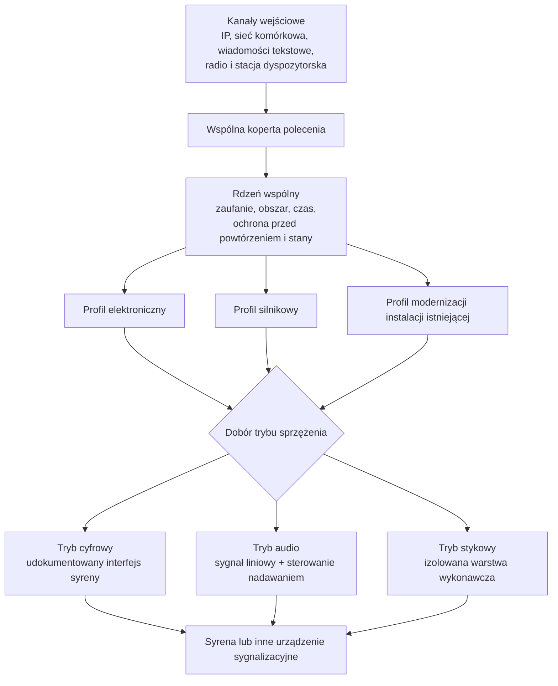

Podział na profile mówi, **czym jest urządzenie wykonawcze**. Osobną osią jest **tryb sprzężenia** —
czy sterownik podaje syrenie gotowy dźwięk, wywołuje jej interfejs programowy, czy zamyka obwód.
Te dwie osie są niezależne i nie należy ich mylić.

Kanały wejściowe nie zmieniają znaczenia polecenia. Sieć przewodowa, sieć bezprzewodowa, transmisja
komórkowa, wiadomość tekstowa, radio dalekiego zasięgu i stacja radiowa przekazują dane do jednej
wspólnej koperty i jednej maszyny stanów. Dodanie kanału łączności nie może prowadzić do utworzenia
odrębnej logiki wykonawczej.

---

#### Profil elektroniczny

Syrena elektroniczna to wzmacniacz z przetwornikiem. Sterownik podaje na jej wejście sygnał audio
i uruchamia tor nadawania.

Profil obejmuje odtworzenie sygnału z pliku wzorcowego, odtworzenie komunikatu nagranego,
wygenerowanie komunikatu z tekstu w języku polskim, wyjście liniowe o uzgodnionym poziomie,
sterowanie torem nadawania oraz wykrycie gotowości wzmacniacza.

**Syrena elektroniczna może być sterowana także przez własny interfejs programowy**, jeżeli
producent taki udostępnia i udokumentował go zgodnie z wymaganiami swobody wyboru dostawcy.
Sterownik wywołuje wtedy polecenia syreny — odtwórz wskazany slot, podaj stan — zamiast
podawać jej gotowy dźwięk. Połączenie realizowane jest **standardową warstwą fizyczną**: portem
szeregowym, przewodem sieciowym, złączem uniwersalnym albo wejściami i wyjściami ogólnego
przeznaczenia. Nie jest to rozwiązanie zarezerwowane dla instalacji istniejących — nowa syrena
z udokumentowanym interfejsem korzysta z tej drogi tak samo.

Wybór między sterowaniem przez interfejs a podaniem gotowego dźwięku należy do projektanta
instalacji i zależy od tego, co syrena potrafi oraz co producent udokumentował. Oba sposoby są
równoprawne; opisuje je rozdział o trybach sprzężenia.

Należy uwzględnić dwa odrębne wymagania. Poziom sygnału musi mieścić się w granicach ±3 dB
względem wzorca, bez przesterowania. Potwierdzenie uruchomienia toru audio nie stanowi natomiast
dowodu słyszalności i nie zastępuje sprawdzenia zasięgu.

Dostarczane urządzenia mają wyjście stereofoniczne z dwoma kanałami przypisywanymi programowo
niezależnie. Pozwala to rozdzielić tor syreny od toru pomocniczego — na przykład nagłośnienia
wewnętrznego albo stacji radiowej — bez dokładania sprzętu.

---

#### Profil silnikowy

Syrena silnikowa wytwarza dźwięk mechanicznie. Sterownik nie tworzy tu przebiegu akustycznego, tylko
zamyka i otwiera obwód zasilania układu wykonawczego według zatwierdzonego programu.

**Sterownik nie może sterować obwodem mocy bezpośrednio z wyjść ogólnego przeznaczenia.** Musi
używać certyfikowanej, izolowanej warstwy wykonawczej — stycznika albo układu rozruchowego —
z izolacją galwaniczną i fizycznym zabezpieczeniem przed porażeniem podczas prac serwisowych.

Profil obejmuje ponadto sprzętowe blokady wzajemne, ograniczenie maksymalnego czasu ciągłego
zasilania, monitorowanie stanu stycznika, wykrywanie obecności obciążenia oraz wejście awaryjnego
odcięcia.

Modulacja sygnału ochrony ludności jest **programem sterowania układem wykonawczym**, a nie
przypadkowym przełączaniem z poziomu aplikacji. Parametry cyklu muszą pochodzić z zatwierdzonego
profilu i przejść testy u producenta syreny oraz na instalacji — a nie zostać dobrane
eksperymentalnie w terenie.

Osobno trzeba pamiętać, że dla syreny silnikowej **odcięcie lokalne** oznacza **zatrzymanie wirnika
pracującego pod obciążeniem**. Jest to czynność na obwodzie mocy, ze skutkami mechanicznymi,
i pozostaje środkiem awaryjnym.

---

#### Profil modernizacji instalacji istniejącej (retrofit)

Ten profil obsługuje instalacje, które już stoją. Wytyczne przewidują dwie drogi, a wybór należy
do zamawiającego, bo to on zna stan instalacji, umowy serwisowe i budżet.

> [!important] Zasada modernizacji instalacji istniejącej
> Kanał SOiA dodaje się jako tor równoległy. Dołączenie go nie może
> wyłączyć ani ograniczyć dotychczasowych sposobów uruchomienia syreny — istniejącego systemu
> dyspozytorskiego, pulpitu lokalnego, przycisku ręcznego ani kanału radiowego. Wykonawca nie może
> warunkować dołączenia wyłączeniem albo przeprogramowaniem istniejącego systemu, ani uzależniać
> od tego gwarancji. Oba tory pracują równolegle *(W-J01 do W-J08)*.

Tryby sprzężenia z syreną są niezależne od profili wykonawczych.
Sterowanie przez interfejs programowy syreny i podanie jej gotowego dźwięku występują zarówno
w instalacji nowej, jak i modernizowanej; profil modernizacyjny wyróżnia to, że instalacja już istnieje,
a nie to, jakim sposobem jest wysterowana.

##### Wariant 1 — integracja przez interfejs producenta

Sterownik wywołuje udokumentowane polecenia syreny, w szczególności odtworzenie wskazanego slotu
i odczyt stanu.
Połączenie realizowane jest standardową warstwą fizyczną — portem szeregowym RS-232, przewodem
sieciowym, złączem uniwersalnym albo wejściami i wyjściami ogólnego przeznaczenia.

Warunkiem jest otwarta dokumentacja producenta syreny: wykaz poleceń ze składnią, mapa slotów,
format i sposób wgrania plików dźwiękowych, kody odpowiedzi i błędów, sposób odczytu stanu oraz
parametry elektryczne złącza. Dokumentacja ma wystarczyć, żeby **niezależny wykonawca napisał
integrację bez kontaktu z producentem**.

Ewentualna wewnętrzna funkcja zatrzymania udostępniona przez producenta syreny nie stanowi
polecenia SOiA i nie może służyć do przerwania rozpoczętej emisji wbrew zasadzie niepodzielności.

##### Wariant 2 — wykorzystanie syreny jako systemu nagłośnieniowego

Sterownik sam odtwarza plik wzorcowy i podaje sygnał liniowy na wejście audio syreny, jednocześnie
uruchamiając jej tor nadawania. Syrena pełni wtedy rolę wzmacniacza z przetwornikiem i **nie musi
wiedzieć nic o SOiA** — ani o slotach, ani o katalogu sygnałów, ani o poleceniach.

Wariant ten ogranicza zależność od nieudokumentowanego interfejsu programowego. Wymaga wejścia
liniowego oraz wejścia nadawania, a jego dopuszczalność należy potwierdzić z uwzględnieniem
dokumentacji, bezpieczeństwa, warunków gwarancji i postanowień umowy.

Wierność sygnału zapewnia sterownik odtwarzający plik referencyjny zweryfikowany sumą kontrolną.
W wariancie interfejsowym zależy ona od zawartości slotów syreny i prawidłowości jej okresowej
weryfikacji.

##### Wymagania niepodlegające ograniczeniu w instalacji modernizowanej

Żadna z dróg nie zwalnia z rdzenia wspólnego. Weryfikacja źródła polecenia, reguła obszaru, okno
czasu, ochrona przed powtórzeniem i lokalne odcięcie awaryjne obowiązują tak samo jak w nowej
instalacji. Modernizacja dotyczy **sposobu wysterowania syreny**, a nie zakresu sprawdzeń przed
uruchomieniem.

##### Obsługa zbiegu poleceń z dwóch torów

Przy zbiegu poleceń z równoległych torów do końca wykonuje się polecenie, które jako pierwsze
rozpoczęło sekwencję. Polecenie odebrane w trakcie emisji podlega odnotowaniu i odroczeniu
do ponownej kwalifikacji. Nie może zostać automatycznie zakolejkowane jako następna emisja.

Lokalne odcięcie awaryjne i tryb serwisowy zachowują pierwszeństwo niezależnie od toru.

---

#### Interfejs radiowy jako punkt integracji

Stacja dyspozytorska podłącza się do **odrębnego portu** sterownika — sieciowego albo
szeregowego — przeznaczonego wyłącznie do przyjmowania polecenia z zewnątrz. Nie należy mylić tego
portu z torem audio i sterowaniem nadawaniem syreny, które służą do czegoś zupełnie innego.

Adapter stacji radiowej musi deklarować: nazwę i wersję, obsługiwany profil, wykaz obsługiwanych
funkcji, mapowanie wejść i wyjść, dopuszczalne czasy, zachowanie przy błędzie, możliwości
diagnostyczne oraz test zgodności.

Adapter **nie tworzy własnej semantyki alarmu**. Dostarcza polecenie; sprawdza je i wykonuje rdzeń
wspólny, dokładnie tak samo jak polecenie z każdego innego kanału. Kanał radiowy nie jest przy tym
dowodem uprawnienia — sam fakt, że wiadomość przyszła zaufaną drogą, nie wystarcza.

---

#### Maszyna stanów

Stan urządzenia musi być **trwały**, to znaczy dawać się odtworzyć po restarcie i po zaniku
zasilania. Bez tego nie da się zagwarantować, że polecenie wykonane raz nie wykona się drugi raz.

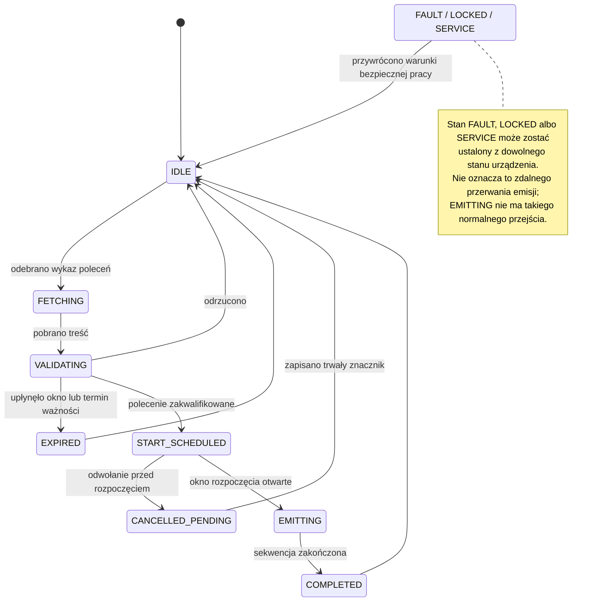

> [!note] Dla odbiorcy operacyjnego
> Diagram jest modelem dla producenta oprogramowania, a nie instrukcją obsługi syreny. Dla właściciela najważniejsze są trzy skutki: urządzenie odmawia przy poleceniu niespełniającym warunków, nie powtarza zakończonej emisji po restarcie i nie przerywa rozpoczętej emisji zwykłym poleceniem zdalnym. Tryb serwisowy, blokada albo awaria wymagają przywrócenia warunków bezpiecznej pracy na obiekcie.

**Stan `EMITTING` ma w normalnym przebiegu wyłącznie przejście wynikające z zakończenia
sekwencji.** Awaryjne odcięcie toru wykonawczego jest czynnością sprzętową i nie stanowi zwykłego
przejścia maszyny stanów.

**Stan `CANCELLED_PENDING` dotyczy wyłącznie polecenia, którego wykonywanie jeszcze się nie
rozpoczęło.** Urządzenie zapisuje trwały znacznik odwołania, aby późniejsze odebranie odwołanej
akcji nie spowodowało emisji. Znacznik musi przetrwać restart.

---

#### Odtwarzanie stanu po restarcie i zaniku zasilania

Po uruchomieniu urządzenie odtwarza stan trwały i postępuje według jego zawartości.

Polecenie **zakończone** nie podlega ponownemu wykonaniu, niezależnie od liczby jego późniejszych
wystąpień w wykazie. Polecenie **odwołane** nie jest uruchamiane. Polecenie **zaplanowane** podlega
ponownej weryfikacji świeżości i okna rozpoczęcia. Stan **przerwanej emisji** wymaga jawnie
określonego postępowania właściwego dla profilu sprzętowego; samoczynne wznowienie jest
niedopuszczalne. Stan **awaryjny** utrzymuje się do czasu przywrócenia warunków bezpiecznej pracy.

Zanik zasilania nie może usuwać stanu ochrony przed powtórzeniem ani powodować ponownego wykonania
polecenia, którego okno rozpoczęcia upłynęło.

---

#### Tryby pracy

Urządzenie musi jednoznacznie wiedzieć, w jakim jest trybie, i musi to komunikować.

**Operacyjny** — przyjmuje i wykonuje polecenia produkcyjne. **Ćwiczebny** — wykonuje wyłącznie
polecenia oznaczone jako ćwiczenie i na odrębnym profilu. **Serwisowy** — blokuje wykonanie zdalne,
dopuszcza test lokalny. **Zablokowany** — blokada awaryjna. **Ograniczony** — pracuje węższym
zestawem kanałów, ale **zachowuje pełny zakres weryfikacji**. **Awaryjny** — nie wykonuje poleceń
do czasu spełnienia warunków bezpiecznej pracy.

Zmiana trybu jest zdarzeniem odnotowywanym lokalnie wraz z czasem i przyczyną. **Restart nie może
samoczynnie przełączyć trybu serwisowego lub zablokowanego na operacyjny.** Najczęstszy błąd
eksploatacyjny w tej klasie instalacji to syrena pozostawiona w trybie serwisowym po pracach
konserwacyjnych i odkrycie tego dopiero podczas alarmu.

Tryb ćwiczebny urządzenia i sygnał ćwiczebny z katalogu to **dwie różne rzeczy o myląco podobnych
nazwach**: pierwszy jest stanem urządzenia, drugi rodzajem dźwięku. Można wyemitować sygnał
ćwiczebny w trybie operacyjnym i można wykonać test w trybie ćwiczebnym bez emisji zewnętrznej.

---

#### Ewidencjonowanie etapów wykonania polecenia

Ustalenie przyczyny niewykonania emisji wymaga rozróżnienia kolejnych etapów. Urządzenie powinno
ewidencjonować: przyjęcie polecenia, zaplanowanie akcji, aktywowanie wyjścia, wykrycie obciążenia,
potwierdzenie pracy przez czujniki lokalne, zakończenie emisji oraz błąd lub wykonanie niepełne.

Żaden z tych stopni **nie jest dowodem słyszalności**. Ostatnim ogniwem, którego system nie widzi,
pozostaje akustyka — i tego załącznik nie zmienia.

---

## Część IV. Procedury podłączenia i integracji

Część IV opisuje trzy kumulatywne poziomy podłączenia. Poziom 0 jest dostępny bez zgody i stanowi
podstawowy sposób integracji; poziomy wyższe rozszerzają go o kolejne kanały, nie zastępując
poziomów niższych.

> [!important] Mapa kanałów w stanie docelowym
> Tor danych pobiera podpisany IoT Feed i pozostaje podstawą poziomu 0. Kanał niezwłocznego powiadomienia nie przenosi komendy — skraca czas wykrycia nowej wersji Feedu. Kanał SMS jest odrębnym kanałem wykonawczym z własnym profilem i kontrolami. Urządzenie może korzystać z wielu kanałów, lecz ta sama komenda nie może spowodować wielokrotnej emisji.

### Załącznik nr 6 — Poziom 0: publiczny wykaz poleceń

#### Adresaci i zakres załącznika

Załącznik jest przeznaczony dla osób projektujących i implementujących oprogramowanie sterownika.
Opisuje minimalny proces bezpiecznej integracji urządzenia z SOiA na poziomie 0, bez rejestracji
i bez dostępu do kanałów zamkniętych.

Wartości przytoczone niżej mają charakter **informacyjny**. Źródłem rozstrzygającym są punkty
dostępu wymienione w rozdziale 2: to one publikują aktualne wersje, identyfikatory kluczy
i słowniki. Wpisanie wartości z tego dokumentu na stałe, bez możliwości zmiany, jest błędem.

---

#### 1. Zasada działania poziomu 0

Urządzenie pełni funkcję odbiornika. Okresowo pobiera podpisany wykaz poleceń, a następnie
weryfikuje podpis, obszar i czas przed rozpoczęciem emisji.

Na poziomie 0 urządzenie nie wysyła potwierdzeń ani telemetrii i nie posiada indywidualnej
tożsamości w kanałach zamkniętych. Komunikacja z publicznym punktem dostępu ma charakter odczytu.

---

#### 2. Punkty dostępu

Wszystkie pod adresem produkcyjnym `alarm.soia.info`, metodą odczytu, bez uwierzytelnienia.

| Punkt | Co zwraca |
|---|---|
| `/api/v1/iot/feed` | podpisany wykaz poleceń — zasadnicze źródło |
| `/api/v1/iot/public-key` | klucz publiczny do weryfikacji podpisu, wraz z identyfikatorem i kluczami z okna wymiany |
| `/api/v1/iot/public-key.pem` | ten sam klucz w postaci surowej |
| `/api/v1/iot/profile` | opis profilu klienta, obsługiwane klasy urządzeń i kody sygnałów |
| `/api/v1/iot/dictionaries` | aktualna wersja słowników klas urządzeń i kodów sygnałów |

**Lista jest zamknięta.** Nie ma i nie będzie punktu dostępu, z którego sterownik pobierałby
zawartość dźwiękową: system przenosi polecenie, nie dźwięk. Pliki wzorcowe udostępnia się do
pobrania na stronie, a wgrywa przy instalacji.

##### Limity rozmiaru danych

Wraz z opisem profilu ogłaszane są **maksymalne rozmiary**: pojedynczego polecenia i całego wykazu.
Urządzenie, które otrzyma treść większą, **odrzuca ją jako błąd** — nie jako brak poleceń — i pozostaje
sprawne.

Rdzeń wymagań powinien być możliwy do realizacji na mikrokontrolerze z ograniczoną pamięcią;
wykaz bez ogłoszonej górnej granicy byłby dla takiego urządzenia jednocześnie przyczyną
awarii i wektorem ataku. Wskazówka konstrukcyjna, a nie wymaganie: urządzenie o małej pamięci
powinno weryfikować i przetwarzać wykaz **strumieniowo**, bez buforowania go w całości.

Adres bazowy, tak jak identyfikator klucza, **musi być konfigurowalny**. Urządzenie, którego nie da
się przestawić na inny punkt dostępu bez udziału producenta, nie spełnia wymagań swobody wyboru
dostawcy.

---

#### 3. Struktura wykazu

Wykaz jest dokumentem tekstowym w formacie JSON. Poza polami opisującymi same polecenia niesie
metadane pozwalające sprawdzić, **z czym urządzenie właściwie rozmawia**.

Pola koperty: nazwa profilu i jego wersja, środowisko, wersja słowników, czas wygenerowania, numer
kolejny wykazu, **termin ważności treści**, lista poleceń aktywnych, okno zdarzeń informacyjnych
oraz podpis wraz z algorytmem i identyfikatorem klucza.

Pola pojedynczego polecenia: własny identyfikator polecenia, rodzaj polecenia, klasa urządzenia
docelowego, kod sygnału, powiązanie z ostrzeżeniem źródłowym, numer kolejny polecenia, wykaz poleceń
zastępowanych, obszar wraz z geokodami, **czas, od którego i do którego wolno rozpocząć emisję**,
oraz czas utworzenia.

Osobno występuje **okno zdarzeń** — lista obowiązujących ostrzeżeń, przeznaczona do podglądu
i diagnostyki. **Obecność ostrzeżenia w tym oknie nie jest poleceniem** i nie uruchamia niczego.
Syrena rusza wyłącznie na podstawie pozycji z listy poleceń aktywnych.

---

#### 4. Weryfikacja podpisu

Weryfikacja podpisu stanowi warunek rozpoczęcia dalszego przetwarzania wykazu. Szyfrowanie
połączenia nie zastępuje podpisu treści.

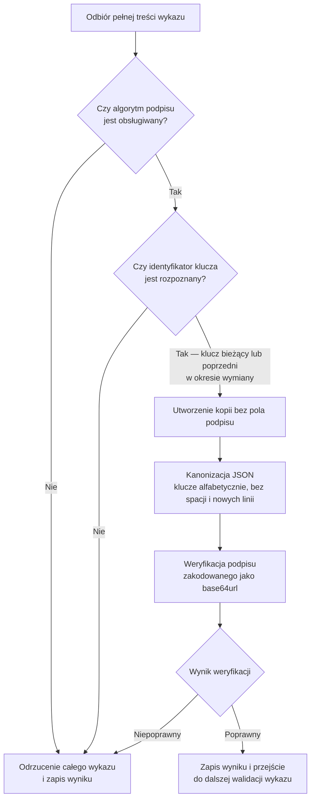

Podpis obejmuje wykaz **bez pola podpisu**. Jeżeli weryfikacja nie przechodzi mimo poprawnego
klucza, w zdecydowanej większości przypadków przyczyną jest **inna kolejność kluczy albo dodatkowe
białe znaki** we własnej serializacji — a nie błąd po stronie serwera.

Nieznany identyfikator klucza powoduje odmowę wykonania. Urządzenie musi jednak obsłużyć okres,
w którym jednocześnie obowiązują klucz bieżący i poprzedni, aby wymiana klucza nie powodowała
przerwy w działaniu urządzeń. Punkt dostępu z kluczem publicznym udostępnia oba klucze w okresie
nakładania.

Do sprawdzenia własnej implementacji służą **wektory wzorcowe**: deterministyczna para znanego
wykazu i znanego podpisu. Implementacja, która nie przechodzi wektorów wzorcowych, nie przejdzie
też odbioru.

---

#### 5. Reguła obszaru

Polecenie dotyczy urządzenia wtedy, gdy **kod obszaru w poleceniu jest równy kodowi terenu
urządzenia albo wobec niego nadrzędny**. Zależność w drugą stronę nie wystarcza.

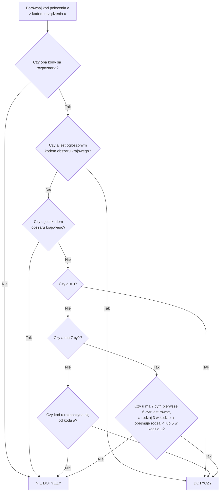

**Siódma cyfra kodu gminy jest znacząca.** Rejestr rozróżnia przez nią gminę miejską, wiejską
i miejsko-wiejską, a w tej ostatniej — samo miasto i sam obszar wiejski. Kody miasta i obszaru
wiejskiego mają wspólne sześć pierwszych cyfr, ale opisują **tereny rozłączne**: ostrzeżenie dla
miasta nie obejmuje otaczających wsi. Porównywanie gmin „po sześciu cyfrach” zawyża obszar alarmu.

Porównaniu podlegają wyłącznie kanoniczne oznaczenia kodów jednostek podziału terytorialnego.
Kody miejscowości i ulic należy pomijać, ponieważ mają odrębną numerację. Kod sześciocyfrowy,
pozbawiony cyfry rodzaju, podlega odrzuceniu jako niepełny. Niedopuszczalne jest korygowanie kodu
przez jego obcięcie lub dopełnienie. Jeżeli polecenie obejmuje wiele geokodów, wystarczające jest
dopasowanie co najmniej jednego z nich.

##### Zasady konfiguracji obszaru działania urządzenia

Obszar działania urządzenia konfiguruje się siedmiocyfrowym kodem gminy, w której urządzenie jest
zlokalizowane. Sterownik obejmujący więcej niż jedną gminę otrzymuje listę kodów gmin, a nie kod
jednostki nadrzędnej.

Obszar ostrzeżenia może zostać wyznaczony geometrycznie na mapie. W takim przypadku polecenie
zawiera kody objętych gmin, a nie kod całego powiatu. Urządzenie skonfigurowane wyłącznie kodem
powiatu nie dopasuje kodów gminnych zawartych w takim poleceniu.

Oprogramowanie musi wykrywać konfigurację dwu- lub czterocyfrową i odrzucać ją albo jednoznacznie
zgłaszać jako błąd.

---

#### 6. Warunki wykonania polecenia

Urządzenie uruchamia syrenę wyłącznie wtedy, gdy **wszystkie** poniższe są prawdziwe:

podpis jest poprawny, a identyfikator klucza znany; profil, środowisko i wersja słowników zgodne
z obsługiwanymi; termin ważności treści jeszcze nie minął; klasa urządzenia docelowego odpowiada
urządzeniu; kod sygnału jest znany i dozwolony; co najmniej jeden kod obszaru obejmuje teren
urządzenia; czas bieżący mieści się w oknie rozpoczęcia; identyfikator polecenia nie został
wcześniej wykonany; numer kolejny nie narusza ochrony przed powtórzeniem; stan techniczny pozwala
na bezpieczną emisję; tryb pracy nie jest serwisowy, zablokowany ani awaryjny.

**Niespełnienie któregokolwiek warunku daje wynik odmowny.** Bez wyjątków i bez interpretacji
rozszerzającej.

Brak polecenia w wykazie nie stanowi dyspozycji odcięcia trwającej emisji. Zniknięcie polecenia z wykazu znaczy,
że nie wolno go **rozpoczynać** — nie jest rozkazem odcięcia emisji już trwającej. Podobnie
obecność ostrzeżenia w oknie zdarzeń nie jest podstawą do uruchomienia czegokolwiek.

---

#### 7. Odpytywanie

**Odstęp bazowy wynosi 30 sekund.** Odpytywanie częstsze wymaga osobnego uzgodnienia i mieści się
w limitach usługi; odpytywanie rzadsze nie spełnia wymagań.

Urządzenie stosuje zapytanie warunkowe ze znacznikiem wersji z poprzedniej odpowiedzi i obsługuje
odpowiedź „bez zmian”. Odpowiedź o przekroczeniu limitu należy respektować wraz ze wskazanym
czasem wstrzymania. Po błędach sieci stosuje się kontrolowane wycofanie zamiast ponawiania
w pętli.

**Losowe rozproszenie momentu odpytania jest obowiązkowe.** Bez rozproszenia urządzenia mogłyby
kierować żądania w tym samym czasie, powodując krótkotrwałe przeciążenie usługi.

> [!caution] Wymaga decyzji przed akceptacją — polling, jitter i Retry-After
> Wymaganie 30 sekund, rozproszenie momentu odpytania, backoff po błędzie i okres wstrzymania wskazany przez usługę muszą mieć jedną zatwierdzoną hierarchię. Redakcja nie rozstrzyga, jak urządzenie ma postąpić, gdy wyjątkowy `Retry-After` przekracza odstęp bazowy. Implementacja i odbiór wymagają wspólnej interpretacji tego przypadku.

Treść przeterminowana nie może stanowić podstawy wykonania polecenia. Brak możliwości pobrania
aktualnego wykazu skutkuje brakiem nowej emisji.

---

#### 8. Dane przechowywane w pamięci trwałej

W pamięci trwałej, odpornej na zanik zasilania: ostatni zaakceptowany numer kolejny wykazu,
ograniczony zbiór wykonanych identyfikatorów poleceń wraz z czasem i wynikiem, identyfikatory
poleceń odwołanych oraz wersję ostatniego poprawnego wykazu.

Identyfikator wykonanego polecenia trzeba przechowywać **co najmniej do momentu, w którym nie może
już wrócić**: dłużej niż termin ważności wykazu, dłużej niż najpóźniejsze okno rozpoczęcia
i najpóźniejsze zdarzenie w oknie, z zapasem doby.

Ponowne otrzymanie tego samego polecenia — przez odpytanie, powiadomienie, wiadomość tekstową albo
radio — **nie może spowodować drugiej emisji**.

---

#### 9. Algorytm działania klienta

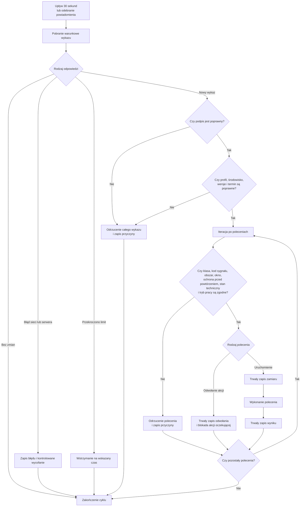

Kolejność ma znaczenie: **zamiar zapisuje się przed uruchomieniem wyjścia**, nie po. Urządzenie,
które straci zasilanie w trakcie emisji, musi po powrocie wiedzieć, że emisja się rozpoczęła.

---

#### 10. Minimalny zakres badań zgodności implementacji

Poprawne uruchomienie dla własnej gminy. Polecenie powiatowe i wojewódzkie obejmujące tę gminę.
Polecenie dla obcej gminy — bez reakcji. Rozróżnienie miasta i obszaru wiejskiego w gminie
miejsko-wiejskiej. Niepoprawny podpis, nieznany identyfikator klucza i zmodyfikowana treść —
odrzucenie. Wykaz przeterminowany i okno rozpoczęcia zamknięte — brak emisji. Ten sam identyfikator
polecenia po restarcie — brak drugiej emisji. Odwołanie przed rozpoczęciem — brak emisji. Odwołanie
po zakończeniu — zapis, bez działania. Wyłączony kanał szybki, wykrycie zmiany samym odpytywaniem.
Odpowiedź z pamięci pośredniej starsza niż oczekiwana — ponowienie. Obsługa odpowiedzi poprawnych,
„bez zmian”, o przekroczeniu limitu i o niedostępności usługi.

Pełny wykaz scenariuszy odbiorowych zawiera załącznik nr 10.

---

#### 11. Typowe błędy implementacyjne i działania korygujące

| Objaw | Przyczyna | Działanie korygujące |
|---|---|---|
| Podpis nie przechodzi mimo poprawnego klucza | inna kolejność kluczy albo białe znaki we własnej serializacji | sortuj klucze alfabetycznie, buduj tekst bez spacji |
| Podpis nie przechodzi po wymianie klucza | urządzenie zna tylko klucz poprzedni | pobierz klucz z punktu dostępu; obsłuż okno nakładania |
| Odpowiedź o przekroczeniu limitu | zbyt częste odpytywanie albo brak rozproszenia | wróć do odstępu bazowego, honoruj czas wstrzymania |
| Syrena milczy mimo ostrzeżenia | ostrzeżenie bez zaznaczenia syren albo poza oknem rozpoczęcia | to jest zachowanie poprawne — polecenie powstaje tylko dla ostrzeżeń z jawnym zaznaczeniem |
| Syrena milczy przy alercie rysowanym po mapie | urządzenie skonfigurowane kodem powiatu | skonfiguruj listą kodów gmin |
| Emisja powtarza się po restarcie | zapis zamiaru dopiero po uruchomieniu wyjścia albo brak trwałości | zapisuj zamiar przed uruchomieniem, w pamięci trwałej |
| Urządzenie działa mimo braku łączności | działanie na treści przeterminowanej | sprawdzaj termin ważności przed każdym wykonaniem |

---

### Załącznik nr 7 — Poziom 1: rejestracja i kanał powiadomienia

#### Zakres funkcjonalny poziomu 1

Poziom 1 skraca czas wykrycia zmiany wykazu. Urządzenie na poziomie 0 wykrywa zmianę podczas
najbliższego odpytania, którego odstęp bazowy wynosi trzydzieści sekund. Urządzenie zarejestrowane
otrzymuje dodatkowo niezwłoczne powiadomienie i pobiera wykaz po jego odebraniu.

Poza tym urządzenie zyskuje **własną tożsamość kryptograficzną**, która pozwala odróżnić je od
innych, zawiesić albo odwołać pojedynczo, i która jest warunkiem wejścia na poziom drugi.

Poziom ten **nie zmienia** zakresu weryfikacji polecenia, reguły obszaru, ochrony przed
powtórzeniem i obowiązku cyklicznego odpytywania. Odpytywanie co trzydzieści sekund pozostaje
obowiązkowe także wtedy, gdy kanał powiadomienia działa. Niedostępność kanału powiadomienia
wydłuża czas wykrycia zmiany, lecz nie pozbawia urządzenia zdolności pobrania polecenia z poziomu 0.

---

#### 1. Zgłoszenie

Zgłoszenie składa **podmiot publiczny** — jednostka samorządu terytorialnego, wojewoda albo
jednostka organizacyjna Państwowej Straży Pożarnej — formularzem udostępnionym przez Komendę Główną
PSP. Jednostce samorządu terytorialnego zakłada się **profil**, w którym rejestruje ona własne
urządzenia; profil porządkuje wnioski i wiąże je z podmiotem odpowiedzialnym, ale **nie zastępuje
decyzji** o dopuszczeniu pojedynczego urządzenia.

Rejestracja i dopuszczenie do kanałów zamkniętych nie obejmują podmiotów spoza wskazanego kręgu.
Podmioty te mogą nadal korzystać z poziomu 0 bez procedury rejestracyjnej.

Zakres danych zgłoszenia:

**Identyfikacja urządzenia** — nazwa techniczna bez danych osobowych, producent, model, numer
seryjny, wersja sprzętu i oprogramowania, profil wykonawczy.

**Obszar działania** — lista siedmiocyfrowych kodów gmin, na których syrena fizycznie oddziałuje.
Nie kod powiatu, nie kod województwa.

**Umiejscowienie** — opis lokalizacji na poziomie wystarczającym do identyfikacji obiektu.
Współrzędne dokładne wymagają odrębnej polityki i nie są przedmiotem zgłoszenia.

**Odpowiedzialność** — jednostka odpowiedzialna operacyjnie oraz kontakt serwisowy. Dane kontaktowe
prowadzi się poza materiałem kryptograficznym.

**Kanały** — którymi urządzenie dysponuje: przewodowy, bezprzewodowy, komórkowy, wiadomości
tekstowe, radiowy dyspozytorski, radiowy dalekiego zasięgu.

**Klasy zdolności** — które zamówiono: rdzeń, tor audio, profil głosowy.

Formularz **nie przyjmuje i nie przechowuje klucza prywatnego**. Materiał prywatny nie opuszcza
urządzenia.

---

#### 2. Decyzja administratora

**Złożenie zgłoszenia nie tworzy uprawnienia.** O dopuszczeniu **każdego urządzenia z osobna**
rozstrzyga administrator SOiA i jest to decyzja, a nie czynność techniczna wykonywana automatycznie.
Administrator potwierdza powiązanie identyfikatora z konkretnym urządzeniem, jego lokalizacją
i obszarem działania. Weryfikacja ta dotyczy każdego urządzenia odrębnie.

**Termin rozpatrzenia:** 14 dni roboczych dla zgłoszenia pojedynczego, 30 dni roboczych dla porcji
zgłoszeń złożonej z profilu jednostki samorządu terytorialnego. Termin biegnie od zgłoszenia
kompletnego.

Stany rejestracji przedstawia poniższy diagram:

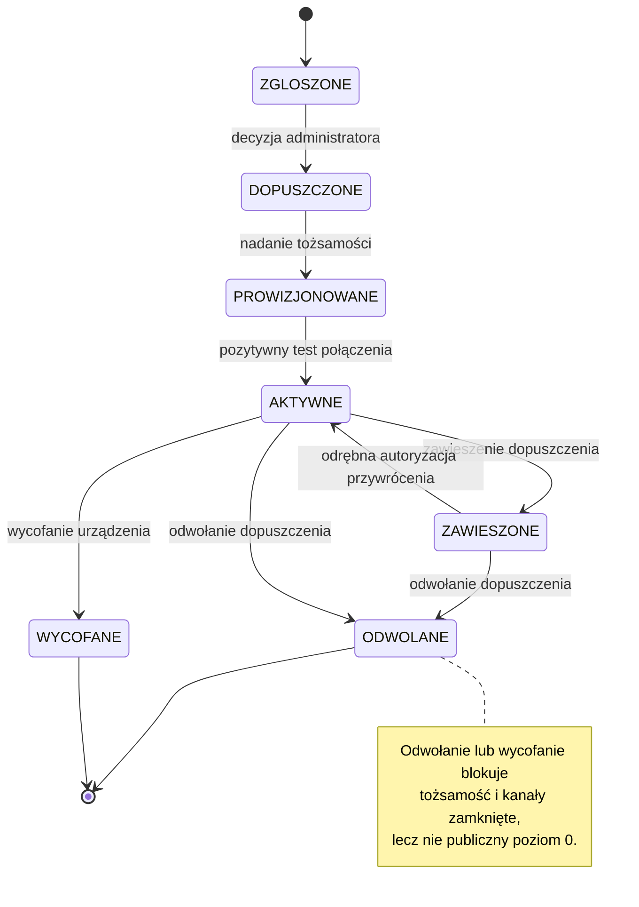

> [!note] Jak czytać proces rejestracji
> Diagram pokazuje status administracyjny urządzenia, a nie jego stan techniczny. JST składa i uzupełnia zgłoszenie, administrator podejmuje decyzję, system nadaje tożsamość, a urządzenie potwierdza połączenie. Zawieszenie lub odwołanie blokuje kanały zamknięte, lecz samo w sobie nie usuwa dostępu do publicznego poziomu 0.

**Rejestracja nie jest warunkiem działania.** W okresie od zgłoszenia do rozstrzygnięcia — który
może trwać dni — urządzenie normalnie wykonuje polecenia z publicznego wykazu. Nie powstaje luka
w ochronie ludności i nie ma powodu, żeby wstrzymywać uruchomienie instalacji do czasu decyzji.

**Zawieszenie i odwołanie nie odcinają od publicznego wykazu.** Blokują tożsamość i kanał szybki;
urządzenie wraca wtedy do zachowania z poziomu otwartego, chyba że lokalna polityka wymaga jego
wyłączenia. Zmiana stanu zachowuje ślad, wskazuje przyczynę i osobę, a przywrócenie wymaga odrębnej
autoryzacji.

---

#### 3. Nadanie tożsamości

Dopuszczenie skutkuje utworzeniem tożsamości urządzenia i wydaniem indywidualnego certyfikatu.

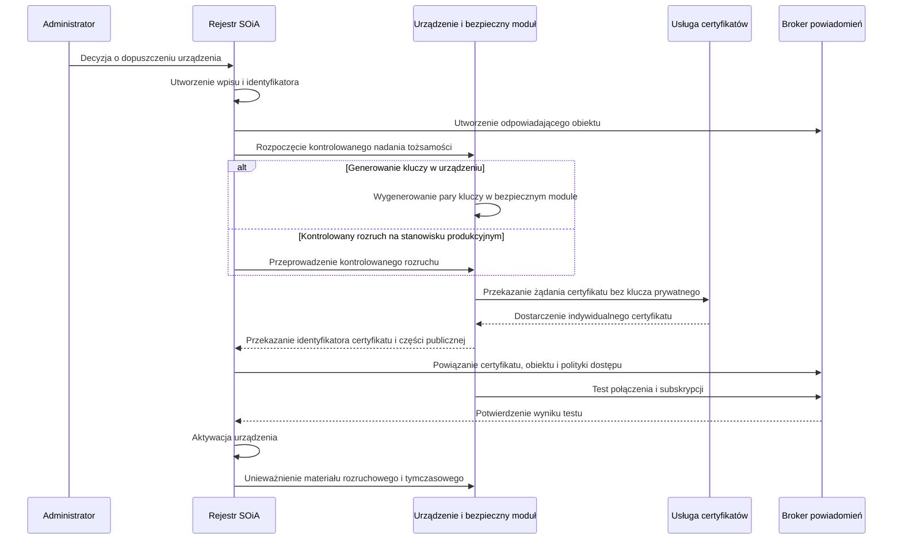

> [!note] Granica odpowiedzialności przy nadawaniu tożsamości
> Diagram opisuje proces wykonywany po pozytywnej decyzji administratora. Instalator przygotowuje urządzenie do kontrolowanego nadania tożsamości, ale nie podejmuje decyzji o dopuszczeniu i nie przejmuje klucza prywatnego. Materiał prywatny pozostaje w bezpiecznym magazynie urządzenia, a system otrzymuje wyłącznie dane potrzebne do powiązania tożsamości i polityki dostępu.

Obowiązuje zasada: **jeden fizyczny sterownik — jedna tożsamość.** Jeden aktywny
certyfikat nie może identyfikować wielu urządzeń. **Klucz prywatny nie opuszcza bezpiecznego
magazynu.** Kompromitacja jednego urządzenia nie może wymuszać wymiany całej floty. Identyfikator
połączenia jest unikalny, a jego duplikat stanowi zdarzenie operacyjne wymagające reakcji.

Rejestr SOiA prowadzi **własny, niezależny identyfikator urządzenia** i jego odwzorowanie
w usłudze brokera. Nazwa zasobu u dostawcy chmurowego nie może być jedyną tożsamością biznesową
urządzenia — inaczej zmiana dostawcy stałaby się zmianą rejestru.

---

#### 4. Kanał powiadomienia

Kanał powiadomienia przenosi wyłącznie informację o zmianie wykazu i konieczności jego ponownego
pobrania. Nie przenosi polecenia uruchomienia, odwołania ani innej treści wykonawczej.

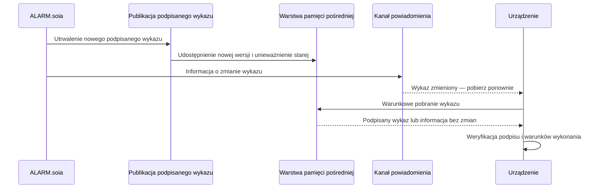

Dla toru danych jedynym źródłem treści wykonawczej pozostaje podpisany wykaz. Powiadomienie wyłącznie skraca czas
dotarcia informacji o jego zmianie i nie tworzy równoległego toru decyzyjnego. Niedostępność kanału
powiadomienia nie zatrzymuje działania poziomu 0; urządzenie wykrywa zmianę podczas cyklicznego
odpytywania. Sprawdzenie działania bez kanału powiadomienia stanowi element odbioru.

Polityka dostępu urządzenia jest **minimalna**: połączenie wyłącznie własnym identyfikatorem,
subskrypcja wyłącznie tematu powiadomień oraz brak uprawnienia do publikowania wiadomości.
Przyszły kanał statusu urządzenia wymaga odrębnej polityki,
odrębnej decyzji o retencji danych i odrębnego rozstrzygnięcia o potwierdzeniach.

---

#### 5. Kolejność publikacji i zapewnienie świeżości danych

Powiadomienie może dotrzeć do urządzenia szybciej, niż zdąży odświeżyć się pamięć pośrednia przed
punktem dostępu. Urządzenie pobrałoby wtedy **starszą treść niż ta, o której je powiadomiono**.

Publikacja musi więc spełniać warunek: **po odebraniu powiadomienia urządzenie ma móc pobrać nową
albo równoważną, podpisaną treść.** Dopuszczalne sposoby to utrwalenie stanu i skuteczne
unieważnienie pamięci pośredniej przed wysłaniem powiadomienia, generowanie treści z krótkim czasem
ważności pamięci pośredniej, albo umieszczenie w powiadomieniu numeru kolejnego pozwalającego
urządzeniu rozpoznać, że pobrało wersję starszą, i ponowić żądanie.

> [!caution] Wymaga decyzji przed akceptacją — świeżość po powiadomieniu
> Sama obecność pamięci pośredniej ani krótki czas jej ważności nie dowodzą, że urządzenie pobrało wersję wskazaną przez powiadomienie. Przed odbiorem trzeba zatwierdzić mechanizm pozwalający rozpoznać wersję starszą albo wykazać równoważność pobranej treści. Redakcja nie wybiera jednego z dopuszczalnych mechanizmów.

Modyfikowanie podpisanej treści w warstwie pośredniczącej jest niedopuszczalne. Zmiana bajtów
objętych podpisem powoduje niepowodzenie jego weryfikacji.

---

#### 6. Cykl życia materiału kryptograficznego

Musi istnieć i być udokumentowany proces: wydania, aktywacji, **wymiany przed wygaśnięciem**,
równoległego okna certyfikatu starego i nowego, potwierdzenia działania na nowym, dezaktywacji
starego, awaryjnego odwołania, ponownego nadania tożsamości po wymianie płyty, wycofania urządzenia
z eksploatacji oraz okresowego przeglądu wykrywającego certyfikaty bez urządzeń i urządzenia bez
ważnej tożsamości.

Wymiana **nie może wymagać wizyty przy każdym urządzeniu**, ale zdalny rozruch musi być chroniony
i odnotowany.

---

#### 7. Wymagania procesu rejestracji w skali docelowej

Przy założonej docelowej skali rzędu **dwudziestu trzech tysięcy urządzeń** wyłącznie ręczne
wystawianie certyfikatów i przetwarzanie zgłoszeń nie zapewni wymaganej przepustowości procesu.

Decyzja administratora pozostaje decyzją — ale musi być wspierana procesem: **zgłoszeniem zbiorczym
dla jednostki**, prowizjonowaniem flotowym tożsamości, automatycznym przydziałem karty abonenckiej
i numeru oraz **wymianą klucza jako operacją planowaną**, z oknem nakładania i harmonogramem,
a nie jednorazową podmianą.

To samo założenie dotyczy odpytywania. Flota tej wielkości przy odstępie trzydziestu sekund
generowałaby średnio ponad siedemset zapytań na sekundę. Zapytania warunkowe ograniczają koszt
obsługi, natomiast losowe rozproszenie momentu odpytania zapobiega jednoczesnemu kierowaniu żądań
przez znaczną część floty.

> [!caution] Założenie projektowe
> Liczbę urządzeń oraz wynikającą z niej przepustowość należy potwierdzić przed przyjęciem wymagań
> pojemnościowych i eksploatacyjnych.

---

#### 8. Kryteria odbiorowe

Dwa urządzenia nie mogą połączyć się tym samym identyfikatorem bez wykrycia konfliktu. Certyfikat
jednego urządzenia nie daje dostępu jako inne. Po odwołaniu urządzenie nie łączy się ponownie.
Wymiana materiału kryptograficznego odbywa się bez utraty zdolności do odpytywania. Po wymianie
sprzętu stary certyfikat jest nieaktywny. **Eksport rejestru nie zawiera kluczy prywatnych.**
Wyłączenie kanału powiadomienia nie zatrzymuje wykonywania poleceń.

---

### Załącznik nr 8 — Poziom 2: sieć wydzielona i kanał wiadomości tekstowych

#### Zakres funkcjonalny poziomu 2

Poziom 2 dodaje dwie zdolności: pracę w wydzielonej sieci operatora, podlegającej kontroli dostępu,
oraz kanał wiadomości tekstowych przeznaczony dla lokalizacji, w których transmisja danych jest
niestabilna albo niedostępna.

Kanał wiadomości tekstowych jest dwukierunkowy. Urządzenie może przekazywać odrębne potwierdzenia
przyjęcia i wykonania polecenia; żadne z nich nie stanowi potwierdzenia słyszalności sygnału.

---

#### 1. Dostęp do usług SOiA z sieci wydzielonej

Punkt dostępu SOiA oraz usługa powiadomień są osiągalne **równolegle z sieci wydzielonej
i z publicznego internetu**. Urządzenie pracujące w sieci wydzielonej używa **tego samego adresu**
i tej samej ścieżki co urządzenie na poziomie otwartym — zmienia się droga, nie kontrakt.

Obecność warstwy pośredniczącej nie narusza podpisu, jeżeli podpisane bajty pozostają niezmienione.
Warstwa ta nie może jednak modyfikować podpisanego dokumentu, interpretować poleceń ani stosować
własnej reguły obszaru. Treść objęta podpisem musi zostać przekazana bez zmian.

Sieć wydzielona ogranicza, **dokąd** urządzenie może się połączyć. Nie zmienia zakresu weryfikacji
polecenia: praca w sieci zaufanej nie jest podstawą do uruchomienia syreny.

---

#### 2. Profil komunikacji za pośrednictwem wiadomości tekstowych

Profil jest **wersjonowany i będzie się zmieniał** wraz z profilami kolejnych producentów. Poniżej
opisano jego strukturę; obowiązujące dla danej instalacji wartości zapisuje się w karcie
konfiguracji, o której mowa w załączniku nr 9.

##### Identyfikator urządzenia

Trzy człony: **numer kolejny nadany przez system**, **typ syreny** oraz **kod jednostki
terytorialnej**. Katalog typów obejmuje cztery wartości: **syrena elektroniczna**, **syrena
silnikowa**, **instalacja modernizowana (retrofit)** oraz **inne urządzenie sygnalizacyjne**.

Człon terytorialny identyfikatora służy do **rozpoznania urządzenia** i nie jest jego obszarem
działania. Obszar konfiguruje się osobno, listą siedmiocyfrowych kodów gmin. Te dwie wartości mogą
się różnić i różnica jest poprawna, nie błędna.

##### Polecenie

Wiadomość składa się z **hasła sterującego**, **kodu polecenia** oraz — od wersji profilu
wprowadzanej wraz z niniejszymi Wytycznymi — **znacznika czasu i licznika**. Katalog poleceń
obejmuje test łączności niepowodujący emisji, sygnały akustyczne z katalogu oraz polecenie
awaryjnego wygaszenia wyjścia. Powiązanie kodów poleceń z sygnałami zawiera załącznik nr 4.

Materiał źródłowy określa polecenie awaryjnego wygaszenia jako odcięcie toru wykonawczego.

> [!caution] Wymaga decyzji przed akceptacją — semantyka awaryjnego wygaszenia
> Słownik zastrzega „odcięcie lokalne” dla czynności wykonywanej na obiekcie i wyklucza zdalne
> zatrzymanie rozpoczętej emisji. Przed podpisaniem należy określić semantykę awaryjnego wygaszenia
> wyjścia oraz jego relację do zasady niepodzielności emisji. Redakcja V2 nie rozstrzyga tej
> sprzeczności materiału źródłowego.

##### Granice wiadomości

Polecenie musi zmieścić się w **jednej wiadomości: do 160 znaków** podstawowego alfabetu.
Urządzenie **odrzuca wiadomości wieloczęściowe** i nie podejmuje próby ich sklejania — wiadomość
złożona z fragmentów potrafi dotrzeć niekompletna albo w innej kolejności, a polecenie sklejone
z części przestaje być poleceniem, którego treść dało się zweryfikować.

Z tego wynika ograniczenie składni: **wyłącznie znaki podstawowego alfabetu, bez polskich znaków
diakrytycznych**. Ich użycie przełącza kodowanie i skraca wiadomość do 70 znaków, co przy dłuższym
poleceniu wymusiłoby podział — a podziału nie dopuszczamy.

##### Ochrona przed powtórzeniem polecenia

W fazie przejściowej, gdy nie ma zamkniętej grupy abonenckiej, realnym zabezpieczeniem pozostaje
hasło i lista numerów uprawnionych. Obie te warstwy są bezradne wobec **powtórzenia przechwyconej
wiadomości**: ta sama treść, wysłana drugi raz, jest nie do odróżnienia od oryginału.

Dlatego polecenie niesie znacznik czasu i licznik, a urządzenie odrzuca wiadomość, której znacznik
odbiega od jego czasu bardziej niż o dopuszczalny margines albo której licznik nie jest wyższy
od ostatnio przyjętego. Kosztuje to kilkanaście znaków i nie wymaga zmiany sprzętu — a usuwa
najprostszy z możliwych ataków w fazie, w której brakuje trzech pozostałych warstw.

##### Potwierdzenia

Poprawne polecenie daje **dwa potwierdzenia**, i to rozróżnienie jest istotne:

**Przyjęcie polecenia** — urządzenie odebrało wiadomość, zweryfikowało ją i uznało za swoją.
**Wykonanie** — wyjście zostało uruchomione, sygnał ruszył.

Pierwsze bez drugiego oznacza „przyjęto, uruchomienie niepotwierdzone” i jest stanem wymagającym
reakcji, a nie sukcesem. Żadne z nich **nie jest dowodem słyszalności**.

Potwierdzenia trafiają wyłącznie na numery uprawnione. Pełny katalog kodów potwierdzeń i błędów
oraz sposób odczytania odpowiedzi urządzenia utrzymywany jest w wersjonowanym profilu protokołu,
a nie w tym dokumencie.

---

#### 3. Model zabezpieczeń kanału wiadomości tekstowych

Kanał tekstowy **nie ma podpisu kryptograficznego**. Zamiast niego stosuje się obronę w głąb,
w której każda warstwa odcina inną drogę wejścia:

| Warstwa | Co kontroluje | Co odcina |
|---|---|---|
| Karta abonencka wydana centralnie | kto dysponuje nadajnikiem w systemie | podmioty spoza systemu |
| Zamknięta grupa abonencka | ruch wyłącznie wewnątrz grupy | wiadomość z zewnątrz sieci |
| Hasło sterujące na urządzeniu | treść każdego polecenia | wiadomość wysłaną omyłkowo wewnątrz grupy |
| Wykaz numerów uprawnionych | kto może wydać polecenie temu urządzeniu | uczestnika grupy bez uprawnienia |

Komplet czterech warstw tworzy model wielowarstwowej kontroli dostępu do kanału. Nie stanowi on
podpisu kryptograficznego treści. Żadna z warstw stosowana samodzielnie nie jest wystarczająca:
zamknięta grupa nie zastępuje hasła, a hasło nie zastępuje wykazu numerów.

> [!important] Stan przejściowy i docelowy kanału SMS
> W okresie przejściowym urządzenie może korzystać z karty innego operatora, ale nadal stosuje pełną walidację profilu SMS: numery uprawnione, unikalne hasło, składnię, znacznik czasu, licznik i ochronę przed powtórzeniem. W stanie docelowym KG PSP zapewnia kartę SIM w zamkniętej grupie użytkowników (CUG) oraz zarządza warstwą operatorską i listami numerów uprawnionych. CUG ogranicza dostęp do sieci, lecz nie zastępuje kontroli wykonywanych przez urządzenie.

##### Planowany okres przejściowy 2026–2027

Projekt zakłada, że w okresie przejściowym jednostki samorządu terytorialnego korzystają z kart
własnych operatorów. Zamknięta grupa abonencka nie jest wówczas dostępna, co usuwa warstwę
ograniczającą ruch do uczestników grupy.

W okresie docelowym ruch spoza grupy jest ograniczany na poziomie sieci. W okresie przejściowym
ochrona opiera się na wykazie numerów uprawnionych, haśle sterującym, znaczniku czasu i liczniku.
Ze względu na możliwość podszycia się pod numer nadawcy na niektórych trasach samo sprawdzenie
numeru nie jest wystarczające.

Stąd wymagania bezwzględne na czas tej fazy: **hasło unikalne dla urządzenia** — wspólne hasło floty
zamienia kompromitację jednej karty konfiguracyjnej w zdarzenie krajowe zamiast lokalnego — oraz
**rejestrowanie i sygnalizowanie odrzuconych poleceń**, bo polecenie odrzucone z nieznanego numeru
jest sygnałem bezpieczeństwa, a nie szumem.

Zalecenie operacyjne: **tam, gdzie dostępny jest tor danych, kanał tekstowy powinien pozostać
uzupełniający, a nie jedyny.** Wpięcie przewodem do sieci obiektu jest w tej fazie wyraźnie
bezpieczniejszą drogą.

Przejście do fazy docelowej **nie zmienia składni poleceń ani kontraktu** — zmienia kartę abonencką
i numery w wykazie uprawnionych. Urządzenie kupione dziś musi je przyjąć bez wymiany sprzętu.

##### Ryzyka rezydualne i środki ograniczające

Ryzyko powtórzenia przechwyconej wiadomości jest ograniczane przez znacznik czasu i licznik
określone w W-D25 oraz przez mechanizm niewykonywania tego samego polecenia ponownie w określonym
oknie (W-D14). Skuteczność wymaga trwałego przechowywania licznika, wiarygodnego czasu i ochrony
stanu urządzenia.

Pozostaje ryzyko **podszycia się pod numer nadawcy**, na które w fazie przejściowej nie ma
odpowiedzi technicznej po stronie sieci. Realnym zabezpieczeniem jest wtedy **hasło unikalne
dla urządzenia** — i dlatego jest ono w tej fazie zabezpieczeniem podstawowym, a nie uzupełniającym.

Potwierdzenia wysyłane na numery uprawnione zwiększają wykrywalność nieprawidłowego uruchomienia,
lecz nie gwarantują jego natychmiastowego wykrycia, ponieważ kanał potwierdzeń również może być
niedostępny lub opóźniony.

---

#### 4. Ograniczenia skalowalności kanału wiadomości tekstowych

Kanał tekstowy nie jest przeznaczony do samodzielnej obsługi alarmu krajowego. Jego przepustowość
należy potwierdzić przed wdrożeniem i okresowo weryfikować.

Bramka wielokartowa nadaje rzędu jednej wiadomości na sekundę na kartę. Przy ośmiu kartach daje to
około ośmiu wiadomości na sekundę — czyli **blisko godziny na powiadomienie floty rzędu dwudziestu
trzech tysięcy urządzeń**. Przy czterech takich bramkach nadal kilkanaście minut. Tymczasem **okno
rozpoczęcia emisji trwa trzy minuty**, a urządzenie, do którego polecenie dotrze po jego zamknięciu,
zgodnie z zasadą fail-closed nie rozpocznie emisji.

Kanał wiadomości tekstowych należy traktować jako kanał obszarowy i zapasowy, przeznaczony dla
pojedynczych gmin, lokalizacji bez transmisji danych oraz sytuacji awaryjnych. Podstawowym kanałem
o większej skali pozostaje tor danych z niezwłocznym powiadomieniem.

Podane wartości są szacunkiem rzędu wielkości i wymagają potwierdzenia pomiarem u operatora przed
wszczęciem postępowania. Jeżeli zmierzona przepustowość nie zapewni obsługi zakładanego obszaru
w wymaganym czasie, należy zwiększyć liczbę bramek, zmienić założenia dotyczące okna dla tego
kanału albo ograniczyć jego planowany zasięg.

---

#### 5. Obsługa stanów awaryjnych

Rozróżnienie, które musi być widoczne dla operatora: **brak potwierdzenia nie jest awarią syreny**.
Może oznaczać awarię bramki, brak zasięgu modemu, problem karty abonenckiej, przeciążenie kolejki
albo opóźnienie w sieci operatora — i każda z tych sytuacji wymaga innej reakcji niż wyjazd
do syreny.

Zasady postępowania. Bramka bez odpowiedzi — wstrzymanie pobierania z kolejki z zachowaniem zleceń,
nie ich porzucenie. Brak zasięgu — wstrzymanie realizacji, nie lawinowe ponawianie. Odrzucenie
polecenia przez bramkę — ponowienie transportowe z kontrolowanym wycofaniem. Brak potwierdzenia
wykonania mimo potwierdzenia przyjęcia — **brak automatycznego uznania sukcesu** i eskalacja.
Odpowiedź spóźniona — zapis i uzgodnienie stanu bez kasowania historii. Odpowiedź niejednoznaczna
albo od nieznanego nadawcy — kwarantanna i zdarzenie bezpieczeństwa. Przeciążenie kolejki —
pierwszeństwo dla poleceń krytycznych i widoczne dla operatora spowolnienie.

Wynik zbiorczy dla obszaru **nie może ukrywać niepowodzeń częściowych**. Operator ma widzieć liczby:
ile urządzeń potwierdziło przyjęcie, ile wykonanie, ile nie odpowiedziało — a nie jeden komunikat
„wysłano”.

---

#### 6. Ochrona i przechowywanie wartości operacyjnych

Numery abonenckie, hasła sterujące, wykazy numerów uprawnionych, nazwy sektorów i parametry sieci
**nie są częścią tego dokumentu**. Zapisuje się je w karcie konfiguracji urządzenia, przekazywanej
instalatorowi poza obiegiem publikowanym — wzór karty zawiera załącznik nr 9.

Podręcznik określa struktury danych, natomiast wartości właściwe dla konkretnej instalacji są
przechowywane w karcie konfiguracji.

---

## Część V. Konfiguracja, instalacja i odbiór

Ta część zawiera formularz konfiguracji urządzenia oraz zakres sprawdzeń wykonywanych podczas
odbioru. Zakres sprawdzeń odpowiada klasom zdolności i elementom objętym zamówieniem.

### Załącznik nr 9 — Karta konfiguracji urządzenia

#### Przeznaczenie i zasady stosowania karty

Jedna karta opisuje **jedno urządzenie**. Zawiera wszystkie wartości potrzebne instalatorowi
do uruchomienia instalacji i wszystkie wartości, których **nie ma w żadnym dokumencie
publikowanym**: numery, hasło sterujące, wykaz numerów uprawnionych, identyfikator urządzenia
i mapę poleceń.

Podział jest celowy. Wytyczne i pozostałe załączniki opisują **struktury** i można je swobodnie
rozsyłać. Karta zawiera **wartości** i krąży poza obiegiem publikowanym — w wydruku albo
w przekazie chronionym, nigdy w repozytorium ani w załączniku do wiadomości rozsyłanej szeroko.

> [!warning] Dokument zawierający dane wrażliwe operacyjnie
> Wypełniona karta zawiera dane uwierzytelniające i numery uprawnione. Jej przekazywanie,
> przechowywanie, aktualizowanie, archiwizowanie i wycofywanie powinno odbywać się zgodnie
> z zatwierdzoną polityką bezpieczeństwa, retencji i odpowiedzialności dowodowej.

Legenda: oznaczenie **[W]** wskazuje pole wypełniane przez instalatora na obiekcie. Pozostałe
wartości nadaje Komenda Główna PSP albo zamawiający, a instalator wprowadza je bez zmian.

> [!note] Odpowiedzialność za kartę konfiguracji
> Karta nie służy wykonawcy do samodzielnego ustalania wartości operacyjnych. KG PSP albo zamawiający przekazuje wartości zatwierdzone dla instalacji, instalator wprowadza je bez zmiany i uzupełnia pola oznaczone `[W]`, a właściciel przejmuje kartę po odbiorze. Każda późniejsza zmiana wartości wymaga aktualizacji karty przez podmiot do tego uprawniony.

---

#### A. Identyfikacja urządzenia

| Pole | Wartość |
|---|---|
| Numer karty / urządzenia | |
| Jednostka odpowiedzialna | |
| Lokalizacja — miejscowość, adres, obiekt | [W] |
| Identyfikator urządzenia | `………………-……-………` — numer kolejny, typ, kod jednostki |
| Typ syreny | ☐ elektroniczna ☐ silnikowa ☐ instalacja modernizowana (retrofit) ☐ inne urządzenie sygnalizacyjne |
| Zamówione klasy zdolności | ☐ I ☐ II ☐ III |
| Zakres zamówienia | ☐ dostawa i montaż (D) ☐ wymagania wobec producenta syreny (P) |
| Producent i model syreny | |
| Numer seryjny syreny | [W] |
| Producent i model sterownika | |
| Numer seryjny sterownika | [W] |
| Wersja oprogramowania sterownika | [W] |

---

#### B. Obszar działania

Wpisać **wyłącznie siedmiocyfrowe kody gmin**, na których syrena fizycznie oddziałuje. Kod powiatu
lub województwa jest niedopuszczalny — urządzenie tak skonfigurowane pominie ostrzeżenia zadane
przez narysowanie obszaru na mapie.

| Lp. | Kod gminy (7 cyfr) | Nazwa jednostki |
|---|---|---|
| 1 | | |
| 2 | | |
| 3 | | |

Potwierdzenie zgodności kodów z rejestrem podziału terytorialnego: [W] ……………………… (data, podpis)

---

#### C. Łączność

| Pole | Wartość |
|---|---|
| Sposób podłączenia podstawowy | ☐ przewodowy ☐ bezprzewodowy ☐ komórkowy |
| Sposób podłączenia zapasowy | ☐ przewodowy ☐ bezprzewodowy ☐ komórkowy ☐ brak |
| Adres punktu dostępu SOiA | |
| Numer abonencki urządzenia | |
| Operator / rodzaj sieci | ☐ sieć wydzielona ☐ operator własny jednostki *(faza 2026–2027)* |
| Kod PIN karty abonenckiej | [W] ………… ☐ PIN wyłączony |
| Punkt dostępu do sieci danych | [W] |
| Data i sposób przekazania karty abonenckiej | [W] |

---

#### D. Zabezpieczenia

| Pole | Wartość |
|---|---|
| Hasło sterujące | [W] ………………… — **zmienić z domyślnego**, nadać **unikalne dla tego urządzenia** |
| Data ustalenia hasła | [W] |
| Numery uprawnione do wydawania poleceń | 1) …………………  2) ………………… |
| Numery otrzymujące potwierdzenia | 1) …………………  2) ………………… |
| Identyfikator klucza weryfikującego wykaz | |
| Sposób przechowywania materiału kryptograficznego | ☐ moduł sprzętowy ☐ bezpieczna enklawa procesora |

> [!warning] Unikalność hasła sterującego
> Hasło wspólne dla wielu urządzeń jest niedopuszczalne. W okresie bez sieci wydzielonej hasło jest
> podstawowym, a nie wyłącznie uzupełniającym zabezpieczeniem kanału tekstowego.

---

#### E. Mapa poleceń i wysterowanie syreny

| Polecenie | Sygnał | Kod polecenia |
|---|---|---|
| Test łączności — bez emisji | — | |
| Ogłoszenie alarmu — ludność cywilna | modulowany, 180 s | |
| Odwołanie alarmu — ludność cywilna | ciągły, 180 s | |
| Alarm dla jednostki ochrony ppoż. | 3 bloki z przerwami 30 s, 180 s | |
| Alarm ćwiczebny lub treningowy | ciągły, 60 s | |
| Awaryjne wygaszenie wyjścia | — | |

| Pole | Wartość |
|---|---|
| Tryb sprzężenia z syreną | ☐ cyfrowy przez interfejs syreny ☐ audio — syrena jako nagłośnienie ☐ stykowy |
| Wyjście audio — kanał i poziom | [W] |
| Wyjście sterowania nadawaniem | [W] nr przekaźnika: ………… |
| Wyjścia przekaźnikowe — przeznaczenie | [W] |
| Wersja pakietu plików referencyjnych | `v.………………` |
| Napięcie zasilania części zewnętrznej pod obciążeniem | [W] ………… V |
| Zmierzona jakość toru radiowego części wewnętrznej | [W] |
| Potwierdzenie sum kontrolnych plików | ☐ zgodne — [W] data: ………… |

---

#### E.1. Elementy zapewniane przez instalatora

Zestaw nie obejmuje elementów zależnych od obiektu — długości tras, rodzaju podłoża i warunków
zewnętrznych. Ich brak w dostawie **nie jest niekompletnością**. Firma monterska przygotowuje je
przed przyjazdem, po ustaleniu warunków na miejscu.

> [!note] Przykład: elementy zależne od obiektu
> Kotwy dobiera się do konkretnej ściany i nie można ich ustalić wyłącznie na podstawie modelu sterownika. Brak właściwych kotew nie jest wadą fabrycznej dostawy, ale uniemożliwia bezpieczny montaż. Warunki obiektu należy więc rozpoznać przed rozpoczęciem prac, a potrzebne elementy przygotować przed przyjazdem na montaż.

| Element | Przygotowano |
|---|---|
| Przewód sieciowy między częścią wewnętrzną a zewnętrzną, odpowiedniej kategorii i długości | ☐ |
| Przedłużenie przewodu zasilającego część zewnętrzną | ☐ |
| Przewód i złącza wielkiej częstotliwości dla anteny nawigacji satelitarnej | ☐ |
| Puszki połączeniowe o szczelności właściwej dla montażu zewnętrznego | ☐ |
| Dławnice, przepusty, uszczelnienia i materiały odporne na promieniowanie słoneczne | ☐ |
| Kotwy, kołki i śruby dobrane do rodzaju i nośności ściany | ☐ |
| Konstrukcja wsporcza części zewnętrznej, jeżeli montaż na ścianie nie jest możliwy | ☐ |
| Przewody zasilania sieciowego i ochronny | ☐ |
| Środki ochrony przepięciowej wynikające z projektu obiektu | ☐ |

---

#### F. Odbiór instalacji

| Czynność | Wynik |
|---|---|
| Kompletność dostawy sprawdzona wobec listy zawartości zestawu | ☐ |
| Kontrola mechaniczna i elektryczna przed załączeniem wykonana | ☐ |
| Okablowanie zgodne z mapą listwy przyłączeniowej | ☐ |
| Temperatura pomieszczenia — **zmierzona i odnotowana** [W] ………… °C | ☐ |
| Karta abonencka włożona, zasięg potwierdzony | ☐ |
| Bezprzerwowe przejście na zasilanie rezerwowe sprawdzone | ☐ |
| Łącze między częścią wewnętrzną a zewnętrzną aktywne | ☐ |
| Hasło sterujące zmienione z domyślnego i unikalne | ☐ |
| Numery uprawnione wprowadzone | ☐ |
| Obszar skonfigurowany kodami gmin, bez kodu powiatu | ☐ |
| Pliki referencyjne wgrane, sumy kontrolne zgodne **z Wytycznymi z 28 maja 2025 r.** | ☐ |
| Wyjścia zmapowane zgodnie z częścią E | ☐ |
| Test łączności — potwierdzenie przyjęcia, **bez emisji** | ☐ |
| Test ogłoszenia alarmu — przyjęcie i wykonanie | ☐ |
| Test odwołania alarmu — **emisja sygnału ciągłego, nie cisza** | ☐ |
| Test zachowania przy poleceniu dla obcej gminy, **poprawnym pod każdym innym względem** — brak reakcji | ☐ |
| Test powtórzenia tego samego polecenia — brak drugiej emisji | ☐ |
| Odcięcie awaryjne — sprawdzone | ☐ |
| Podtrzymanie zasilania — sprawdzone | ☐ |
| Zmierzony czas od wydania polecenia **do rozpoczęcia emisji** *(bez progu zaliczenia)* | [W] ………… s |

Uwagi: [W]

_______________________________________________________________________

_______________________________________________________________________

| Instalator | Przedstawiciel właściciela |
|---|---|
| imię, nazwisko | imię, nazwisko |
| data | data |
| podpis | podpis |

---

#### Zasady obiegu i aktualizacji wypełnionej karty

Egzemplarz przekazuje się właścicielowi urządzenia w sposób potwierdzony. Zasady przechowywania
kopii przez wykonawcę, okres retencji oraz sposób wycofywania wersji nieaktualnych określa
zatwierdzona polityka bezpieczeństwa i dokumentacji. Kartę aktualizuje się przy każdej zmianie
hasła, numerów uprawnionych, obszaru albo wersji pakietu plików referencyjnych.

Karty **nie umieszcza się** w repozytoriach dokumentacji, w załącznikach do korespondencji
rozsyłanej ani w materiałach przekazywanych do publikacji.

---

### Załącznik nr 10 — Scenariusze sprawdzeń i protokół odbioru

#### Rola sprawdzeń w procesie dopuszczenia instalacji

Poziom 0 nie wymaga rejestracji i nie zawiera centralnej bramki dopuszczającej implementację.
Poprawność mechanizmu weryfikacji musi zatem zostać potwierdzona w badaniach zgodności modelu oraz
podczas odbioru konkretnej instalacji.

Sprawdzenia powinny obejmować przede wszystkim przypadki negatywne, w których urządzenie ma odmówić
wykonania polecenia. Pozytywny test emisji nie potwierdza samodzielnie poprawności reguły obszaru,
ważności treści ani podpisu. Z tego względu wymagane są również próby z poleceniem dla obcej gminy,
treścią przeterminowaną i niepoprawnym podpisem.

#### Zakres sprawdzeń zgodny z przedmiotem zamówienia

Każdy scenariusz ma przypisaną **klasę zdolności** — tę samą, która w załączniku nr 3 rozstrzyga,
kiedy wymaganie obowiązuje. Instalacja, w której sterownik steruje syreną cyfrową przez jej własny
interfejs, nie podlega sprawdzeniom klasy II, bo nie odtwarza dźwięku. Instalacja bez profilu
głosowego nie podlega sprawdzeniom klasy III.

| Znak | Zakres |
|---|---|
| **I** | rdzeń — zawsze |
| **II** | tor audio — gdy sterownik sam odtwarza dźwięk |
| **III** | profil głosowy — gdy zamówiono |
| **D** | dostawa i montaż — gdy przedmiotem zamówienia jest kompletny zestaw |
| **P** | wobec producenta syreny — sprawdzenie dokumentowe |

#### Metodyka sprawdzeń negatywnych

Sprawdzenie negatywne — „urządzenie ma **nie** zareagować” — jest wiarygodne tylko wtedy, gdy
polecenie próbne różni się od poprawnego **wyłącznie tym jednym elementem**, który badamy.

Najgroźniejszy przypadek to test reguły obszaru. Polecenie wystawione w środowisku testowym
zostanie odrzucone już na kontroli środowiska (`W-A05`), zanim dojdzie do porównania kodów gmin.
Wynik będzie pozytywny — i **nie odróżni urządzenia z działającą regułą obszaru od urządzenia,
które tej reguły nie ma w ogóle**.

Dlatego polecenie próbne do sprawdzeń negatywnych musi być **poprawne pod każdym innym względem**:
to samo środowisko, ten sam profil, ten sam klucz, ważny termin i otwarte okno rozpoczęcia.
Wystawianie takich poleceń jest funkcją systemu, a nie czynnością instalatora — opisano ją
w wymaganiach produktowych po stronie SOiA.

Sprawdzenia dzielą się na trzy grupy: **zgodności modelu**, wykonywane raz dla modelu i wersji
oprogramowania; **odbiorowe**, wykonywane dla każdej instalacji; oraz **okresowe**, powtarzane
w eksploatacji.

> [!note] Ciągłość identyfikatorów scenariuszy
> Identyfikatory S-102 i S-103 dodano w późniejszym etapie redakcji. Zachowano ich numery, aby nie
> unieważniać istniejących odwołań; kolejność prezentacji odpowiada zakresowi tematycznemu, a nie
> kolejności numerów.

---

#### 1. Sprawdzenia zgodności modelu

Wykonywane jednorazowo dla danego modelu i wersji oprogramowania, przez producenta albo wykonawcę,
przed pierwszym wdrożeniem. Wynik dotyczy modelu, nie egzemplarza.

##### 1.1. Weryfikacja treści

| Nr | Klasa zdolności | Scenariusz | Oczekiwany wynik |
|---|---|---|---|
| S-01 | **I** | Poprawny wykaz, polecenie dla własnej gminy | emisja |
| S-02 | **I** | Podpis niepoprawny | odrzucenie **całego** wykazu, brak emisji |
| S-03 | **I** | Treść zmodyfikowana po podpisaniu | odrzucenie całości |
| S-04 | **I** | Nieznany identyfikator klucza | odrzucenie, brak emisji |
| S-05 | **I** | Klucz z okna wymiany — poprzedni, wciąż ważny | poprawna weryfikacja, emisja |
| S-06 | **I** | Niezgodna wersja profilu albo środowiska | odrzucenie |
| S-07 | **I** | Wektory wzorcowe podpisu | zgodność co do bajtu |
| S-08 | **I** | Wykaz i polecenie przekraczające ogłoszony limit rozmiaru | odrzucenie jako **błąd**, nie jako brak poleceń; urządzenie pozostaje sprawne |

##### 1.2. Reguła obszaru

Wszystkie sprawdzenia negatywne w tej grupie wykonuje się poleceniem poprawnym pod każdym innym
względem — zgodnie z uwagą metodyczną powyżej.

| Nr | Klasa zdolności | Scenariusz | Oczekiwany wynik |
|---|---|---|---|
| S-09 | **I** | Polecenie dla własnej gminy | emisja |
| S-10 | **I** | Polecenie dla powiatu obejmującego tę gminę | emisja |
| S-11 | **I** | Polecenie dla województwa obejmującego tę gminę | emisja |
| S-12 | **I** | Polecenie dla obszaru obejmującego wiele województw | emisja |
| S-13 | **I** | Polecenie dla obcej gminy | **brak emisji** |
| S-14 | **I** | Gmina miejsko-wiejska: polecenie dla całej gminy, urządzenie w mieście | emisja |
| S-15 | **I** | Gmina miejsko-wiejska: polecenie dla obszaru wiejskiego, urządzenie w mieście | **brak emisji** |
| S-16 | **I** | Kod sześciocyfrowy, bez cyfry rodzaju | odrzucenie kodu, brak emisji |
| S-17 | **I** | Kod miejscowości albo ulicy | pominięcie, brak emisji |
| S-18 | **I** | Konfiguracja urządzenia kodem powiatu | **odrzucenie konfiguracji albo ostrzeżenie** |

##### 1.3. Czas, źródła czasu i powtórzenia

| Nr | Klasa zdolności | Scenariusz | Oczekiwany wynik |
|---|---|---|---|
| S-19 | **I** | Wykaz po terminie ważności | brak emisji |
| S-20 | **I** | Okno rozpoczęcia już zamknięte | brak emisji |
| S-21 | **I** | Ten sam identyfikator polecenia po restarcie urządzenia | **brak drugiej emisji** |
| S-22 | **I** | Ten sam identyfikator po zaniku i powrocie zasilania | brak drugiej emisji |
| S-23 | **I** | To samo polecenie dwoma różnymi kanałami | dokładnie jedna emisja |
| S-24 | **I** | Odwołanie akcji przed jej rozpoczęciem | brak emisji |
| S-25 | **I** | Odwołanie akcji po jej zakończeniu | zapis zdarzenia, brak działania |
| S-26 | **I** | Odwołanie akcji, której urządzenie nigdy nie widziało | trwały znacznik, brak emisji przy późniejszym odtworzeniu |
| S-27 | **I** | Dryf zegara przekraczający 30 s | brak emisji, zapis przyczyny |
| S-28 | **I** | Utrata źródła podstawowego czasu | przejście na źródło kolejne z hierarchii, praca bez przerwy |
| S-29 | **I** | Brak synchronizacji dłuższy niż doba | sygnalizacja stanu, praca na zegarze podtrzymywanym |

##### 1.4. Katalog sygnałów

| Nr | Klasa zdolności | Scenariusz | Oczekiwany wynik |
|---|---|---|---|
| S-30 | **I** | Każdy sygnał z katalogu — czas trwania | zgodność w tolerancji ±5 % |
| S-31 | **I** | Każdy sygnał z katalogu — struktura | modulacja oraz liczba i długość przerw zgodne z wzorcem |
| S-32 | **II** | Poziom w zadeklarowanym punkcie pomiarowym | w granicach ±3 dB względem wzorca, bez przesterowania |
| S-33 | **II** | Regulacja poziomu | zmiana skuteczna, realizowana programowo |
| S-34 | **I** | Nieznany kod sygnału w wykazie | odrzucenie **tego** polecenia, obsługa pozostałych bez zakłóceń |
| S-35 | **II** | Plik o niezgodnej sumie kontrolnej | odmowa instalacji |
| S-36 | **II** | Pojemność pamięci na pakiet dźwiękowy | mieści komplet plików w dwóch wersjach |

##### 1.5. Komunikat głosowy

Wykonywane wyłącznie wtedy, gdy zamówiono profil głosowy.

| Nr | Klasa zdolności | Scenariusz | Oczekiwany wynik |
|---|---|---|---|
| S-37 | **III** | Synteza przy całkowitym braku łączności | komunikat wypowiedziany, zrozumiały |
| S-38 | **III** | Komunikat głosowy zbiegający się z sygnałem akustycznym | sygnał akustyczny **nieopóźniony i niezastąpiony** |
| S-39 | **III** | Ten sam tekst przy tej samej wersji modelu | ten sam dźwięk |

##### 1.6. Kanały i odporność

| Nr | Klasa zdolności | Scenariusz | Oczekiwany wynik |
|---|---|---|---|
| S-40 | **I** | Kanał niezwłocznego powiadomienia wyłączony | wykrycie zmiany samym odpytywaniem |
| S-41 | **I** | Odpowiedź z pamięci pośredniej starsza niż oczekiwana | ponowienie żądania |
| S-42 | **I** | Przekroczenie limitu zapytań | wstrzymanie na wskazany czas |
| S-43 | **I** | Usługa niedostępna | brak emisji, kontrolowane wycofanie |
| S-44 | **I** | Utrata kanału podstawowego | praca kanałem zapasowym, **pełny zakres weryfikacji** |
| S-45 | **I** | Polecenie tekstowe z nieuprawnionego numeru | odrzucenie i zapis zdarzenia |
| S-46 | **I** | Polecenie tekstowe z błędnym hasłem | odrzucenie i zapis zdarzenia |
| S-47 | **I** | Powtórzone polecenie tekstowe w oknie blokady | odrzucenie i zapis |
| S-48 | **I** | Polecenie tekstowe podzielone na wiele wiadomości | **odrzucenie**, bez próby sklejania |
| S-102 | **I** | Powtórzenie przechwyconego polecenia tekstowego z tym samym znacznikiem i licznikiem | **odrzucenie** i zapis zdarzenia |
| S-49 | **I** | Polecenie przyjęte kanałem umożliwiającym odpowiedź | potwierdzenie **przyjęcia** odrębne od potwierdzenia wykonania |

##### 1.7. Współistnienie z systemem istniejącym

| Nr | Klasa zdolności | Scenariusz | Oczekiwany wynik |
|---|---|---|---|
| S-50 | **I** | Uruchomienie dotychczasowym sposobem po dołączeniu kanału SOiA | **działa bez zmian** |
| S-51 | **I** | Uruchomienie lokalne przy całkowitym braku łączności z SOiA | działa |
| S-52 | **I** | Polecenie z drugiego toru w trakcie trwającej emisji | odrzucenie i zapis, **bez kolejkowania i bez drugiej emisji** |
| S-53 | **I** | Polecenie odroczone z S-52, którego okno rozpoczęcia nadal trwa | **ponowienie po zakończeniu bieżącej emisji**, zapis odroczenia i ponowienia |
| S-54 | **I** | Odcięcie lokalne przy emisji uruchomionej z toru SOiA | odcięcie skuteczne |
| S-55 | **I** | Tryb serwisowy wobec polecenia z każdego toru | blokada zdalnego uruchomienia |
| S-56 | **I** | Próba zatrzymania trwającej emisji poleceniem zdalnym | **odrzucenie**, emisja dokończona |

##### 1.8. Platforma, zasilanie i diagnostyka

| Nr | Klasa zdolności | Scenariusz | Oczekiwany wynik |
|---|---|---|---|
| S-57 | **I** | Zawieszenie oprogramowania | samoczynny restart przez układ nadzoru |
| S-58 | **I** | Restart urządzenia z niewysłanymi zapisami rejestru | zapisy **zachowane**, nic nie ginie |
| S-59 | **I** | Odczyt rejestru bez oprogramowania producenta | format otwarty, czytelny |
| S-60 | **I** | Czas od załączenia zasilania do gotowości operacyjnej | nie dłuższy niż 60 s |
| S-61 | **I** | Zwarcie na wyjściu obiektowym | urządzenie pracuje dalej, tor wykonawczy sprawny |
| S-62 | **I** | Impuls 200 ms na wejściu uruchomienia lokalnego | wykryty |
| S-63 | **I** | Odczyt stanu przy zamkniętej obudowie | praca z rezerwy, niski stan energii, gotowość i brak łączności **rozróżnialne z zewnątrz** |
| S-64 | **I** | Nieudana aktualizacja | powrót do poprzedniej wersji, materiał kryptograficzny zachowany |
| S-65 | **I** | Przełączenie na alternatywny punkt dostępu i punkt zaufania | skuteczne, bez udziału producenta |

##### 1.9. Sprawdzenia dokumentowe

Wykonywane przez przegląd dokumentacji, nie na stanowisku.

| Nr | Klasa zdolności | Scenariusz | Oczekiwany wynik |
|---|---|---|---|
| S-66 | **D** | Deklaracja zgodności, wykaz norm zharmonizowanych, sprawozdania z badań | przedłożone i kompletne |
| S-103 | **I** | Dokumentacja interfejsów elektrycznych, audio i integracyjnych **wraz ze schematem elektrycznym** | przedłożona, w zakresie umożliwiającym samodzielny serwis |
| S-67 | **D** | Model degradacji magazynu energii i świadectwo dla profilu obciążenia obejmującego emisję | przedłożone |
| S-68 | **P** | Specyfikacja interfejsu sterowania syreną | opublikowana, kompletna, z warunkami licencyjnymi dopuszczającymi integrację przez podmiot trzeci |
| S-69 | **P** | Wejście liniowe audio i zwarciowe wejście nadawania syreny | udokumentowane wraz z parametrami elektrycznymi |
| S-70 | **P** | Integracja wykonana przez podmiot trzeci, bez udziału producenta syreny | wykazana |

---

#### 2. Sprawdzenia odbiorowe instalacji

Wykonywane dla **każdej** instalacji, przy uruchomieniu, i dokumentowane w karcie konfiguracji.
Zakres zależy od zamówionych klas zdolności.

##### 2.1. Dostawa i montaż

| Nr | Klasa zdolności | Scenariusz | Oczekiwany wynik |
|---|---|---|---|
| S-71 | **D** | Kompletność dostawy wobec listy zawartości zestawu | wszystkie pozycje obecne, brak uszkodzeń transportowych |
| S-72 | **D** | Data produkcji i ostatniego ładowania magazynu energii, pomiar napięcia przed uruchomieniem | odnotowane, napięcie w zakresie |
| S-73 | **D** | Kontrola mechaniczna: zamocowanie, otwarcie obudowy, stabilność magazynu energii i anten | zgodne z listą kontrolną producenta |
| S-74 | **D** | Kontrola elektryczna przed załączeniem: obwód wyłączony, ciągłość ochronna, polaryzacja, izolacja żył niewykorzystanych | zgodne z listą kontrolną producenta |
| S-75 | **D** | Pierwsze załączenie | bez wyzwolenia zabezpieczenia obwodu obiektowego |
| S-76 | **D** | **Bezprzerwowe przejście na zasilanie rezerwowe** przy odłączeniu zasilania sieciowego | brak przerwy w pracy, sygnalizacja zmienia stan |
| S-77 | **D** | Powrót do zasilania sieciowego | praca sieciowa przywrócona, sygnalizacja zgodna |
| S-78 | **D** | Łącze między częścią wewnętrzną a zewnętrzną | aktywne, potwierdzone po obu stronach |
| S-79 | **D** | Napięcie zasilania części zewnętrznej **pod obciążeniem** | w zadeklarowanym budżecie |
| S-80 | **D** | Ochronniki przepięciowe torów między częścią zewnętrzną a wewnętrzną | zamontowane i podłączone |
| S-81 | **D** | Zgodność okablowania z mapą listwy przyłączeniowej | zgodne co do numeru zacisku, oba końce przewodu oznaczone |
| S-82 | **D** | Umiejscowienie anten części wewnętrznej i jakość toru radiowego | zgodne z dokumentacją, wartość zmierzona odnotowana |
| S-83 | **D** | Element uruchomienia lokalnego | zamontowany w miejscu wskazanym w dokumentacji, sprawny |

##### 2.2. Konfiguracja

| Nr | Klasa zdolności | Scenariusz | Oczekiwany wynik |
|---|---|---|---|
| S-84 | **I** | Obszar wpisany kodami gmin | bez kodu powiatu i województwa, zgodny z rejestrem podziału terytorialnego |
| S-85 | **I** | Hasło sterujące | zmienione z domyślnego i **unikalne dla urządzenia** |
| S-86 | **I** | Numery uprawnione | wprowadzone, zgodne z kartą konfiguracji |
| S-87 | **I** | Adres punktu dostępu i identyfikator klucza | zgodne z aktualnymi wartościami publikowanymi |
| S-88 | **II** | Pliki referencyjne | wgrane, sumy kontrolne potwierdzone wobec Wytycznych z 28 maja 2025 r., wersja pakietu odnotowana |

##### 2.3. Uruchomienie

| Nr | Klasa zdolności | Scenariusz | Oczekiwany wynik |
|---|---|---|---|
| S-89 | **I** | Łączność | zasięg albo połączenie przewodowe potwierdzone |
| S-90 | **I** | Test łączności | przyjęcie potwierdzone, **bez emisji zewnętrznej** |
| S-91 | **I** | Ogłoszenie alarmu | przyjęcie i wykonanie potwierdzone |
| S-92 | **I** | Odwołanie alarmu | **emisja sygnału ciągłego, a nie cisza** |
| S-93 | **I** | Polecenie dla obcej gminy, poprawne pod każdym innym względem | brak reakcji |
| S-94 | **I** | Powtórzenie tego samego polecenia | brak drugiej emisji |
| S-95 | **I** | Odcięcie lokalne | skuteczne |
| S-96 | **I** | Zachowanie po restarcie | brak samoczynnego uruchomienia |
| S-97 | **D** | Podtrzymanie zasilania | zgodne z deklaracją |
| S-98 | **I** | Zmierzony **czas od wydania polecenia do rozpoczęcia emisji** | odnotowany; **bez progu zaliczenia** |
| S-99 | **D** | Temperatura pomieszczenia w chwili odbioru | odnotowana; **zapis stanu, nie warunek dopuszczenia** |
| S-100 | **I** | Dotychczasowy sposób uruchomienia **po** dołączeniu kanału SOiA | działa bez zmian |
| S-101 | **I** | Uruchomienie lokalne przy odłączonej łączności | działa |

> [!warning] Sprawdzenia powodujące emisję zewnętrzną
> Sprawdzenia powodujące **emisję zewnętrzną** wymagają uprzedzenia mieszkańców i uzgodnienia
> z właściwym organem. Tam, gdzie to możliwe, wykonuje się je na sygnale ćwiczebnym albo w trybie
> lokalnym bez emisji. Sprawdzenia S-91 i S-92 są jedynymi, których nie da się wykonać inaczej —
> i dlatego uzgodnienie terminu jest częścią przygotowania odbioru, a nie jego utrudnieniem.

**Interpretacja wyniku S-98.** Projekt nie ustanawia liczbowego progu zaliczenia; stosuje wymóg
niezwłoczności. Pomiar służy zgromadzeniu porównywalnych danych z instalacji. Wynik istotnie
odstający od pozostałych stanowi przesłankę do dodatkowej diagnostyki, a nie samodzielną podstawę
odmowy podpisania protokołu.

**Interpretacja wyniku S-99.** Projekt nie nakłada wymagań na warunki obiektowe. Pomiar dokumentuje
warunki w chwili odbioru, lecz nie potwierdza ich zgodności z deklarowanym zakresem pracy przez cały
rok. Ocena warunków całorocznych należy do właściciela obiektu i projektanta instalacji.

---

#### 3. Sprawdzenia okresowe

**Test odsłuchowy — nie rzadziej niż raz na dwanaście miesięcy** oraz po każdej modernizacji
sterownika, w trybie i na wzorze protokołu określonym w Wytycznych z 28 maja 2025 r. Obejmuje
odtworzenie każdego pliku w trybie lokalnym, pomiar czasu trwania i potwierdzenie struktury.

Do tego sprawdzenia dochodzą trzy uzupełniające, wynikające z niniejszych Wytycznych:
**potwierdzenie poprawnej weryfikacji polecenia** — próbą z celowo niepoprawnym podpisem;
**potwierdzenie reguły obszaru** — próbą z kodem obcej gminy, poprawną pod każdym innym względem;
oraz **sprawdzenie stanu zasilania rezerwowego**.

Rozbieżność czasu trwania przekraczająca 5 % albo zmiana struktury sygnału powoduje **wyłączenie
syreny z eksploatacji** do czasu ponownego wgrania pliku wzorcowego. Protokoły przechowuje jednostka
eksploatująca przez okres wskazany w Wytycznych z 28 maja 2025 r.

Dopóki system nie zapewnia potwierdzania obecności urządzeń, test okresowy pozostaje podstawowym
udokumentowanym źródłem informacji o sprawności instalacji. Ewentualne wprowadzenie częstszych
testów indywidualnych wymaga odrębnego określenia procedury, częstotliwości i kryteriów oceny.

---

#### 4. Protokół odbioru instalacji

> [!note] Jak czytać protokół odbioru
> Protokół grupuje wyniki, ale nie zastępuje dowodów szczegółowych z testów i karty konfiguracji. Wykonawca przedstawia wyniki sprawdzeń, przedstawiciel właściciela ocenia ich kompletność i podpisuje rozstrzygnięcie. Wynik „z uwagami” nie usuwa obowiązku usunięcia niezgodności, która według kryteriów dopuszczenia wyklucza eksploatację.

**Instalacja:** …………………………………………………  **Identyfikator urządzenia:** ……………………………

**Data:** ………………  **Wykonujący:** ………………………………  **Przedstawiciel właściciela:** ………………………

**Zamówione klasy zdolności:** ☐ I ☐ II ☐ III ☐ D

| Grupa | Scenariusze | Wynik |
|---|---|---|
| Dostawa i montaż | S-71 … S-83 | ☐ zgodne ☐ uwagi ☐ nie dotyczy |
| Konfiguracja | S-84 … S-88 | ☐ zgodne ☐ uwagi |
| Uruchomienie i emisja | S-89 … S-92 | ☐ zgodne ☐ uwagi |
| Odmowa | S-93, S-94 | ☐ zgodne ☐ uwagi |
| Bezpieczeństwo i zasilanie | S-95 … S-97 | ☐ zgodne ☐ uwagi |
| Współistnienie | S-100, S-101 | ☐ zgodne ☐ uwagi ☐ nie dotyczy |

**Zmierzony czas od wydania polecenia do rozpoczęcia emisji (S-98):** ………… s *(bez progu zaliczenia)*

**Zmierzona temperatura pomieszczenia (S-99):** ………… °C *(zapis stanu)*

**Stwierdzone niezgodności i termin usunięcia:**

_______________________________________________________________________

_______________________________________________________________________

**Rozstrzygnięcie:** ☐ instalacja dopuszczona do eksploatacji ☐ dopuszczona z uwagami
☐ niedopuszczona

Podpisy: ………………………………………  ………………………………………

---

#### 5. Proponowane kryteria dopuszczenia instalacji

Instalacja, która uruchamia syrenę mimo niespełnienia warunków — poza własnym obszarem, poza oknem
rozpoczęcia albo przy niepoprawnym podpisie — nie spełnia kryteriów dopuszczenia określonych
w projekcie i wymaga usunięcia przyczyny przed eksploatacją.

Brak emisji po niespełnieniu warunków weryfikacji jest zachowaniem zgodnym z zasadą fail-closed.
Porównanie skutków fałszywego uruchomienia i pominięcia alarmu wymaga odrębnej analizy ryzyka i nie
jest rozstrzygane w niniejszej części.

Wynik pomiaru w scenariuszach S-98 i S-99, dla których projekt nie ustanawia progu, nie stanowi
samodzielnej podstawy odmowy dopuszczenia. Służy dokumentowaniu stanu i tworzeniu zbioru danych
do późniejszego określenia wartości referencyjnych.

---

## Część VI. Przygotowanie i realizacja zamówienia

Ta część jest przeznaczona dla jednostek samorządu terytorialnego przygotowujących zakup.
W konkretnym postępowaniu podstawowym mechanizmem egzekwowania wymagań wobec wykonawcy jest ich
prawidłowe ujęcie w dokumentach zamówienia i w umowie. Niniejszy projekt nie zastępuje analizy
prawnej ani opisu przedmiotu zamówienia dostosowanego do danego postępowania.

### Załącznik nr 11 — Wytyczne do opisu przedmiotu zamówienia

#### Zakres i sposób stosowania załącznika

> [!warning] Zakres zastosowania
> Załącznik nie stanowi kompletnego opisu przedmiotu zamówienia. Zawiera propozycję minimalnego
> zakresu funkcjonalnego, który zamawiający powinien zweryfikować, uszczegółowić i dostosować do
> potrzeb, przedmiotu oraz podstawy prawnej konkretnego postępowania.

> [!note] Trzy ścieżki przygotowania zamówienia
> Zamawiający wybiera najpierw jeden punkt wyjścia: nową instalację, integrację instalacji istniejącej albo zakup samej syreny. Następnie dobiera klasy zdolności oraz rozdziela wymagania wobec sterownika, syreny, montażu i odbioru. Załącznik nie jest gotowym OPZ — wymaga rozpoznania obiektu, dostosowania do postępowania oraz sprawdzenia aktualnego stanu prawnego opisanego w części VII.

W konkretnym postępowaniu podstawowym mechanizmem egzekwowania wymagań wobec wykonawcy jest ich
ujęcie w dokumentach zamówienia i umowie. Sam projekt Wytycznych nie ustanawia obowiązków po
stronie producenta sterownika ani producenta syreny.

Każdy zapis odsyła do identyfikatora wymagania z załącznika nr 3, co umożliwia jego jednoznaczne
wyjaśnienie i sprawdzenie przy odbiorze. Zmiana wymagań oznaczonych jako bezwzględne wymaga oceny
wpływu na zgodność urządzenia z SOiA i nie powinna wynikać wyłącznie ze skrócenia dokumentacji.

##### Określenie wymaganych klas zdolności

Przed wyborem poszczególnych zapisów zamawiający określa wymagany zakres funkcjonalny:

| Klasa lub symbol | Warunek stosowania |
|---|---|
| **I — rdzeń** | zawsze, bez wyjątku; to jest cała zgodność z systemem |
| **II — tor audio** | gdy sterownik ma sam odtwarzać dźwięk — przy modernizacji instalacji istniejących i wszędzie, gdzie syrena pracuje jako nagłośnienie |
| **III — profil głosowy** | tylko gdy urządzenie ma wypowiadać treść słowną; podnosi wymagania sprzętowe i cenę |
| **D — dostawa i montaż** | symbol zakresu, stosowany, gdy przedmiotem zamówienia jest kompletny zestaw, a nie sam sterownik |

Sterowanie syreną cyfrową przez jej udokumentowany interfejs wymaga klasy I. Modernizacja, w której
sterownik odtwarza dźwięk, wymaga klas I i II. Klasa III dotyczy zdolności opcjonalnej; system
centralny nie przenosi obecnie treści głosowej.

**Wymagania kierowane do producenta syreny** — otwarty interfejs sterowania, standardowa warstwa
fizyczna, warunki licencyjne dopuszczające integrację przez podmiot trzeci oraz wejście liniowe
i wejście nadawania — należą do **zamówienia na syrenę**, nie na sterownik. Zamawiający, który
kupuje jedno i drugie w jednym postępowaniu, powinien je rozdzielić w opisie.

Rozdziały 1–3 zawierają propozycje zależne od przedmiotu zamówienia. Rozdział 4 obejmuje wymagania
horyzontalne dotyczące swobody wyboru dostawcy. Rozdział 5 wskazuje postanowienia, które mogą
powodować nieuzasadnione ograniczenie interoperacyjności lub konkurencji.

---

#### 1. Nowa instalacja

##### 1.1. Zgodność z systemem

> Dostarczone urządzenie musi odbierać i wykonywać polecenia wykonawcze systemu ostrzegania
> i alarmowania (SOiA) na poziomie otwartym, to jest przez pobieranie podpisanego wykazu poleceń
> z publicznego punktu dostępu, bez konieczności rejestracji urządzenia.
> *(W-D01, W-D05)*

> Przed uruchomieniem sygnału urządzenie musi łącznie potwierdzić: poprawność podpisu odebranej
> treści i zgodność identyfikatora klucza, zgodność profilu i wersji słowników, aktualność treści,
> zgodność klasy urządzenia, objęcie obszaru urządzenia obszarem polecenia zgodnie z regułą
> zawierania, mieszczenie się w oknie rozpoczęcia oraz brak wcześniejszego wykonania tego samego
> polecenia. Niespełnienie któregokolwiek warunku oznacza niewykonanie polecenia.
> *(W-A01…W-A12)*

> Ochrona przed powtórnym wykonaniem polecenia musi przetrwać zanik zasilania i restart urządzenia.
> *(W-A10, W-A11)*

##### 1.2. Obszar

> Obszar działania urządzenia konfiguruje się wyłącznie siedmiocyfrowymi kodami gmin. Urządzenie
> musi odrzucić albo zgłosić jako błąd konfigurację kodem dwucyfrowym lub czterocyfrowym oraz
> odrzucić kod sześciocyfrowy jako niepełny. Cyfra rodzaju gminy jest znacząca.
> *(W-B01…W-B07)*

##### 1.3. Sygnały

> Urządzenie musi być zdolne wyemitować wszystkie cztery sygnały akustyczne określone
> w rozporządzeniu Ministra Spraw Wewnętrznych i Administracji z dnia 14 maja 2025 r. w sprawie
> alarmów i komunikatów ostrzegawczych, z wykorzystaniem plików referencyjnych zatwierdzonych przez
> Komendę Główną Państwowej Straży Pożarnej, z zachowaniem czasu trwania w tolerancji ±5 %
> oraz struktury czasowej sygnału. Wymóg utrzymania poziomu w granicach ±3 dB względem wzorca,
> w zadeklarowanym punkcie pomiarowym, dotyczy urządzeń klasy II.
> *(W-C01…W-C07)*

> Urządzenie musi potwierdzić zgodność sumy kontrolnej pliku przed jego instalacją oraz odrzucić kod
> sygnału, którego nie zna, bez przerywania obsługi pozostałych poleceń.
> *(W-C03, W-A08)*

##### 1.4. Kanały i łączność

> Urządzenie musi umożliwiać podłączenie do sieci lokalnej obiektu przewodowo, bez modemu i bez
> karty abonenckiej, oraz obsługiwać co najmniej cztery niezależne, zarządzalne tory sieciowe
> przewodowe.
> *(W-D06, W-D07)*

> Urządzenie musi posiadać odrębny interfejs stacji radiowej — port sieciowy albo szeregowy — przeznaczony
> do podłączenia stacji dyspozytorskiej jako źródła polecenia, niezależny od toru audio
> i od sterowania nadawaniem.
> *(W-D09)*

> Urządzenie musi posiadać moduł komunikacji komórkowej bez blokady operatorskiej karty
> abonenckiej, z gniazdem karty dostępnym serwisowo bez demontażu urządzenia z uchwytu.
> *(W-D11, W-D21)*

> Urządzenie musi stosować hasło sterujące unikalne dla egzemplarza; hasło wspólne dla wielu
> urządzeń jest niedopuszczalne. Odrzucenie polecenia tekstowego — z nieznanego numeru, z błędnym
> hasłem albo spoza mapy poleceń — musi być rejestrowane i sygnalizowane.
> *(W-D18, W-D19)*

*Zalecane dodatkowo:* obsługa karty klasy przemysłowej — o rozszerzonym zakresie temperatur pracy
i podwyższonej wytrzymałości zapisu — oraz karty zdalnie prowizjonowanej, umożliwiającej zmianę
operatora bez wymiany karty *(W-D22, W-D23)*. Przy większych wdrożeniach warto
policzyć koszt pominięcia: jest to koszt jednego wyjazdu serwisowego pomnożony przez liczbę
zainstalowanych urządzeń.

##### 1.5. Wysterowanie syreny

> Urządzenie musi zapewniać co najmniej dwa niezależne sposoby wysterowania syreny: wyjście audio
> liniowe oraz co najmniej sześć niezależnych, bezpotencjałowych wyjść przekaźnikowych w układzie
> NO/NC/COM, w tym co najmniej jedno do obwodu 230 V z izolacją galwaniczną nie mniejszą niż 4 kV
> oraz co najmniej jedno realizujące niezależne sterowanie nadawaniem.
> *(W-E01…W-E05)*

> Urządzenie musi posiadać lokalne, sprzętowe odcięcie toru wykonawczego, niezależne od łączności
> i od oprogramowania, mające pierwszeństwo przed poleceniem zdalnym, oraz nie może samoczynnie
> wznawiać przerwanej emisji po niekontrolowanym restarcie.
> *(W-E08, W-E09)*

##### 1.6. Zasilanie i warunki pracy

> Zestaw jako całość musi zachować ciągłość pracy przez co najmniej 10 godzin od zaniku zasilania
> sieciowego, z określonym modelem degradacji magazynu energii i wynikającym z niego czasem
> podtrzymania na koniec okresu gwarancji.
> *(W-H01, W-H02)*

> Po powrocie zasilania urządzenie musi odtworzyć stan trwały i nie wykonywać polecenia, którego
> okno rozpoczęcia już minęło.
> *(W-H05)*

##### 1.7. Zestaw, przyłącza i montaż

> Przedmiotem dostawy jest kompletny zestaw gotowy do zamocowania, obejmujący część wewnętrzną,
> część zewnętrzną, magazyn energii, komplet anten i akcesoria montażowe, wraz z listą zawartości
> umożliwiającą kontrolę kompletności przed montażem oraz jawnym wskazaniem elementów zapewnianych
> przez instalatora.
> *(W-K01, W-K02, W-K03)*

> Część zewnętrzna zestawu musi posiadać stopień ochrony nie gorszy niż IP67 i zakres temperatur
> pracy co najmniej od −40 °C do +70 °C.
> *(W-K04)*

> Urządzenie musi udostępniać oznaczoną, ponumerowaną listwę przyłączeniową dla wszystkich sygnałów
> obiektowych, wraz z dołączoną do dokumentacji mapą wiążącą numer zacisku z sygnałem i oznaczeniem
> barwnym złączki, wraz z wymogiem oznaczenia obu końców przewodu. Podłączenie nie może wymagać
> narzędzi specjalistycznych producenta.
> *(W-K06, W-K07, W-K08)*

> Urządzenie musi być urządzeniem I klasy ochronności z obowiązkowym przewodem ochronnym, zawierać
> zabezpieczenie nadprądowe wewnątrz obudowy oraz fizyczną izolację obwodów sieciowych chroniącą
> przed dotykiem podczas prac serwisowych.
> *(W-K11, W-K12, W-K13)*

> Wykonawca dostarczy instrukcję instalacji obejmującą kolejność prac, dobór mocowania do rodzaju
> podłoża, montaż magazynu energii i anten, listę kontrolną przed pierwszym załączeniem oraz
> wymagane kwalifikacje personelu — osobno dla prac przy napięciu sieciowym, kotwienia obudowy
> o znacznej masie i prac na wysokości.
> *(W-K15, W-K16, W-K17)*

> Uruchomienie obejmuje sprawdzenie bezprzerwowego przejścia na zasilanie rezerwowe i powrotu
> do zasilania sieciowego.
> *(W-K18)*

**Warunek obiektowy do sprawdzenia przed zamówieniem.** Część wewnętrzna zestawu pracuje
w pomieszczeniu o stabilnej temperaturze. Zamawiający powinien **sprawdzić, czy pomieszczenie
przewidziane pod montaż utrzymuje zakres deklarowany przez producenta** — nieogrzewana remiza
zimą schodzi poniżej progu. Jeżeli nie utrzymuje, do wyboru są dwie drogi: zapewnienie ogrzewania
albo postawienie wymagania rozszerzonego zakresu temperatur.

*Do rozważenia przy lokalizacjach nieogrzewanych i nieklimatyzowanych:* rozszerzony zakres
temperatur pracy, co najmniej od −20 °C do +55 °C. Standardowo dostarczane zestawy deklarują zakres
węższy, właściwy dla pomieszczeń o stabilnej temperaturze — jeżeli remiza albo obiekt takiej
temperatury nie zapewnia, wymaganie trzeba postawić wprost *(W-H06, W-H07)*.

---

#### 2. Integracja kanału SOiA z instalacją istniejącą

Wariant zachowujący dotychczasowy system sterowania i dodający kanał SOiA jako tor równoległy.

> Przedmiotem zamówienia jest dołączenie kanału systemu ostrzegania i alarmowania (SOiA)
> do istniejącej instalacji syreny, z zachowaniem dotychczasowego sposobu sterowania.

> Dołączenie może zostać zrealizowane przez wykorzystanie udokumentowanego interfejsu sterowania
> istniejącej syreny albo przez podanie sygnału liniowego na jej wejście audio z jednoczesnym
> sterowaniem nadawaniem. Wykonawca wskazuje zastosowany tryb w projekcie wykonawczym.
> *(W-E10, załącznik nr 5)*

> Dołączenie kanału nie zmniejsza zakresu sprawdzeń wykonywanych przed uruchomieniem sygnału.
> Weryfikacja podpisu, reguła obszaru, okno rozpoczęcia, ochrona przed powtórzeniem oraz lokalne
> odcięcie awaryjne obowiązują w pełnym zakresie.
> *(załącznik nr 3, części A, B, E)*

> Dołączenie kanału SOiA nie może wyłączyć ani ograniczyć dotychczasowych sposobów uruchomienia
> syreny — istniejącego systemu dyspozytorskiego, pulpitu lokalnego, przycisku ręcznego ani kanału
> radiowego. Wykonawca nie może warunkować realizacji przedmiotu zamówienia wyłączeniem,
> przeprogramowaniem ani ograniczeniem istniejącego systemu, ani uzależniać od tego gwarancji
> i serwisu. Oba tory pracują równolegle.
> *(W-J01, W-J03)*

> Instalacja musi zachować możliwość uruchomienia lokalnego, działającego przy całkowitym braku
> łączności z systemem.
> *(W-J02)*

> Przy zbiegu poleceń z dwóch torów wykonaniu podlega wyłącznie polecenie, które pierwsze rozpoczęło
> sekwencję. Polecenie odebrane w trakcie emisji podlega odrzuceniu i odnotowaniu, bez kolejkowania
> i bez powodowania kolejnej emisji. Odrzucenie ma charakter odroczenia, a nie usunięcia polecenia:
> urządzenie ponawia je po zakończeniu bieżącej emisji, jeżeli jego okno rozpoczęcia pozostaje
> otwarte.
> *(W-J04, W-J08)*

> Odbiór obejmuje potwierdzenie, że po dołączeniu kanału SOiA dotychczasowy sposób uruchomienia
> syreny nadal działa.
> *(W-J06)*

> [!note] Ocena wariantu audio
> Jeżeli producent zainstalowanej syreny nie udostępnia dokumentacji interfejsu sterowania, należy
> przeanalizować wariant audio. Jego zastosowanie wymaga potwierdzenia zgodności z dokumentacją,
> bezpieczeństwem technicznym, warunkami gwarancji, licencjami i postanowieniami umowy.

---

#### 3. Zakup syreny

Zapisy kierowane do producenta syreny, nie sterownika.

> Dostarczona syrena musi posiadać otwarty, udokumentowany interfejs sterowania, obejmujący wykaz
> poleceń wraz ze składnią, mapę slotów dźwiękowych, format i sposób wgrania plików, kody odpowiedzi
> i błędów, sposób odczytu stanu oraz parametry elektryczne złącza. Dokumentacja musi być
> wystarczająca do samodzielnego wykonania integracji przez podmiot trzeci, bez udziału producenta.
> *(W-I11)*

> Interfejs musi być zrealizowany na standardowej warstwie fizycznej: port sieciowy, szeregowy albo złącze uniwersalne.
> *(W-I12)*

> Warunki licencyjne muszą dopuszczać integrację przez podmiot trzeci, bez opłat za samo podłączenie
> i bez utraty gwarancji.
> *(W-I13)*

> Syrena musi udostępniać wejście liniowe audio oraz zwarciowe wejście nadawania, umożliwiające jej
> wysterowanie niezależnie od interfejsu programowego producenta.
> *(W-I14)*

Wymaganie dotyczące wejścia liniowego i wejścia nadawania stanowi niezależny wariant integracyjny
i powinno być rozważane również wtedy, gdy producent deklaruje dostępność interfejsu programowego.

---

#### 4. Wymagania zapewniające swobodę wyboru dostawcy

> Urządzenie musi działać w pełnym zakresie funkcji alarmowania bez połączenia z platformą
> producenta. Podstawowe alarmowanie nie może wymagać abonamentu ani usługi świadczonej przez
> producenta.
> *(W-I01, W-I05)*

> Zamawiający musi mieć możliwość zmiany adresu punktu dostępu, kanału powiadomienia i punktu
> zaufania, wyłączenia i włączenia poszczególnych kanałów oraz wymiany karty abonenckiej — bez
> udziału producenta, bez utraty gwarancji i bez ponownej licencji.
> *(W-I02, W-I03, W-I04)*

> Materiał kryptograficzny nie może być współdzielony między urządzeniami. Wykonawca dostarczy
> procedurę wymiany i odwołania materiału kryptograficznego.
> *(W-I06, W-I07)*

> Wykonawca dostarczy dokumentację interfejsów elektrycznych, audio i integracyjnych w zakresie
> umożliwiającym samodzielny serwis, a także umożliwi eksport pełnej konfiguracji i dziennika
> zdarzeń w formacie otwartym, możliwym do odczytu bez oprogramowania producenta.
> *(W-I08, W-G06, W-G09)*

> W ramach odbioru wykonawca wykaże możliwość przełączenia urządzenia na alternatywny punkt dostępu.
> *(W-I10)*

---

#### 5. Postanowienia niezalecane w opisie przedmiotu zamówienia

Poniższe zestawienie wskazuje rodzaje postanowień, które mogą prowadzić do nieuzasadnionej
zależności od dostawcy albo utrudniać odbiór. Ich zastosowanie należy każdorazowo ocenić w świetle
przedmiotu zamówienia i przepisów o zamówieniach publicznych.

| Ryzykowne postanowienie lub brak | Zalecany sposób ujęcia |
|---|---|
| wymaganie konkretnego systemu dyspozytorskiego albo „kompatybilności z systemem X” | opisać wymagane funkcje, interfejsy i zgodność z SOiA oraz dopuścić rozwiązania równoważne zgodnie z właściwymi przepisami |
| zakup odrębnego „pakietu dźwięków alarmowych” | wymagać instalacji właściwych plików referencyjnych i potwierdzenia ich sum kontrolnych |
| ujęcie łączności bez sprawdzenia świadczeń zapewnianych centralnie | zweryfikować stan organizacyjny na dzień wszczęcia postępowania i wymagać możliwości późniejszej zmiany karty oraz konfiguracji bez wymiany sprzętu |
| uzależnienie podstawowego alarmowania od platformy producenta | wymagać pełnego działania podstawowych funkcji bez połączenia z usługą producenta |
| ogólna deklaracja „interfejs dostępny dla partnerów” | wymagać opublikowanej specyfikacji protokołu, warunków licencyjnych i sprawdzalnego testu zgodności |
| brak zasobów dla funkcji objętych zamówieniem i przewidywanego okresu eksploatacji | określić zasoby odpowiednio do zamówionych klas zdolności, planowanych rozszerzeń i okresu wsparcia |
| wyłączenie dotychczasowego systemu jako warunek dołączenia SOiA | wymagać równoległej pracy torów oraz sprawdzenia zachowania istniejących sposobów uruchomienia |
| brak kryteriów odbioru odpowiadających wymaganiom | przypisać wymaganiom konkretne scenariusze sprawdzeń i wynik oczekiwany zgodnie z załącznikiem nr 10 |

---

#### 6. Proponowane postanowienia umowne dotyczące odbioru

> Odbiór instalacji następuje po wykonaniu i udokumentowaniu sprawdzeń określonych w załączniku
> nr 10 do Wytycznych Komendanta Głównego Państwowej Straży Pożarnej w sprawie podłączania syren
> alarmowych do SOiA, potwierdzonych protokołem odbioru oraz wypełnioną kartą konfiguracji
> urządzenia.

> Instalacja, która uruchamia sygnał mimo niespełnienia warunków weryfikacji — w szczególności poza
> własnym obszarem, poza oknem rozpoczęcia albo przy niepoprawnym podpisie — nie podlega odbiorowi
> do czasu usunięcia przyczyny.

Drugie postanowienie wymaga od wykonawcy wykazania poprawności implementacji w zakresie warunków
bezpiecznego wykonania polecenia.

---

## Część VII. Ramy prawne i źródła normatywne

Ta część przedstawia akty wskazane w materiale źródłowym jako podstawa lub kontekst projektu oraz
opisuje przyjęty sposób weryfikacji ich statusu.

### Załącznik nr 12 — Podstawa prawna

#### Zakres i aktualność podstaw prawnych

Załącznik zestawia akty, na których opiera się projekt, wraz ze stanem obowiązywania zadeklarowanym
w materiale źródłowym na **23 sierpnia 2026 r.** Materiał źródłowy wskazuje, że status każdego aktu
sprawdzono w rejestrze aktów prawnych, a zakres nowelizacji ustalono na podstawie treści ustaw
zmieniających.

Stan prawny może ulec zmianie. Przed powołaniem aktu w piśmie lub postępowaniu należy ponownie
sprawdzić jego status, datę ostatniej zmiany, tekst obowiązujący oraz wpływ nowelizacji na przepisy
przywołane w projekcie.

> [!caution] Granica redakcji V2
> Formalne brzmienie załącznika nie potwierdza urzędowego wydania niniejszych Wytycznych ani
> aktualności przywołanych aktów. Przed podpisaniem należy dołączyć trwałe odnośniki do źródeł
> urzędowych i udokumentować ponowną weryfikację każdej pozycji.

---

#### 1. Ustawa o ochronie ludności i obronie cywilnej

**Ustawa z dnia 5 grudnia 2024 r. o ochronie ludności i obronie cywilnej** — Dz. U. poz. 1907,
z późniejszymi zmianami.

Status wskazany w materiale źródłowym: obowiązująca. Ustawa jest datowana na 5 grudnia 2024 r.,
została ogłoszona 23 grudnia 2024 r. i weszła w życie **1 stycznia 2025 r.**

Przepisy istotne dla Wytycznych:

**Art. 71** — system powiadamiania, ostrzegania i alarmowania o zagrożeniach. To on jest podstawą
istnienia SOiA jako systemu, którym organy ochrony ludności przekazują alarmy i komunikaty.

**Art. 72** — delegacja do wydania rozporządzenia określającego rodzaje alarmów i komunikatów
ostrzegawczych oraz sposób ich ogłaszania i odwoływania. Na tej podstawie wydano rozporządzenie
opisane w rozdziale 2.

**Art. 73** — żądania kierowane do nadawców programów radiowych i telewizyjnych, operatorów sieci
telekomunikacyjnych oraz redaktorów dzienników i wydawców stron internetowych.

**Art. 9 ust. 1 pkt 1** — terytorialne organy ochrony ludności, czyli podmioty ogłaszające alarm.

##### Zakres zweryfikowanych zmian ustawowych

**Ustawa z dnia 7 listopada 2025 r.** o zmianie ustawy o systemie informacji w ochronie zdrowia oraz
ustawy o ochronie ludności i obronie cywilnej — Dz. U. 2025 poz. 1705. Wejście w życie
**1 stycznia 2027 r.**

**Ustawa z dnia 17 kwietnia 2026 r.** o zmianie ustawy o ochronie ludności i obronie cywilnej oraz
niektórych innych ustaw — Dz. U. 2026 poz. 646. Obowiązuje od **29 maja 2026 r.** Zmienia
w szczególności art. 16, 17, 19, 30, 50, 52 i 62 oraz dalsze. **Nie zmienia art. 70–74.**

**Ustawa z dnia 29 maja 2026 r.** o zmianie ustawy o zarządzaniu kryzysowym oraz niektórych innych
ustaw — Dz. U. 2026 poz. 815. Obowiązuje od **4 lipca 2026 r.** W ustawie o ochronie ludności
i obronie cywilnej zmienia wyłącznie art. 5, 15, 38, 40 i 44. **Nie zmienia art. 70–74.**

> [!note] Wniosek wynikający z materiału źródłowego
> Według stanu zadeklarowanego na 23 sierpnia 2026 r. wskazane nowelizacje nie zmieniły art. 70–74.
> Wniosek ten wymaga ponownego potwierdzenia w tekście obowiązującym przed podpisaniem projektu.

---

#### 2. Rozporządzenie o alarmach i komunikatach ostrzegawczych

**Rozporządzenie Ministra Spraw Wewnętrznych i Administracji z dnia 14 maja 2025 r. w sprawie
alarmów i komunikatów ostrzegawczych** — Dz. U. poz. 645.

Podstawa wydania: art. 72 ustawy o ochronie ludności i obronie cywilnej. Weszło w życie po upływie
14 dni od ogłoszenia; ogłoszone 16 maja 2025 r. Status: obowiązujące.

Rozporządzenie określa rodzaje alarmów oraz sposób ich ogłaszania i odwoływania, rodzaje komunikatów
ostrzegawczych oraz tryb ich przekazywania.

**Rodzaje alarmów (§ 2).** Akustyczny — modulowany dźwięk syreny alarmowej albo zapowiedź słowna
przekazywana przez urządzenie nagłaśniające. Wizualny — żółty znak w kształcie trójkąta
równobocznego skierowanego podstawą do dołu, umieszczany niezwłocznie po ogłoszeniu alarmu
akustycznego.

**Katalog sygnałów akustycznych (załącznik).** Cztery pozycje, będące przedmiotem załącznika nr 4
do niniejszych Wytycznych: ogłoszenie alarmu dla ludności cywilnej — modulowany dźwięk trwający trzy
minuty; **odwołanie alarmu — ciągły dźwięk trwający trzy minuty**; alarm dla jednostki ochrony
przeciwpożarowej — trzykrotnie wzrastający i opadający dźwięk z przerwami trzydziestosekundowymi,
łącznie trzy minuty; alarm ćwiczebny lub treningowy — ciągły dźwięk trwający jedną minutę.

**Kaskada przekazywania (§ 5–9) i rola PSP.** Terytorialny organ ochrony ludności ogłasza alarm,
wskazuje obszar zagrożenia, wydaje zalecenia dla ludności i określa przewidywany czas trwania
zagrożenia. Wójt, burmistrz albo prezydent miasta przekazuje alarm podmiotom ochrony ludności.
Starosta czyni to **uwzględniając ustalenia z komendantem powiatowym lub miejskim Państwowej Straży
Pożarnej**; wojewoda — **uwzględniając ustalenia z komendantem wojewódzkim PSP**.

Projekt przyjmuje udział Państwowej Straży Pożarnej w tych ustaleniach jako przesłankę proponowanych
zadań komendantów powiatowych i wojewódzkich. Zakres tych zadań wymaga potwierdzenia w toku
uzgodnień prawnych i kompetencyjnych.

---

#### 3. Wytyczne KG PSP w sprawie cyfrowych sygnałów alarmowych

**Wytyczne Komendanta Głównego Państwowej Straży Pożarnej z dnia 28 maja 2025 r. w sprawie
przygotowania, dystrybucji oraz eksploatacji cyfrowych sygnałów alarmowych syren.** Materiał
źródłowy wskazuje datę rozpoczęcia ich stosowania na **31 maja 2025 r.**

Ustanawiają cztery pliki wzorcowe wraz z sumami kontrolnymi, wymagania formatu — WAV PCM 16 bit mono
przy próbkowaniu nie mniejszym niż 8 kHz — tolerancje czasu trwania ±5 % i poziomu ±3 dB, tryb
dystrybucji kaskadą przez komendantów wojewódzkich, obowiązek weryfikacji sum kontrolnych przed
instalacją, roczny test odsłuchowy wraz ze wzorem protokołu oraz zasadę wyłączenia syreny
z eksploatacji przy rozbieżności przekraczającej 5 %.

Projekt zakłada, że po podpisaniu niniejsze Wytyczne będą uzupełniać Wytyczne z 28 maja 2025 r.,
bez ich uchylania ani zmiany. W przypadku kwestii uregulowanych w obu dokumentach projekt odsyła
do brzmienia Wytycznych z 2025 r., w szczególności w zakresie formatu plików, tolerancji i trybu
sprawdzeń okresowych.

Załącznik nr 4 odnotowuje dwie rozbieżności wewnętrzne w materiale z 2025 r., dotyczące opisu pliku
alarmu dla jednostki ochrony przeciwpożarowej. Ich formalne rozstrzygnięcie pozostaje poza zakresem
niniejszego projektu.

---

#### 4. Akty stanowiące kontekst prawny

Nie stanowią bezpośredniej podstawy projektu, lecz tworzą kontekst prawny działania systemu.

**Rozporządzenie Ministra Spraw Wewnętrznych i Administracji z dnia 14 kwietnia 2025 r. w sprawie
Centralnej Ewidencji Zasobów Ochrony Ludności i Obrony Cywilnej** — Dz. U. poz. 493, obowiązuje
od 1 maja 2025 r.

**Rozporządzenie Ministra Spraw Wewnętrznych i Administracji z dnia 7 lipca 2025 r. w sprawie
Centralnej Ewidencji Obiektów Zbiorowej Ochrony** — Dz. U. poz. 922, obowiązuje od 25 lipca 2025 r.

**Ustawa z dnia 26 kwietnia 2007 r. o zarządzaniu kryzysowym**, w brzmieniu nadanym nowelizacją
z 29 maja 2026 r. — w zakresie planów zarządzania kryzysowego, do których odsyła ustawa o ochronie
ludności.

**Ustawa z dnia 11 września 2019 r. — Prawo zamówień publicznych** — w zakresie opisu przedmiotu
zamówienia dopuszczającego rozwiązania równoważne, istotnego dla załącznika nr 11.

---

#### 5. Czas urzędowy i synchronizacja systemów

Projekt wiąże wymagania dotyczące źródeł czasu z przepisami o czasie urzędowym i sposobach jego
rozpowszechniania. Zakres, w jakim przepisy te uzasadniają konkretną kolejność źródeł technicznych,
wymaga potwierdzenia w toku uzgodnień prawnych i technicznych.

**Ustawa z dnia 10 grudnia 2003 r. o czasie urzędowym na obszarze Rzeczypospolitej Polskiej**
(Dz. U. z 2004 r. Nr 16, poz. 144). Art. 2 ust. 4 określa uniwersalny czas koordynowany UTC(PL)
jako polską realizację czasu koordynowanego, wyznaczaną przez państwowy wzorzec jednostek miar
czasu i częstotliwości. Art. 4 ust. 1 czyni Prezesa Głównego Urzędu Miar organem uprawnionym
do utrzymywania i rozpowszechniania sygnałów tego czasu.

**Rozporządzenie Ministra Gospodarki, Pracy i Polityki Społecznej z dnia 19 marca 2004 r.
w sprawie sposobów rozpowszechniania sygnałów czasu urzędowego i uniwersalnego czasu
koordynowanego UTC(PL)** (Dz. U. Nr 56, poz. 548). § 1 wskazuje **z nazwy** dwa serwery czasu
udostępniane całodobowo w sieci Internet oraz pozostałe drogi rozpowszechniania sygnału. Projekt
wykorzystuje te serwery jako źródło podstawowe; samo rozporządzenie należy zweryfikować pod kątem
tego, czy ustanawia ono taką kolejność dla urządzeń objętych projektem.

**Rozporządzenie Rady Ministrów z dnia 21 maja 2024 r. w sprawie Krajowych Ram Interoperacyjności**
(Dz. U. poz. 773), zastępujące wersję z 2012 r. Materiał źródłowy wskazuje, że akt nie zawiera
bezpośredniego wymogu synchronizacji czasu, a jego znaczenie dla projektu ma charakter pośredni,
związany z rozliczalnością i wiarygodnym dokumentowaniem zdarzeń. Wniosek ten nie stanowi
samodzielnej podstawy wyboru konkretnej architektury synchronizacji.

---

#### 6. Terminologia nieaktualna

W obiegu pozostają materiały posługujące się nazewnictwem z **rozporządzenia Rady Ministrów z 2013 r.
w sprawie systemów wykrywania skażeń i powiadamiania o ich wystąpieniu** — w szczególności
określeniami „alarm główny” i „alarm OSP”.

**Nazewnictwa tego nie należy stosować.** Obowiązujące nazwy sygnałów wynikają z rozporządzenia
z 14 maja 2025 r. i brzmią: „alarm dla ludności cywilnej”, „odwołanie alarmu”, „alarm dla jednostki
ochrony przeciwpożarowej” oraz „alarm ćwiczebny lub treningowy”.

---

#### 7. Metodyka i data weryfikacji źródeł

Status aktów oraz daty wejścia w życie ustalono na podstawie rejestru aktów prawnych prowadzonego
przez Kancelarię Sejmu. Zakres nowelizacji ustawy o ochronie ludności i obronie cywilnej ustalono
przez sprawdzenie treści ustaw zmieniających — to jest przez odczytanie, które artykuły są
przedmiotem zmiany — a nie na podstawie streszczeń ani opracowań wtórnych.

Cytaty z rozporządzenia i z Wytycznych z 2025 roku pochodzą z tekstów źródłowych.

**Data weryfikacji: 23 sierpnia 2026 r.** Przy każdym kolejnym wydaniu Wytycznych datę tę należy
odświeżyć wraz z ponownym sprawdzeniem statusu wymienionych aktów.

---

## Tryb zgłaszania uwag

Projekt wskazuje Biuro Informatyki i Łączności Komendy Głównej Państwowej Straży Pożarnej jako
adresata uwag. Przed rozpowszechnieniem dokumentu należy potwierdzić właściwego adresata i kanał
przekazywania uwag. Zgłoszenie dotyczące wymagania albo scenariusza sprawdzenia powinno zawierać
jego identyfikator, na przykład `W-B02` albo `S-93`.

*Wersja redakcyjna V2 opracowana na podstawie pliku `PODRECZNIK.md` z 23 sierpnia 2026 r.
Wersja merytoryczna materiału źródłowego: 0.4.*
