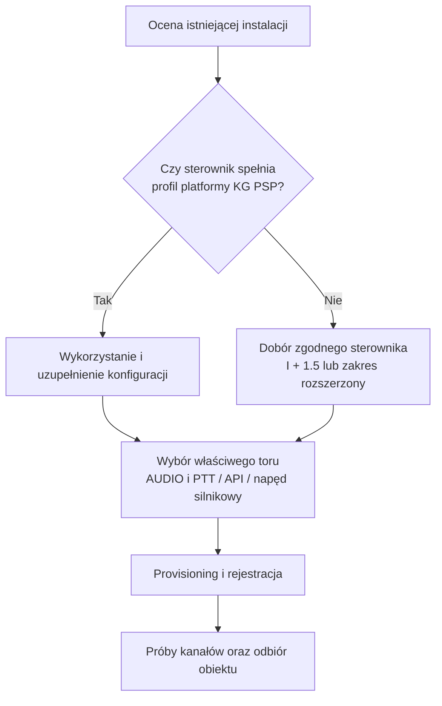
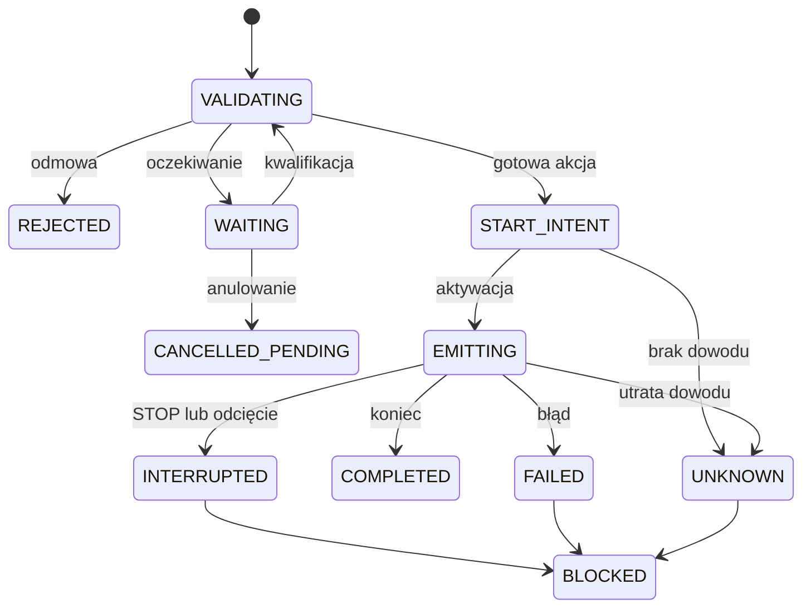
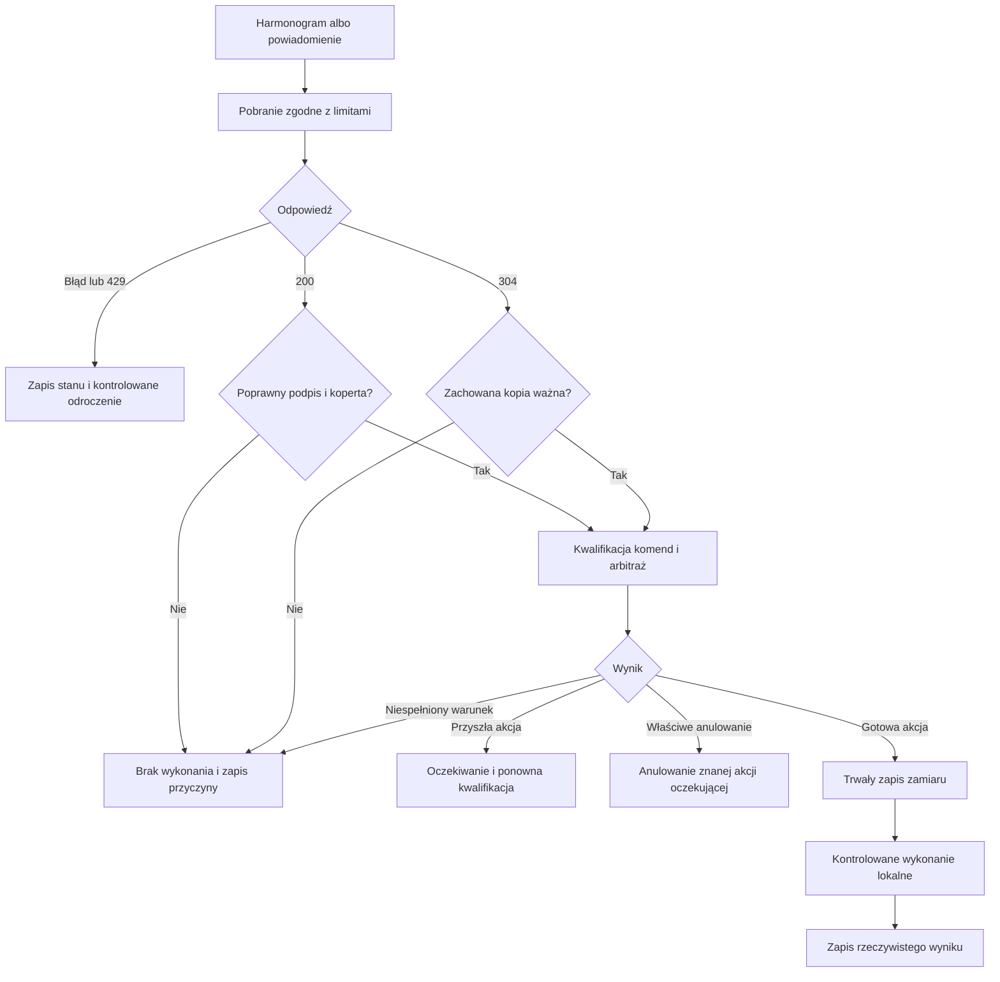
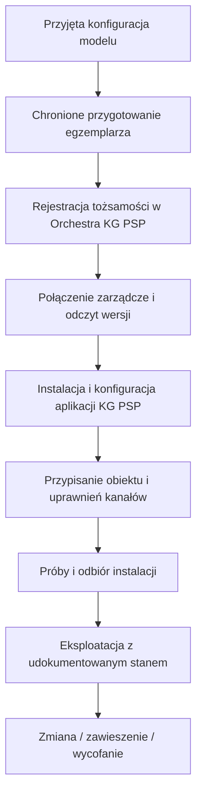

<!-- Generated from PODRECZNIK_v2.md; run python scripts/sync_pages.py. -->

  
  
  

  

    
<strong>Repozytorium wszystkich publicznych dokumentów SOiA:</strong>
    <a href="https://github.com/KGPSP/WYTYCZNE_SOIA">KGPSP/WYTYCZNE_SOIA</a>.

  

  

  
    

      <strong>Partially AI-Modified — informacja o wykorzystaniu sztucznej inteligencji</strong>
      
Materiał zawiera treść pierwotnie opracowaną przez człowieka, która została częściowo zmodyfikowana i zredagowana z wykorzystaniem narzędzi sztucznej inteligencji. Odpowiedzialność redakcyjną za publikację ponosi wydawca; dokument zachowuje status projektu wytycznych.

      
Zastosowano wariant <a href="https://digital-strategy.ec.europa.eu/en/policies/eu-icons-labelling-ai-generated-content">Partially AI-Modified z zestawu ikon UE</a>, z uwzględnieniem <a href="https://eur-lex.europa.eu/eli/reg/2024/1689/oj">art. 50 rozporządzenia (UE) 2024/1689</a>. Ikona jest dobrowolnym oznaczeniem i sama w sobie nie stanowi potwierdzenia zgodności prawnej ani merytorycznej dokumentu.

    

  

# Podręcznik SOiA

## Zasady podłączania syren alarmowych i innych urządzeń

**Wersja dokumentacyjna 0.5 · 10 września 2026 r. · Projekt wytycznych**

Dokument opisuje wymagania przygotowania, przyłączenia i utrzymania sterowników w zarządzanym systemie KG PSP. Decyzja o alarmowaniu wynika z właściwej procedury; system dostarcza polecenie, a aplikacja KG PSP weryfikuje je i wykonuje na właściwym torze. Sprzęt różnych wykonawców współpracuje przez uzgodnioną platformę i interfejsy.

Najważniejsze uzupełnienia tej wersji to **profil 1.5 dla urządzeń kompaktowych** oraz **OrchestraOS, Yocto i provisioning KG PSP**. Parametry dostosowuje się do funkcji i zakresu dostawy. Mniejsza liczba portów nie oznacza słabszej autoryzacji, historii, nadzoru lub ochrony kluczy.

## Jak korzystać z wytycznych

| Potrzeba | Punkt wejścia |
| --- | --- |
| Cel i odpowiedzialność organizacyjna | Z2 |
| Wspólny system bazowy i dołączanie urządzeń | [Platforma KG PSP](PLATFORMA_KG_PSP.md), następnie Z3 i Z7 |
| Mały sterownik i dobór wyposażenia | [Profil 1.5](PROFIL_1_5.md) i macierz Z3 |
| Sygnały i wykonanie | Z4 i Z5 |
| Feed, rejestracja, SMS i TETRA | Z6–Z8 |
| Konfiguracja i odbiór | Z9 i Z10 |
| Zakup i podstawa prawna | Z11 i Z12 |

## Zakres wersji i źródła rozstrzygające

Klasa I obejmuje wspólny rdzeń, 1.5 profil kompaktowy z audio, II profil rozszerzony z audio, a III lokalny TTS. Oznaczenia D/P określają zakres dostawy lub adresata. Nie są to wersje protokołu ani `deviceClass` komendy.

Publiczny poziom 0 pozostaje otwartym odczytem. Zgodność nowej platformy KG PSP wymaga właściwego obrazu Yocto/OrchestraOS, tożsamości, rejestracji i odbioru. Odczyt feedu, online w Managerze i fizyczna emisja to odrębne etapy.

W fazie 2026–2028 zestawy mają GSM/LTE, z SMS jako zapasem i możliwością dodatkowego IP przez Ethernet/Wi-Fi. Po tej fazie podstawowym kanałem poleceń ma być odebrana TETRA, z aktywnym zapasem GSM. Terminy i warunki przełączenia określa plan lokalizacji.

| Rodzaj zapisu | Znaczenie |
| --- | --- |
| Wymaganie W-* | Warunek w wybranej klasie/profilu i zakresie. |
| Scenariusz S-* | Próba właściwej funkcji i jej oczekiwany wynik. |
| Kontrakt aplikacji i metadane API | Obsługiwana wersja, klasy odbiorców i kody; nie są listą portów sprzętu. |
| Pakiet i karta konfiguracji | Wydania, zasoby, parametry oraz uprawnienia konkretnego modelu i egzemplarza. |
| Przepis prawa | Podstawa prawna we właściwym zakresie; dokument techniczny nie nadaje nowych kompetencji. |

Odczyt 10.09.2026 potwierdził publiczny profil IoT `0.1` i słownik `2026.1`. Funkcje planowane, w tym dodatkowe kody, TTS i integracja TETRA, wymagają osobnego kontraktu oraz odbioru. Publikacja wytycznych nie jest wdrożeniem aplikacji.

Dokument pozostaje ogólny: nie zawiera pinoutów konkretnych syren, numerów abonenckich, sekretów ani konfiguracji produkcyjnych. Nazwy OrchestraOS/Orchestra, Yocto i RAUC identyfikują środowisko integracji KG PSP; modele urządzeń i wykonawcy nie są narzucone. Pliki PDF materiałów źródłowych nie są dołączane do tego wydania.

Opis i diagram nie zastępują wymagania, ale wymaganie zakupowe również nie dowodzi istniejącej funkcji API. Sprzeczność pomiędzy zakresem zamówienia a dostępnym kontraktem trzeba rozstrzygnąć przed odbiorem; nie wolno zmieniać znaczenia komendy dla obejścia braku.

## Spis treści

- **Część I — Cel zasady i zakres systemu**
    - [Załącznik nr 2 — Informacja dla organów ochrony ludności i jednostek samorządu terytorialnego](zalaczniki/Z2-INFORMACJA-DLA-ORGANOW.md)
- **Część II — Terminologia i zasady interpretacji**
    - [Załącznik nr 1 — Słownik pojęć](zalaczniki/Z1-SLOWNIK.md)
- **Część III — Wymagania techniczne i funkcjonalne**
    - [Załącznik nr 3 — Wymagania minimalne dla urządzenia](zalaczniki/Z3-WYMAGANIA-MINIMALNE.md)
    - [Załącznik nr 4 — Katalog sygnałów i plików referencyjnych](zalaczniki/Z4-KATALOG-SYGNALOW.md)
    - [Załącznik nr 5 — Profile sterownika i maszyna stanów](zalaczniki/Z5-PROFILE-STEROWNIKA.md)
- **Część IV — Przyłączenie i kanały komunikacji**
    - [Załącznik nr 6 — Poziom 0 publiczny wykaz poleceń](zalaczniki/Z6-POZIOM-0-PUBLICZNY-WYKAZ.md)
    - [Załącznik nr 7 — Rejestracja urządzenia i kanały rejestrowane](zalaczniki/Z7-POZIOM-1-REJESTRACJA.md)
    - [Załącznik nr 8 — Sieć wydzielona SMS i przejście na TETRA](zalaczniki/Z8-POZIOM-2-APN-I-SMS.md)
- **Część V — Konfiguracja i odbiór**
    - [Załącznik nr 9 — Karta konfiguracji urządzenia](zalaczniki/Z9-KARTA-KONFIGURACJI.md)
    - [Załącznik nr 10 — Scenariusze sprawdzeń i protokół odbioru](zalaczniki/Z10-TESTY-I-ODBIOR.md)
- **Część VI — Przygotowanie zamówienia**
    - [Załącznik nr 11 — Wytyczne do opisu przedmiotu zamówienia](zalaczniki/Z11-ZAPISY-DO-OPZ.md)
- **Część VII — Podstawa prawna i źródła**
    - [Załącznik nr 12 — Podstawa prawna i źródła](zalaczniki/Z12-PODSTAWA-PRAWNA.md)

---

## Część I — Cel zasady i zakres systemu

### Załącznik nr 2 — Informacja dla organów ochrony ludności i jednostek samorządu terytorialnego

#### Cel i podział odpowiedzialności

SOiA ma umożliwiać wykonanie tej samej uprawnionej decyzji przez urządzenia różnych producentów. Właściwy organ i procedura rozstrzygają o alarmowaniu. System dostarcza polecenie, a aplikacja sterownika sprawdza jego adresata, ważność i historię, po czym wykonuje właściwą funkcję.

KG PSP zapewnia środowisko integracji, komponenty platformy i aplikację operacyjną. Wykonawca dostarcza zgodny sprzęt, buduje obraz Yocto/OrchestraOS dla swojej płyty i zapewnia interfejsy. Właściciel odpowiada za instalację, eksploatację i dokumentację w swoim zakresie. Wymagania techniczne określa Z3; przygotowanie dostaw Z11.

#### Co jest wspólne

| Element | Wymagany rezultat |
| --- | --- |
| Platforma | OrchestraOS wydania KG PSP, zgodny system i aplikacja. |
| Tożsamość i zarządzanie | Przygotowany egzemplarz zarejestrowany we właściwej instancji Orchestra. |
| Polecenia | Wspólne znaczenie, sprawdzanie uprawnień, czasu, obszaru i powtórzeń. |
| Integracja lokalna | Odebrany tor syreny elektronicznej, silnikowej lub innego urządzenia. |
| Utrzymanie | Aktualizacje, odtworzenie, wersje i możliwość przejęcia serwisu. |

Online w Managerze nie jest potwierdzeniem emisji. alarm.soia.info i syreny.soia.info służą zarządzaniu operacyjnemu, a Orchestra utrzymaniu technicznemu urządzeń.

#### Dobór klasy i zakresu zakupu

Klasa I obejmuje rdzeń. Profil 1.5 dodaje kompaktowe wyposażenie i lokalne audio; klasa II — rozszerzone wyposażenie z audio. Klasa III obejmuje lokalną syntezę mowy i może być dodana również do profilu kompaktowego. Większa liczba głośników nie określa sama potrzeb pamięci sterownika, a TTS nie zwiększa automatycznie liczby przekaźników.

Do prostszego punktu można zamówić I + 1.5, jeżeli mapa torów i zasoby są wystarczające. Posiadanego zgodnego urządzenia nie wymienia się tylko dlatego, że wprowadzono nowy profil. Szczegóły zawiera [profil 1.5](PROFIL_1_5.md).

Zakup syreny, samego sterownika, kompletnego zestawu D i montażu sprzętu powierzonego to różne przedmioty. Należy rozdzielić sprzęt już dostarczony, brakujące elementy oraz czynności wykonawcy. Nie zamawia się ponownie aplikacji alarmowej dostarczanej przez KG PSP.

#### Adaptacja instalacji istniejącej

Przed zakupem ustala się stan syreny, jej elektronikę, dokumentację i tor sterowania. Sprawna syrena elektroniczna może korzystać z audio/PTT lub udokumentowanego API. Syrena silnikowa wymaga izolowanej aparatury napędu i programu silnikowego; nie odtworzy komunikatów słownych.

Dotychczasowe wymagane sposoby uruchomienia pozostają dostępne. Ich współpracę i arbitraż trzeba odebrać. Sam dodatkowy modem GSM ani karta SIM nie zapewniają pełnej zgodności z SOIA.KGPSP.

#### Łączność i przyłączenie

Faza 2026–2028 zakłada GSM/LTE, z SMS jako zapasem. Internet obiektu przez Ethernet lub Wi-Fi może zapewniać dodatkową drogę IP. Po tej fazie podstawowym kanałem poleceń ma być TETRA, po jej zapewnieniu i odbiorze w lokalizacji. GSM pozostaje aktywnym zapasem. Usługi kart, operator i szczegółowe terminy określa plan obiektu; nie wynikają automatycznie z kalendarza.

Poziom 0 jest publicznym odczytem feedu. Rejestracja platformy i odbiór oficjalnej instalacji są osobnymi wymaganiami. Poziomy 1 i 2 dodają uprawnione kanały i usługi według profilu. Sam wniosek nie potwierdza przyjęcia urządzenia, a publiczny odczyt nie nadaje uprawnień do kanałów zamkniętych.

#### Warunek gotowości

Model i obraz → przygotowanie egzemplarza → rejestracja i przypisanie → gotowość aplikacji → sprawdzenie kanałów → odbiór fizycznego toru. Pierwsze podłączenie nie wyzwala próby dźwiękowej.

Przyjęcie, doręczenie, ACK i dźwięk to różne etapy. Odbiór obejmuje także polecenia, których urządzenie ma nie wykonać, restart, zasilanie i zbieg kanałów. Nie wolno deklarować gotowości funkcji planowanej wyłącznie na podstawie wyposażenia sprzętu. Dostępny kontrakt sprawdza się według Z4/Z6, a instalację według Z9/Z10.

---

## Część II — Terminologia i zasady interpretacji

### Załącznik nr 1 — Słownik pojęć

#### System i odpowiedzialność

**SOiA / SOIA.KGPSP** — system ostrzegania i alarmowania obejmujący przygotowanie, dystrybucję i wykonanie poleceń oraz utrzymanie urządzeń. Decyzja o alarmowaniu wynika z właściwej procedury i uprawnień, a system ją wykonuje.

**ALARM.soia** — warstwa operacyjna dostępna pod adresem `alarm.soia.info`, publikująca komunikaty i podpisany IoT Feed. **SYRENY.soia** — warstwa operacyjnego zarządzania uruchamianiem syren pod adresem `syreny.soia.info`, w tym właściwe profile SMS. Relacje, uprawnienia i wersje integracji wskazuje KG PSP; same adresy nie potwierdzają uruchomienia każdej planowanej funkcji.

**Orchestra Manager** — techniczne zarządzanie urządzeniami: rejestracja, konfiguracja, stan, telemetria, dostęp i aktualizacje. Nie jest odrębnym źródłem decyzji alarmowej. **Orchestra SDN** — właściwa dla instancji droga kontrolowanej komunikacji zarządczej.

**Organ ochrony ludności** — organ podejmujący decyzje w granicach właściwości ustawowej. **Administrator KG PSP** — podmiot uprawniony do przyjęcia konfiguracji, rejestracji egzemplarza i nadania dostępu w określonym zakresie. **Właściciel instalacji** — podmiot odpowiedzialny za jej stan, eksploatację i dokumentację. **Wykonawca** — dostawca platformy, integracji lub montażu w zakresie zamówienia.

**PL-CAP** — profil komunikatu ostrzegawczego oparty na CAP. **IoT Feed** — podpisany, jednokierunkowy wykaz poleceń wykonawczych w profilu `PL-CAP-DIST-IOT`. Feed nie jest samym komunikatem CAP ani potwierdzeniem emisji.

#### Platforma i przygotowanie urządzenia

**Sterownik** — urządzenie brzegowe z mikrokomputerem, tożsamością i systemem bazowym, na którym aplikacja KG PSP kwalifikuje polecenia i steruje lokalnym interfejsem. Może być osobnym modułem lub częścią zestawu. Modem i bramka nie są jego synonimami.

**OrchestraOS** — system bazowy używany w platformie KG PSP. **Yocto Project** — środowisko budowy systemu Linux dla określonego sprzętu. **BSP** — pakiet obsługi konkretnej płyty, jej rozruchu i urządzeń. Wykonawca buduje obraz ze wskazanego wydania komponentów udostępnionych przez KG PSP na wniosek.

**Provisioning** — przygotowanie egzemplarza: obraz, indywidualna tożsamość, konfiguracja startowa, rejestracja i przypisanie. **ZTP** — automatyzacja pierwszego przyłączenia dzięki wcześniejszemu przygotowaniu. Samo pojawienie się urządzenia w sieci nie nadaje mu zaufania.

**Przyjęcie modelu** — sprawdzenie konkretnej konfiguracji sprzętu i oprogramowania. **Rejestracja egzemplarza** — przyjęcie tożsamości konkretnej sztuki do właściwego środowiska. **Odbiór obiektu** — potwierdzenie funkcji w rzeczywistej instalacji. Są to odrębne etapy.

**Flota** — grupa zgodnych urządzeń używana do zarządzania. Nie wyznacza obszaru alarmowania. **Karta konfiguracji** — dokument modelu lub egzemplarza z wersjami, przypisaniem, portami i dowodami. Wypełniona karta i jej sekrety pozostają poza publikacją.

**Bramka LoRaWAN** — osobny element przekazujący ruch radiowy urządzeń końcowych do LNS. **LNS** — serwer sieci LoRaWAN. **CUPS** — usługa konfiguracji bramki. Żaden z tych elementów nie jest aplikacją interpretującą IoT Feed.

#### Cztery niezależne osie doboru

| Pojęcie | Znaczenie |
| --- | --- |
| Klasa odbiorcy w komendzie | Do jakiej kategorii urządzenia jest skierowane polecenie, np. `SIREN_CONTROLLER`. |
| Klasa zdolności | I — rdzeń; 1.5 — profil kompaktowy z audio; II — rozszerzony z audio; III — lokalny TTS. Wymagania określa Z3. |
| Profil wykonawczy i tryb połączenia | Syrena elektroniczna, silnikowa lub inny odbiornik; AUDIO/PTT, API albo izolowane sterowanie stykowe. |
| Poziom podłączenia | 0 — odczyt publiczny; 1 — kanały rejestrowane; 2 — dodatkowe usługi wydzielone/SMS według profilu. |

Oznaczenie 1.5 nie jest wersją feedu ani poziomem rejestracji. Profil modernizacji oznacza adaptację instalacji istniejącej, nie osobny rodzaj dźwięku lub tożsamości urządzenia. Otwartość odczytu poziomu 0 nie jest potwierdzeniem zgodności platformy z Z3.

#### Polecenie i efekt

**Komenda** — pojedyncze polecenie wykonawcze z tożsamością operacji. **Kod sygnału** — identyfikator funkcji określonej w kontrakcie, nie plik dźwiękowy. **Sygnał alarmowy** — przebieg określony w katalogu Z4 i właściwym przepisie.

**Plik referencyjny** — zatwierdzony zasób lokalny o określonej wersji i sumie. **Manifest pakietu audio** — wykaz plików, ich parametrów i skrótów powiązany z akceptacją KG PSP. Nie jest IoT Feed. Aktualizacja zasobów jest czynnością utrzymaniową, a wykonanie alarmu nie zależy od pobierania audio.

**TTS** — lokalne przekształcenie zatwierdzonego tekstu w mowę. Odtwarzanie gotowego nagrania nie jest TTS. Syrena silnikowa nie odtwarza ani plików, ani mowy.

**Okno rozpoczęcia** — czas, w którym można rozpocząć lokalną operację. Nie jest czasem trwania dźwięku ani ważnością całego ostrzeżenia. **Emisja** — fizyczne wytworzenie dźwięku; aktywacja wyjścia jest wcześniejszym, odrębnym etapem.

**CANCEL_PENDING** — anulowanie określonej, znanej akcji oczekującej zgodnie z kontraktem. Nie jest sygnałem odwołania i nie zatrzymuje emisji trwającej. **Odwołanie alarmu** — odrębna funkcja akustyczna, w profilu dla ludności sygnał ciągły 180 s. **Techniczne STOP** — funkcja właściwego kontraktu, jeśli została przewidziana i odebrana; nie zastępuje odwołania. **Odcięcie lokalne** — czynność sprzętowa o pierwszeństwie bezpieczeństwa. Dla silnika odcina napęd, lecz wirnik może jeszcze wybiegać.

**Arbitraż** — wspólne rozstrzygnięcie dostępu do tego samego toru. **Odrzucenie** kończy kwalifikację tej operacji. **Odroczenie** zachowuje operację do ponownej kwalifikacji na warunkach profilu. **Wynik niepewny** oznacza brak dowodu pozwalającego rozstrzygnąć, czy nastąpiło wykonanie; nie uprawnia do automatycznego ponowienia.

#### Obszar i zaufanie

**TERYT** — krajowy rejestr podziału terytorialnego. **TERC** — kody jednostek: dwie cyfry województwa, cztery powiatu i siedem gminy. Tor konfiguruje się siedmiocyfrowym kodem gminy. Cyfra rodzaju jest znacząca; miasto i obszar wiejski gminy miejsko-wiejskiej nie są zamienne.

**Reguła zawierania** — geokod polecenia musi obejmować teren przypisany danemu torowi. Nie porównuje się w ten sposób kodów ulic ani miejscowości. Zasięg akustyczny nie rozszerza samodzielnie adresowania.

**Podpis feedu**, **indywidualna tożsamość urządzenia** oraz **zaufanie aktualizacji i rozruchu** są trzema odrębnymi domenami. Publiczne klucze weryfikacji mogą być wspólne; prywatnych kluczy i sekretów egzemplarzy nie współdzieli się. Nieznany klucz nie uzyskuje zaufania tylko przez wystąpienie w odebranej treści.

**Fail-closed** — niespełnienie warunków kwalifikacji powoduje brak nowego wykonania. **Świeżość** — ważność podpisanej treści i komendy. **Ochrona przed powtórzeniem** — trwała historia zapobiegająca ponownemu wykonaniu, także po restarcie i zmianie kanału.

**Potwierdzenie** — informacja o określonym etapie: przyjęciu, starcie, końcu lub błędzie. Doręczenie SMS, ACK, stan przekaźnika i pomiar akustyczny nie są tym samym. Numery nadawców i odbiorców statusu określa się oddzielnie.

---

## Część III — Wymagania techniczne i funkcjonalne

### Załącznik nr 3 — Wymagania minimalne dla urządzenia

#### Zakres i pierwszeństwo wymagań

Wymagania dotyczą nowej platformy sterującej włączanej do zarządzanego systemu KG PSP oraz właściwego zakresu modernizacji. Publiczny odczyt IoT Feed pozostaje otwarty. Możliwość zbudowania własnego czytnika feedu nie oznacza zgodności zakupowej ani dopuszczenia punktu alarmowego według tego załącznika.

**MUSI** oznacza warunek konieczny w wybranym zakresie. **POWINIEN** oznacza zalecenie, którego pominięcie należy uzasadnić w karcie. Braku wymaganej funkcji nie oznacza się jako „nie dotyczy”. Każde wymaganie ocenia się na rzeczywistej konfiguracji, z dowodem, bez automatycznego uznania modelu lub nazwy handlowej za zgodny.

Wspólną platformę opisuje [OrchestraOS i provisioning KG PSP](PLATFORMA_KG_PSP.md). Nazwy OrchestraOS, Orchestra Manager, Orchestra SDN, Yocto i RAUC identyfikują wymagane środowisko współpracy. Sprzęt, BSP i wykonawcę dobiera się konkurencyjnie; kryteria równoważności oraz uzasadnienie wymagań ujmuje konkretne zamówienie. Aplikację alarmową zapewnia KG PSP, a wykonawca dostarcza kompatybilną platformę i interfejsy.

#### Klasy zdolności i profil 1.5

| Oznaczenie | Zakres | Zastosowanie |
| --- | --- | --- |
| **I** | Wspólny rdzeń platformy, bezpieczeństwa i wykonania | Obowiązuje wszystkie zgodne sterowniki; nie wymaga automatycznie wyposażenia rozszerzonego. |
| **1.5** | Kompaktowy profil z lokalnym audio | Dodawany do I dla mniejszej liczby torów. Zachowuje wymagania jakości audio i ochrony; TTS nie jest obowiązkowy. |
| **II** | Rozszerzony profil z lokalnym audio | Dodawany do I, gdy potrzebna jest większa liczba portów i I/O. |
| **III** | Lokalna synteza mowy | Dodawana po zamówieniu TTS, także do konfiguracji 1.5. Wymaga większych zasobów, lecz sama nie zwiększa liczby I/O. |
| **D** | Kompletny zestaw i montaż | Zakres dostawy, nie klasa zdolności. |
| **P** | Wymagania wobec producenta syreny | Stosowane do właściwej części wykonawczej. |

Zestaw I + 1.5 nie musi mieć czterech Ethernetów ani sześciu styków. Wspólne wymagania I obowiązują w nim w całości, z liczbami portów określonymi poniżej. Funkcje audio oznaczone **1.5 / II** dotyczą obu profili. I + 1.5 + III ma zasoby TTS z W-F07/08, a liczbę I/O nadal dobiera się z profilu kompaktowego. Nie wprowadza się odrębnej klasy 2.5.

Klasa zdolności nie jest `deviceClass` w komendzie ani wersją profilu IoT. Oznaczenie 1.5 nie zmienia wartości `SIREN_CONTROLLER`, profilu `0.1` lub słownika publikowanego przez centralę. Profil elektroniczny/silnikowy i tryb AUDIO/PTT/API/stykowy są osobnymi osiami opisanymi w Z5.

##### Macierz wyposażenia

| Element | I — rdzeń | I + 1.5 — kompaktowy | I + II — rozszerzony |
| --- | --- | --- | --- |
| OrchestraOS, Yocto, aplikacja KG PSP i provisioning | Wymagane | Wymagane | Wymagane |
| Ethernet | Minimum 1 | Minimum 1; bez obowiązku osobnego managed switch | Minimum 4 zarządzalne tory |
| LTE/IP, SMS MO/MT, SIM i antena | Wymagane | Wymagane | Wymagane |
| Wi-Fi, GNSS, LoRa/LoRaWAN | Zgodnie z W-D08/10/16 | Dostarczone wymagane moduły i anteny | Zgodnie z W-D08/10/16 |
| Styki bezpotencjałowe | Minimum 2 | Minimum 2; PTT może używać jednego | Minimum 6; PTT może używać jednego |
| GPI / GPO | Według karty | Minimum 2 / 2 | Minimum 6 / 6 |
| RS-232 / USB | Bilans torów i rozbudowy | Minimum 2 pełne RS-232 i 2 USB | Liczba według karty oraz planu rozbudowy |
| Lokalne audio | Gdy wybrano profil audio | Dwa kanały LINE OUT, osobne PTT i lokalny pakiet | Te same wymagania audio |
| Pamięć audio | Dla profilu audio | Minimum 32 MB i miejsce na dwie wersje pakietu | Tak samo |
| TTS | Po zamówieniu III | Niewymagany; po dodaniu III wymagania głosowe | Po zamówieniu III |
| Odcięcie, watchdog, historia i autoryzacja | Wymagane | Wymagane | Wymagane |

Minima portów, styków i GPI/GPO profilu 1.5 dotyczą także dostawy samego sterownika. Zakres D dodatkowo obejmuje kompletny zestaw i montaż. RS-232, USB, audio oraz interfejs terminala muszą być rzeczywiście dostępne z systemu. Wspólne złącze nie może zostać policzone jako dwa niezależne tory używane równocześnie. Wejście audio, dodatkowe I/O i kolejne moduły ujmuje się jawnie w karcie. Dla potrzeb wskazanych przez KG PSP opcja Audio IN ma być dostarczona i odebrana, a nie jedynie wymieniona jako możliwość przyszłego zakupu.

W profilu silnikowym zdolność audio platformy może pozostać niewykorzystana. Dźwięk tworzy silnik z wirnikiem; wymagania plików i TTS nie są sposobem jego sterowania. Dwa wyjścia mogą służyć funkcjom RUN/CYKL, lecz nazwy i parametry muszą zostać zmapowane na konkretny sprzęt.

#### A. Weryfikacja polecenia

Droga komunikacji nie jest uprawnieniem do uruchomienia. IoT Feed wymaga podpisu i kwalifikacji całej koperty; SMS lub radio stosują własny, jawny kontrakt. Nowy kanał nie tworzy drugiej logiki alarmowania.

| ID | Moc | Klasa lub zakres | Wymaganie |
| --- | --- | --- | --- |
| W-A01 | MUSI | **I** | Zweryfikować podpis odebranej treści przed jakimkolwiek działaniem wykonawczym |
| W-A02 | MUSI | **I** | Odrzucić całą treść przy niepowodzeniu weryfikacji — nie wykonywać jej części |
| W-A03 | MUSI | **I** | Rozpoznawać identyfikator klucza i odrzucać treść podpisaną kluczem nieznanym |
| W-A04 | MUSI | **I** | Obsługiwać kontrolowaną zmianę zaufanych kluczy z oknem nakładania, zakresem ważności i możliwością odwołania. Sam nieznany identyfikator w feedzie nie upoważnia do zaufania nowemu kluczowi. |
| W-A05 | MUSI | **I** | Sprawdzić zgodność profilu, środowiska i wersji słowników |
| W-A06 | MUSI | **I** | Odrzucić treść po upływie jej terminu ważności, niezależnie od stanu łączności |
| W-A07 | MUSI | **I** | Wykonać wyłącznie polecenia skierowane do własnej klasy urządzenia |
| W-A08 | MUSI | **I** | Odrzucić kod sygnału, którego nie zna, **nie przerywając obsługi pozostałych poleceń** |
| W-A09 | MUSI | **I** | Rozpocząć emisję wyłącznie w oknie rozpoczęcia wskazanym w poleceniu |
| W-A10 | MUSI | **I** | Zapewnić, że to samo polecenie — odebrane ponownie, innym kanałem albo po restarcie — nie spowoduje drugiej emisji |
| W-A11 | MUSI | **I** | Zachować ochronę przed powtórzeniem po zaniku zasilania |
| W-A12 | MUSI | **I** | Traktować każdą wątpliwość jako powód niewykonania polecenia (fail-closed) |
| W-A13 | MUSI | **I** | Odmówić wykonania polecenia przy dryfie zegara przekraczającym **30 sekund** względem czasu odniesienia |
| W-A14 | POWINIEN | **I** | Zapisywać w rejestrze zdarzeń wynik każdej weryfikacji, także zakończonej odmową, wraz z przyczyną |
| W-A15 | MUSI | **I** | Utrzymywać wiarygodny czas z co najmniej dwóch źródeł wskazanych w profilu KG PSP, mieć zegar podtrzymywany, znać wiek synchronizacji i sygnalizować przekroczenie doby. Utrata wiarygodności czasu blokuje nowe wykonanie. |
| W-A16 | POWINIEN | **I** | Rozróżniać przyjęcie, start, zakończenie, błąd i niepewny wynik zgodnie z profilem odpowiedzi. Test bez emisji ma własny wynik; ACK nie zastępuje pomiaru efektu. |
| W-A17 | MUSI | **I** | Stosować udokumentowane limity rozmiaru odpowiedzi i polecenia, zgodne z kontraktem oraz zasobami. Przekroczenie jest błędem, nie pustą listą. Brak limitu w metadanych API wymaga uzupełnienia profilu integracji przed odbiorem. |

#### B. Obszar działania

TERC określa administracyjnego adresata niezależnego toru. Nie jest obliczeniem akustycznego zasięgu syreny. Wiele geokodów polecenia porównuje się z przypisaniem danego toru.

| ID | Moc | Klasa lub zakres | Wymaganie |
| --- | --- | --- | --- |
| W-B01 | MUSI | **I** | Przypisać każdemu niezależnemu torowi wykonawczemu dokładnie jeden siedmiocyfrowy TERC gminy. Wiele torów wymaga jawnej mapy tor–TERC; zasięg akustyczny poza gminą nie tworzy dodatkowego adresata. |
| W-B02 | MUSI | **I** | Odrzucić konfigurację toru kodem dwucyfrowym albo czterocyfrowym lub oznaczyć błąd uniemożliwiający dopuszczenie toru do wykonania. |
| W-B03 | MUSI | **I** | Odrzucić kod sześciocyfrowy, bez cyfry rodzaju, jako niepełny |
| W-B04 | MUSI | **I** | Uwzględniać cyfrę rodzaju gminy: kod gminy miejsko-wiejskiej obejmuje jej miasto i jej obszar wiejski, a te dwa są względem siebie rozłączne |
| W-B05 | MUSI | **I** | Pomijać kody miejscowości i ulic — mają własną numerację i porównanie prefiksowe daje trafienia przypadkowe |
| W-B06 | MUSI | **I** | Uruchamiać wyłącznie tor, którego przypisany TERC jest objęty geokodem polecenia. Dopasowanie jednego toru nie uruchamia pozostałych torów urządzenia. |
| W-B07 | MUSI | **I** | Traktować kod nierozpoznany — o innej długości albo nienumeryczny — jako brak dopasowania; nigdy nie „naprawiać” go przez obcięcie ani dopełnienie |
| W-B08 | POWINIEN | **I** | Udostępniać skonfigurowany obszar do odczytu w rejestrze zdarzeń i w eksporcie konfiguracji |

#### C. Sygnały i komunikaty

Nominalne sygnały określa katalog Z4. Lokalny pakiet audio i program silnikowy mają oddzielną postać. Wymagane zasoby muszą być gotowe przed przyjęciem polecenia, niezależnie od dostępności internetu.

| ID | Moc | Klasa lub zakres | Wymaganie |
| --- | --- | --- | --- |
| W-C01 | MUSI | **I** | Obsługiwać co najmniej ogłoszenie i odwołanie alarmu dla ludności; pozostałe funkcje katalogu zgodnie z profilem zastosowania i uprawnieniami. Zdolność lokalna nie potwierdza dostępności komendy centralnej. |
| W-C02 | MUSI | **1.5 / II** | Dla sygnałów alarmowych odtwarzać wyłącznie niezmodyfikowane pliki referencyjne; zatwierdzone nagrania słowne i TTS mają odrębny zakres. |
| W-C03 | MUSI | **I** | Przed instalacją i użyciem plików potwierdzać ich zgodność z zatwierdzonym pakietem i manifestem KG PSP. Dla profilu silnikowego weryfikować wersję programu wykonawczego; suma z przypadkowej kopii dokumentu nie jest kotwicą zaufania. |
| W-C04 | MUSI | **1.5 / II** | Obsługiwać zatwierdzony format pakietu audio, w tym WAV PCM 16 bit mono o próbkowaniu co najmniej 8 kHz. Plików nie przeliczać ani nie skracać samodzielnie. |
| W-C05 | MUSI | **I** | Zachowywać nominalny czas sygnału z katalogu. Metoda pomiaru, tolerancja i niepewność muszą być wskazane w zatwierdzonym profilu odbioru; nie zmieniają nominalnych 180 s lub 60 s. |
| W-C06 | MUSI | **I** | Zachować strukturę czasową sygnału — modulację oraz liczbę i długość przerw |
| W-C07 | MUSI | **1.5 / II** | Utrzymać poziom w granicach ±3 dB względem wzorca, bez przesterowania, w zadeklarowanym i udokumentowanym punkcie pomiarowym |
| W-C08 | MUSI | **I** | Kończyć funkcję lokalnie po właściwym czasie. Oddzielnie nadzorować odtwarzanie i zwolnienie PTT, a dla silnika okno programu i odcięcie napędu; nadzór nie może zależeć wyłącznie od procesu odbiornika poleceń. |
| W-C09 | MUSI | **I** | Traktować odwołanie alarmu jako **emisję sygnału**, a nie jako zaprzestanie emisji |
| W-C10 | MUSI | **1.5 / II** | Przechowywać zatwierdzony pakiet lokalnie w pamięci trwałej, z miejscem na dwie wersje i co najmniej 32 MB na audio. Wykonanie alarmu nie może wymagać pobrania ani strumieniowania pliku. |
| W-C11 | MUSI | **III** | Zapewniać pełną ścieżkę od zatwierdzonego tekstu do zrozumiałej polskiej mowy, z prawem użycia silnika i głosu, kontrolą długości oraz wersjonowaniem. Sam odtwarzacz nagrań nie jest TTS. |
| W-C12 | MUSI | **III** | Wykonywać zamówioną syntezę lokalnie, bez zależności od usługi zewnętrznej w chwili wykonania. |
| W-C13 | POWINIEN | **III** | Syntezować komunikat **do bufora przed rozpoczęciem odtwarzania**, nigdy w trakcie emisji |
| W-C14 | POWINIEN | **III** | Zapewniać powtarzalność: ten sam tekst przy tej samej wersji modelu daje ten sam dźwięk |
| W-C15 | POWINIEN | **III** | Przypinać i odnotowywać w rejestrze zdarzeń wersję modelu i głosu |
| W-C16 | POWINIEN | **III** | Umożliwiać nadpisanie wymowy nazw miejscowości, skrótów, jednostek, liczb, dat i godzin |
| W-C17 | MUSI | **III** | Zapewnić, że komunikat głosowy **nigdy nie opóźnia ani nie zastępuje** sygnału akustycznego z pliku referencyjnego |

#### D. Kanały i łączność

W fazie 2026–2028 podstawowa łączność zestawu jest komórkowa GSM/LTE, a SMS jest zapasem. Ethernet i Wi-Fi mogą zapewniać dodatkową drogę IP. Po tej fazie TETRA ma być podstawowym kanałem poleceń, po odbiorze lokalizacji; GSM pozostaje aktywnym zapasem. Zmiana SIM i APN jest osobnym procesem od integracji TETRA.

| ID | Moc | Klasa lub zakres | Wymaganie |
| --- | --- | --- | --- |
| W-D01 | MUSI | **I** | W normalnej pracy pobierać podpisany wykaz co 30 s między początkami żądań, z rozłożeniem faz urządzeń. Odpowiedź 429, Retry-After i błąd uruchamiają kontrolowane odroczenie zgodnie z Z6. |
| W-D02 | MUSI | **I** | Stosować warunkowe pobranie przez ETag/If-None-Match; odpowiedź 304 nie odnawia podpisanej ważności zachowanej kopii. |
| W-D03 | MUSI | **I** | Honorować odpowiedź o przekroczeniu limitu zapytań wraz ze wskazanym czasem wstrzymania |
| W-D04 | MUSI | **I** | Stosować kontrolowane wycofanie po błędach i losowe rozproszenie momentu odpytania |
| W-D05 | MUSI | **I** | Utrzymywać cykliczne pobieranie **także wtedy**, gdy działa kanał niezwłocznego powiadomienia |
| W-D06 | MUSI | **I** | Umożliwiać podłączenie do sieci lokalnej obiektu przewodowo, bez modemu i bez karty abonenckiej |
| W-D07 | MUSI | **I** | Udostępniać co najmniej jeden zarządzalny interfejs Ethernet w rdzeniu I i profilu 1.5; dla rozszerzonego profilu II co najmniej cztery tory. Udokumentować stan, konfigurację i separację. Profil 1.5 nie wymaga osobnego przełącznika zarządzalnego. |
| W-D08 | MUSI | **I** | Zapewniać Wi-Fi z obsługą zabezpieczeń wskazanych w profilu KG PSP i samoczynnym powrotem do połączenia. Wymaganą opcję dostarczyć i uruchomić; nie zastępuje jej samo gniazdo rozszerzeń. |
| W-D09 | MUSI | **I** | Zapewniać udokumentowany interfejs danych dla stacji radiowej lub przyszłego terminala TETRA, niezależny funkcjonalnie od audio/PTT. Bilans portów i zgodny adapter określa karta; samo złącze nie potwierdza działania protokołu. |
| W-D10 | MUSI | **I** | Zapewniać LoRa/LoRaWAN jako urządzenie końcowe interoperacyjne z profilem serwera sieciowego wskazanym przez KG PSP. Bramka i jej onboarding są osobnym zakresem dostawy. |
| W-D11 | MUSI | **I** | Posiadać własny modem komórkowy LTE z transmisją IP oraz SMS przychodzącymi i wychodzącymi, anteną i obsługą SIM, bez blokady operatorskiej. Udostępniać aplikacji pełną treść i metadane. |
| W-D12 | MUSI | **I** | Umożliwiać wymianę karty abonenckiej oraz samodzielną konfigurację parametrów dostępu do sieci |
| W-D13 | MUSI | **I** | Dla SMS stosować walidację właściwego kontraktu, uprawnienia nadawców, kontrolę treści, historii i ważności oraz rejestrację bez ujawniania sekretów. Nowy profil aplikacji KG PSP wymaga kryptograficznej autentyczności i integralności treści. |
| W-D14 | MUSI | **I** | Nie wykonywać ponownie tej samej operacji odebranej przez SMS lub inny kanał. Wspólne ID i trwałą historię określa kontrakt; starego SMS bez ID nie uznawać za pełną deduplikację między kanałami. |
| W-D15 | MUSI | **I** | Przyjmować **konfigurowalny** adres punktu dostępu, adres kanału powiadomienia i numery uprawnione |
| W-D16 | MUSI | **I** | Posiadać wielokonstelacyjny moduł pozycjonowania satelitarnego z odczytem współrzędnych i statusu ustalenia pozycji |
| W-D17 | POWINIEN | **I** | Kontynuować pracę na kanale zapasowym przy utracie kanału podstawowego, bez zmiany zakresu weryfikacji |
| W-D18 | MUSI | **I** | Stosować indywidualne sekrety uwierzytelniające urządzenia. W starszym profilu z hasłem kod jest unikalny, lecz nie zastępuje podpisu/MAC; w nowym profilu sposób ochrony określa kontrakt aplikacji KG PSP. |
| W-D19 | MUSI | **I** | Rejestrować odrzucenia SMS wraz z przyczyną i metadanymi potrzebnymi do audytu, maskując hasła i inne sekrety także w zapisanej treści. |
| W-D20 | MUSI | **I** | Przyjąć bez wymiany sprzętu kartę abonencką i konfigurację sieci wydzielonej wprowadzane w fazie docelowej |
| W-D21 | MUSI | **D** | Posiadać gniazdo wymiennej karty abonenckiej **dostępne bez demontażu urządzenia z uchwytu**, z mocowaniem zabezpieczającym kartę przed wysunięciem przy drganiach; dokumentacja wskazuje, czy wymiana wymaga wyłączenia urządzenia |
| W-D22 | POWINIEN | **D** | Obsługiwać kartę klasy przemysłowej — o rozszerzonym zakresie temperatur pracy i podwyższonej wytrzymałości zapisu względem karty konsumenckiej |
| W-D23 | POWINIEN | **D** | Obsługiwać kartę zdalnie prowizjonowaną, w postaci wymiennej lub wlutowanej |
| W-D24 | MUSI | **I** | Udostępniać aplikacji pełne SMS i metadane części. Profil wykonawczy określa kodowanie, limit części, rozmiaru i czasu kompletowania; nie wykonywać fragmentu. Profil dopuszczający tylko jedną wiadomość odrzuca multipart. |
| W-D25 | MUSI | **I** | Weryfikować integralność i autentyczność całego nowego polecenia SMS, jego tożsamość operacji, adresata i ważność oraz trwałą ochronę przed odtworzeniem. Pola czasu i licznika bez uwierzytelnienia nie zapewniają tej ochrony. |
| W-D26 | MUSI | **I** | Przewidzieć rozbudowę o terminal TETRA: obsługiwany port, miejsce, moc i antenę oraz wersjonowany adapter. Docelową usługę i drogę centralną odbiera się oddzielnie, także przy odłączonym GSM i internecie obiektu. |

#### E. Wysterowanie syreny

Dobiera się tor zgodny z funkcją i udokumentowanym wejściem syreny. AUDIO/PTT, API oraz sterowanie silnikiem nie są zamiennymi sposobami połączenia zacisków. Zasady zakończenia, odcięcia i arbitrażu zawiera Z5.

| ID | Moc | Klasa lub zakres | Wymaganie |
| --- | --- | --- | --- |
| W-E01 | MUSI | **I** | Zapewniać rozróżnialne wykonanie ogłoszenia i odwołania przez właściwy tor lokalny. Dwie funkcje nie oznaczają automatycznie dwóch osobnych metod integracji ani dwóch dodatkowych przekaźników. |
| W-E02 | MUSI | **1.5 / II** | Posiadać wyjście audio liniowe o poziomie nie niższym niż 1,0 V RMS, **z zadeklarowaną tolerancją** i **regulacją poziomu realizowaną programowo** — nie elementem regulacyjnym na płycie — o impedancji wyjściowej nie większej niż 50 Ω, stosunku sygnału do szumu nie gorszym niż 90 dB i zniekształceniach nie większych niż 0,1 %, z dwoma kanałami przypisywanymi programowo niezależnie |
| W-E03 | MUSI | **I** | Zapewniać co najmniej dwa niezależne bezpotencjałowe tory NO/NC/COM w rdzeniu I i profilu 1.5, a co najmniej sześć w rozszerzonym profilu II. Napięcie, prąd, izolację i trwałość dobrać do interfejsu oraz cyklu pracy; nie prowadzić prądu silnika przez styki sterownika. |
| W-E04 | MUSI | **I** | Zapewnić izolację torów sterowania od niebezpiecznych napięć i ochronę serwisową odpowiednią do zastosowania. Gdy obiekt wymaga 230 V, stosować właściwą izolowaną aparaturę wykonawczą; mały sterownik może pracować wyłącznie po stronie sygnałowej. |
| W-E05 | MUSI | **1.5 / II** | Sterować PTT osobno od audio, z udokumentowanymi parametrami. PTT może wykorzystywać jeden z już policzonych przekaźników; nie wymaga automatycznie trzeciego albo siódmego styku. |
| W-E06 | MUSI | **I** | Nie sterować obwodem mocy syreny silnikowej bezpośrednio z wyjść ogólnego przeznaczenia — wyłącznie przez certyfikowaną, izolowaną warstwę wykonawczą |
| W-E07 | MUSI | **I** | Ograniczać niezależnie od procesu aplikacji maksymalne okno zasilania napędu syreny silnikowej, z kontrolą programu i bez samoczynnego wznowienia po awarii. |
| W-E08 | MUSI | **I** | Posiadać lokalne, sprzętowe **odcięcie** toru wykonawczego, niezależne od łączności i od oprogramowania, mające pierwszeństwo przed poleceniem zdalnym |
| W-E09 | MUSI | **I** | Nie wznawiać samoczynnie przerwanej emisji po niekontrolowanym restarcie |
| W-E10 | MUSI | **1.5 / II** | Umożliwiać sterowanie syreną elektroniczną przez lokalne audio i osobne PTT. Wejście MIC wymaga właściwego dopasowania poziomu i izolacji; zgodność wynika z dokumentacji konkretnego interfejsu, nie kształtu gniazda. |
| W-E11 | POWINIEN | **I** | Wykrywać stan układu wykonawczego — obecność obciążenia, gotowość wzmacniacza, stan stycznika |
| W-E12 | POWINIEN | **I** | Rozróżniać w rejestrze zdarzeń przyjęcie polecenia, zaplanowanie akcji, aktywowanie wyjścia, wykrycie obciążenia i zakończenie emisji |
| W-E13 | MUSI | **I** | Izolować zwarcie lub przeciążenie obwodu obiektowego, zachowując pracę sterownika i pozostałych sprawnych torów. Uszkodzony tor zgłaszać jako błąd, bez deklarowania jego zdolności emisji. |
| W-E14 | MUSI | **I** | Wykrywać na wejściu uruchomienia lokalnego impuls o czasie trwania nie dłuższym niż **200 ms** i podać w dokumentacji częstotliwość próbkowania wejść |

#### F. Platforma i cykl życia

KG PSP udostępnia na wniosek wersjonowane komponenty do budowy Yocto/OrchestraOS. Wykonawca buduje, utrzymuje i dokumentuje obraz dla swojej płyty, zapewnia integrację z Orchestra i lokalne interfejsy. KG PSP dostarcza aplikację alarmową. Szczegóły procesu opisuje dokument platformy.

| ID | Moc | Klasa lub zakres | Wymaganie |
| --- | --- | --- | --- |
| W-F01 | MUSI | **I** | Uruchamiać utrzymywany dla konkretnej płyty Linux oparty na Yocto Project i OrchestraOS wydania KG PSP. Zapewniać wersjonowane aktualizacje bezpieczeństwa oraz odtworzenie dopuszczonej wersji przez deklarowany okres wsparcia. |
| W-F02 | MUSI | **I** | Umożliwiać aktualizację **bez dostępu do publicznego Internetu**, z zachowaniem podpisów |
| W-F03 | MUSI | **I** | Utwardzić konfigurację: wyłączyć zbędne usługi i konta domyślne, ograniczyć porty i dostęp serwisowy/debugowy. Urządzenie eksploatowane nie może udostępniać trybu obchodzącego wymagane zabezpieczenia. |
| W-F04 | MUSI | **I** | Udostępniać zdalny dostęp administracyjny wyłącznie z uwierzytelnieniem kluczem; hasło nie może być jedynym mechanizmem |
| W-F05 | MUSI | **I** | Chronić indywidualne klucze prywatne i sekrety w nieeksportowalnym magazynie sprzętowym lub bezpiecznej enklawie. Odmawiać uruchomienia nieautoryzowanego obrazu, także po podmianie nośnika. Publiczne klucze weryfikacji mogą być wspólne. Model zagrożeń obejmuje również szynę procesor–radio: ochronę treści i kluczy przed odczytem, wstrzyknięciem oraz odtworzeniem. |
| W-F06 | MUSI | **I** | Posiadać sprzętowy układ nadzoru pracy, samoczynnie restartujący urządzenie przy zawieszeniu oprogramowania |
| W-F07 | MUSI | **III** | Mieć procesor 64-bitowy o co najmniej **czterech rdzeniach** i taktowaniu nie mniejszym niż **1,5 GHz** |
| W-F08 | MUSI | **III** | Mieć co najmniej **4 GB** pamięci operacyjnej i co najmniej **32 GB** pamięci trwałej klasy przemysłowej |
| W-F09 | MUSI | **I** | Rozdzielić buforowane i rotowane logi diagnostyczne od trwałego transakcyjnego zapisu historii poleceń. Stan decydujący o jednokrotnym wykonaniu zapisać przed aktywacją wyjścia; okresowa synchronizacja nie zastępuje tego zapisu. |
| W-F10 | MUSI | **I** | Obsługiwać podpisane RAUC bundle zgodne z instancją KG PSP, dwa zestawy partycji A/B i kontrolowany rollback. Zachować odrębne dane aplikacji, tożsamość i historię poleceń. Podpis aktualizacji nie zastępuje ochrony rozruchu. |
| W-F11 | MUSI | **I** | Zapewniać wersjonowany lokalny kontrakt sprzętowy dostępny z aplikacji KG PSP: metody, pola, jednostki, statusy, błędy i uprawnienia. Wykonawca dostarcza potrzebny adapter dla swojej płyty. |
| W-F12 | MUSI | **I** | Uruchamiać wskazany pakiet aplikacji KG PSP, z autostartem, nadzorem, trwałym obszarem danych i uprawnieniami do interfejsów, bez zmiany pakietu i bez obchodzenia zabezpieczeń. |
| W-F13 | MUSI | **D** | Zapewniać udokumentowane porty rozszerzeń i co najmniej 2 GPI oraz 2 GPO dla zestawu kompaktowego, a 6 GPI i 6 GPO dla zestawu rozszerzonego II. Liczyć oddzielnie styki, GPI/GPO i zajęcie PTT; klasa III sama nie zwiększa liczby I/O. |
| W-F14 | MUSI | **I** | Udostępnić **udokumentowaną procedurę przekazania właścicielowi zdolności podpisywania obrazów** albo depozyt kluczy podpisujących — tak, żeby weryfikacja rozruchu z W-F05 nie zamykała urządzenia trwale u producenta |
| W-F15 | MUSI | **I** | Budować obraz z komponentów Yocto/OrchestraOS udostępnionych przez KG PSP na wniosek, dla wskazanej płyty i BSP. Przekazać manifest, wersje, konfigurację, zmiany, artefakty i instrukcję odtworzenia budowy. |
| W-F16 | MUSI | **I** | Przeprowadzić chroniony provisioning indywidualnej tożsamości i rejestrację we właściwej instancji Orchestra KG PSP. Wykazać identyfikację, konfigurację, telemetrię, wersje, aktualizację i odwołanie dostępu. |
| W-F17 | MUSI | **I** | Zapewnić uwierzytelnione zarządzanie przed instalacją aplikacji KG PSP, z ograniczonymi rolami i bez publicznego panelu lub powłoki. Rozdzielić certyfikaty urządzenia, zaufanie feedu i klucze podpisywania obrazów. |
| W-F18 | MUSI | **I** | Powiązać model, rewizję, obraz, adaptery, pakiet aplikacji i egzemplarz z kartą obiektu. Flota aktualizacyjna nie zmienia samodzielnie TERC ani uprawnień do alarmowania. |
| W-F19 | MUSI | **1.5** | Zapewnić co najmniej 64-bitowy procesor o 2 rdzeniach, 2 GB RAM i 16 GB przemysłowej pamięci trwałej oraz działającą konfigurację z macierzy 1.5. Wykazać bilans OS A/B, aplikacji, danych i rezerwy; wyższe wymagania klasy III obowiązują przy jej zamówieniu. |

#### G. Tryby pracy i dowody

Dziennik ma odróżniać przyjęcie, wykonanie lokalne, zmierzony efekt oraz brak dowodu. Utrata łączności zarządczej nie jest dowodem awarii syreny, a stan online nie potwierdza emisji.

| ID | Moc | Klasa lub zakres | Wymaganie |
| --- | --- | --- | --- |
| W-G01 | MUSI | **I** | Rozróżniać tryby: pracy operacyjnej, ćwiczebny, serwisowy, zablokowany, ograniczony i awaryjny |
| W-G02 | MUSI | **I** | Blokować zdalne wykonanie w trybie serwisowym i zablokowanym. Test lokalny w serwisie wymaga właściwych uprawnień; nie może omijać aktywnego odcięcia ani blokady bezpieczeństwa. |
| W-G03 | MUSI | **I** | **Nie przełączać się samoczynnie** z trybu serwisowego lub zablokowanego do operacyjnego po restarcie |
| W-G04 | MUSI | **I** | Odnotowywać zmianę trybu w rejestrze zdarzeń wraz z czasem i przyczyną |
| W-G05 | MUSI | **I** | Prowadzić lokalny rejestr zdarzeń obejmujący co najmniej: źródło polecenia, wynik weryfikacji, decyzję wykonania, zmianę stanu wyjścia, restart wraz z przyczyną, zmianę trybu, aktualizację i wymianę materiału kryptograficznego |
| W-G06 | MUSI | **I** | Udostępniać rejestr zdarzeń w formacie otwartym, możliwym do odczytu bez oprogramowania producenta |
| W-G07 | MUSI | **I** | Nie ujawniać w rejestrze kluczy prywatnych ani pełnych wartości sekretów |
| W-G08 | MUSI | **I** | Sygnalizować **bez otwierania obudowy i bez podłączania komputera** co najmniej: pracę z zasilania rezerwowego, niski stan magazynu energii, gotowość operacyjną oraz brak łączności |
| W-G08a | MUSI | **I** | Rozróżniać w sygnalizacji stan gotowości od stanu braku łączności — tak, żeby dało się je odróżnić bez odczytu rejestru |
| W-G09 | POWINIEN | **I** | Umożliwiać eksport pełnej konfiguracji urządzenia w formacie otwartym |
| W-G10 | POWINIEN | **I** | Umożliwiać wykonanie testu cichego, niepowodującego emisji zewnętrznej |
| W-G11 | MUSI | **I** | Zachować trwale i lokalnie historię decyzji oraz wyników, niezależnie od łączności. Restart nie usuwa niewysłanych zapisów potrzebnych do rozstrzygnięcia ponowienia. |
| W-G12 | MUSI | **I** | Zapewnić rejestrowi pojemność i okres przechowywania nie krótszy niż **dwanaście miesięcy** zwykłej eksploatacji, z nadpisywaniem najstarszych zapisów po jego wyczerpaniu |

#### H. Zasilanie i warunki pracy

Bilans rozdziela sterownik, modem, bramkę, wzmacniacz i napęd. Podtrzymanie jednego elementu nie dowodzi gotowości całego punktu. Warunki obiektowe muszą mieścić się w deklarowanym zakresie lub wymagać odpowiedniej konfiguracji.

| ID | Moc | Klasa lub zakres | Wymaganie |
| --- | --- | --- | --- |
| W-H01 | MUSI | **D** | Zapewnić dla kompletnego zestawu sterowania i łączności minimum 10 h podtrzymania przy odbiorze i 8 h na końcu gwarancji, dla udokumentowanego profilu obciążenia obejmującego sterowanie emisją. Zasilanie wzmacniaczy i napędu ma osobny bilans; nie wynika z akumulatora sterownika. |
| W-H02 | MUSI | **D** | Określić model degradacji magazynu energii i przedłożyć świadectwo badania albo obliczenie dla profilu obciążenia z W-H01 |
| W-H03 | MUSI | **I** | Monitorować stan zasilania podstawowego i rezerwowego oraz odnotowywać jego zmiany |
| W-H04 | MUSI | **I** | Wykonać kontrolowane zamknięcie pracy przy wyczerpaniu zasilania rezerwowego |
| W-H05 | MUSI | **I** | Po powrocie zasilania odtworzyć stan trwały i **nie wykonywać polecenia, którego okno rozpoczęcia już minęło** |
| W-H06 | MUSI | **D** | Pracować w zakresie temperatur co najmniej od +10 °C do +40 °C przy wilgotności do 95 % bez kondensacji, w pomieszczeniu zamkniętym |
| W-H07 | POWINIEN | **D** | Udostępniać wykonanie o **rozszerzonym zakresie temperatur pracy**, co najmniej od −20 °C do +55 °C, dla zamawiających, u których warunki obiektowe nie mieszczą się w zakresie z W-H06 |
| W-H08 | POWINIEN | **I** | Sygnalizować przewidywany pozostały czas pracy na zasilaniu rezerwowym |
| W-H09 | MUSI | **I** | Określić i wykazać czas rozruchu platformy oraz uzyskania gotowości aplikacji dla wskazanej konfiguracji. Limit i warunki ustala się przed odbiorem; online w zarządzaniu nie jest dopuszczeniem syreny do emisji. |

#### I. Interoperacyjność i prawa

Zgodność z Orchestra KG PSP nie oznacza zakupu sprzętu od jednego producenta. Warunki dostępu do komponentów, budowy, podpisywania, interfejsów i utrzymania muszą umożliwiać wykonanie zamówienia oraz późniejszą zmianę serwisu.

| ID | Moc | Klasa lub zakres | Wymaganie |
| --- | --- | --- | --- |
| W-I01 | MUSI | **I** | Zachować lokalne funkcje alarmowania przy niedostępności technicznego zarządzania Orchestra lub usługi producenta, jeśli polecenie dotarło właściwym kanałem i spełnia wszystkie warunki. Brak zarządzania nie tworzy nowego polecenia. |
| W-I02 | MUSI | **I** | Umożliwiać zmianę adresu punktu dostępu, kanału powiadomienia i punktu zaufania bez udziału producenta |
| W-I03 | MUSI | **I** | Umożliwiać wyłączenie i włączenie poszczególnych kanałów |
| W-I04 | MUSI | **I** | Umożliwiać wymianę karty abonenckiej bez utraty gwarancji i bez wizyty serwisu producenta |
| W-I05 | MUSI | **I** | Nie wymagać stałego abonamentu u producenta dla podstawowego alarmowania |
| W-I06 | MUSI | **I** | Nie współdzielić między egzemplarzami indywidualnych kluczy prywatnych ani sekretów urządzeń. Wspólne publiczne klucze weryfikacji feedu, aktualizacji i rozruchu są dopuszczalne i nie są tożsamością egzemplarza. |
| W-I07 | MUSI | **I** | Udostępniać procedurę wymiany i odwołania materiału kryptograficznego |
| W-I08 | MUSI | **I** | Dostarczyć dokumentację interfejsów elektrycznych, audio i integracyjnych **wraz ze schematem elektrycznym** w zakresie umożliwiającym samodzielny serwis |
| W-I09 | MUSI | **I** | Dostarczać SBOM dla wydania oraz proces zgłaszania podatności, okres wsparcia i terminy poprawek. Prawa i zależności muszą pozwalać KG PSP utrzymywać system oraz powierzyć obsługę innemu wykonawcy. |
| W-I10 | POWINIEN | **I** | Wykazać w odbiorze możliwość przełączenia urządzenia na alternatywny punkt dostępu |
| W-I15 | MUSI | **D** | Dostarczyć **deklarację zgodności**, wykaz zastosowanych norm zharmonizowanych oraz sprawozdania z badań kompatybilności elektromagnetycznej, badań radiowych i badań bezpieczeństwa |
| W-I11 | MUSI | **P** | Producent elektronicznej syreny udostępnia udokumentowany interfejs sterowania wraz z funkcjami, formatem komend, zasobami lokalnymi, statusami i parametrami. Dla syreny silnikowej dokumentuje się jej tor sterowania i wymagania napędu. |
| W-I12 | MUSI | **P** | **Producent syreny** — zrealizować ten interfejs na standardowej warstwie fizycznej: szeregowej, sieciowej, uniwersalnej albo na wejściach i wyjściach ogólnego przeznaczenia; złącza i protokoły autorskie bez opublikowanej specyfikacji nie spełniają wymagania |
| W-I13 | MUSI | **P** | **Producent syreny** — określić warunki licencyjne dopuszczające integrację przez podmiot trzeci, bez opłat za samo podłączenie i bez utraty gwarancji |
| W-I14 | MUSI | **P** | Producent nowej syreny elektronicznej zapewnia udokumentowane wejście audio i osobne PTT lub przyjęty równoważny profil integracji. Wymagania odtwarzania plików nie stosuje się do napędu syreny silnikowej. |

#### J. Współistnienie i arbitraż

Zachowuje się wymagane dotychczasowe funkcje lokalne i radiowe. Wszystkie kanały mają wspólny arbitraż. „Odrzucono”, „odroczono”, „wykonano” i „wynik niepewny” nie są synonimami.

| ID | Moc | Klasa lub zakres | Wymaganie |
| --- | --- | --- | --- |
| W-J01 | MUSI | **I** | Nie wyłączać ani nie ograniczać dotychczasowych sposobów uruchomienia syreny — istniejącego systemu dyspozytorskiego, pulpitu lokalnego, przycisku ręcznego ani kanału radiowego |
| W-J02 | MUSI | **I** | Zachować możliwość **uruchomienia lokalnego**, działającego przy całkowitym braku łączności z SOiA |
| W-J03 | MUSI | **I** | Zapewniać współpracę z instalacją istniejącą bez utraty jej wymaganych funkcji i uprawnień gwarancyjnych. Niezbędne nastawy integracyjne dokumentować i uzgadniać; nie utożsamiać ich z wyłączeniem dotychczasowego systemu. |
| W-J04 | MUSI | **I** | Przy zbiegu poleceń stosować jedną wersjonowaną tabelę arbitrażu dla wszystkich torów. Rozróżniać końcowe odrzucenie, kontrolowane odroczenie i duplikat; bez automatycznej kolejnej emisji oraz bez niejawnego przerwania bieżącej. |
| W-J05 | MUSI | **I** | Zachować pierwszeństwo lokalnego odcięcia i trybu serwisowego **niezależnie od toru**, z którego przyszło polecenie |
| W-J06 | MUSI | **I** | Po dołączeniu kanału SOiA potwierdzić w odbiorze, że **dotychczasowy sposób uruchomienia nadal działa** |
| W-J07 | POWINIEN | **I** | Odnotowywać w rejestrze zdarzeń tor, z którego przyszło polecenie |
| W-J08 | MUSI | **I** | Po zakończeniu bieżącej funkcji ponownie kwalifikować wyłącznie operację świadomie odroczoną przez przyjęty profil: sprawdzić ważność, historię, adresata i stan toru. Odrzuconej końcowo albo wykonanej operacji nie ponawiać. |

#### K. Zestaw i instalacja

Zakres D oznacza dostawę określoną kartą: może korzystać z istniejącej syreny, bramki i zasilania. Wykaz elementów rozdziela rzeczy dostarczane, powierzone i zapewniane przez instalatora. Nie przepisuje się konkretnego zestawu KPO do każdego małego urządzenia.

| ID | Moc | Klasa lub zakres | Wymaganie |
| --- | --- | --- | --- |
| W-K01 | MUSI | **D** | Dostarczać kompletny zestaw zgodny z kartą zakresu: sterownik, wymagane moduły, zasilanie, anteny i akcesoria. Osobna bramka oraz podział na część wewnętrzną i zewnętrzną wynikają z projektu, nie z samego oznaczenia 1.5. |
| W-K02 | MUSI | **D** | Zawierać **listę zawartości zestawu** umożliwiającą kontrolę kompletności dostawy przed montażem, z rozróżnieniem pozycji pakunkowych i elementów fabrycznie zabudowanych oraz z **procedurą postępowania przy stwierdzeniu niezgodności** |
| W-K03 | MUSI | **D** | Wskazywać w dokumentacji **elementy zapewniane przez instalatora** — okablowanie, puszki, dławnice, kotwy, konstrukcje wsporcze — żeby ich brak nie był mylony z niekompletnością dostawy |
| W-K04 | MUSI | **D** | Zapewnić częściom pracującym na zewnątrz ochronę środowiskową i temperatury odpowiednie do lokalizacji, określone przed zakupem. Parametry dla elementów wewnętrznych i zewnętrznych oceniać oddzielnie. |
| W-K05 | MUSI | **D** | Udokumentować połączenia i zasilanie części zestawu, w tym rzeczywistą drogę do bramki, jeżeli występuje. Nie wymagać osobnej bramki przy każdej syrenie bez uzasadnienia projektu sieci. |
| W-K20 | MUSI | **D** | Zawierać w zestawie **ochronniki przepięciowe** torów sygnałowego i zasilającego prowadzonych między częścią zewnętrzną a wewnętrzną |
| W-K21 | MUSI | **D** | Traktować część zewnętrzną jako element istotny dla bezpieczeństwa: podać sposób jej utwardzenia, ścieżkę aktualizacji jej oprogramowania, sposób uwierzytelnienia sterownika do jej interfejsów oraz sposób nadzoru jej zasilania |
| W-K22 | MUSI | **D** | Podać dopuszczalny **budżet napięciowy zasilania części zewnętrznej pod obciążeniem** oraz maksymalną długość trasy; wartość mierzy się przy odbiorze |
| W-K23 | MUSI | **D** | Zawierać w zestawie **fizyczny element uruchomienia lokalnego** wraz ze wskazaniem miejsca jego montażu |
| W-K24 | MUSI | **D** | Podać dla magazynu energii **datę produkcji i datę ostatniego ładowania odświeżającego**; napięcie mierzy się przed pierwszym uruchomieniem |
| W-K25 | MUSI | **D** | Zapewnić, że pierwsze załączenie **nie wyzwala zabezpieczenia obwodu obiektowego**, albo podać wymaganą charakterystykę tego zabezpieczenia |
| W-K26 | MUSI | **D** | Wskazać wymagane umiejscowienie anten części wewnętrznej i przewidzieć **zapis zmierzonej jakości toru radiowego** w dokumentacji odbiorowej |
| W-K06 | MUSI | **D** | Udostępniać **oznaczoną, ponumerowaną listwę przyłączeniową** dla wszystkich sygnałów obiektowych: zasilania, wejść dwustanowych, wyjść, torów stykowych i toru audio |
| W-K07 | MUSI | **D** | Dołączać do dokumentacji **mapę listwy** wiążącą numer zacisku z sygnałem i z oznaczeniem barwnym złączki, wraz z wymogiem oznaczenia obu końców przewodu obiektowego przez instalatora |
| W-K08 | MUSI | **D** | Umożliwiać podłączenie bez lutowania i bez narzędzi specjalistycznych producenta |
| W-K09 | MUSI | **D** | Zapewnić dostęp do gniazda karty abonenckiej i do magazynu energii **bez demontażu urządzenia z uchwytu** |
| W-K10 | POWINIEN | **D** | Umożliwiać otwarcie obudowy bez kolizji z instalacją obiektową |
| W-K11 | MUSI | **D** | Dla zestawu z obwodami sieciowymi zapewnić właściwą klasę ochronności i połączenia ochronne zgodnie z projektem oraz dokumentacją. Obowiązkowego PE nie przerywać; sam moduł zasilany bezpiecznym napięciem nie jest automatycznie urządzeniem I klasy ochronności. |
| W-K12 | MUSI | **D** | Zapewnić zabezpieczenia zasilania dobrane do prądu udarowego, obciążenia i warunków zwarciowych obiektu, z udokumentowanym miejscem montażu i dostępem serwisowym. |
| W-K13 | MUSI | **D** | Zapewnić **fizyczną przegrodę albo osłonę** oddzielającą obwody sieciowe od obwodów niskiego napięcia na listwie przyłączeniowej, chroniącą przed dotykiem podczas prac serwisowych |
| W-K14 | MUSI | **D** | Wymagać indywidualnego zaizolowania żył niewykorzystanych w przewodach wielożyłowych |
| W-K15 | MUSI | **D** | Zawierać w dokumentacji **listę kontrolną przed pierwszym załączeniem**, obejmującą kontrolę mechaniczną i elektryczną |
| W-K16 | MUSI | **D** | Dołączać **instrukcję instalacji** obejmującą kolejność prac, dobór mocowania do rodzaju podłoża, montaż magazynu energii, montaż anten i uruchomienie |
| W-K17 | MUSI | **D** | Wskazywać wymagane **kwalifikacje personelu** — osobno dla prac przy napięciu sieciowym, dla kotwienia obudowy o znacznej masie i dla prac na wysokości — wraz z wykazem środków ochrony indywidualnej i warunkami przerwania pracy |
| W-K18 | MUSI | **D** | Przewidywać przy pierwszym załączeniu **sprawdzenie bezprzerwowego przejścia na zasilanie rezerwowe** i powrotu do zasilania sieciowego |
| W-K19 | POWINIEN | **D** | Zawierać wzór protokołu przekazania instalacji |

#### Stosowanie i odbiór

Wartości połączeń elektrycznych, konfiguracja sieci, role i sekrety nie są publikowane w wytycznych. Trafiają do karty modelu i egzemplarza. Wymagania dotyczące wskazanego profilu ocenia się z odpowiednimi scenariuszami [Z10](zalaczniki/Z10-TESTY-I-ODBIOR.md). Dobór opisuje [profil 1.5](PROFIL_1_5.md), a zakres zamówienia [Z11](zalaczniki/Z11-ZAPISY-DO-OPZ.md).

Brak funkcji w bieżącym kontrakcie centrali oznacza zależność do zamknięcia przed odbiorem tej funkcji, a nie podstawę do mapowania innej komendy. Samo wpisanie numeru 1.5 lub 0.5 nie aktualizuje oprogramowania urządzeń.

#### Zestawienie liczbowe

| Część | Wymagań | MUSI |
| --- | --- | --- |
| A — Weryfikacja polecenia | 17 | 15 |
| B — Obszar działania | 8 | 7 |
| C — Sygnały i komunikaty | 17 | 13 |
| D — Kanały i łączność | 26 | 23 |
| E — Wysterowanie syreny | 14 | 12 |
| F — Platforma i cykl życia | 19 | 19 |
| G — Tryby pracy i dowody | 13 | 11 |
| H — Zasilanie i warunki pracy | 9 | 7 |
| I — Interoperacyjność i prawa | 15 | 14 |
| J — Współistnienie i arbitraż | 8 | 7 |
| K — Zestaw i instalacja | 26 | 24 |
| **Razem** | **172** | **152** |

Identyfikatory 166 wymagań wydania 0.4 zachowano. Dodano W-D26 i W-F15–W-F19; zmiany zakresu są jawne i dotyczą nowego wydania dokumentacji, bez zmiany wcześniejszych umów lub protokołów odbioru.

### Załącznik nr 4 — Katalog sygnałów i plików referencyjnych

#### Sygnał, plik i komenda

Sygnał akustyczny, jego plik referencyjny i kod w protokole są różnymi pojęciami. Przepisy określają rodzaj i nominalny przebieg sygnału. KG PSP określa zatwierdzony pakiet lokalny. Kontrakt centrali określa, jakie funkcje można aktualnie wywołać danym kanałem. Zmiana wytycznych nie wdraża nowego kodu w centrali.

#### Katalog akustyczny

Podstawa: [rozporządzenie MSWiA z 14 maja 2025 r., Dz.U. poz. 645](https://api.sejm.gov.pl/eli/acts/DU/2025/645/text.pdf), załącznik, strona 4.

| Funkcja | Przebieg nominalny |
| --- | --- |
| Ogłoszenie alarmu dla ludności cywilnej | Sygnał modulowany, 180 s. |
| Odwołanie alarmu dla ludności cywilnej | Sygnał ciągły, 180 s. |
| Alarm dla jednostki ochrony przeciwpożarowej | Trzykrotnie wzrastający i opadający dźwięk, z przerwami 30 s, łącznie 180 s. |
| Alarm ćwiczebny lub treningowy | Sygnał ciągły, 60 s. |

W profilu podstawowym dla ludności wymagane są ogłoszenie i odwołanie alarmu. Pozostałe funkcje dobiera się do profilu zastosowania i uprawnień, zachowując ich właściwe przebiegi. Dostępność lokalna nie jest uprawnieniem do zdalnego uruchomienia.

Odwołanie jest odrębną emisją, nie ciszą, STOP ani anulowaniem akcji oczekującej. Syrena silnikowa realizuje sygnał programem napędu, a elektroniczna odtwarza zasób we właściwym torze. Zapowiedzi słowne i sygnalizacja wizualna wymagają odpowiednich profili.

#### Stan publicznego kontraktu

Odczyt publicznych metadanych 10.09.2026 potwierdził profil `PL-CAP-DIST-IOT` w wersji `0.1`, słownik `2026.1` i klasę odbiorcy `SIREN_CONTROLLER`.

| Kod ogłoszony w metadanych | Znaczenie |
| --- | --- |
| `SIREN_ALARM_MODULATED_3M` | Ogłoszenie alarmu, z kwalifikacją według kontraktu. |
| `SIREN_CANCEL_PENDING` | Anulowanie wskazanej znanej akcji oczekującej; bez dźwięku odwołania. |

Źródła: [profil](https://alarm.soia.info/api/v1/iot/profile) i [słowniki](https://alarm.soia.info/api/v1/iot/dictionaries). Jest to datowany odczyt. Przed odbiorem sprawdza się wersję przeznaczoną do współpracy z urządzeniem.

W tym odczycie nie potwierdzono odrębnej publicznej komendy dźwiękowego odwołania, wywołania jednostki, sygnału ćwiczebnego ani ogólnego TTS. Nie przypisuje się im z góry kodów rzekomo obowiązującego słownika 2026.2. Ich wdrożenie wymaga zgodnego kontraktu i aplikacji. Kody SMS wynikają z konkretnego profilu, a nie z uniwersalnej cyfry polecenia.

#### Lokalny pakiet i kontrola integralności

Dla podstawowego toru elektronicznego sterownik ma lokalne zasoby ALARM i ODWOLANIE, po 180 s. Nazwy fizycznych plików, format, wersję i skróty określa zatwierdzony manifest. Pakiet musi mieścić się w pamięci oraz przetrwać restart, aktualizację i odtworzenie.

| Element manifestu | Znaczenie |
| --- | --- |
| Wydanie i akceptacja | Wiadomo, kto i dla jakiego profilu zatwierdził zasób. |
| Funkcja i plik | Jednoznaczne powiązanie lokalnej funkcji z zasobem. |
| Format i parametry | Kodowanie, kanały, próbkowanie i nominalny czas. |
| Skrót i pochodzenie | Możliwość sprawdzenia, że dostarczono właściwy zasób. |
| Metoda odbioru | Punkt pomiaru, tolerancja i niepewność pomiarowa. |

W obiegu istnieją materiały referencyjne z maja 2025 r. Nie przenosi się sum z dowolnej kopii jako aktualnych kotwic wdrożenia bez potwierdzenia wydania i akceptacji. Tolerancje nie zmieniają nominalnego czasu sygnału. Odsłuch nie zastępuje sprawdzenia integralności, a skrót pliku nie potwierdza akustycznego efektu instalacji.

#### Dystrybucja i aktualizacja

Pliki dostarcza się przed uruchomieniem funkcji. Aktualizacja pakietu może korzystać z zatwierdzonego mechanizmu utrzymania KG PSP, z kontrolą wersji i integralności oraz potwierdzeniem instalacji. Jest osobna od pobierania IoT Feed; alarm nie wymaga pobrania audio ani strumieniowania z internetu.

Wariant API z plikami w syrenie wymaga odrębnego przyjęcia miejsca zasobu, jego kontroli i mapy funkcji. Nie zastępuje milcząco profilu lokalnych plików w sterowniku. Pakiet aplikacji, pakiet audio, słownik kodów i wytyczne mają odrębne wersje.

#### Sprawdzenia okresowe

Plan utrzymania określa częstotliwość i zakres sprawdzeń na podstawie właściwych wytycznych, DTR i oceny instalacji. Sprawdza się zasoby, sygnały, ochronę przed błędnym uruchomieniem oraz zasilanie. Niezgodność wymaga ustalenia przyczyny i zakresu ograniczenia gotowości; ponowne wgranie pliku nie naprawia automatycznie usterki toru fizycznego. Próby emisji organizuje się zgodnie z właściwą procedurą.

### Załącznik nr 5 — Profile sterownika i maszyna stanów

#### Wspólny rdzeń i właściwy tor wykonania

System przekazuje znaczenie polecenia, a aplikacja KG PSP na zgodnej platformie wybiera lokalną funkcję. Wspólne są zaufanie, adresat, czas, historia i arbitraż. Typ syreny, tryb połączenia i wyposażenie dobiera się osobno.

| Oś doboru | Warianty |
| --- | --- |
| Klasa zdolności | I; kompaktowe audio 1.5 albo rozszerzone II; opcjonalne TTS III. |
| Profil wykonawczy | Elektroniczny, silnikowy albo inny jawnie zdefiniowany odbiornik. |
| Tor lokalny | AUDIO/PTT, udokumentowany API lub izolowane sterowanie napędem. |
| Rodzaj inwestycji | Nowy punkt, adaptacja istniejącego lub montaż sprzętu powierzonego. |

Profil 1.5 zachowuje ten sam rdzeń i jakość audio co II, lecz ma mniejszą liczbę portów. Współpraca z OrchestraOS/Yocto i provisioningiem jest obowiązkiem platformy, a nie cechą zastrzeżoną dla klasy III.

#### Profil elektroniczny

Sterownik odtwarza zatwierdzone lokalne pliki i podaje sygnał przez LINE OUT. PTT jest sterowane osobno i może korzystać z jednego z istniejących przekaźników. Czas PTT obejmuje zmierzone przygotowanie toru, całe audio i zakończenie; nie jest automatycznie równy czasowi pliku.

Wejście syreny identyfikuje się z dokumentacji. Wejście MIC wymaga właściwego dopasowania poziomu, odniesienia mas i ewentualnej izolacji. Złącze podobne do RJ-45 nie musi być Ethernetem. Parametrów i numerów zacisków nie przenosi się między modelami.

TTS jest osobnym rozszerzeniem: zatwierdzony tekst, lokalny polski silnik i głos, prawa użycia, bufor, limity oraz próba offline. Gotowe nagrania nie wymagają syntezy. Wymagane funkcje głosowe nie mogą opóźniać podstawowego sygnału.

#### Profil silnikowy

Syrena wytwarza dźwięk mechanicznie. Sterownik przekazuje wyłącznie sygnały sterujące do izolowanej aparatury, a silnik ma własny tor mocy, zabezpieczenia i zasilanie. Funkcje programu, np. RUN/CYKL, mapuje się na odebrany interfejs. Moc silnika nie jest prądem przełączanym przez wyjście sterownika.

Program uwzględnia rozbieg, wybieg i cykl łączeń. Wymagane jest niezależne ograniczenie okna pracy, lokalne odcięcie i nadzór. Odjęcie napięcia kończy napęd, ale wirnik może jeszcze wybiegać. Stan stycznika nie jest pomiarem dźwięku. Akumulator sterownika nie zapewnia automatycznie zasilania silnika.

#### Wariant przez API i modernizacja

Udokumentowany interfejs cyfrowy może służyć do wywołania funkcji syreny, jeśli obejmuje wymagany zakres, statusy, parametry i prawa integracji. Sam RS-232 lub Ethernet nie jest protokołem. Wykonawca dostarcza adapter, który zachowuje znaczenie funkcji i działa z pakietem KG PSP.

Jeżeli API uruchamia generator syreny lub zasób zapisany w jej pamięci, trzeba jawnie przyjąć ten wariant, miejsce zasobu, kontrolę integralności i nadzór. Nie jest to automatycznie spełnienie wymagania plików w pamięci sterownika. Tak samo wybór gotowego nagrania przez API nie jest pełną obsługą dowolnego tekstu TTS.

Adaptacja zachowuje wymagane dotychczasowe sterowanie lokalne i radiowe. Potrzebne nastawy integracyjne opisuje karta; nie podłącza się niezależnych nadajników do jednego portu szeregowego przez pasywny rozgałęźnik.

#### Znaczenie końca działania

| Zdarzenie | Reguła |
| --- | --- |
| Koniec prawidłowego sygnału | Lokalny nadzór kończy odtwarzanie lub program i zwalnia właściwy tor. |
| CANCEL_PENDING | Dotyczy wskazanej znanej operacji oczekującej; nie emituje odwołania i nie przerywa trwającego sygnału. |
| Odwołanie alarmu | Odrębna funkcja wykonawcza, z własną kwalifikacją i właściwym sygnałem. |
| Techniczne STOP | Tylko w profilu, który definiuje i autoryzuje tę funkcję; odnotowuje przerwanie. Nie jest odwołaniem alarmu. |
| Odcięcie lokalne albo niezależny limit bezpieczeństwa | Ma pierwszeństwo nad poleceniami. Nie wymaga działania sieci ani aplikacji. |
| Błąd lub niepewność po aktywacji | Bezpieczne zakończenie i trwały wynik; brak automatycznego wznowienia albo powtórzenia. |

Normalnie zakwalifikowany sygnał jest wykonywany do końca. Wyjątkiem jest działanie ochronne albo techniczne zatrzymanie przewidziane w przyjętym profilu. Nie wolno deklarować, że żaden sprzęt i żaden kanał nie posiada funkcji STOP; nie wolno też tworzyć jej samodzielnie przez zmianę znaczenia innej komendy.

#### Arbitraż poleceń

Wszystkie kanały korzystają z jednej tabeli arbitrażu określonej w profilu KG PSP przed odbiorem. Przy braku reguły umożliwiającej odroczenie konflikt jest odrzucany i zapisywany. Wykonawca nie może sam wybrać odmiennego zachowania.

| Sytuacja | Wymagane rozstrzygnięcie |
| --- | --- |
| Ten sam ID operacji innym kanałem | Duplikat; nie powstaje drugie wykonanie. |
| Inne polecenie przy zajętym torze | Brak równoległego przejęcia; końcowe odrzucenie albo jawne odroczenie zgodnie z tabelą. |
| Koniec bieżącej funkcji | Ponowna kwalifikacja tylko operacji odroczonej: ważność, adresat, historia, zasoby i stan. |
| Operacja odrzucona końcowo | Brak automatycznego ponowienia przez lokalną kolejkę. |
| Brak ACK lub wynik niepewny | Uzgodnienie stanu; nie uznaje się tego za dowód niewykonania. |
| Blokada, serwis albo odcięcie | Pierwszeństwo bezpieczeństwa; test lokalny nie obchodzi odcięcia. |

Wpisy odroczone mają ograniczone miejsce i ważność. Nie tworzą kolejki automatycznie sklejającej dwa sygnały w dłuższą emisję. Opóźniona operacja musi ponownie spełnić wszystkie warunki.

#### Maszyna stanów

Model pokazuje stany jednej operacji, nie nazwy endpointów aplikacji. Po zakończeniu lub odrzuceniu urządzenie może przyjmować kolejne polecenia, zachowując historię. Wyjście z blokady wymaga wyjaśnienia stanu i przywrócenia warunków bezpiecznej pracy. Stan przed aktywacją oraz historia przetrwają restart. Przerwana albo niepewna operacja nie wraca samoczynnie do EMITTING. Ponowne uruchomienie aplikacji nie znosi utrwalonego serwisu lub blokady.

#### Dowody wykonania

Rozróżnia się przyjęcie, zaplanowanie, próbę aktywacji, stan wyjścia, start odtwarzania, koniec i wynik z czujnika. Przekaźnik ani ACK nie potwierdzają słyszalności. Pomiar akustyczny potwierdza efekt wyłącznie w zakresie miejsca i metody pomiaru. Karta zapisuje, jaki dowód jest dostępny dla danego toru.

---

## Część IV — Przyłączenie i kanały komunikacji

### Załącznik nr 6 — Poziom 0 publiczny wykaz poleceń

#### Otwarty odczyt i zgodność urządzenia

Poziom 0 jest jednokierunkowym odczytem publicznego IoT Feed. Nie wymaga uwierzytelnienia żądania ani rejestracji do samego pobrania. Nie zapewnia dowodu obecności i wykonania urządzenia. Rejestracja platformy Orchestra oraz odbiór punktu według Z3/Z7 są osobnymi warunkami zarządzanej instalacji KG PSP.

Poniżej opisano zasady kontraktu i datowany stan metadanych. Wersję przeznaczoną do wdrożenia uzgadnia się z aplikacją KG PSP i potwierdza wektorami oraz próbami. Nowy dokument nie zmienia działania centrali.

#### Punkty dostępu

Metoda GET, baza `https://alarm.soia.info`:

| Ścieżka | Rola |
| --- | --- |
| `/api/v1/iot/feed` | Podpisany wykaz poleceń i informacyjne okno zdarzeń. |
| `/api/v1/iot/public-key` | Publiczne klucze i ich identyfikatory z bieżącego okna wymiany. |
| `/api/v1/iot/public-key.pem` | Publiczny klucz w postaci PEM. |
| `/api/v1/iot/profile` | Metadane profilu klienta, klas odbiorców i kodów. |
| `/api/v1/iot/dictionaries` | Wersja i zawartość słowników. |

Odczyt 10.09.2026: profil `PL-CAP-DIST-IOT` / `0.1`, słownik `2026.1`, klasa `SIREN_CONTROLLER`, kody `SIREN_ALARM_MODULATED_3M` i `SIREN_CANCEL_PENDING`. Metadane `/profile` nie ogłaszały w tym odczycie maksymalnych rozmiarów feedu i pojedynczej komendy. Limit klienta oraz kompletność obsługi muszą być określone w pakiecie integracyjnym; nie przyjmuje się wartości domyślnych z opisu jako parametru API.

To wykaz publicznych punktów użytych w tym profilu, nie zakaz tworzenia przyszłych usług utrzymania. IoT Feed nie zawiera pliku audio; lokalne zasoby opisuje Z4.

#### Integralność i źródło zaufania

HTTPS chroni połączenie, a podpis chroni treść. Przed kwalifikacją aplikacja sprawdza algorytm, identyfikator zaufanego klucza i podpis całego dokumentu. Nieznany klucz lub błędny podpis powodują odrzucenie całości.

W profilu 0.1 podpis Ed25519 obejmuje dokument po usunięciu głównego pola `signature`, z kanonizacją zgodną z kontraktem. Trzeba zachować kolejność tablic, kodowanie UTF-8 i poprawną serializację wartości; samo usunięcie spacji nie jest pełnym opisem kanonizacji. Implementację sprawdza się na wektorach wzorcowych.

Klucz publiczny może być wspólny. Jego pochodzenie i aktualizację przyjmuje się zgodnie z konfiguracją zaufania KG PSP. Sam komunikat z nowym `kid` nie nadaje mu zaufania. Kontrolowane pobranie lub dystrybucja nowego klucza musi uwzględniać źródło, ważność, okno nakładania i odwołanie.

#### Kwalifikacja polecenia

`activeCommands` jest listą poleceń wykonawczych. `eventWindow` jest informacją o zdarzeniach i nie uruchamia syreny. Przed wykonaniem sprawdza się:

- zgodność profilu, środowiska, słownika i klasy odbiorcy;
- ważność feedu i operacji oraz brak niedozwolonego cofnięcia sekwencji;
- dopasowanie geokodu do TERC konkretnego toru;
- obsługiwaną funkcję, okno rozpoczęcia, historię ID i stan techniczny;
- zasoby lokalne, tryb pracy i wspólny arbitraż kanałów.

Nieznany kod funkcji odrzuca właściwą komendę, a nie inne poprawne komendy w zweryfikowanym feedzie. Nieprawidłowy podpis odrzuca całą kopertę. Brak polecenia w kolejnej kopii nie jest zdalnym odcięciem trwającego sygnału.

##### Obszar

Tor ma jeden siedmiocyfrowy TERC gminy. Polecenie może wskazać jednostkę nadrzędną albo wiele geokodów. Wiele niezależnych torów w sterowniku ma osobną mapę. Nie wolno uruchamiać wszystkich wyjść po dopasowaniu jednego toru.

Rozróżnia się rodzaj gminy, w tym gminę miejsko-wiejską oraz jej miasto i obszar wiejski. Nie porównuje się tylko sześciu pierwszych cyfr gminy. Kody ulic i miejscowości nie są geokodami tego samego rejestru. Błędnej konfiguracji nie naprawia się przez obcięcie lub dopełnienie.

##### Czas i anulowanie

Ważne polecenie przyszłe może oczekiwać do ponownej kwalifikacji. Przed aktywacją musi nadal być potwierdzone właściwą świeżą treścią, pozostawać w swoim oknie i spełniać reguły. Nie należy go usuwać na stałe tylko dlatego, że odebrano je przed początkiem okna.

W bieżącym profilu `CANCEL_PENDING` dotyczy wskazanej, znanej lokalnie operacji oczekującej. Nieznane ID nie tworzy zaległego START; operacja rozpoczęta albo zakończona nie jest przekształcana w odwołanie dźwiękowe. Zmiana tej semantyki wymaga nowej, uzgodnionej wersji kontraktu.

#### Harmonogram i pamięć pośrednia

Normalny okres pobierania wynosi 30 s między początkami żądań. Fazy urządzeń są rozłożone, a zapytania do tego samego feedu nie nakładają się. Powiadomienie może przyspieszyć pobranie, lecz nie znosi cyklicznej pracy.

| Odpowiedź lub stan | Działanie |
| --- | --- |
| HTTP 200 | Zweryfikować pełną treść; dopiero potem przyjąć jej ETag i stan. |
| HTTP 304 | Sprawdzić ważność już zweryfikowanej kopii; nie odnawiać `feedExpiresAt`. |
| HTTP 429 | Honorować Retry-After; oznaczyć stan kanału i nie wykonywać przeterminowanych danych. |
| Błąd lub brak sieci | Kontrolowane wycofanie i rozproszenie ponowień; bez pętli zapytań. |
| Powrót łączności | Powrócić do harmonogramu, zweryfikować czas i treść; nie odtwarzać starej emisji. |

Przy wygasłej kopii kolejne planowe pobranie może zostać wykonane bez warunku ETag, nadal z kontrolą sekwencji. Cache HIT i HTTP 304 nie dowodzą ważności podpisanego dokumentu. Prawidłowe respektowanie Retry-After może chwilowo przekroczyć 30 s; jest stanem wyjątkowym opisanym przez profil, nie nowym normalnym interwałem.

#### Trwałość i przebieg

W pamięci trwałej pozostają zaakceptowana sekwencja, zaufanie, historia ID, zamiary i wyniki. Retencja historii obejmuje najpóźniejszą ważność feedu, operacji i okna zdarzeń z zapasem doby; nie oznacza to resetowania najwyższej sekwencji po dobie. Restart po niepewnej aktywacji nie uprawnia do ponowienia.

Odbiór obejmuje błędny podpis, obcy obszar, przyszłą i przeterminowaną komendę, duplikat po restarcie, nieznane ID anulowania, ważność przy 304 oraz zachowanie przy 429 i utracie sieci. Próby przeprowadza się w uzgodnionym środowisku. Odczyt produkcyjnego feedu nie jest zgodą na testy emisji lub obciążenia.

### Załącznik nr 7 — Rejestracja urządzenia i kanały rejestrowane

#### Co podlega rejestracji

Rejestracja platformy w Orchestra KG PSP, przydzielenie dostępu do kanału powiadomień i odbiór konkretnej syreny są odrębnymi czynnościami. Wspólna ewidencja ma umożliwiać ich powiązanie. Samo konto, certyfikat lub poprawny odczyt feedu nie potwierdzają wszystkich etapów.

Pełny proces przygotowania opisuje [platforma KG PSP](PLATFORMA_KG_PSP.md). Dotyczy również profilu 1.5. Wniosek nie ustanawia automatycznie uprawnienia; dostęp przydziela administrator właściwej instancji zgodnie z określonym zakresem.

#### Przygotowanie modelu

Wykonawca zgłasza płytę, rewizję, profil zdolności i wyposażenie. KG PSP udostępnia komponenty Yocto/OrchestraOS, warunki integracji oraz pakiet kontrolny. Wykonawca przygotowuje i dokumentuje obraz/BSP oraz adaptery. Próby modelu poprzedzają przygotowanie partii egzemplarzy.

| Dane konfiguracji modelu | Zakres |
| --- | --- |
| Sprzęt | Model, rewizja płyty, architektura, zasoby i porty. |
| Oprogramowanie | Wydanie komponentów KG PSP, OS/BSP, interfejsy i sposób uruchamiania aplikacji. |
| Funkcja | I, 1.5, II lub III w odpowiednim połączeniu; profil wykonawczy i zakres D/P. |
| Bezpieczeństwo | Rozruch, klucze, aktualizacje, serwis i nadzór toru. |
| Dowody | Wyniki prób, manifest, SBOM i odtworzenie budowy. |

#### Provisioning egzemplarza

Egzemplarz otrzymuje dopuszczony obraz, indywidualną tożsamość i konfigurację startową. Materiały prywatne nie są przesyłane jako zwykły załącznik zgłoszenia. Konfiguracja startowa umożliwia bezpieczne pierwsze połączenie; nie może wymagać poświadczeń, które byłyby dostępne dopiero po tym samym połączeniu.

Rekord obejmuje numer seryjny, model/rewizję, tożsamość, właściwą instancję Orchestra, grupę zgodnych urządzeń, lokalizację, ID syreny i przypisanie TERC do toru. Modem i SIM mają osobne atrybuty. Wymiana SIM nie tworzy nowej tożsamości; wymiana płyty wymaga kontroli starej i nowej tożsamości.

ZTP jest wykonaniem wcześniej przygotowanego procesu, nie zastępstwem identyfikacji lub decyzji. Pierwsze uruchomienie służy diagnostyce przy bezpiecznym stanie wyjść; nie wyzwala samoczynnie testu akustycznego.

#### Uprawnienia i cykl życia

Administrator określa rolę wykonawcy, zakres urządzeń, czas dostępu i sposób jego cofnięcia. Panel oraz powłoka nie są publicznie dostępne. Rejestracja i zarządzanie platformą muszą działać przed instalacją aplikacji KG PSP.

Jedna indywidualna tożsamość nie może identyfikować wielu egzemplarzy. Proces obejmuje wymianę certyfikatów przed wygaśnięciem, okres nakładania, potwierdzenie pracy na nowym materiale, odwołanie, wymianę płyty i wycofanie. Flota służy dystrybucji zgodnych wydań, nie zmianie obszaru alarmowania.

Cofnięcie tożsamości zamkniętego kanału nie usuwa publicznego endpointu, ale nie może być interpretowane jako zgoda na dalszą eksploatację wycofanego urządzenia. Konfiguracja trybu i dopuszczenia określa, czy aplikacja może wykonywać nowe polecenia. Blokady bezpieczeństwa zachowują pierwszeństwo także wobec poziomu 0.

#### Powiadomienie o zmianie feedu

Kanał powiadomienia przenosi informację o zmianie, nie polecenie wykonawcze. Odbiornik pobiera i sprawdza podpisany feed. Utrata powiadomień nie znosi normalnego cyklicznego pobierania.

Polityka powiadomień ogranicza urządzenie do własnej tożsamości i właściwej subskrypcji. Telemetria i statusy wykonania mają odrębne uprawnienia i retencję. Nie utożsamia się braku publikowania na kanale powiadomień z zakazem telemetrii w Orchestra.

Po otrzymaniu powiadomienia klient musi rozpoznać, czy pobrał właściwą lub równoważną świeżą wersję. Mechanizm wersjonowania, cache i kontrolowanego ponowienia opisuje kontrakt. Sam cache HIT lub krótki max-age nie stanowią tego dowodu.

#### Kryteria przyjęcia

Sprawdza się właściwą instancję, tożsamość, powiązanie obiektu, uprawniony dostęp i odmowę nieuprawnionego, zmianę wersji, aktualizację i rollback, cofnięcie dostępu oraz pracę po przerwie łączności. Brak rejestracji lub odbioru jest odrębnym stanem gotowości. Terminy obsługi zgłoszeń, dane instancji i osoby odpowiedzialne określa proces KG PSP poza niniejszą publikacją.

### Załącznik nr 8 — Sieć wydzielona SMS i przejście na TETRA

#### Kanał i poziom podłączenia

Sieć wydzielona ogranicza dostęp, ale nie zastępuje walidacji komendy. SMS jest kanałem wykonawczym z własnym kontraktem, a nie powiadomieniem o zmianie feedu. Wymagania aplikacyjne nie powstają przez samą wymianę karty SIM.

W fazie 2026–2028 zestawy korzystają z GSM/LTE, z SMS jako zapasem i możliwością dodatkowego IP przez Ethernet lub Wi-Fi. Po tej fazie TETRA ma być podstawowym kanałem poleceń, po jej zapewnieniu i odbiorze. GSM pozostaje czynny. Zmiana operatora lub APN oraz migracja TETRA są osobnymi procesami.

#### Trzy odrębne profile SMS

| Profil | Zakres i ograniczenia |
| --- | --- |
| Zastany moduł syreny | Składnia i funkcje według DTR. Może obsługiwać hasło oraz listę numerów, bez ID i ważności komendy. Nie przypisuje się mu zabezpieczeń nieobecnych w parserze. |
| Nowa aplikacja KG PSP | Pełna walidacja uzgodnionego kontraktu, kryptograficzna autentyczność i integralność, adresat, ważność, ID i trwała ochrona przed odtworzeniem. |
| Warstwa operatorska | Usługi nadawcze i odbiorcze, SIM, APN i ograniczenia sieciowe. Nie zastępuje dwóch powyższych profili. |

Właściciel i administrator określają dopuszczony zakres użycia starszego modułu oraz sposób jego współpracy z nowym sterownikiem. Starszy SMS bez ID i czasu nie jest pełnym odpowiednikiem podpisanego feedu. Nie wysyła się automatycznie tego samego żądania równolegle wszystkimi kanałami bez wspólnej identyfikacji i arbitrażu.

#### Przygotowanie SIM i numerów

Karta musi obsługiwać dane, jeżeli służy do IP, oraz SMS przychodzące i wychodzące w wymaganych kierunkach. Umowa wyłącznie na dane nie potwierdza SMS. Sprawdza się aktywność, blokady, antenę, powrót po restarcie i zgodność z modemem.

Oddzielnie zapisuje się numer urządzenia, numery uprawnione do sterowania, odbiorców statusów i administratorów konfiguracji. Numer widoczny w odebranej wiadomości musi odpowiadać przyjętemu profilowi. Nadpis tekstowy ani wpis w polu nadawcy usługi nie tworzą działającej skrzynki odbiorczej.

Jeżeli niezależny modem syreny i modem sterownika mają pracować równocześnie, trzeba zapewnić usługi dla obu. Zamknięta grupa abonencka ogranicza ruch tylko w zakresie potwierdzonym przez operatora; sama lista w urządzeniu nie zmienia zasad sieci.

#### Kontrakt wiadomości i odpowiedzi

Nowy kontrakt określa funkcję, adresata, ID operacji, ważność, materiał uwierzytelniający, kodowanie, długość i zachowanie po błędzie. Składni nie ustala sam instalator. Hasło, czas i rosnący licznik przesłane bez ochrony integralności nie są kryptograficznym uwierzytelnieniem treści.

Modem udostępnia aplikacji pełną treść, nadawcę i metadane. Profil może ograniczać polecenie do jednego SMS; jeśli dopuszcza multipart, musi określić identyfikację części, limit liczby, rozmiaru i czasu oraz walidację kompletnej wiadomości przed wykonaniem. Nie wolno wykonywać fragmentu ani uznawać braku części za pustą komendę.

| Informacja zwrotna | Co potwierdza |
| --- | --- |
| Przyjęcie przez usługę nadawczą | Zarejestrowanie wysyłki. |
| Raport doręczenia | Etap transportu określony przez operatora. |
| ACK aplikacji | Rozpoznanie i kwalifikację operacji zgodnie z kontraktem. |
| Start i koniec | Właściwy etap lokalnej funkcji, wraz z ID operacji. |
| Błąd lub niepewność | Brak pełnego dowodu powodzenia; bez automatycznej drugiej emisji. |
| Pomiar zewnętrzny | Efekt w zakresie rzeczywistego czujnika i pomiaru. |

Test łączności bez emisji nie wymaga fikcyjnego potwierdzenia dźwięku. Spóźnionego statusu bez ID operacji nie należy przypisywać nowemu zleceniu wyłącznie przez zgodny numer syreny. Treść rejestrowana w logach nie może ujawniać haseł lub sekretów.

#### Przejście na TETRA

Przygotowanie obejmuje port obsługiwany przez OS, miejsce, zasilanie, antenę i adapter. Docelowo wymagane są konkretny terminal, właściwa usługa sieciowa, tożsamość i integracja centralna. Samo złącze USB ani katalogowa możliwość TETRA nie potwierdzają tej zdolności.

Usługa IP TETRA i SDS są różnymi drogami. Wariant IP wymaga wykazanej osiągalności i pojemności dla ruchu aplikacji. SDS wymaga jawnego transportu polecenia, z zachowaniem znaczenia, autentyczności, ważności i historii. Nie zakłada się przesyłania całego feedu co 30 s przez każdy terminal bez oceny pojemności.

TETRA przenosząca tylko komunikat „pobierz feed” pozostaje zależna od innego IP. Docelowy tor podstawowy musi wykazać wykonanie wymaganej funkcji przy odłączonym GSM i internecie obiektu. Duże aktualizacje mogą nadal korzystać z LAN/Wi-Fi/LTE. Nie zmienia to pierwszeństwa TETRA dla poleceń po odbiorze migracji.

#### Próby migracji i eksploatacja

Przed przełączeniem sprawdza się nową drogę, stary zapas, wspólną historię, utratę i powrót zasięgu oraz brak odtworzenia przeterminowanych poleceń. Dotychczasową usługę wyłącza się dopiero zgodnie z planem ciągłości; GSM pozostaje aktywnym zapasem fazy docelowej.

Przepustowość SMS, radia i zwrotek musi odpowiadać zakładanemu obszarowi oraz oknu wykonania. Brak ACK nie dowodzi awarii syreny ani niewykonania. Wynik zbiorczy nie ukrywa błędów poszczególnych urządzeń. Dane dostępowe, numery i parametry sieci pozostają w chronionej karcie konfiguracji.

---

## Część V — Konfiguracja i odbiór

### Załącznik nr 9 — Karta konfiguracji urządzenia

Jedna karta opisuje jeden egzemplarz sterownika i jego powiązanie z obiektem. Wiele niezależnych torów ma osobną mapę. Wypełniona karta, identyfikatory operacyjne, numery i sekrety są przekazywane w chronionym obiegu, poza repozytorium publicznym. Nie wpisuje się do karty kluczy prywatnych.

Wartości operacyjne zatwierdza właściwy administrator. Wykonawca zapisuje konfigurację i wyniki pomiarów, a właściciel przejmuje dokumentację po odbiorze. Zmiana płyty, SIM, obrazu, profilu lub połączeń wymaga aktualizacji właściwych części karty i odpowiednich prób.

#### A. Model i egzemplarz

| Pole | Wartość |
| --- | --- |
| Numer karty i rewizja | |
| Właściciel, obiekt i lokalizacja | |
| Model i rewizja płyty sterownika | |
| Numer seryjny i ID urządzenia w ewidencji KG PSP | |
| ID Orchestra i właściwa instancja | |
| ID syreny, model i rewizja elektroniki | |
| Klasy zdolności | I + ☐ 1.5 ☐ II; opcjonalnie ☐ III |
| Zakres dostawy | ☐ moduł ☐ zestaw D ☐ wymagania P ☐ sprzęt powierzony |
| Profil wykonawczy | ☐ elektroniczny ☐ silnikowy ☐ inny: … |
| Tryb integracji | ☐ AUDIO/PTT ☐ API ☐ izolowany tor silnikowy |
| Rodzaj inwestycji | ☐ nowa ☐ adaptacja |
| Dowód przyjęcia konfiguracji modelu | |

#### B. Obraz i przygotowanie platformy

| Pole | Wartość |
| --- | --- |
| Wydanie komponentów Yocto/OrchestraOS od KG PSP | |
| OS, BSP, manifest i skrót obrazu | |
| Wersja adapterów i kontraktu sprzętowego | |
| Pakiet aplikacji KG PSP i metoda instalacji | |
| Zasoby i bilans A/B, danych, audio oraz rezerwy | |
| Profil zaufania aktualizacji i rozruchu | Identyfikatory, bez kluczy prywatnych |
| Provisioning egzemplarza i dowód rejestracji | |
| Flota aktualizacyjna i zakres uprawnień | |
| Sposób odtworzenia i wycofania urządzenia | |

#### C. Mapa torów i obszaru

Każdy niezależny tor ma dokładnie jeden siedmiocyfrowy TERC. Nie wpisuje się listy sąsiednich gmin tylko dlatego, że dochodzi do nich dźwięk. Kod powiatu, województwa, miejscowości lub ulicy nie jest prawidłową konfiguracją tego pola.

| Tor | TERC gminy | Syrena lub odbiornik | Funkcje i interfejs |
| --- | --- | --- | --- |
| 1 | | | |
| 2, jeżeli występuje | | | |

| Interfejs | Liczba dostępna | Przydział i parametry | Rezerwa |
| --- | --- | --- | --- |
| Ethernet | | | |
| RS-232 | | | |
| USB | | | |
| Styki NO/NC/COM | | PTT lub RUN/CYKL uwzględnione w liczbie | |
| GPI | | | |
| GPO | | | |
| Audio OUT / wymagane IN | | | |

#### D. Łączność i uprawnienia

| Pole | Wartość |
| --- | --- |
| Etap | ☐ GSM/LTE 2026–2028 ☐ odebrana migracja TETRA |
| Kanał podstawowy i zapasowy | |
| Ethernet/Wi-Fi obiektu i polityka przełączania | |
| Modemy i przypisanie usług SIM | |
| Operator, APN i wymagane dane/SMS MO/MT | |
| Numer urządzenia | |
| Nadawcy uprawnieni do sterowania | |
| Odbiorcy statusów i rodzaj zwrotek | |
| Administratorzy konfiguracji | |
| Profil SMS i mechanizm uwierzytelnienia | Referencja do sekretu w chronionym obiegu |
| Profil IoT, słownik, endpoint i zaufane klucze | |
| Źródła czasu i warunki utraty wiarygodności | |
| LoRaWAN node, bramka i profil LNS/CUPS | |
| TETRA: terminal/usługa lub obecna rezerwa | |

#### E. Funkcja i zasoby lokalne

| Funkcja | Kod i wersja kontraktu | Zasób lub program lokalny | Wynik i sposób potwierdzenia |
| --- | --- | --- | --- |
| Test bez emisji | | | |
| ALARM dla ludności | | | |
| ODWOLANIE dla ludności | | | |
| Inne sygnały objęte profilem | | | |
| TTS, jeżeli zamówiony | | | |
| Anulowanie akcji oczekującej | | | |
| Techniczne STOP, jeżeli przewidziane | | | |

| Parametr | Wartość i dowód |
| --- | --- |
| Pakiet/manifest audio, skróty i akceptacja | |
| Program silnikowy i parametry obiektu | |
| Adapter poziomu/izolacji lub protokołu | |
| PTT, Tpre/Tpost i niezależny nadzór | |
| Lokalny TTS: głos, wersja, prawa i próba offline | |
| Tabela arbitrażu: odrzucenie/odroczenie/STOP | |
| Historia, retencja i zachowanie po restarcie | |

#### F. Zasilanie i montaż

| Pole | Wartość i dowód |
| --- | --- |
| Elementy dostarczone, powierzone i obiektowe | |
| Mapa przewodów i zacisków powykonawczych | |
| Ochrona elektryczna, izolacja i przepięcia | |
| Zasilane elementy i profil obciążenia | |
| Podtrzymanie sterowania/łączności | |
| Osobny bilans wzmacniacza lub silnika | |
| Rezerwa zasilania i miejsca dla TETRA | |
| Deklarowane warunki pracy i warunki obiektu | |
| Temperatura przy odbiorze i ocena zakresu | |
| Przejście na rezerwę i powrót zasilania | |

#### G. Odbiór i przekazanie

Wyniki każdego właściwego scenariusza Z10: **pozytywny**, **negatywny**, **nie wykonano** albo **nie dotyczy z uzasadnieniem zakresu**. Brak wymaganej funkcji nie jest „nie dotyczy”.

| Grupa | Dowody i wynik |
| --- | --- |
| Platforma, obraz i konfiguracja modelu | |
| Profil 1.5 lub rozszerzony, wyposażenie i opcje | |
| Provisioning, Orchestra i uprawnienia | |
| Aplikacja, kanały, adresat i odmowy | |
| Tor lokalny, sygnały i opcjonalny TTS | |
| Arbitraż, błędy, restart i podtrzymanie | |
| TETRA: przygotowanie lub odbiór migracji | |
| Dokumentacja, odtworzenie i utrzymanie | |

**Rozstrzygnięcie i zakres dopuszczonych funkcji:** …

**Niezgodności, zakres ograniczenia gotowości i termin działań:** …

**Wykonawca / przedstawiciel właściciela / data / podpisy:** …

Stan „online” ani pozytywny test samej łączności nie zastępują odbioru. Kartę przejmuje właściciel; kopie, retencja i wycofanie wersji są zarządzane zgodnie z właściwą polityką.

### Załącznik nr 10 — Scenariusze sprawdzeń i protokół odbioru

#### Zakres i metodyka

Próby dotyczą wskazanego modelu, rewizji, obrazu, aplikacji i profilu. Oddzielnie odbiera się platformę, egzemplarz, kanały oraz tor obiektu. Wszystkie właściwe wymagania MUSI mają wynik i dowód; „nie wykonano” nie oznacza zgodności.

Klasa I jest wspólna; próby **1.5 / II** obejmują lokalne audio obu profili; III dotyczy zamówionego TTS. D i P oznaczają właściwy zakres dostawy. Funkcji audio nie bada się na silniku, ale bada się właściwy program silnikowy. Zakresy warunkowe muszą być rozstrzygnięte przed próbą.

Przypadek negatywny różni się od poprawnego wyłącznie badanym warunkiem. Obcy TERC z jednocześnie błędnym podpisem nie testuje reguły terytorialnej. Przy każdej próbie zapisuje się konfigurację, dane kontrolne, czas, wynik oraz poziom dowodu: odbiór, stan wyjścia, odtwarzanie albo pomiar zewnętrzny.

Próby prowadzi się w uzgodnionym środowisku i zgodnie z właściwą procedurą. Nie należy wystawiać produkcyjnych poleceń tylko po to, aby sprawdzić parser. Dla funkcji jeszcze niewdrożonej w centrali wynik pozostaje niewykonany w tym kanale; test lokalny nie poświadcza pełnej integracji z centralą.

#### Scenariusze istniejące z zachowaniem identyfikatorów

##### 1.1. Weryfikacja treści

| Nr | Klasa lub zakres | Scenariusz | Oczekiwany wynik |
| --- | --- | --- | --- |
| S-01 | **I** | Poprawny wykaz, polecenie dla własnej gminy | emisja |
| S-02 | **I** | Podpis niepoprawny | odrzucenie **całego** wykazu, brak emisji |
| S-03 | **I** | Treść zmodyfikowana po podpisaniu | odrzucenie całości |
| S-04 | **I** | Nieznany identyfikator klucza | odrzucenie, brak emisji |
| S-05 | **I** | Klucz z okna wymiany — poprzedni, wciąż ważny | poprawna weryfikacja, emisja |
| S-06 | **I** | Niezgodna wersja profilu albo środowiska | odrzucenie |
| S-07 | **I** | Wektory wzorcowe podpisu | zgodność co do bajtu |
| S-08 | **I** | Feed lub polecenie przekracza limit przyjętego kontraktu | Odrzucenie jako błąd; urządzenie pozostaje sprawne; brak deklaracji limitu API, którego API nie publikuje. |

##### 1.2. Reguła obszaru

| Nr | Klasa lub zakres | Scenariusz | Oczekiwany wynik |
| --- | --- | --- | --- |
| S-09 | **I** | Polecenie dla własnej gminy | emisja |
| S-10 | **I** | Polecenie dla powiatu obejmującego tę gminę | emisja |
| S-11 | **I** | Polecenie dla województwa obejmującego tę gminę | emisja |
| S-12 | **I** | Polecenie wielowojewódzkie obejmujące TERC badanego toru | Wykonanie właściwego toru; przy braku dopasowania brak wykonania. |
| S-13 | **I** | Polecenie dla obcej gminy | **brak emisji** |
| S-14 | **I** | Gmina miejsko-wiejska: polecenie dla całej gminy, urządzenie w mieście | emisja |
| S-15 | **I** | Gmina miejsko-wiejska: polecenie dla obszaru wiejskiego, urządzenie w mieście | **brak emisji** |
| S-16 | **I** | Kod sześciocyfrowy, bez cyfry rodzaju | odrzucenie kodu, brak emisji |
| S-17 | **I** | Kod miejscowości albo ulicy | pominięcie, brak emisji |
| S-18 | **I** | Konfiguracja toru kodem powiatu lub województwa | Odrzucenie lub błąd blokujący dopuszczenie toru; ostrzeżenie nie może pozwalać na wykonanie z błędnym TERC. |

##### 1.3. Czas, źródła czasu i powtórzenia

| Nr | Klasa lub zakres | Scenariusz | Oczekiwany wynik |
| --- | --- | --- | --- |
| S-19 | **I** | Wykaz po terminie ważności | brak emisji |
| S-20 | **I** | Okno rozpoczęcia już zamknięte | brak emisji |
| S-21 | **I** | Ten sam identyfikator polecenia po restarcie urządzenia | **brak drugiej emisji** |
| S-22 | **I** | Ten sam identyfikator po zaniku i powrocie zasilania | brak drugiej emisji |
| S-23 | **I** | To samo polecenie dwoma różnymi kanałami | dokładnie jedna emisja |
| S-24 | **I** | CANCEL_PENDING dla wskazanej znanej akcji oczekującej | Anulowanie tylko tej akcji, brak dźwięku odwołania. |
| S-25 | **I** | CANCEL_PENDING dla akcji rozpoczętej lub zakończonej | Zapis/no-op zgodnie z kontraktem; brak przerwania emisji i brak odwołania dźwiękowego. |
| S-26 | **I** | CANCEL_PENDING dla nieznanego lokalnie ID w profilu 0.1 | Brak działania; nie tworzy START ani nowej akcji z powiązań. |
| S-27 | **I** | Dryf zegara przekraczający 30 s | brak emisji, zapis przyczyny |
| S-28 | **I** | Utrata źródła podstawowego czasu | Użycie źródła kolejnego; wykonanie tylko przy zachowanej wiarygodności czasu. |
| S-29 | **I** | Brak synchronizacji dłuższy niż doba | Sygnalizacja wieku i ocena zegara; brak nowego wykonania po utracie wiarygodności. |

##### 1.4. Katalog sygnałów

| Nr | Klasa lub zakres | Scenariusz | Oczekiwany wynik |
| --- | --- | --- | --- |
| S-30 | **I** | Każdy sygnał wymagany przez profil — pomiar czasu | Nominalny przebieg Z4 oraz metoda, tolerancja i niepewność z zatwierdzonego pakietu odbiorowego. |
| S-31 | **I** | Każdy sygnał z katalogu — struktura | modulacja oraz liczba i długość przerw zgodne z wzorcem |
| S-32 | **1.5 / II** | Poziom w zadeklarowanym punkcie pomiarowym | w granicach ±3 dB względem wzorca, bez przesterowania |
| S-33 | **1.5 / II** | Regulacja poziomu | zmiana skuteczna, realizowana programowo |
| S-34 | **I** | Nieznany kod sygnału w wykazie | odrzucenie **tego** polecenia, obsługa pozostałych bez zakłóceń |
| S-35 | **1.5 / II** | Plik o skrócie niezgodnym z zatwierdzonym manifestem | Odmowa instalacji/użycia; brak zastąpienia zasobu innym plikiem o podobnej nazwie. |
| S-36 | **1.5 / II** | Pamięć i trwałość lokalnego pakietu audio | Minimum 32 MB oraz miejsce na dwie wersje rzeczywistego pakietu; zasoby dostępne po restarcie. |

##### 1.5. Komunikat głosowy

| Nr | Klasa lub zakres | Scenariusz | Oczekiwany wynik |
| --- | --- | --- | --- |
| S-37 | **III** | Synteza przy całkowitym braku łączności | komunikat wypowiedziany, zrozumiały |
| S-38 | **III** | Komunikat głosowy zbiegający się z sygnałem akustycznym | sygnał akustyczny **nieopóźniony i niezastąpiony** |
| S-39 | **III** | Ten sam tekst przy tej samej wersji modelu | ten sam dźwięk |

##### 1.6. Kanały i odporność

| Nr | Klasa lub zakres | Scenariusz | Oczekiwany wynik |
| --- | --- | --- | --- |
| S-40 | **I** | Kanał niezwłocznego powiadomienia wyłączony | wykrycie zmiany samym odpytywaniem |
| S-41 | **I** | Odpowiedź z pamięci pośredniej starsza niż oczekiwana | ponowienie żądania |
| S-42 | **I** | Przekroczenie limitu zapytań | wstrzymanie na wskazany czas |
| S-43 | **I** | Niedostępność publicznej usługi | Kontrolowane wycofanie; brak wykonania na przeterminowanych danych. Inne odebrane poprawne kanały ocenia się według ich profilu. |
| S-44 | **I** | Utrata kanału podstawowego | praca kanałem zapasowym, **pełny zakres weryfikacji** |
| S-45 | **I** | Polecenie tekstowe z nieuprawnionego numeru | odrzucenie i zapis zdarzenia |
| S-46 | **I** | SMS z błędnym uwierzytelnieniem właściwego profilu | Odrzucenie i zapis bez ujawniania sekretu. |
| S-47 | **I** | Powtórzone polecenie tekstowe w oknie blokady | odrzucenie i zapis |
| S-48 | **I** | Multipart wobec profilu dopuszczającego jedną wiadomość oraz wobec profilu dopuszczającego kompletowanie | W pierwszym odrzucenie; w drugim wykonanie wyłącznie kompletnej uwierzytelnionej wiadomości w limitach. Brak wykonania fragmentu. |
| S-102 | **I** | Powtórzenie uwierzytelnionego SMS oraz zmiana jego czasu/licznika bez ponownego uwierzytelnienia | Duplikat lub naruszenie integralności odrzucone; historia trwała, brak nowej emisji. |
| S-49 | **I** | Polecenie i test bez emisji na kanale ze zwrotkami | Oddzielne ID oraz statusy przyjęcia/startu/końca/błędu według kontraktu. Test bez emisji nie raportuje dźwięku. |

##### 1.7. Współistnienie z systemem istniejącym

| Nr | Klasa lub zakres | Scenariusz | Oczekiwany wynik |
| --- | --- | --- | --- |
| S-50 | **I** | Uruchomienie dotychczasowym sposobem po dołączeniu kanału SOiA | **działa bez zmian** |
| S-51 | **I** | Uruchomienie lokalne przy całkowitym braku łączności z SOiA | działa |
| S-52 | **I** | Drugie polecenie podczas zajęcia toru | Brak równoległego przejęcia. Wynik: odrzucenie albo jawne odroczenie według przyjętej przed próbą tabeli Z5. |
| S-53 | **I** | Jawnie odroczona operacja po zwolnieniu toru | Pełna ponowna kwalifikacja. Wykonanie tylko przy ważności i braku wcześniejszej realizacji; końcowo odrzucona operacja nie wraca. |
| S-54 | **I** | Odcięcie lokalne przy emisji uruchomionej z toru SOiA | odcięcie skuteczne |
| S-55 | **I** | Tryb serwisowy wobec polecenia z każdego toru | blokada zdalnego uruchomienia |
| S-56 | **I** | Nieuprawniona albo nieprzewidziana przez profil próba zdalnego STOP | Odrzucenie; nie mapuje się CANCEL_PENDING lub odwołania alarmu na STOP. |

##### 1.8. Platforma, zasilanie i diagnostyka

| Nr | Klasa lub zakres | Scenariusz | Oczekiwany wynik |
| --- | --- | --- | --- |
| S-57 | **I** | Zawieszenie oprogramowania podczas pracy toru | Niezależny nadzór ogranicza tor i restartuje aplikację/platformę; brak samoczynnego wznowienia emisji. |
| S-58 | **I** | Restart urządzenia z niewysłanymi zapisami rejestru | zapisy **zachowane**, nic nie ginie |
| S-59 | **I** | Odczyt rejestru bez oprogramowania producenta | format otwarty, czytelny |
| S-60 | **I** | Rozruch na docelowym obrazie i uzyskanie gotowości aplikacji | Osobne czasy i warunki, porównane z limitem karty przyjętym przed próbą. Online w Managerze nie zastępuje wyniku. |
| S-61 | **I** | Zwarcie lub przeciążenie jednego wyjścia obiektowego | Uszkodzony tor izolowany i zgłoszony; sterownik i pozostałe sprawne tory zachowują pracę. Brak fikcyjnego sukcesu uszkodzonego toru. |
| S-62 | **I** | Impuls 200 ms na wejściu uruchomienia lokalnego | wykryty |
| S-63 | **I** | Odczyt stanu przy zamkniętej obudowie | praca z rezerwy, niski stan energii, gotowość i brak łączności **rozróżnialne z zewnątrz** |
| S-64 | **I** | Nieudana aktualizacja, utrata zasilania przy zapisie i nieudany rozruch nowego obrazu | Kontrolowany rollback; tożsamość, dane aplikacji i historia zachowane; brak ponownej emisji. |
| S-65 | **I** | Przełączenie na alternatywny punkt dostępu i punkt zaufania | skuteczne, bez udziału producenta |

##### 1.9. Sprawdzenia dokumentowe

| Nr | Klasa lub zakres | Scenariusz | Oczekiwany wynik |
| --- | --- | --- | --- |
| S-66 | **D** | Deklaracja zgodności, wykaz norm zharmonizowanych, sprawozdania z badań | przedłożone i kompletne |
| S-103 | **I** | Dokumentacja interfejsów elektrycznych, audio i integracyjnych **wraz ze schematem elektrycznym** | przedłożona, w zakresie umożliwiającym samodzielny serwis |
| S-67 | **D** | Model degradacji magazynu energii i świadectwo dla profilu obciążenia obejmującego emisję | przedłożone |
| S-68 | **P** | Dokumentacja interfejsu właściwego rodzaju syreny | Zakres pozwala wykonać niezależną integrację API, audio albo toru silnikowego zgodnie z zamówieniem. |
| S-69 | **P** | Tor AUDIO/PTT zamawianej syreny elektronicznej | Interfejs i parametry udokumentowane albo przyjęty jawny wariant równoważny; nie dotyczy napędu silnikowego. |
| S-70 | **P** | Integracja przez niezależnego wykonawcę | Wykazana na dokumentacji i prawach objętych dostawą, dla właściwego toru. |

##### 2.1. Dostawa i montaż

| Nr | Klasa lub zakres | Scenariusz | Oczekiwany wynik |
| --- | --- | --- | --- |
| S-71 | **D** | Kompletność dostawy wobec listy zawartości zestawu | wszystkie pozycje obecne, brak uszkodzeń transportowych |
| S-72 | **D** | Data produkcji i ostatniego ładowania magazynu energii, pomiar napięcia przed uruchomieniem | odnotowane, napięcie w zakresie |
| S-73 | **D** | Kontrola mechaniczna: zamocowanie, otwarcie obudowy, stabilność magazynu energii i anten | zgodne z listą kontrolną producenta |
| S-74 | **D** | Kontrola elektryczna przed załączeniem, zasilanie wyłączone | Polaryzacja, izolacja i wymagane połączenia ochronne zgodne z klasą ochronności oraz projektem. |
| S-75 | **D** | Pierwsze załączenie | bez wyzwolenia zabezpieczenia obwodu obiektowego |
| S-76 | **D** | **Bezprzerwowe przejście na zasilanie rezerwowe** przy odłączeniu zasilania sieciowego | brak przerwy w pracy, sygnalizacja zmienia stan |
| S-77 | **D** | Powrót do zasilania sieciowego | praca sieciowa przywrócona, sygnalizacja zgodna |
| S-78 | **D** | Łącze między częścią wewnętrzną a zewnętrzną | aktywne, potwierdzone po obu stronach |
| S-79 | **D** | Napięcie zasilania części zewnętrznej **pod obciążeniem** | w zadeklarowanym budżecie |
| S-80 | **D** | Ochronniki przepięciowe torów między częścią zewnętrzną a wewnętrzną | zamontowane i podłączone |
| S-81 | **D** | Zgodność okablowania z mapą listwy przyłączeniowej | zgodne co do numeru zacisku, oba końce przewodu oznaczone |
| S-82 | **D** | Umiejscowienie anten części wewnętrznej i jakość toru radiowego | zgodne z dokumentacją, wartość zmierzona odnotowana |
| S-83 | **D** | Element uruchomienia lokalnego | zamontowany w miejscu wskazanym w dokumentacji, sprawny |

##### 2.2. Konfiguracja

| Nr | Klasa lub zakres | Scenariusz | Oczekiwany wynik |
| --- | --- | --- | --- |
| S-84 | **I** | Mapa TERC niezależnych torów | Jeden prawidłowy TERC na tor; dopasowanie jednego nie uruchamia wszystkich wyjść. |
| S-85 | **I** | Indywidualne uwierzytelnienie urządzenia i SMS | Sekrety właściwego profilu unikalne; brak kont i haseł domyślnych. |
| S-86 | **I** | Numery uprawnione | wprowadzone, zgodne z kartą konfiguracji |
| S-87 | **I** | Endpoint i zaufane klucze konfiguracji | Zgodne z zatwierdzonym profilem; nieznany klucz z samej odebranej treści nie zostaje automatycznie zaakceptowany. |
| S-88 | **1.5 / II** | Lokalne pliki i manifest pakietu | Zasoby wgrane, integralność i akceptacja potwierdzone, wersja zapisana. |

##### 2.3. Uruchomienie

| Nr | Klasa lub zakres | Scenariusz | Oczekiwany wynik |
| --- | --- | --- | --- |
| S-89 | **I** | Łączność | zasięg albo połączenie przewodowe potwierdzone |
| S-90 | **I** | Test łączności | przyjęcie potwierdzone, **bez emisji zewnętrznej** |
| S-91 | **I** | Ogłoszenie alarmu | przyjęcie i wykonanie potwierdzone |
| S-92 | **I** | Odwołanie alarmu | **emisja sygnału ciągłego, a nie cisza** |
| S-93 | **I** | Polecenie dla obcej gminy, poprawne pod każdym innym względem | brak reakcji |
| S-94 | **I** | Powtórzenie tego samego polecenia | brak drugiej emisji |
| S-95 | **I** | Odcięcie lokalne | skuteczne |
| S-96 | **I** | Zachowanie po restarcie | brak samoczynnego uruchomienia |
| S-97 | **D** | Podtrzymanie rzeczywistej kompletacji | Czasy W-H01 wykazane dla podanego obciążenia; osobna zdolność zasilania wzmacniacza lub silnika, jeśli wymagana. |
| S-98 | **I** | Zmierzony **czas od wydania polecenia do rozpoczęcia emisji** | odnotowany; **bez progu zaliczenia** |
| S-99 | **D** | Warunki obiektu wobec deklarowanych warunków pracy | Pomiar i ocena zakresu. Warunki poza deklaracją nie potwierdzają zgodności; pojedynczy pomiar nie dowodzi warunków całorocznych. |
| S-100 | **I** | Dotychczasowy sposób uruchomienia **po** dołączeniu kanału SOiA | działa bez zmian |
| S-101 | **I** | Uruchomienie lokalne przy odłączonej łączności | działa |

#### Próby platformy i profilu kompaktowego

| Nr | Klasa lub zakres | Scenariusz | Oczekiwany wynik |
| --- | --- | --- | --- |
| S-104 | **I** | Odtworzenie budowy Yocto/OrchestraOS dla płyty z przekazanego manifestu | Wynik uruchamia się na wskazanym modelu; źródła, BSP i zależności są identyfikowalne. |
| S-105 | **I** | Provisioning i pierwsza rejestracja egzemplarza | Właściwa instancja Orchestra i indywidualna tożsamość; brak samoczynnej emisji. |
| S-106 | **I** | Uprawniony dostęp, próba obcego dostępu i cofnięcie uprawnień | Uprawniona operacja działa, pozostałe odrzucone i odnotowane; zarządzanie przed instalacją aplikacji. |
| S-107 | **I** | Zły podpis RAUC i nieautoryzowany obraz/nośnik rozruchowy | Odmowa aktualizacji lub rozruchu; osobno wykazana ochrona obu mechanizmów. |
| S-108 | **1.5** | Rzeczywiste porty, opcje i bilans profilu kompaktowego | Macierz Z3 i W-F19 spełnione; PTT policzone jako funkcja istniejącego styku, bez podwójnego liczenia. |
| S-109 | **I** | Aplikacja KG PSP na dostarczonej platformie i interfejsach | Pakiet działa bez zmiany logiki i obejścia zabezpieczeń; autostart, trwały zapis i lokalny kontrakt działają. |
| S-110 | **I** | Awaria po trwałym zapisie zamiaru lub podczas aktywacji wyjścia | Wynik przerwany lub niepewny zostaje zachowany; brak automatycznego ponowienia po restarcie. |
| S-111 | **1.5 / II** | ALARM i ODWOLANIE bez internetu oraz awaria odtwarzacza | Właściwe lokalne pliki, pełny nominalny przebieg i osobny nadzór PTT; brak zależności od pobrania audio. |
| S-112 | **I** | Syrena silnikowa, program, odcięcie i wybieg — gdy zastosowano | Właściwe sterowanie izolowaną aparaturą i niezależny limit; odcięcie napędu nie jest deklarowane jako natychmiastowe zatrzymanie wirnika. |
| S-113 | **I** | HTTP 304 przy wygasłej kopii oraz przyszłe polecenie | 304 nie odnawia ważności; przyszła akcja wymaga ponownej kwalifikacji na ważnej treści. |
| S-114 | **I** | Zmiana floty aktualizacyjnej i wymiana SIM | Tożsamość egzemplarza i TERC nie zmieniają się samoczynnie; właściwe atrybuty ewidencji zaktualizowane. |
| S-115 | **I** | Rezerwa TETRA, a w etapie migracji terminal i integracja | Teraz: port/moc/miejsce/obsługa. Docelowo: polecenie działa bez GSM i internetu obiektu, a zapas GSM zachowuje właściwe reguły. |
| S-116 | **I** | Techniczne STOP objęte przyjętym profilem | Wyłącznie uprawniona funkcja i właściwy zakres; wynik przerwania zapisany, bez mylenia z odwołaniem dźwiękowym. |
| S-117 | **I** | Ochrona sekretów, toru procesor–radio i dostępu serwisowego według modelu zagrożeń | Próby odczytu klucza, zapisu/wstrzyknięcia/powtórzenia na szynie i nieuprawnionego debugowania nie omijają ochrony. Brak sekretów w logach; domeny zaufania rozdzielone. |
| S-118 | **I** | SBOM, wsparcie, prawa, komponenty i procedura odtworzenia | Komplet dla wydania; możliwość utrzymania i przejęcia serwisu; zależności i warunki podpisywania jawne. |
| S-119 | **III** | TTS na konfiguracji kompaktowej lub rozszerzonej | Zasoby III i pełny lokalny polski TTS z prawami użycia; liczba I/O odpowiada zamówionemu profilowi, nie samej nazwie III. |
| S-120 | **I** | Przyłączenie LoRaWAN i ewentualnej bramki w zakresie zamówienia | Node działa z właściwym LNS; onboarding/CUPS bramki potwierdzone, jeśli bramka jest objęta dostawą. |

#### Powiązanie z wymaganiami

| Obszar Z3 | Główne scenariusze |
| --- | --- |
| A — podpis, ważność i historia | S-01–S-08, S-19–S-29, S-110, S-113, S-117 |
| B — obszar | S-09–S-18, S-84, S-93, S-114 |
| C — sygnały i mowa | S-30–S-39, S-88, S-91–S-92, S-111, S-119 |
| D — kanały | S-40–S-49, S-85–S-87, S-89–S-90, S-102, S-113–S-115, S-120 |
| E — tor wykonawczy | S-32–S-33, S-54–S-57, S-61–S-62, S-68–S-70, S-95, S-108, S-110–S-112, S-116 |
| F — platforma | S-57–S-65, S-103–S-110, S-114, S-117–S-119 |
| G — stan i dziennik | S-49, S-55, S-58–S-59, S-63, S-96, S-106, S-110, S-117 |
| H — zasilanie i środowisko | S-60, S-67, S-72, S-76–S-77, S-96–S-99 |
| I — interoperacyjność i prawa | S-65–S-70, S-103–S-109, S-117–S-118 |
| J — współistnienie | S-50–S-56, S-100–S-101, S-110, S-116 |
| K — dostawa i instalacja | S-66–S-67, S-71–S-83, S-97, S-99, S-108, S-115 |

Macierz porządkuje grupy. W karcie odbioru każde właściwe wymaganie musi zostać powiązane z konkretnym dowodem; samo zaliczenie jednej próby w grupie nie poświadcza wszystkich wymagań tej grupy.

#### Protokół i wynik

**Obiekt / ID sterownika / ID syreny / rewizja karty:** …

**Model / OS/BSP / aplikacja / profil zdolności i wykonania:** …

**Wykonawca / przedstawiciel właściciela / data:** …

| Grupa odbioru | Scenariusze właściwe | Dowód | Wynik |
| --- | --- | --- | --- |
| Konfiguracja modelu i platforma | | | |
| Wyposażenie 1.5 lub rozszerzone | | | |
| Provisioning i Orchestra | | | |
| Aplikacja i kanały | | | |
| Syrena i fizyczny efekt | | | |
| Odmowy, arbitraż i restart | | | |
| Zasilanie i warunki obiektu | | | |
| Dokumentacja i utrzymanie | | | |

Wynik: pozytywny, negatywny, nie wykonano albo nie dotyczy z uzasadnieniem. Protokół podaje niezgodności, zakres gotowości, działania i rozstrzygnięcie. Niezgodności wykluczającej wymaganą bezpieczną funkcję nie usuwa zapis „z uwagami”.

Czas od publikacji do emisji mierzy się osobno od czasu rozruchu i od czasu dźwięku. Ocenia się go według przyjętych warunków i wymogu niezwłoczności; 30 s pollingu nie jest gwarancją końcowej latencji. Warunki środowiskowe porównuje się z deklaracją, bez uznawania jednego pomiaru za dowód warunków całorocznych.

#### Sprawdzenia okresowe i po zmianie

Plan utrzymania określa częstotliwość, zakres, metodę i uprawnienia, uwzględniając DTR, właściwe wytyczne i stan obiektu. Zmiana SIM, firmware, pakietu, interfejsu lub profilu wymaga ponowienia odpowiednich prób. Próby zewnętrznej emisji organizuje się zgodnie z właściwą procedurą; ta publikacja nie zleca ich uruchomienia.

Dokument opisuje 120 scenariuszy: zachowane S-01–S-103 oraz nowe S-104–S-120. Nie jest raportem ich wykonania na urządzeniach.

---

## Część VI — Przygotowanie zamówienia

### Załącznik nr 11 — Wytyczne do opisu przedmiotu zamówienia

#### Zakres i zasady

Załącznik pomaga przygotować opis dostawy, ale nie jest gotowym OPZ. Zamawiający określa funkcję, obiekt, klasy zdolności, zakres dostawy i kryteria odbioru. Zgodność z instancją KG PSP nie może sprowadzać się do nazwy produktu lub ogólnej deklaracji „kompatybilne”.

Wymagania mają być związane z potrzebą i proporcjonalne. Przy wskazaniu istniejącego środowiska OrchestraOS/Orchestra należy przekazać potrzebne interfejsy, warunki dostępu do komponentów i kryteria oceny. Stosowanie nazw własnych i równoważności w konkretnym OPZ wymaga oceny według art. 99 i 101 Prawa zamówień publicznych. Sam zwrot „lub równoważny” nie zastępuje mierzalnych kryteriów.

#### Najpierw przedmiot dostawy

| Przedmiot | Co trzeba rozdzielić |
| --- | --- |
| Nowy punkt alarmowania | Syrena, sterownik, moduły, zasilanie, konstrukcja, integracja, konfiguracja i odbiór. |
| Adaptacja istniejącego punktu | Elementy zachowane po sprawdzeniu, brakujące wyposażenie i prace integracyjne. |
| Montaż sprzętu powierzonego | Zakres już dostarczony oraz tylko brakujące materiały, połączenia i próby. |
| Sam sterownik | Zgodna platforma i jej interfejsy; bez automatycznego traktowania jako całego zestawu D. |
| Sama syrena | Właściwy tor wykonawczy i dokumentacja producenta P. |

Aplikację alarmową dostarcza KG PSP. Wykonawca zapewnia środowisko, instalację wskazanego pakietu i integrację sprzętową; nie zamawia się u niego opracowania odrębnej logiki alarmowania. Nie wycenia się drugi raz sprzętu posiadanego ani świadczeń zapewnianych centralnie.

#### Dobór zdolności

Klasa I obejmuje wspólny rdzeń. I + 1.5 jest profilem kompaktowym z lokalnym audio; I + II profilem rozszerzonym. III dodaje lokalny TTS, także do 1.5, przy zachowaniu właściwej liczby I/O. Zasoby głosu nie zwiększają automatycznie liczby styków. Wiążąca jest [macierz Z3](zalaczniki/Z3-WYMAGANIA-MINIMALNE.md#macierz-wyposazenia).

W opisie należy wskazać modelową konfigurację funkcjonalną, nie nazwę handlową sprzętu. Opcje niezbędne do spełnienia wymagań mają wejść do oferty. PTT jest funkcją jednego ze styków, jeśli tak przewiduje karta; nie stanowi automatycznie dodatkowego przekaźnika.

#### Proponowany zapis platformy

> Dostawca zapewni sterownik zgodny z systemem KG PSP i wskazanym profilem Z3, z systemem Linux opartym na Yocto Project i OrchestraOS wydania KG PSP. KG PSP udostępni na wniosek wersjonowane komponenty i warunki integracji. Wykonawca dostosuje BSP, rozruch, sterowniki i konfigurację do swojej płyty, zbuduje oraz udokumentuje obraz i zapewni jego utrzymanie.

> Urządzenie będzie współpracować z właściwą instancją Orchestra KG PSP: indywidualna tożsamość, rejestracja, konfiguracja, telemetria, wersje, dostęp i podpisane aktualizacje RAUC w układzie A/B. Dane aplikacji i historia pozostaną zachowane przy aktualizacji i odtworzeniu. Przekazanie źródeł nie obejmuje automatycznie prywatnych kluczy produkcyjnych.

> Wykonawca zapewni udokumentowany lokalny kontrakt sprzętowy i uruchomienie pakietu aplikacji KG PSP bez zmiany jego logiki oraz bez obchodzenia zabezpieczeń. Przekaże manifest, SBOM, instrukcję odtworzenia budowy, wyniki prób i dokumentację utrzymania.

Podstawa: W-F01–W-F19 w właściwym zakresie, W-I08/09 i [platforma KG PSP](PLATFORMA_KG_PSP.md). Warunki udostępnienia pakietu muszą być znane wykonawcom przed zobowiązaniem do integracji.

#### Łączność i rozbudowa

> Zestaw zapewni własny LTE/IP oraz SMS MO/MT, wymagane Ethernet, Wi-Fi, GNSS i radio zgodnie z profilem. Wymagane anteny i opcje będą dostarczone oraz uruchomione. Zakres SIM, danych, SMS i ich kosztów zostanie rozdzielony od samego modemu.

> W fazie 2026–2028 zestaw zachowa gotowość GSM/LTE. Przygotowanie TETRA obejmie obsługiwane porty, miejsce, moc, antenę i adapter. Przełączenie TETRA na drogę podstawową nastąpi po odrębnym odbiorze; GSM pozostanie aktywnym zapasem. Odbiór docelowy wykaże sterowanie przy odłączonym GSM i internecie obiektu.

Podstawa: W-D01–W-D26. Nie zakłada się, że modem syreny jest automatycznie dostępny aplikacji sterownika. Odrębny zapas SMS w syrenie wymaga osobnego ujęcia, usług i arbitrażu. Bramka LoRaWAN nie jest wymagana po jednej sztuce na każdą syrenę bez projektu sieci.

#### Tor wykonawczy

> Wykonawca określi i odbierze właściwy tor: lokalne audio i osobne PTT, udokumentowane API albo izolowaną aparaturę silnikową. Funkcje ALARM i ODWOLANIE będą rozróżnione; anulowanie oczekującej akcji lub techniczne STOP nie zastąpią sygnału odwołania.

> Dla toru elektronicznego wymagane zasoby będą znajdować się lokalnie przed alarmem, z zatwierdzonym manifestem i kontrolą integralności. Wariant API zmieniający miejsce plików lub używający generatora wymaga jawnego profilu i odbioru. Dla silnika zapewni się właściwy program, izolację, odcięcie i niezależny nadzór czasu.

Podstawa: W-C01–W-C17 i W-E01–W-E14. Moc i zasięg akustyczny, konstrukcję i parametry instalacji określa projekt obiektu. Nazwy zacisków jednego modelu nie są standardem dla innych urządzeń.

#### Zasilanie i zachowanie instalacji

> Bilans obejmie rzeczywiste elementy zestawu oraz rezerwę rozbudowy. Podtrzymanie sterownika i łączności nie będzie utożsamiane z zasilaniem wzmacniacza albo silnika. Profil obciążenia, czasy i kryteria zostaną wskazane przed odbiorem.

> Integracja zachowa wymagane lokalne i dotychczasowe tory. Wspólny arbitraż będzie rozróżniał odrzucenie, odroczenie i duplikat. Po błędzie lub restarcie nie nastąpi samoczynne wznowienie starej emisji. Blokady bezpieczeństwa mają pierwszeństwo.

Podstawa: części H, J i K Z3. Obudowy, zabezpieczenia i warunki pracy dobiera się do zakresu oraz obiektu. Nie kopiuje się wszystkich parametrów zestawu rozbudowanego do małego modułu bez uzasadnienia.

#### Dokumenty i kryteria odbioru

Umowa określa wersje wytycznych i profili, wymagany pakiet zgodności, interfejsy, prawa i okres wsparcia. Odbiór konfiguracji modelu, egzemplarza, aplikacji, kanałów i obiektu jest rozdzielony. Scenariusze Z10 obejmują negatywne próby autoryzacji, czasu i adresata oraz błędy zasilania i aktualizacji.

Nie dopuszcza się wymaganej funkcji, której nie wykonano albo dla której nie ma dowodu. Brak wsparcia w kontrakcie centrali jest zależnością do zamknięcia przed odbiorem tej funkcji, nie pozwoleniem na zmianę znaczenia innej komendy. Wypełniona karta Z9 i sekrety nie trafiają do publicznego repozytorium.

#### Postanowienia do unikania

Ogólna „zgodność z SOiA” bez profilu i prób; utożsamienie „TTS ready” z działającym głosem; automatyczne wymaganie sześciu styków od profilu 1.5; policzenie PTT podwójnie; zamówienie samej możliwości doposażenia zamiast wymaganych opcji; uznanie SIM za provisioning; przekazanie całej logiki alarmowej producentowi urządzenia; uznanie online lub ACK za dowód emisji.

---

## Część VII — Podstawa prawna i źródła

### Załącznik nr 12 — Podstawa prawna i źródła

#### Status opracowania

To dokumentacja projektu wytycznych, nie nowy akt prawny ani dowód podpisania wytycznych KG PSP. Wersja 0.5 porządkuje wymagania techniczne i wdrożeniowe. Ich zastosowanie w konkretnym postępowaniu i instalacji wymaga określenia właściwego zakresu i podstawy prawnej.

10.09.2026 sprawdzono metadane ELI aktów wymienionych poniżej oraz treść przepisów istotnych dla sygnałów, czasu, zamówień i wskazanych zmian ustawy o ochronie ludności. Daty wejścia w życie sprawdza się niezależnie od ogólnej etykiety statusu w rejestrze.

#### Ochrona ludności i sygnały

[Ustawa z 5 grudnia 2024 r. o ochronie ludności i obronie cywilnej, Dz.U. 2024 poz. 1907](https://api.sejm.gov.pl/eli/acts/DU/2024/1907) określa w art. 70–74 systemy wykrywania zagrożeń, powiadamiania, ostrzegania i alarmowania oraz bezpiecznej łączności. Art. 71 reguluje przekazywanie sygnałów i decyzje organów, a art. 72 stanowi delegację do rozporządzenia o alarmach. Obowiązki komunikacyjne z art. 73 nie są specyfikacją interfejsów sterownika.

[Rozporządzenie MSWiA z 14 maja 2025 r., Dz.U. 2025 poz. 645](https://api.sejm.gov.pl/eli/acts/DU/2025/645/text.pdf) obowiązuje od 31.05.2025. Określa rodzaje alarmów, sposoby ogłaszania i odwoływania oraz tryb przekazywania. Katalog akustyczny przedstawia Z4. Parametry portów, system operacyjny i profil 1.5 nie wynikają wprost z tego rozporządzenia — są wymaganiami technicznymi projektu.

| Nowelizacja ustawy | Stan istotny dla przeglądu |
| --- | --- |
| [Dz.U. 2025 poz. 1705](https://api.sejm.gov.pl/eli/acts/DU/2025/1705/text.pdf) | Zmienia art. 30; wejście w życie 1.01.2027, więc nie traktuje się jej zmian jako obowiązujących 10.09.2026. |
| [Dz.U. 2026 poz. 646](https://api.sejm.gov.pl/eli/acts/DU/2026/646/text.pdf) | Obowiązuje od 29.05.2026; sprawdzony zakres nie zmienia art. 70–74. |
| [Dz.U. 2026 poz. 815](https://api.sejm.gov.pl/eli/acts/DU/2026/815/text.pdf) | Obowiązuje od 4.07.2026; zmienia w tej ustawie art. 5, 15, 38, 40 i 44, nie art. 70–74. |

Odczyt metadanych źródłowej ustawy wskazał te trzy akty zmieniające. Pliku ogłoszonego nie nazwano automatycznie tekstem ujednoliconym; wpływ zmian sprawdzono osobno. Przed przyszłym użyciem aktu należy ponownie sprawdzić rejestr.

#### Materiały referencyjne KG PSP

W materiałach źródłowych znajdują się dokumenty opisane datami 27 i 28 maja 2025 r., dotyczące cyfrowych sygnałów syren. Potwierdzono ich treść, w tym różnice opisu sygnału dla jednostki ochrony przeciwpożarowej, ale niniejszy przegląd nie potwierdza autentyczności podpisu i formalnego statusu każdego egzemplarza.

Wdrożenie wymaga pakietu i manifestu zatwierdzonego przez KG PSP, z określonym pochodzeniem, wersją i metodą odbioru. Wartości SHA-256, tolerancje i procedury nie są uznawane za aktualnie wiążące tylko dlatego, że występują w kopii podręcznika. Nie oznacza to stwierdzenia, że źródłowy dokument nie istnieje lub nie został wydany.

#### Zamówienia i interoperacyjność

[Prawo zamówień publicznych, ustawa z 11 września 2019 r.](https://api.sejm.gov.pl/eli/acts/DU/2019/2019), w szczególności art. 99 i 101, jest podstawą oceny opisu przedmiotu i równoważności. Wskazanie istniejącego środowiska KG PSP wymaga uzasadnienia, opisu interfejsów i kryteriów. Nie stanowi automatycznie podstawy ograniczenia wykonawców do jednego producenta.

OrchestraOS, Yocto, RAUC i provisioning opisują wymagany model integracji. Dokumentacja przekazana wykonawcom ma pozwalać przygotować zgodną platformę na ich sprzęcie. Szczegółowa ocena konkretnego OPZ pozostaje odrębna od redakcji wytycznych.

#### Czas i pozostałe akty kontekstowe

| Źródło urzędowe | Znaczenie |
| --- | --- |
| [Ustawa o czasie urzędowym, Dz.U. 2004 poz. 144](https://api.sejm.gov.pl/eli/acts/DU/2004/144) | Utrzymywanie i rozpowszechnianie czasu urzędowego. |
| [Rozporządzenie o rozpowszechnianiu czasu, Dz.U. 2004 poz. 548](https://api.sejm.gov.pl/eli/acts/DU/2004/548/text.pdf) | Wskazuje m.in. serwery NTP GUM; nie ustanawia samo hierarchii wszystkich źródeł czasu sterownika. |
| [Krajowe Ramy Interoperacyjności, Dz.U. 2024 poz. 773](https://api.sejm.gov.pl/eli/acts/DU/2024/773) | Kontekst interoperacyjności i utrzymania systemów; nie jest źródłem liczby portów 1.5. |
| [Centralna Ewidencja Zasobów, Dz.U. 2025 poz. 493](https://api.sejm.gov.pl/eli/acts/DU/2025/493) | Ewidencja zasobów ochrony ludności; odrębna od technicznego rejestru Orchestra. |
| [Centralna Ewidencja Obiektów Zbiorowej Ochrony, Dz.U. 2025 poz. 922](https://api.sejm.gov.pl/eli/acts/DU/2025/922) | Kontekst ustawowy, nie profil sterowania syreną. |
| [Ustawa o zarządzaniu kryzysowym](https://api.sejm.gov.pl/eli/acts/DU/2007/590) | Planowanie i organizacja w aktualnym brzmieniu, wraz z właściwymi zmianami. |

Próg kontroli czasu i zasady pomiaru są wymaganiami technicznymi określonymi w profilu, a nie automatycznym wnioskiem z przepisów o czasie urzędowym. Zakres bezpiecznej pracy urządzenia i instalacji wynika także z właściwej dokumentacji technicznej i projektu obiektu.

#### Źródła techniczne aktualizacji

Podstawą kierunku były dokumenty KG PSP: wizja SOIA.KGPSP v0.3, wymagania wspólne platformy v0.2, profile sterowników v0.2 oraz instrukcje kanałów i integracji. Ich szczegółowe instrukcje instalacyjne i PDF-y nie są wgrywane w tym wydaniu repozytorium.

Dokumentacja mechanizmów: [Yocto Project](https://docs.yoctoproject.org/brief-yoctoprojectqs/index.html), [BSP](https://docs.yoctoproject.org/bsp-guide/index.html), [OrchestraOS](https://cthings.co/orchestra-os) i [RAUC](https://rauc.readthedocs.io/en/latest/basic.html). Opis produktu nie jest dowodem wdrożenia funkcji w instancji KG PSP. Wersję oraz prawa do komponentów określa pakiet integracyjny.

Weryfikacja dokumentacji i publicznych metadanych nie zastępuje odbioru urządzeń, aplikacji i sieci. Nie wykonywano prób emisji, wysyłki SMS ani zmian systemów operacyjnych w ramach przygotowania tego wydania.
