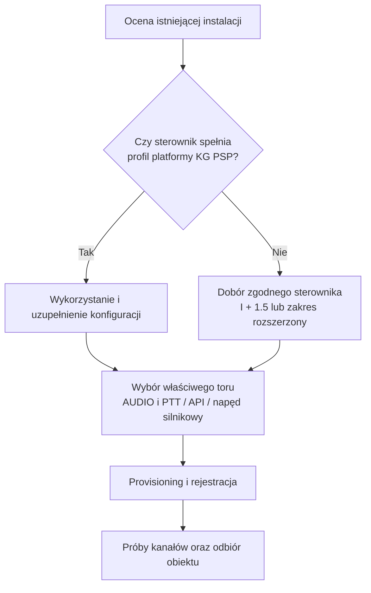

<!-- Generated from zalaczniki/Z2-INFORMACJA-DLA-ORGANOW.md; run python scripts/sync_pages.py. -->

[← Powrót do podręcznika](../PODRECZNIK_v2_ROZDZIELONY.md#spis-tresci)

# Załącznik nr 2 — Informacja dla organów ochrony ludności i jednostek samorządu terytorialnego

## Cel i podział odpowiedzialności

SOiA ma umożliwiać wykonanie tej samej uprawnionej decyzji przez urządzenia różnych producentów. Właściwy organ i procedura rozstrzygają o alarmowaniu. System dostarcza polecenie, a aplikacja sterownika sprawdza jego adresata, ważność i historię, po czym wykonuje właściwą funkcję.

KG PSP zapewnia środowisko integracji, komponenty platformy i aplikację operacyjną. Wykonawca dostarcza zgodny sprzęt, buduje obraz Yocto/OrchestraOS dla swojej płyty i zapewnia interfejsy. Właściciel odpowiada za instalację, eksploatację i dokumentację w swoim zakresie. Wymagania techniczne określa Z3; przygotowanie dostaw Z11.

## Co jest wspólne

| Element | Wymagany rezultat |
| --- | --- |
| Platforma | OrchestraOS wydania KG PSP, zgodny system i aplikacja. |
| Tożsamość i zarządzanie | Przygotowany egzemplarz zarejestrowany we właściwej instancji Orchestra. |
| Polecenia | Wspólne znaczenie, sprawdzanie uprawnień, czasu, obszaru i powtórzeń. |
| Integracja lokalna | Odebrany tor syreny elektronicznej, silnikowej lub innego urządzenia. |
| Utrzymanie | Aktualizacje, odtworzenie, wersje i możliwość przejęcia serwisu. |

Online w Managerze nie jest potwierdzeniem emisji. alarm.soia.info i syreny.soia.info służą zarządzaniu operacyjnemu, a Orchestra utrzymaniu technicznemu urządzeń.

## Dobór klasy i zakresu zakupu

Klasa I obejmuje rdzeń. Profil 1.5 dodaje kompaktowe wyposażenie i lokalne audio; klasa II — rozszerzone wyposażenie z audio. Klasa III obejmuje lokalną syntezę mowy i może być dodana również do profilu kompaktowego. Większa liczba głośników nie określa sama potrzeb pamięci sterownika, a TTS nie zwiększa automatycznie liczby przekaźników.

Do prostszego punktu można zamówić I + 1.5, jeżeli mapa torów i zasoby są wystarczające. Posiadanego zgodnego urządzenia nie wymienia się tylko dlatego, że wprowadzono nowy profil. Szczegóły zawiera [profil 1.5](../PROFIL_1_5.md).

Zakup syreny, samego sterownika, kompletnego zestawu D i montażu sprzętu powierzonego to różne przedmioty. Należy rozdzielić sprzęt już dostarczony, brakujące elementy oraz czynności wykonawcy. Nie zamawia się ponownie aplikacji alarmowej dostarczanej przez KG PSP.

## Adaptacja instalacji istniejącej

Przed zakupem ustala się stan syreny, jej elektronikę, dokumentację i tor sterowania. Sprawna syrena elektroniczna może korzystać z audio/PTT lub udokumentowanego API. Syrena silnikowa wymaga izolowanej aparatury napędu i programu silnikowego; nie odtworzy komunikatów słownych.

Dotychczasowe wymagane sposoby uruchomienia pozostają dostępne. Ich współpracę i arbitraż trzeba odebrać. Sam dodatkowy modem GSM ani karta SIM nie zapewniają pełnej zgodności z SOIA.KGPSP.

## Łączność i przyłączenie

Faza 2026–2028 zakłada GSM/LTE, z SMS jako zapasem. Internet obiektu przez Ethernet lub Wi-Fi może zapewniać dodatkową drogę IP. Po tej fazie podstawowym kanałem poleceń ma być TETRA, po jej zapewnieniu i odbiorze w lokalizacji. GSM pozostaje aktywnym zapasem. Usługi kart, operator i szczegółowe terminy określa plan obiektu; nie wynikają automatycznie z kalendarza.

Poziom 0 jest publicznym odczytem feedu. Rejestracja platformy i odbiór oficjalnej instalacji są osobnymi wymaganiami. Poziomy 1 i 2 dodają uprawnione kanały i usługi według profilu. Sam wniosek nie potwierdza przyjęcia urządzenia, a publiczny odczyt nie nadaje uprawnień do kanałów zamkniętych.

## Warunek gotowości

Model i obraz → przygotowanie egzemplarza → rejestracja i przypisanie → gotowość aplikacji → sprawdzenie kanałów → odbiór fizycznego toru. Pierwsze podłączenie nie wyzwala próby dźwiękowej.

Przyjęcie, doręczenie, ACK i dźwięk to różne etapy. Odbiór obejmuje także polecenia, których urządzenie ma nie wykonać, restart, zasilanie i zbieg kanałów. Nie wolno deklarować gotowości funkcji planowanej wyłącznie na podstawie wyposażenia sprzętu. Dostępny kontrakt sprawdza się według Z4/Z6, a instalację według Z9/Z10.
