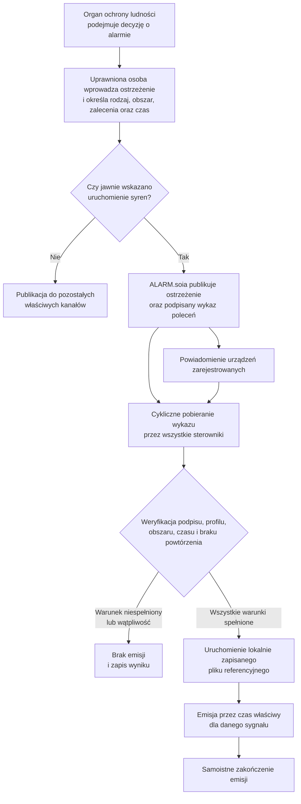
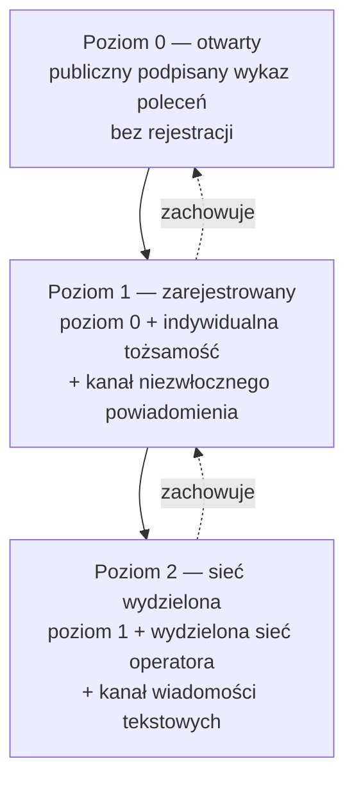
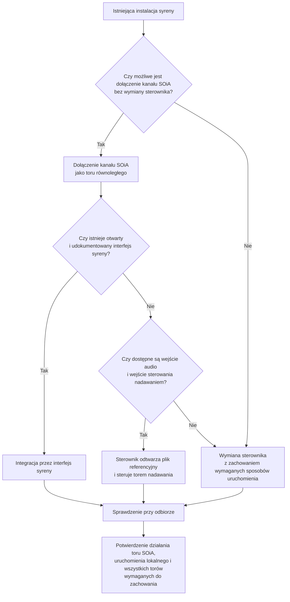
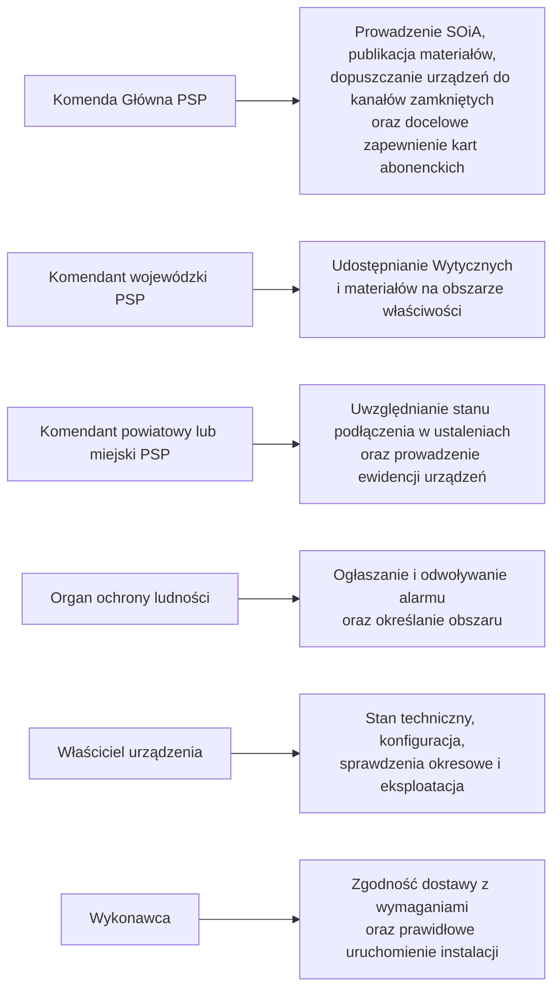

[← Powrót do podręcznika](../index.md#spis-tresci)

# Załącznik nr 2 — Informacja dla organów ochrony ludności i jednostek samorządu terytorialnego

Załącznik jest przeznaczony dla wójtów, burmistrzów, prezydentów miast, starostów oraz komendantów
powiatowych i miejskich Państwowej Straży Pożarnej. Przedstawia cel systemu, skutki jego wdrożenia
dla jednostek samorządu terytorialnego oraz ograniczenia funkcjonalne. Wymagania techniczne
określono w załączniku nr 3.

---

## 1. Stan istniejący i potrzeba standaryzacji

Eksploatowane instalacje syren alarmowych są zróżnicowane pod względem producentów, sposobów
sterowania, interfejsów oraz zapisanych materiałów dźwiękowych. Zróżnicowanie to utrudnia
jednoczesne i jednolite wykonanie alarmu obejmującego obszar więcej niż jednej jednostki samorządu
terytorialnego.

Odrębnym ryzykiem jest długotrwałe uzależnienie właściciela instalacji od jednego dostawcy,
wynikające z braku otwartych interfejsów i interoperacyjności. Zmiana dostawcy może wówczas wymagać
wymiany znacznej części infrastruktury.

SOiA ogranicza oba ryzyka przez ujednolicenie elementów wspólnych dla wszystkich urządzeń oraz
pozostawienie konkurencji w zakresie jakości, ceny, trwałości i sposobu realizacji urządzenia.

---

## 2. Zasada rozdzielenia odpowiedzialności

Rolą producenta jest dostarczenie syreny albo innego urządzenia sygnalizacyjnego zgodnego
z wymaganiami interoperacyjności. Rolą państwa jest prowadzenie systemu ostrzegania
i alarmowania. Jednolite znaczenie poleceń określa kontrakt SOiA.

Wspólny standard podłączenia umożliwia współdziałanie urządzeń różnych producentów. Jednostka
samorządu terytorialnego może rozbudowywać instalację o urządzenia innych marek bez zmiany systemu
centralnego, a sąsiadujące jednostki mogą wykonywać ten sam sygnał w sposób spójny.

---

## 3. Dobrowolność przystąpienia i wymóg pełnej zgodności

Wytyczne nie ustanawiają obowiązku przyłączenia syreny do SOiA. Podmiot podejmujący decyzję
o przystąpieniu stosuje jednak wymagania w całości, ponieważ ich częściowe spełnienie może
prowadzić do niespójnego wykonania tego samego polecenia przez różne urządzenia.

**Momentem przystąpienia jest zgłoszenie urządzenia do rejestracji.** Do tej chwili urządzenie
pobierające publiczny wykaz jest po prostu odbiorcą informacji udostępnianej powszechnie.

---

## 4. Przebieg procesu alarmowania

Proces rozdziela czynności decyzyjne wykonywane przez uprawnione osoby od automatycznych czynności
dystrybucji, weryfikacji i wykonania polecenia. System nie ogłasza alarmu samodzielnie.

Polecenie wskazuje rodzaj sygnału, lecz nie przenosi pliku dźwiękowego. Plik referencyjny jest
instalowany w urządzeniu podczas uruchomienia instalacji.

---

## 5. Poziomy podłączenia do SOiA

SOiA przewiduje trzy kumulatywne poziomy podłączenia urządzenia.

**Poziom 0** umożliwia pobieranie publicznego wykazu poleceń przez Internet i nie wymaga
rejestracji, zgody ani zawiadomienia Komendy Głównej PSP. Mogą z niego korzystać podmioty publiczne
i niepubliczne, pod warunkiem poprawnego skonfigurowania obszaru oraz weryfikacji poleceń.

**Poziom 1** jest przeznaczony dla urządzeń podmiotów publicznych dopuszczonych przez administratora
SOiA. Urządzenie otrzymuje indywidualną tożsamość kryptograficzną i kanał niezwłocznego
powiadomienia. Profil jednostki porządkuje zgłoszenia, lecz dopuszczenie jest rozstrzygane odrębnie
dla każdego urządzenia po potwierdzeniu jego tożsamości, lokalizacji i obszaru działania.

**Poziom 2** uzupełnia poziom 1 o pracę w wydzielonej sieci operatora oraz kanał wiadomości
tekstowych.

Poziom wyższy nie zastępuje poziomu niższego. Cykliczne pobieranie podpisanego wykazu pozostaje
obowiązkowe, dlatego niedostępność kanału powiadomienia wpływa na czas reakcji, lecz nie znosi
możliwości pobrania i wykonania polecenia z poziomu 0. Rejestracja nie jest warunkiem technicznego
działania urządzenia na poziomie 0 podczas oczekiwania na rozstrzygnięcie administratora.

---

## 6. Zakres zakupów po stronie jednostki samorządu terytorialnego

Zakres zakupów i świadczeń przewidzianych w projekcie przedstawia poniższe zestawienie.

| Zakres | Sposób zapewnienia |
|---|---|
| Syrena, sterownik, montaż, uruchomienie i serwis | przedmiot zamówienia jednostki samorządu terytorialnego |
| Łączność urządzenia | w okresie przejściowym 2026–2027 — karty operatorów wybranych przez jednostkę; docelowo projekt przewiduje karty zapewniane centralnie przez KG PSP |
| System centralny | element SOiA; nie wymaga zakupu pulpitu dyspozytorskiego ani oprogramowania serwerowego producenta syreny |
| Pliki referencyjne sygnałów | udostępniane przez KG PSP; instalowane w urządzeniu podczas uruchomienia |

Urządzenie powinno umożliwiać późniejszą wymianę karty abonenckiej i zmianę konfiguracji bez
wymiany sprzętu.

Zakres funkcji określa się w zamówieniu przez wskazanie klas zdolności:

- **klasa I — rdzeń:** wymagana dla każdego urządzenia przyłączanego do SOiA;
- **klasa II — tor audio:** wymagana, gdy sterownik samodzielnie odtwarza dźwięk;
- **klasa III — profil głosowy:** stosowana, gdy zamówienie obejmuje wypowiadanie treści słownej.

Dla sterowania syreną cyfrową przez jej udokumentowany interfejs wystarczająca jest klasa I.
Modernizacja instalacji z odtwarzaniem dźwięku przez sterownik wymaga klas I i II. Klasa III
dotyczy zdolności opcjonalnej; projekt wskazuje, że system nie przenosi obecnie treści głosowej.

Załącznik nr 11 zawiera propozycje minimalnych wymagań funkcjonalnych do wykorzystania przy
opracowaniu opisu przedmiotu zamówienia. Nie stanowi kompletnego opisu gotowego do bezpośredniego
zastosowania. Zamawiający odpowiada za dostosowanie wymagań do przedmiotu, warunków i podstawy
prawnej konkretnego postępowania, w tym za ograniczenie ryzyka zależności od jednego dostawcy.

---

## 7. Integracja istniejących instalacji syren

Projekt nie wymaga automatycznej wymiany istniejących syren. Dobór wariantu integracji należy
poprzedzić oceną stanu instalacji, dostępnych interfejsów, dokumentacji producenta, warunków
gwarancji oraz bezpieczeństwa technicznego.

Dołączenie kanału SOiA nie powinno wyłączać ani ograniczać istniejącego systemu dyspozytorskiego,
pulpitu lokalnego, przycisku ręcznego ani kanału radiowego. Wszystkie tory powinny pracować
równolegle, a możliwość uruchomienia lokalnego powinna pozostać niezależna od łączności.

Zachowanie dotychczasowych sposobów uruchomienia podlega sprawdzeniu przy odbiorze zgodnie
z załącznikiem nr 10 oraz powinno zostać odzwierciedlone w postanowieniach umowy przygotowanych
z wykorzystaniem załącznika nr 11.

W wariancie audio sterownik odtwarza lokalnie plik referencyjny, podaje sygnał na wejście audio
syreny i równolegle uruchamia jej tor nadawania. Dopuszczalność tego wariantu wymaga potwierdzenia
zgodności z dokumentacją urządzenia, wymaganiami bezpieczeństwa oraz warunkami konkretnej umowy.

---

## 8. Ograniczenia funkcjonalne systemu

Prawidłowe określenie zakresu wdrożenia wymaga uwzględnienia następujących ograniczeń:

| Ograniczenie | Znaczenie operacyjne |
|---|---|
| SOiA nie zastępuje decyzji organu ochrony ludności | system przenosi i wykonuje decyzję podjętą przez właściwy organ; nie ogłasza alarmu samodzielnie |
| Potwierdzenie wykonania nie jest potwierdzeniem słyszalności | zasięg i skuteczność akustyczna podlegają projektowi instalacji oraz sprawdzeniom lokalnym |
| Trwająca emisja nie podlega zdalnemu zatrzymaniu | rozpoczęta sekwencja jest wykonywana do końca; odwołanie alarmu stanowi odrębny sygnał akustyczny |
| Jedno polecenie powoduje jedną emisję | ponowienie sygnału wymaga odrębnej decyzji i odrębnego polecenia |
| Obecny zakres nie obejmuje wywoływania jednostek ochrony przeciwpożarowej | dotychczasowe środki wywoływania pozostają odrębne; rozszerzenie zakresu wymaga osobnego etapu |
| Polecenie nie przenosi pliku dźwiękowego | pliki referencyjne muszą zostać zainstalowane i zweryfikowane podczas uruchomienia instalacji |
| System nie przenosi obecnie treści głosowej | klasa III opisuje opcjonalną zdolność urządzenia, a nie aktualnie dostępną usługę centralną |
| Kanał publiczny nie zapewnia informacji zwrotnej o stanie urządzenia | sprawność potwierdza się w toku odbioru, sprawdzeń okresowych i czynności właściciela instalacji |
| Nie ustanowiono liczbowego progu czasu reakcji | czas od wydania polecenia do rozpoczęcia emisji podlega pomiarowi i zapisowi; zastosowanie ma wymóg niezwłoczności |
| Brak wszystkich kanałów łączności uniemożliwia odebranie nowego polecenia | urządzenie nie może uruchamiać emisji na podstawie domniemania lub treści przeterminowanej |

---

## 9. Podział odpowiedzialności

Projekt przyjmuje następujący podział odpowiedzialności:

Odpowiedzialność za stan techniczny i eksploatację instalacji pozostaje po stronie jej właściciela;
nie przechodzi na dostawcę systemu centralnego. Projekt przewiduje ponadto centralne przygotowanie
i publiczne udostępnienie polskiego głosu do syntezy mowy, co wymaga odrębnej realizacji.

---

## 10. Zalecane działania wdrożeniowe

Jednostka samorządu terytorialnego planująca zakup powinna określić wymagane klasy zdolności,
przeanalizować propozycje zawarte w załączniku nr 11 i uwzględnić w opisie przedmiotu zamówienia
wymagania ograniczające zależność od jednego dostawcy.

W przypadku istniejącej instalacji należy ocenić warianty opisane w rozdziale 7 oraz pozyskać
dokumentację interfejsu sterowania. Brak wystarczającej dokumentacji może przemawiać za oceną
wariantu audio, z uwzględnieniem warunków technicznych, gwarancyjnych i umownych.

Działające urządzenie może korzystać z poziomu 0 bez uprzedniej rejestracji. Zgłoszenie urządzenia
publicznego do poziomu 1 albo 2 może być prowadzone równolegle, bez wstrzymywania technicznego
działania na poziomie 0.

Publiczny wykaz poleceń jest dostępny również dla podmiotów niepublicznych. Warunkiem bezpiecznego
wykorzystania jest pełna weryfikacja polecenia przed jego wykonaniem. Rejestracja oraz kanały
zamknięte pozostają przeznaczone dla podmiotów publicznych, a wykorzystanie poziomu 0 bez
rejestracji odbywa się poza zakresem dopuszczenia do kanałów zamkniętych.

---
