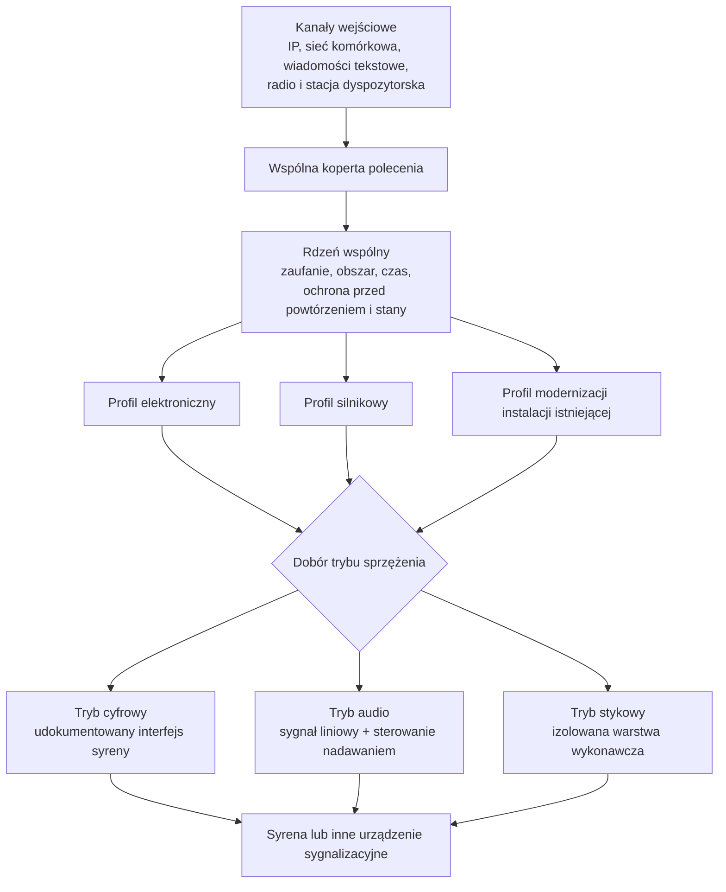
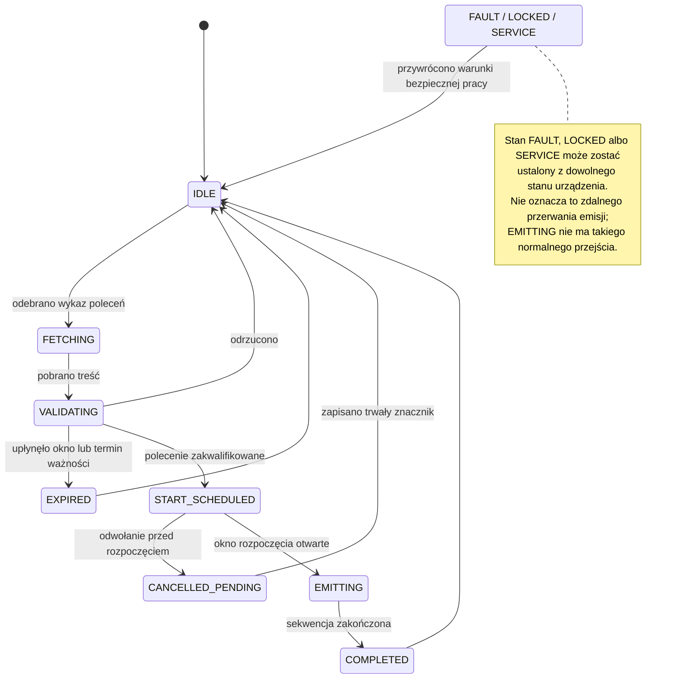

[← Powrót do podręcznika](../index.md#spis-tresci)

# Załącznik nr 5 — Profile sterownika i maszyna stanów

## Architektura rdzenia wspólnego i profili wykonawczych

System centralny nie wymaga informacji o konstrukcji konkretnej syreny. Przekazuje znaczenie
polecenia: rodzaj sygnału, obszar, okno rozpoczęcia i identyfikator. Sterownik odpowiada za
przekształcenie zweryfikowanego polecenia w działanie właściwe dla danej instalacji.

Konstrukcja ma więc dwie warstwy. **Rdzeń wspólny** — jednakowy dla wszystkich urządzeń — obejmuje
odbiór polecenia dowolnym kanałem, weryfikację, regułę obszaru, kontrolę czasu, ochronę przed
powtórzeniem i maszynę stanów. **Profil wykonawczy** opisuje, jak dane urządzenie zamienia decyzję
rdzenia na dźwięk.

Podział na profile mówi, **czym jest urządzenie wykonawcze**. Osobną osią jest **tryb sprzężenia** —
czy sterownik podaje syrenie gotowy dźwięk, wywołuje jej interfejs programowy, czy zamyka obwód.
Te dwie osie są niezależne i nie należy ich mylić.

Kanały wejściowe nie zmieniają znaczenia polecenia. Sieć przewodowa, sieć bezprzewodowa, transmisja
komórkowa, wiadomość tekstowa, radio dalekiego zasięgu i stacja radiowa przekazują dane do jednej
wspólnej koperty i jednej maszyny stanów. Dodanie kanału łączności nie może prowadzić do utworzenia
odrębnej logiki wykonawczej.

---

## Profil elektroniczny

Syrena elektroniczna to wzmacniacz z przetwornikiem. Sterownik podaje na jej wejście sygnał audio
i uruchamia tor nadawania.

Profil obejmuje odtworzenie sygnału z pliku wzorcowego, odtworzenie komunikatu nagranego,
wygenerowanie komunikatu z tekstu w języku polskim, wyjście liniowe o uzgodnionym poziomie,
sterowanie torem nadawania oraz wykrycie gotowości wzmacniacza.

**Syrena elektroniczna może być sterowana także przez własny interfejs programowy**, jeżeli
producent taki udostępnia i udokumentował go zgodnie z wymaganiami swobody wyboru dostawcy.
Sterownik wywołuje wtedy polecenia syreny — odtwórz wskazany slot, podaj stan — zamiast
podawać jej gotowy dźwięk. Połączenie realizowane jest **standardową warstwą fizyczną**: portem
szeregowym, przewodem sieciowym, złączem uniwersalnym albo wejściami i wyjściami ogólnego
przeznaczenia. Nie jest to rozwiązanie zarezerwowane dla instalacji istniejących — nowa syrena
z udokumentowanym interfejsem korzysta z tej drogi tak samo.

Wybór między sterowaniem przez interfejs a podaniem gotowego dźwięku należy do projektanta
instalacji i zależy od tego, co syrena potrafi oraz co producent udokumentował. Oba sposoby są
równoprawne; opisuje je rozdział o trybach sprzężenia.

Należy uwzględnić dwa odrębne wymagania. Poziom sygnału musi mieścić się w granicach ±3 dB
względem wzorca, bez przesterowania. Potwierdzenie uruchomienia toru audio nie stanowi natomiast
dowodu słyszalności i nie zastępuje sprawdzenia zasięgu.

Dostarczane urządzenia mają wyjście stereofoniczne z dwoma kanałami przypisywanymi programowo
niezależnie. Pozwala to rozdzielić tor syreny od toru pomocniczego — na przykład nagłośnienia
wewnętrznego albo stacji radiowej — bez dokładania sprzętu.

---

## Profil silnikowy

Syrena silnikowa wytwarza dźwięk mechanicznie. Sterownik nie tworzy tu przebiegu akustycznego, tylko
zamyka i otwiera obwód zasilania układu wykonawczego według zatwierdzonego programu.

**Sterownik nie może sterować obwodem mocy bezpośrednio z wyjść ogólnego przeznaczenia.** Musi
używać certyfikowanej, izolowanej warstwy wykonawczej — stycznika albo układu rozruchowego —
z izolacją galwaniczną i fizycznym zabezpieczeniem przed porażeniem podczas prac serwisowych.

Profil obejmuje ponadto sprzętowe blokady wzajemne, ograniczenie maksymalnego czasu ciągłego
zasilania, monitorowanie stanu stycznika, wykrywanie obecności obciążenia oraz wejście awaryjnego
odcięcia.

Modulacja sygnału ochrony ludności jest **programem sterowania układem wykonawczym**, a nie
przypadkowym przełączaniem z poziomu aplikacji. Parametry cyklu muszą pochodzić z zatwierdzonego
profilu i przejść testy u producenta syreny oraz na instalacji — a nie zostać dobrane
eksperymentalnie w terenie.

Osobno trzeba pamiętać, że dla syreny silnikowej **odcięcie lokalne** oznacza **zatrzymanie wirnika
pracującego pod obciążeniem**. Jest to czynność na obwodzie mocy, ze skutkami mechanicznymi,
i pozostaje środkiem awaryjnym.

---

## Profil modernizacji instalacji istniejącej (retrofit)

Ten profil obsługuje instalacje, które już stoją. Wytyczne przewidują dwie drogi, a wybór należy
do zamawiającego, bo to on zna stan instalacji, umowy serwisowe i budżet.

!!! info "Zasada modernizacji instalacji istniejącej"

    Kanał SOiA dodaje się jako tor równoległy. Dołączenie go nie może
    wyłączyć ani ograniczyć dotychczasowych sposobów uruchomienia syreny — istniejącego systemu
    dyspozytorskiego, pulpitu lokalnego, przycisku ręcznego ani kanału radiowego. Wykonawca nie może
    warunkować dołączenia wyłączeniem albo przeprogramowaniem istniejącego systemu, ani uzależniać
    od tego gwarancji. Oba tory pracują równolegle *(W-J01 do W-J08)*.

Tryby sprzężenia z syreną są niezależne od profili wykonawczych.
Sterowanie przez interfejs programowy syreny i podanie jej gotowego dźwięku występują zarówno
w instalacji nowej, jak i modernizowanej; profil modernizacyjny wyróżnia to, że instalacja już istnieje,
a nie to, jakim sposobem jest wysterowana.

### Wariant 1 — integracja przez interfejs producenta

Sterownik wywołuje udokumentowane polecenia syreny, w szczególności odtworzenie wskazanego slotu
i odczyt stanu.
Połączenie realizowane jest standardową warstwą fizyczną — portem szeregowym RS-232, przewodem
sieciowym, złączem uniwersalnym albo wejściami i wyjściami ogólnego przeznaczenia.

Warunkiem jest otwarta dokumentacja producenta syreny: wykaz poleceń ze składnią, mapa slotów,
format i sposób wgrania plików dźwiękowych, kody odpowiedzi i błędów, sposób odczytu stanu oraz
parametry elektryczne złącza. Dokumentacja ma wystarczyć, żeby **niezależny wykonawca napisał
integrację bez kontaktu z producentem**.

Ewentualna wewnętrzna funkcja zatrzymania udostępniona przez producenta syreny nie stanowi
polecenia SOiA i nie może służyć do przerwania rozpoczętej emisji wbrew zasadzie niepodzielności.

### Wariant 2 — wykorzystanie syreny jako systemu nagłośnieniowego

Sterownik sam odtwarza plik wzorcowy i podaje sygnał liniowy na wejście audio syreny, jednocześnie
uruchamiając jej tor nadawania. Syrena pełni wtedy rolę wzmacniacza z przetwornikiem i **nie musi
wiedzieć nic o SOiA** — ani o slotach, ani o katalogu sygnałów, ani o poleceniach.

Wariant ten ogranicza zależność od nieudokumentowanego interfejsu programowego. Wymaga wejścia
liniowego oraz wejścia nadawania, a jego dopuszczalność należy potwierdzić z uwzględnieniem
dokumentacji, bezpieczeństwa, warunków gwarancji i postanowień umowy.

Wierność sygnału zapewnia sterownik odtwarzający plik referencyjny zweryfikowany sumą kontrolną.
W wariancie interfejsowym zależy ona od zawartości slotów syreny i prawidłowości jej okresowej
weryfikacji.

### Wymagania niepodlegające ograniczeniu w instalacji modernizowanej

Żadna z dróg nie zwalnia z rdzenia wspólnego. Weryfikacja źródła polecenia, reguła obszaru, okno
czasu, ochrona przed powtórzeniem i lokalne odcięcie awaryjne obowiązują tak samo jak w nowej
instalacji. Modernizacja dotyczy **sposobu wysterowania syreny**, a nie zakresu sprawdzeń przed
uruchomieniem.

### Obsługa zbiegu poleceń z dwóch torów

Przy zbiegu poleceń z równoległych torów do końca wykonuje się polecenie, które jako pierwsze
rozpoczęło sekwencję. Polecenie odebrane w trakcie emisji podlega odnotowaniu i odroczeniu
do ponownej kwalifikacji. Nie może zostać automatycznie zakolejkowane jako następna emisja.

Lokalne odcięcie awaryjne i tryb serwisowy zachowują pierwszeństwo niezależnie od toru.

---

## Interfejs radiowy jako punkt integracji

Stacja dyspozytorska podłącza się do **odrębnego portu** sterownika — sieciowego albo
szeregowego — przeznaczonego wyłącznie do przyjmowania polecenia z zewnątrz. Nie należy mylić tego
portu z torem audio i sterowaniem nadawaniem syreny, które służą do czegoś zupełnie innego.

Adapter stacji radiowej musi deklarować: nazwę i wersję, obsługiwany profil, wykaz obsługiwanych
funkcji, mapowanie wejść i wyjść, dopuszczalne czasy, zachowanie przy błędzie, możliwości
diagnostyczne oraz test zgodności.

Adapter **nie tworzy własnej semantyki alarmu**. Dostarcza polecenie; sprawdza je i wykonuje rdzeń
wspólny, dokładnie tak samo jak polecenie z każdego innego kanału. Kanał radiowy nie jest przy tym
dowodem uprawnienia — sam fakt, że wiadomość przyszła zaufaną drogą, nie wystarcza.

---

## Maszyna stanów

Stan urządzenia musi być **trwały**, to znaczy dawać się odtworzyć po restarcie i po zaniku
zasilania. Bez tego nie da się zagwarantować, że polecenie wykonane raz nie wykona się drugi raz.

!!! note "Dla odbiorcy operacyjnego"

    Diagram jest modelem dla producenta oprogramowania, a nie instrukcją obsługi syreny. Dla właściciela najważniejsze są trzy skutki: urządzenie odmawia przy poleceniu niespełniającym warunków, nie powtarza zakończonej emisji po restarcie i nie przerywa rozpoczętej emisji zwykłym poleceniem zdalnym. Tryb serwisowy, blokada albo awaria wymagają przywrócenia warunków bezpiecznej pracy na obiekcie.

**Stan `EMITTING` ma w normalnym przebiegu wyłącznie przejście wynikające z zakończenia
sekwencji.** Awaryjne odcięcie toru wykonawczego jest czynnością sprzętową i nie stanowi zwykłego
przejścia maszyny stanów.

**Stan `CANCELLED_PENDING` dotyczy wyłącznie polecenia, którego wykonywanie jeszcze się nie
rozpoczęło.** Urządzenie zapisuje trwały znacznik odwołania, aby późniejsze odebranie odwołanej
akcji nie spowodowało emisji. Znacznik musi przetrwać restart.

---

## Odtwarzanie stanu po restarcie i zaniku zasilania

Po uruchomieniu urządzenie odtwarza stan trwały i postępuje według jego zawartości.

Polecenie **zakończone** nie podlega ponownemu wykonaniu, niezależnie od liczby jego późniejszych
wystąpień w wykazie. Polecenie **odwołane** nie jest uruchamiane. Polecenie **zaplanowane** podlega
ponownej weryfikacji świeżości i okna rozpoczęcia. Stan **przerwanej emisji** wymaga jawnie
określonego postępowania właściwego dla profilu sprzętowego; samoczynne wznowienie jest
niedopuszczalne. Stan **awaryjny** utrzymuje się do czasu przywrócenia warunków bezpiecznej pracy.

Zanik zasilania nie może usuwać stanu ochrony przed powtórzeniem ani powodować ponownego wykonania
polecenia, którego okno rozpoczęcia upłynęło.

---

## Tryby pracy

Urządzenie musi jednoznacznie wiedzieć, w jakim jest trybie, i musi to komunikować.

**Operacyjny** — przyjmuje i wykonuje polecenia produkcyjne. **Ćwiczebny** — wykonuje wyłącznie
polecenia oznaczone jako ćwiczenie i na odrębnym profilu. **Serwisowy** — blokuje wykonanie zdalne,
dopuszcza test lokalny. **Zablokowany** — blokada awaryjna. **Ograniczony** — pracuje węższym
zestawem kanałów, ale **zachowuje pełny zakres weryfikacji**. **Awaryjny** — nie wykonuje poleceń
do czasu spełnienia warunków bezpiecznej pracy.

Zmiana trybu jest zdarzeniem odnotowywanym lokalnie wraz z czasem i przyczyną. **Restart nie może
samoczynnie przełączyć trybu serwisowego lub zablokowanego na operacyjny.** Najczęstszy błąd
eksploatacyjny w tej klasie instalacji to syrena pozostawiona w trybie serwisowym po pracach
konserwacyjnych i odkrycie tego dopiero podczas alarmu.

Tryb ćwiczebny urządzenia i sygnał ćwiczebny z katalogu to **dwie różne rzeczy o myląco podobnych
nazwach**: pierwszy jest stanem urządzenia, drugi rodzajem dźwięku. Można wyemitować sygnał
ćwiczebny w trybie operacyjnym i można wykonać test w trybie ćwiczebnym bez emisji zewnętrznej.

---

## Ewidencjonowanie etapów wykonania polecenia

Ustalenie przyczyny niewykonania emisji wymaga rozróżnienia kolejnych etapów. Urządzenie powinno
ewidencjonować: przyjęcie polecenia, zaplanowanie akcji, aktywowanie wyjścia, wykrycie obciążenia,
potwierdzenie pracy przez czujniki lokalne, zakończenie emisji oraz błąd lub wykonanie niepełne.

Żaden z tych stopni **nie jest dowodem słyszalności**. Ostatnim ogniwem, którego system nie widzi,
pozostaje akustyka — i tego załącznik nie zmienia.

---
