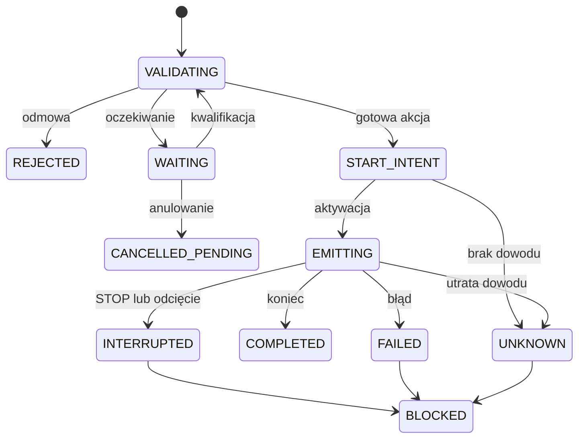

<!-- Generated from zalaczniki/Z5-PROFILE-STEROWNIKA.md; run python scripts/sync_pages.py. -->

[← Powrót do podręcznika](../PODRECZNIK_v2_ROZDZIELONY.md#spis-tresci)

# Załącznik nr 5 — Profile sterownika i maszyna stanów

## Wspólny rdzeń i właściwy tor wykonania

System przekazuje znaczenie polecenia, a aplikacja KG PSP na zgodnej platformie wybiera lokalną funkcję. Wspólne są zaufanie, adresat, czas, historia i arbitraż. Typ syreny, tryb połączenia i wyposażenie dobiera się osobno.

| Oś doboru | Warianty |
| --- | --- |
| Klasa zdolności | I; kompaktowe audio 1.5 albo rozszerzone II; opcjonalne TTS III. |
| Profil wykonawczy | Elektroniczny, silnikowy albo inny jawnie zdefiniowany odbiornik. |
| Tor lokalny | AUDIO/PTT, udokumentowany API lub izolowane sterowanie napędem. |
| Rodzaj inwestycji | Nowy punkt, adaptacja istniejącego lub montaż sprzętu powierzonego. |

Profil 1.5 zachowuje ten sam rdzeń i jakość audio co II, lecz ma mniejszą liczbę portów. Współpraca z OrchestraOS/Yocto i provisioningiem jest obowiązkiem platformy, a nie cechą zastrzeżoną dla klasy III.

## Profil elektroniczny

Sterownik odtwarza zatwierdzone lokalne pliki i podaje sygnał przez LINE OUT. PTT jest sterowane osobno i może korzystać z jednego z istniejących przekaźników. Czas PTT obejmuje zmierzone przygotowanie toru, całe audio i zakończenie; nie jest automatycznie równy czasowi pliku.

Wejście syreny identyfikuje się z dokumentacji. Wejście MIC wymaga właściwego dopasowania poziomu, odniesienia mas i ewentualnej izolacji. Złącze podobne do RJ-45 nie musi być Ethernetem. Parametrów i numerów zacisków nie przenosi się między modelami.

TTS jest osobnym rozszerzeniem: zatwierdzony tekst, lokalny polski silnik i głos, prawa użycia, bufor, limity oraz próba offline. Gotowe nagrania nie wymagają syntezy. Wymagane funkcje głosowe nie mogą opóźniać podstawowego sygnału.

## Profil silnikowy

Syrena wytwarza dźwięk mechanicznie. Sterownik przekazuje wyłącznie sygnały sterujące do izolowanej aparatury, a silnik ma własny tor mocy, zabezpieczenia i zasilanie. Funkcje programu, np. RUN/CYKL, mapuje się na odebrany interfejs. Moc silnika nie jest prądem przełączanym przez wyjście sterownika.

Program uwzględnia rozbieg, wybieg i cykl łączeń. Wymagane jest niezależne ograniczenie okna pracy, lokalne odcięcie i nadzór. Odjęcie napięcia kończy napęd, ale wirnik może jeszcze wybiegać. Stan stycznika nie jest pomiarem dźwięku. Akumulator sterownika nie zapewnia automatycznie zasilania silnika.

## Wariant przez API i modernizacja

Udokumentowany interfejs cyfrowy może służyć do wywołania funkcji syreny, jeśli obejmuje wymagany zakres, statusy, parametry i prawa integracji. Sam RS-232 lub Ethernet nie jest protokołem. Wykonawca dostarcza adapter, który zachowuje znaczenie funkcji i działa z pakietem KG PSP.

Jeżeli API uruchamia generator syreny lub zasób zapisany w jej pamięci, trzeba jawnie przyjąć ten wariant, miejsce zasobu, kontrolę integralności i nadzór. Nie jest to automatycznie spełnienie wymagania plików w pamięci sterownika. Tak samo wybór gotowego nagrania przez API nie jest pełną obsługą dowolnego tekstu TTS.

Adaptacja zachowuje wymagane dotychczasowe sterowanie lokalne i radiowe. Potrzebne nastawy integracyjne opisuje karta; nie podłącza się niezależnych nadajników do jednego portu szeregowego przez pasywny rozgałęźnik.

## Znaczenie końca działania

| Zdarzenie | Reguła |
| --- | --- |
| Koniec prawidłowego sygnału | Lokalny nadzór kończy odtwarzanie lub program i zwalnia właściwy tor. |
| CANCEL_PENDING | Dotyczy wskazanej znanej operacji oczekującej; nie emituje odwołania i nie przerywa trwającego sygnału. |
| Odwołanie alarmu | Odrębna funkcja wykonawcza, z własną kwalifikacją i właściwym sygnałem. |
| Techniczne STOP | Tylko w profilu, który definiuje i autoryzuje tę funkcję; odnotowuje przerwanie. Nie jest odwołaniem alarmu. |
| Odcięcie lokalne albo niezależny limit bezpieczeństwa | Ma pierwszeństwo nad poleceniami. Nie wymaga działania sieci ani aplikacji. |
| Błąd lub niepewność po aktywacji | Bezpieczne zakończenie i trwały wynik; brak automatycznego wznowienia albo powtórzenia. |

Normalnie zakwalifikowany sygnał jest wykonywany do końca. Wyjątkiem jest działanie ochronne albo techniczne zatrzymanie przewidziane w przyjętym profilu. Nie wolno deklarować, że żaden sprzęt i żaden kanał nie posiada funkcji STOP; nie wolno też tworzyć jej samodzielnie przez zmianę znaczenia innej komendy.

## Arbitraż poleceń

Wszystkie kanały korzystają z jednej tabeli arbitrażu określonej w profilu KG PSP przed odbiorem. Przy braku reguły umożliwiającej odroczenie konflikt jest odrzucany i zapisywany. Wykonawca nie może sam wybrać odmiennego zachowania.

| Sytuacja | Wymagane rozstrzygnięcie |
| --- | --- |
| Ten sam ID operacji innym kanałem | Duplikat; nie powstaje drugie wykonanie. |
| Inne polecenie przy zajętym torze | Brak równoległego przejęcia; końcowe odrzucenie albo jawne odroczenie zgodnie z tabelą. |
| Koniec bieżącej funkcji | Ponowna kwalifikacja tylko operacji odroczonej: ważność, adresat, historia, zasoby i stan. |
| Operacja odrzucona końcowo | Brak automatycznego ponowienia przez lokalną kolejkę. |
| Brak ACK lub wynik niepewny | Uzgodnienie stanu; nie uznaje się tego za dowód niewykonania. |
| Blokada, serwis albo odcięcie | Pierwszeństwo bezpieczeństwa; test lokalny nie obchodzi odcięcia. |

Wpisy odroczone mają ograniczone miejsce i ważność. Nie tworzą kolejki automatycznie sklejającej dwa sygnały w dłuższą emisję. Opóźniona operacja musi ponownie spełnić wszystkie warunki.

## Maszyna stanów

Model pokazuje stany jednej operacji, nie nazwy endpointów aplikacji. Po zakończeniu lub odrzuceniu urządzenie może przyjmować kolejne polecenia, zachowując historię. Wyjście z blokady wymaga wyjaśnienia stanu i przywrócenia warunków bezpiecznej pracy. Stan przed aktywacją oraz historia przetrwają restart. Przerwana albo niepewna operacja nie wraca samoczynnie do EMITTING. Ponowne uruchomienie aplikacji nie znosi utrwalonego serwisu lub blokady.

## Dowody wykonania

Rozróżnia się przyjęcie, zaplanowanie, próbę aktywacji, stan wyjścia, start odtwarzania, koniec i wynik z czujnika. Przekaźnik ani ACK nie potwierdzają słyszalności. Pomiar akustyczny potwierdza efekt wyłącznie w zakresie miejsca i metody pomiaru. Karta zapisuje, jaki dowód jest dostępny dla danego toru.
