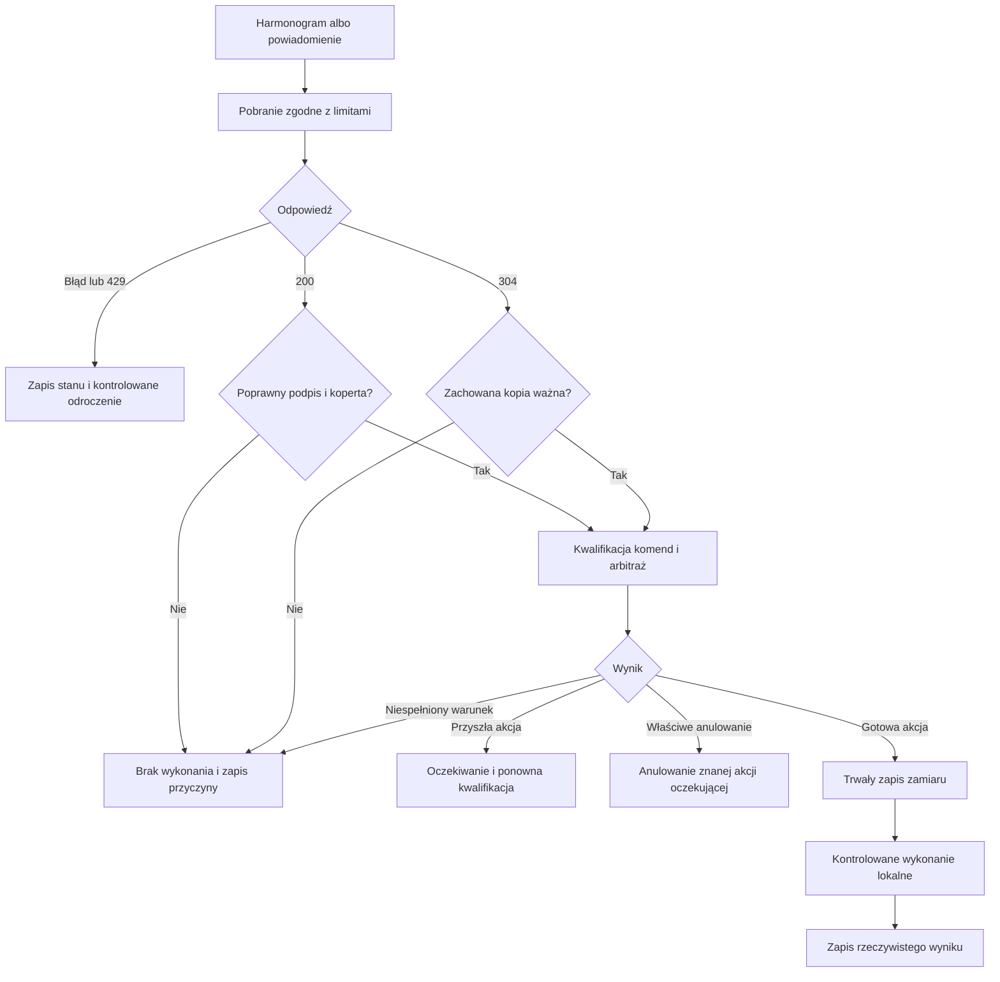

<!-- Generated from zalaczniki/Z6-POZIOM-0-PUBLICZNY-WYKAZ.md; run python scripts/sync_pages.py. -->

[← Powrót do podręcznika](../PODRECZNIK_v2_ROZDZIELONY.md#spis-tresci)

# Załącznik nr 6 — Poziom 0 publiczny wykaz poleceń

## Otwarty odczyt i zgodność urządzenia

Poziom 0 jest jednokierunkowym odczytem publicznego IoT Feed. Nie wymaga uwierzytelnienia żądania ani rejestracji do samego pobrania. Nie zapewnia dowodu obecności i wykonania urządzenia. Rejestracja platformy Orchestra oraz odbiór punktu według Z3/Z7 są osobnymi warunkami zarządzanej instalacji KG PSP.

Poniżej opisano zasady kontraktu i datowany stan metadanych. Wersję przeznaczoną do wdrożenia uzgadnia się z aplikacją KG PSP i potwierdza wektorami oraz próbami. Nowy dokument nie zmienia działania centrali.

## Punkty dostępu

Metoda GET, baza `https://alarm.soia.info`:

| Ścieżka | Rola |
| --- | --- |
| `/api/v1/iot/feed` | Podpisany wykaz poleceń i informacyjne okno zdarzeń. |
| `/api/v1/iot/public-key` | Publiczne klucze i ich identyfikatory z bieżącego okna wymiany. |
| `/api/v1/iot/public-key.pem` | Publiczny klucz w postaci PEM. |
| `/api/v1/iot/profile` | Metadane profilu klienta, klas odbiorców i kodów. |
| `/api/v1/iot/dictionaries` | Wersja i zawartość słowników. |

Odczyt 10.09.2026: profil `PL-CAP-DIST-IOT` / `0.1`, słownik `2026.1`, klasa `SIREN_CONTROLLER`, kody `SIREN_ALARM_MODULATED_3M` i `SIREN_CANCEL_PENDING`. Metadane `/profile` nie ogłaszały w tym odczycie maksymalnych rozmiarów feedu i pojedynczej komendy. Limit klienta oraz kompletność obsługi muszą być określone w pakiecie integracyjnym; nie przyjmuje się wartości domyślnych z opisu jako parametru API.

To wykaz publicznych punktów użytych w tym profilu, nie zakaz tworzenia przyszłych usług utrzymania. IoT Feed nie zawiera pliku audio; lokalne zasoby opisuje Z4.

## Integralność i źródło zaufania

HTTPS chroni połączenie, a podpis chroni treść. Przed kwalifikacją aplikacja sprawdza algorytm, identyfikator zaufanego klucza i podpis całego dokumentu. Nieznany klucz lub błędny podpis powodują odrzucenie całości.

W profilu 0.1 podpis Ed25519 obejmuje dokument po usunięciu głównego pola `signature`, z kanonizacją zgodną z kontraktem. Trzeba zachować kolejność tablic, kodowanie UTF-8 i poprawną serializację wartości; samo usunięcie spacji nie jest pełnym opisem kanonizacji. Implementację sprawdza się na wektorach wzorcowych.

Klucz publiczny może być wspólny. Jego pochodzenie i aktualizację przyjmuje się zgodnie z konfiguracją zaufania KG PSP. Sam komunikat z nowym `kid` nie nadaje mu zaufania. Kontrolowane pobranie lub dystrybucja nowego klucza musi uwzględniać źródło, ważność, okno nakładania i odwołanie.

## Kwalifikacja polecenia

`activeCommands` jest listą poleceń wykonawczych. `eventWindow` jest informacją o zdarzeniach i nie uruchamia syreny. Przed wykonaniem sprawdza się:

- zgodność profilu, środowiska, słownika i klasy odbiorcy;
- ważność feedu i operacji oraz brak niedozwolonego cofnięcia sekwencji;
- dopasowanie geokodu do TERC konkretnego toru;
- obsługiwaną funkcję, okno rozpoczęcia, historię ID i stan techniczny;
- zasoby lokalne, tryb pracy i wspólny arbitraż kanałów.

Nieznany kod funkcji odrzuca właściwą komendę, a nie inne poprawne komendy w zweryfikowanym feedzie. Nieprawidłowy podpis odrzuca całą kopertę. Brak polecenia w kolejnej kopii nie jest zdalnym odcięciem trwającego sygnału.

### Obszar

Tor ma jeden siedmiocyfrowy TERC gminy. Polecenie może wskazać jednostkę nadrzędną albo wiele geokodów. Wiele niezależnych torów w sterowniku ma osobną mapę. Nie wolno uruchamiać wszystkich wyjść po dopasowaniu jednego toru.

Rozróżnia się rodzaj gminy, w tym gminę miejsko-wiejską oraz jej miasto i obszar wiejski. Nie porównuje się tylko sześciu pierwszych cyfr gminy. Kody ulic i miejscowości nie są geokodami tego samego rejestru. Błędnej konfiguracji nie naprawia się przez obcięcie lub dopełnienie.

### Czas i anulowanie

Ważne polecenie przyszłe może oczekiwać do ponownej kwalifikacji. Przed aktywacją musi nadal być potwierdzone właściwą świeżą treścią, pozostawać w swoim oknie i spełniać reguły. Nie należy go usuwać na stałe tylko dlatego, że odebrano je przed początkiem okna.

W bieżącym profilu `CANCEL_PENDING` dotyczy wskazanej, znanej lokalnie operacji oczekującej. Nieznane ID nie tworzy zaległego START; operacja rozpoczęta albo zakończona nie jest przekształcana w odwołanie dźwiękowe. Zmiana tej semantyki wymaga nowej, uzgodnionej wersji kontraktu.

## Harmonogram i pamięć pośrednia

Normalny okres pobierania wynosi 30 s między początkami żądań. Fazy urządzeń są rozłożone, a zapytania do tego samego feedu nie nakładają się. Powiadomienie może przyspieszyć pobranie, lecz nie znosi cyklicznej pracy.

| Odpowiedź lub stan | Działanie |
| --- | --- |
| HTTP 200 | Zweryfikować pełną treść; dopiero potem przyjąć jej ETag i stan. |
| HTTP 304 | Sprawdzić ważność już zweryfikowanej kopii; nie odnawiać `feedExpiresAt`. |
| HTTP 429 | Honorować Retry-After; oznaczyć stan kanału i nie wykonywać przeterminowanych danych. |
| Błąd lub brak sieci | Kontrolowane wycofanie i rozproszenie ponowień; bez pętli zapytań. |
| Powrót łączności | Powrócić do harmonogramu, zweryfikować czas i treść; nie odtwarzać starej emisji. |

Przy wygasłej kopii kolejne planowe pobranie może zostać wykonane bez warunku ETag, nadal z kontrolą sekwencji. Cache HIT i HTTP 304 nie dowodzą ważności podpisanego dokumentu. Prawidłowe respektowanie Retry-After może chwilowo przekroczyć 30 s; jest stanem wyjątkowym opisanym przez profil, nie nowym normalnym interwałem.

## Trwałość i przebieg

W pamięci trwałej pozostają zaakceptowana sekwencja, zaufanie, historia ID, zamiary i wyniki. Retencja historii obejmuje najpóźniejszą ważność feedu, operacji i okna zdarzeń z zapasem doby; nie oznacza to resetowania najwyższej sekwencji po dobie. Restart po niepewnej aktywacji nie uprawnia do ponowienia.

Odbiór obejmuje błędny podpis, obcy obszar, przyszłą i przeterminowaną komendę, duplikat po restarcie, nieznane ID anulowania, ważność przy 304 oraz zachowanie przy 429 i utracie sieci. Próby przeprowadza się w uzgodnionym środowisku. Odczyt produkcyjnego feedu nie jest zgodą na testy emisji lub obciążenia.
