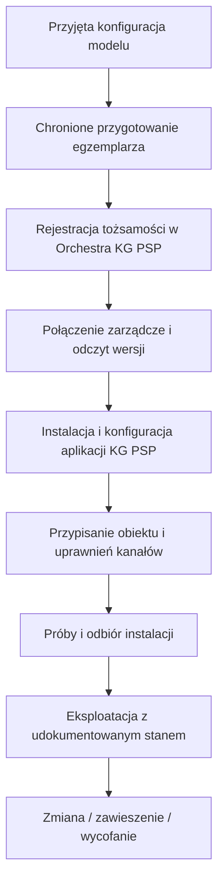

<!-- Generated from zalaczniki/Z7-POZIOM-1-REJESTRACJA.md; run python scripts/sync_pages.py. -->

[← Powrót do podręcznika](../PODRECZNIK_v2_ROZDZIELONY.md#spis-tresci)

# Załącznik nr 7 — Rejestracja urządzenia i kanały rejestrowane

## Co podlega rejestracji

Rejestracja platformy w Orchestra KG PSP, przydzielenie dostępu do kanału powiadomień i odbiór konkretnej syreny są odrębnymi czynnościami. Wspólna ewidencja ma umożliwiać ich powiązanie. Samo konto, certyfikat lub poprawny odczyt feedu nie potwierdzają wszystkich etapów.

Pełny proces przygotowania opisuje [platforma KG PSP](../PLATFORMA_KG_PSP.md). Dotyczy również profilu 1.5. Wniosek nie ustanawia automatycznie uprawnienia; dostęp przydziela administrator właściwej instancji zgodnie z określonym zakresem.

## Przygotowanie modelu

Wykonawca zgłasza płytę, rewizję, profil zdolności i wyposażenie. KG PSP udostępnia komponenty Yocto/OrchestraOS, warunki integracji oraz pakiet kontrolny. Wykonawca przygotowuje i dokumentuje obraz/BSP oraz adaptery. Próby modelu poprzedzają przygotowanie partii egzemplarzy.

| Dane konfiguracji modelu | Zakres |
| --- | --- |
| Sprzęt | Model, rewizja płyty, architektura, zasoby i porty. |
| Oprogramowanie | Wydanie komponentów KG PSP, OS/BSP, interfejsy i sposób uruchamiania aplikacji. |
| Funkcja | I, 1.5, II lub III w odpowiednim połączeniu; profil wykonawczy i zakres D/P. |
| Bezpieczeństwo | Rozruch, klucze, aktualizacje, serwis i nadzór toru. |
| Dowody | Wyniki prób, manifest, SBOM i odtworzenie budowy. |

## Provisioning egzemplarza

Egzemplarz otrzymuje dopuszczony obraz, indywidualną tożsamość i konfigurację startową. Materiały prywatne nie są przesyłane jako zwykły załącznik zgłoszenia. Konfiguracja startowa umożliwia bezpieczne pierwsze połączenie; nie może wymagać poświadczeń, które byłyby dostępne dopiero po tym samym połączeniu.

Rekord obejmuje numer seryjny, model/rewizję, tożsamość, właściwą instancję Orchestra, grupę zgodnych urządzeń, lokalizację, ID syreny i przypisanie TERC do toru. Modem i SIM mają osobne atrybuty. Wymiana SIM nie tworzy nowej tożsamości; wymiana płyty wymaga kontroli starej i nowej tożsamości.

ZTP jest wykonaniem wcześniej przygotowanego procesu, nie zastępstwem identyfikacji lub decyzji. Pierwsze uruchomienie służy diagnostyce przy bezpiecznym stanie wyjść; nie wyzwala samoczynnie testu akustycznego.

## Uprawnienia i cykl życia

Administrator określa rolę wykonawcy, zakres urządzeń, czas dostępu i sposób jego cofnięcia. Panel oraz powłoka nie są publicznie dostępne. Rejestracja i zarządzanie platformą muszą działać przed instalacją aplikacji KG PSP.

Jedna indywidualna tożsamość nie może identyfikować wielu egzemplarzy. Proces obejmuje wymianę certyfikatów przed wygaśnięciem, okres nakładania, potwierdzenie pracy na nowym materiale, odwołanie, wymianę płyty i wycofanie. Flota służy dystrybucji zgodnych wydań, nie zmianie obszaru alarmowania.

Cofnięcie tożsamości zamkniętego kanału nie usuwa publicznego endpointu, ale nie może być interpretowane jako zgoda na dalszą eksploatację wycofanego urządzenia. Konfiguracja trybu i dopuszczenia określa, czy aplikacja może wykonywać nowe polecenia. Blokady bezpieczeństwa zachowują pierwszeństwo także wobec poziomu 0.

## Powiadomienie o zmianie feedu

Kanał powiadomienia przenosi informację o zmianie, nie polecenie wykonawcze. Odbiornik pobiera i sprawdza podpisany feed. Utrata powiadomień nie znosi normalnego cyklicznego pobierania.

Polityka powiadomień ogranicza urządzenie do własnej tożsamości i właściwej subskrypcji. Telemetria i statusy wykonania mają odrębne uprawnienia i retencję. Nie utożsamia się braku publikowania na kanale powiadomień z zakazem telemetrii w Orchestra.

Po otrzymaniu powiadomienia klient musi rozpoznać, czy pobrał właściwą lub równoważną świeżą wersję. Mechanizm wersjonowania, cache i kontrolowanego ponowienia opisuje kontrakt. Sam cache HIT lub krótki max-age nie stanowią tego dowodu.

## Kryteria przyjęcia

Sprawdza się właściwą instancję, tożsamość, powiązanie obiektu, uprawniony dostęp i odmowę nieuprawnionego, zmianę wersji, aktualizację i rollback, cofnięcie dostępu oraz pracę po przerwie łączności. Brak rejestracji lub odbioru jest odrębnym stanem gotowości. Terminy obsługi zgłoszeń, dane instancji i osoby odpowiedzialne określa proces KG PSP poza niniejszą publikacją.
