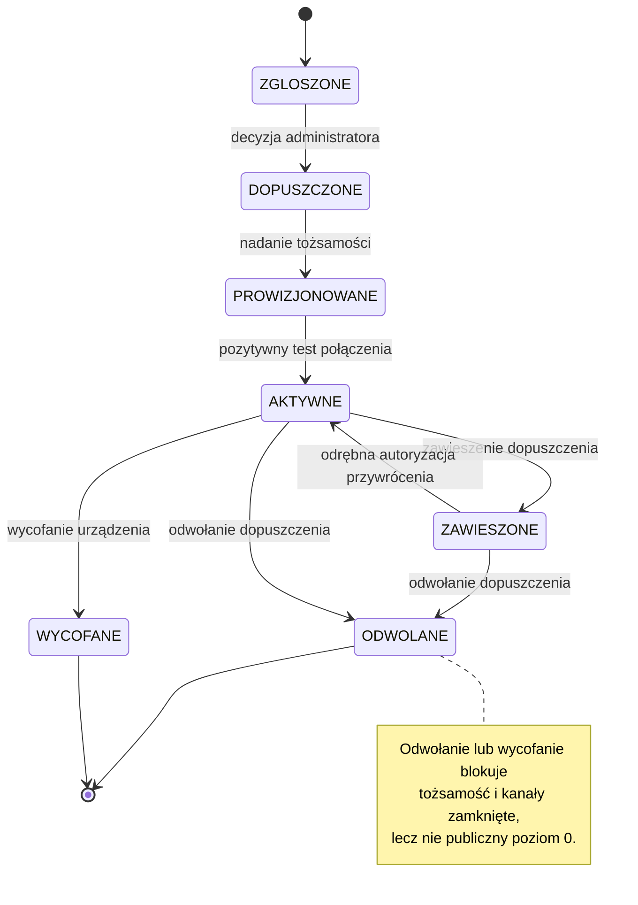
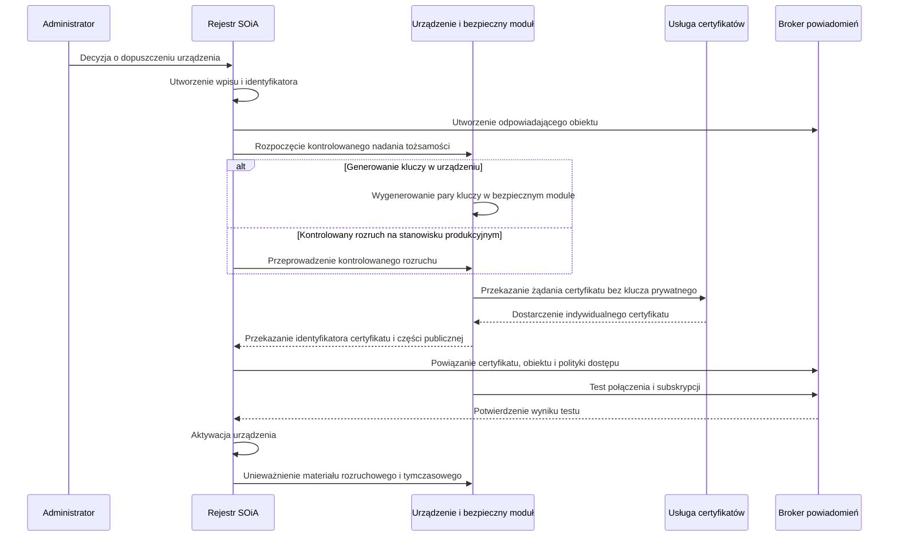
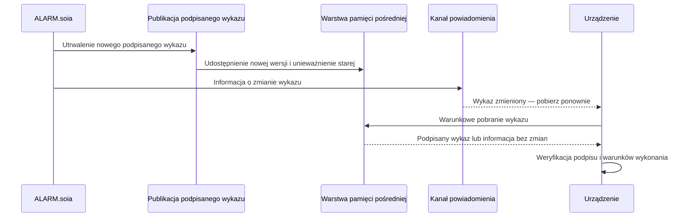

[← Powrót do podręcznika](../index.md#spis-tresci)

# Załącznik nr 7 — Poziom 1: rejestracja i kanał powiadomienia

## Zakres funkcjonalny poziomu 1

Poziom 1 skraca czas wykrycia zmiany wykazu. Urządzenie na poziomie 0 wykrywa zmianę podczas
najbliższego odpytania, którego odstęp bazowy wynosi trzydzieści sekund. Urządzenie zarejestrowane
otrzymuje dodatkowo niezwłoczne powiadomienie i pobiera wykaz po jego odebraniu.

Poza tym urządzenie zyskuje **własną tożsamość kryptograficzną**, która pozwala odróżnić je od
innych, zawiesić albo odwołać pojedynczo, i która jest warunkiem wejścia na poziom drugi.

Poziom ten **nie zmienia** zakresu weryfikacji polecenia, reguły obszaru, ochrony przed
powtórzeniem i obowiązku cyklicznego odpytywania. Odpytywanie co trzydzieści sekund pozostaje
obowiązkowe także wtedy, gdy kanał powiadomienia działa. Niedostępność kanału powiadomienia
wydłuża czas wykrycia zmiany, lecz nie pozbawia urządzenia zdolności pobrania polecenia z poziomu 0.

---

## 1. Zgłoszenie

Zgłoszenie składa **podmiot publiczny** — jednostka samorządu terytorialnego, wojewoda albo
jednostka organizacyjna Państwowej Straży Pożarnej — formularzem udostępnionym przez Komendę Główną
PSP. Jednostce samorządu terytorialnego zakłada się **profil**, w którym rejestruje ona własne
urządzenia; profil porządkuje wnioski i wiąże je z podmiotem odpowiedzialnym, ale **nie zastępuje
decyzji** o dopuszczeniu pojedynczego urządzenia.

Rejestracja i dopuszczenie do kanałów zamkniętych nie obejmują podmiotów spoza wskazanego kręgu.
Podmioty te mogą nadal korzystać z poziomu 0 bez procedury rejestracyjnej.

Zakres danych zgłoszenia:

**Identyfikacja urządzenia** — nazwa techniczna bez danych osobowych, producent, model, numer
seryjny, wersja sprzętu i oprogramowania, profil wykonawczy.

**Obszar działania** — lista siedmiocyfrowych kodów gmin, na których syrena fizycznie oddziałuje.
Nie kod powiatu, nie kod województwa.

**Umiejscowienie** — opis lokalizacji na poziomie wystarczającym do identyfikacji obiektu.
Współrzędne dokładne wymagają odrębnej polityki i nie są przedmiotem zgłoszenia.

**Odpowiedzialność** — jednostka odpowiedzialna operacyjnie oraz kontakt serwisowy. Dane kontaktowe
prowadzi się poza materiałem kryptograficznym.

**Kanały** — którymi urządzenie dysponuje: przewodowy, bezprzewodowy, komórkowy, wiadomości
tekstowe, radiowy dyspozytorski, radiowy dalekiego zasięgu.

**Klasy zdolności** — które zamówiono: rdzeń, tor audio, profil głosowy.

Formularz **nie przyjmuje i nie przechowuje klucza prywatnego**. Materiał prywatny nie opuszcza
urządzenia.

---

## 2. Decyzja administratora

**Złożenie zgłoszenia nie tworzy uprawnienia.** O dopuszczeniu **każdego urządzenia z osobna**
rozstrzyga administrator SOiA i jest to decyzja, a nie czynność techniczna wykonywana automatycznie.
Administrator potwierdza powiązanie identyfikatora z konkretnym urządzeniem, jego lokalizacją
i obszarem działania. Weryfikacja ta dotyczy każdego urządzenia odrębnie.

**Termin rozpatrzenia:** 14 dni roboczych dla zgłoszenia pojedynczego, 30 dni roboczych dla porcji
zgłoszeń złożonej z profilu jednostki samorządu terytorialnego. Termin biegnie od zgłoszenia
kompletnego.

Stany rejestracji przedstawia poniższy diagram:

!!! note "Jak czytać proces rejestracji"

    Diagram pokazuje status administracyjny urządzenia, a nie jego stan techniczny. JST składa i uzupełnia zgłoszenie, administrator podejmuje decyzję, system nadaje tożsamość, a urządzenie potwierdza połączenie. Zawieszenie lub odwołanie blokuje kanały zamknięte, lecz samo w sobie nie usuwa dostępu do publicznego poziomu 0.

**Rejestracja nie jest warunkiem działania.** W okresie od zgłoszenia do rozstrzygnięcia — który
może trwać dni — urządzenie normalnie wykonuje polecenia z publicznego wykazu. Nie powstaje luka
w ochronie ludności i nie ma powodu, żeby wstrzymywać uruchomienie instalacji do czasu decyzji.

**Zawieszenie i odwołanie nie odcinają od publicznego wykazu.** Blokują tożsamość i kanał szybki;
urządzenie wraca wtedy do zachowania z poziomu otwartego, chyba że lokalna polityka wymaga jego
wyłączenia. Zmiana stanu zachowuje ślad, wskazuje przyczynę i osobę, a przywrócenie wymaga odrębnej
autoryzacji.

---

## 3. Nadanie tożsamości

Dopuszczenie skutkuje utworzeniem tożsamości urządzenia i wydaniem indywidualnego certyfikatu.

!!! note "Granica odpowiedzialności przy nadawaniu tożsamości"

    Diagram opisuje proces wykonywany po pozytywnej decyzji administratora. Instalator przygotowuje urządzenie do kontrolowanego nadania tożsamości, ale nie podejmuje decyzji o dopuszczeniu i nie przejmuje klucza prywatnego. Materiał prywatny pozostaje w bezpiecznym magazynie urządzenia, a system otrzymuje wyłącznie dane potrzebne do powiązania tożsamości i polityki dostępu.

Obowiązuje zasada: **jeden fizyczny sterownik — jedna tożsamość.** Jeden aktywny
certyfikat nie może identyfikować wielu urządzeń. **Klucz prywatny nie opuszcza bezpiecznego
magazynu.** Kompromitacja jednego urządzenia nie może wymuszać wymiany całej floty. Identyfikator
połączenia jest unikalny, a jego duplikat stanowi zdarzenie operacyjne wymagające reakcji.

Rejestr SOiA prowadzi **własny, niezależny identyfikator urządzenia** i jego odwzorowanie
w usłudze brokera. Nazwa zasobu u dostawcy chmurowego nie może być jedyną tożsamością biznesową
urządzenia — inaczej zmiana dostawcy stałaby się zmianą rejestru.

---

## 4. Kanał powiadomienia

Kanał powiadomienia przenosi wyłącznie informację o zmianie wykazu i konieczności jego ponownego
pobrania. Nie przenosi polecenia uruchomienia, odwołania ani innej treści wykonawczej.

Dla toru danych jedynym źródłem treści wykonawczej pozostaje podpisany wykaz. Powiadomienie wyłącznie skraca czas
dotarcia informacji o jego zmianie i nie tworzy równoległego toru decyzyjnego. Niedostępność kanału
powiadomienia nie zatrzymuje działania poziomu 0; urządzenie wykrywa zmianę podczas cyklicznego
odpytywania. Sprawdzenie działania bez kanału powiadomienia stanowi element odbioru.

Polityka dostępu urządzenia jest **minimalna**: połączenie wyłącznie własnym identyfikatorem,
subskrypcja wyłącznie tematu powiadomień oraz brak uprawnienia do publikowania wiadomości.
Przyszły kanał statusu urządzenia wymaga odrębnej polityki,
odrębnej decyzji o retencji danych i odrębnego rozstrzygnięcia o potwierdzeniach.

---

## 5. Kolejność publikacji i zapewnienie świeżości danych

Powiadomienie może dotrzeć do urządzenia szybciej, niż zdąży odświeżyć się pamięć pośrednia przed
punktem dostępu. Urządzenie pobrałoby wtedy **starszą treść niż ta, o której je powiadomiono**.

Publikacja musi więc spełniać warunek: **po odebraniu powiadomienia urządzenie ma móc pobrać nową
albo równoważną, podpisaną treść.** Dopuszczalne sposoby to utrwalenie stanu i skuteczne
unieważnienie pamięci pośredniej przed wysłaniem powiadomienia, generowanie treści z krótkim czasem
ważności pamięci pośredniej, albo umieszczenie w powiadomieniu numeru kolejnego pozwalającego
urządzeniu rozpoznać, że pobrało wersję starszą, i ponowić żądanie.

!!! danger "Wymaga decyzji przed akceptacją — świeżość po powiadomieniu"

    Sama obecność pamięci pośredniej ani krótki czas jej ważności nie dowodzą, że urządzenie pobrało wersję wskazaną przez powiadomienie. Przed odbiorem trzeba zatwierdzić mechanizm pozwalający rozpoznać wersję starszą albo wykazać równoważność pobranej treści. Redakcja nie wybiera jednego z dopuszczalnych mechanizmów.

Modyfikowanie podpisanej treści w warstwie pośredniczącej jest niedopuszczalne. Zmiana bajtów
objętych podpisem powoduje niepowodzenie jego weryfikacji.

---

## 6. Cykl życia materiału kryptograficznego

Musi istnieć i być udokumentowany proces: wydania, aktywacji, **wymiany przed wygaśnięciem**,
równoległego okna certyfikatu starego i nowego, potwierdzenia działania na nowym, dezaktywacji
starego, awaryjnego odwołania, ponownego nadania tożsamości po wymianie płyty, wycofania urządzenia
z eksploatacji oraz okresowego przeglądu wykrywającego certyfikaty bez urządzeń i urządzenia bez
ważnej tożsamości.

Wymiana **nie może wymagać wizyty przy każdym urządzeniu**, ale zdalny rozruch musi być chroniony
i odnotowany.

---

## 7. Wymagania procesu rejestracji w skali docelowej

Przy założonej docelowej skali rzędu **dwudziestu trzech tysięcy urządzeń** wyłącznie ręczne
wystawianie certyfikatów i przetwarzanie zgłoszeń nie zapewni wymaganej przepustowości procesu.

Decyzja administratora pozostaje decyzją — ale musi być wspierana procesem: **zgłoszeniem zbiorczym
dla jednostki**, prowizjonowaniem flotowym tożsamości, automatycznym przydziałem karty abonenckiej
i numeru oraz **wymianą klucza jako operacją planowaną**, z oknem nakładania i harmonogramem,
a nie jednorazową podmianą.

To samo założenie dotyczy odpytywania. Flota tej wielkości przy odstępie trzydziestu sekund
generowałaby średnio ponad siedemset zapytań na sekundę. Zapytania warunkowe ograniczają koszt
obsługi, natomiast losowe rozproszenie momentu odpytania zapobiega jednoczesnemu kierowaniu żądań
przez znaczną część floty.

!!! danger "Założenie projektowe"

    Liczbę urządzeń oraz wynikającą z niej przepustowość należy potwierdzić przed przyjęciem wymagań
    pojemnościowych i eksploatacyjnych.

---

## 8. Kryteria odbiorowe

Dwa urządzenia nie mogą połączyć się tym samym identyfikatorem bez wykrycia konfliktu. Certyfikat
jednego urządzenia nie daje dostępu jako inne. Po odwołaniu urządzenie nie łączy się ponownie.
Wymiana materiału kryptograficznego odbywa się bez utraty zdolności do odpytywania. Po wymianie
sprzętu stary certyfikat jest nieaktywny. **Eksport rejestru nie zawiera kluczy prywatnych.**
Wyłączenie kanału powiadomienia nie zatrzymuje wykonywania poleceń.

---
