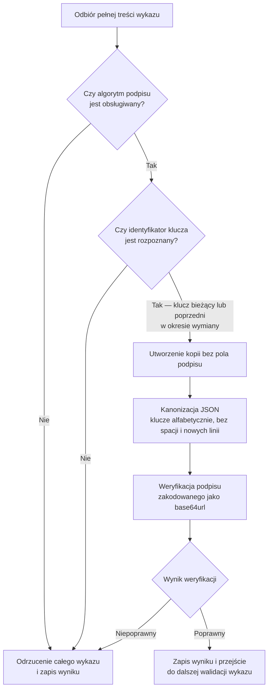
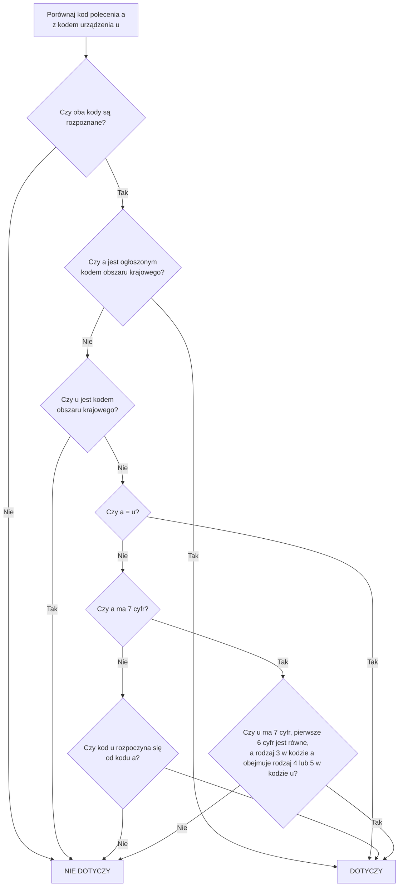
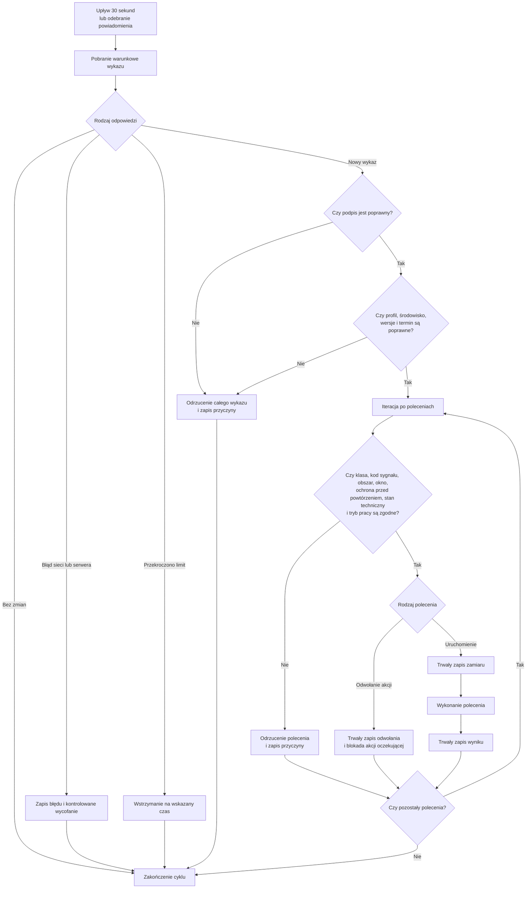

[← Powrót do podręcznika](../PODRECZNIK_v2_ROZDZIELONY.md#spis-treści)

# Załącznik nr 6 — Poziom 0: publiczny wykaz poleceń

## Adresaci i zakres załącznika

Załącznik jest przeznaczony dla osób projektujących i implementujących oprogramowanie sterownika.
Opisuje minimalny proces bezpiecznej integracji urządzenia z SOiA na poziomie 0, bez rejestracji
i bez dostępu do kanałów zamkniętych.

Wartości przytoczone niżej mają charakter **informacyjny**. Źródłem rozstrzygającym są punkty
dostępu wymienione w rozdziale 2: to one publikują aktualne wersje, identyfikatory kluczy
i słowniki. Wpisanie wartości z tego dokumentu na stałe, bez możliwości zmiany, jest błędem.

---

## 1. Zasada działania poziomu 0

Urządzenie pełni funkcję odbiornika. Okresowo pobiera podpisany wykaz poleceń, a następnie
weryfikuje podpis, obszar i czas przed rozpoczęciem emisji.

Na poziomie 0 urządzenie nie wysyła potwierdzeń ani telemetrii i nie posiada indywidualnej
tożsamości w kanałach zamkniętych. Komunikacja z publicznym punktem dostępu ma charakter odczytu.

---

## 2. Punkty dostępu

Wszystkie pod adresem produkcyjnym `alarm.soia.info`, metodą odczytu, bez uwierzytelnienia.

| Punkt | Co zwraca |
|---|---|
| `/api/v1/iot/feed` | podpisany wykaz poleceń — zasadnicze źródło |
| `/api/v1/iot/public-key` | klucz publiczny do weryfikacji podpisu, wraz z identyfikatorem i kluczami z okna wymiany |
| `/api/v1/iot/public-key.pem` | ten sam klucz w postaci surowej |
| `/api/v1/iot/profile` | opis profilu klienta, obsługiwane klasy urządzeń i kody sygnałów |
| `/api/v1/iot/dictionaries` | aktualna wersja słowników klas urządzeń i kodów sygnałów |

**Lista jest zamknięta.** Nie ma i nie będzie punktu dostępu, z którego sterownik pobierałby
zawartość dźwiękową: system przenosi polecenie, nie dźwięk. Pliki wzorcowe udostępnia się do
pobrania na stronie, a wgrywa przy instalacji.

### Limity rozmiaru danych

Wraz z opisem profilu ogłaszane są **maksymalne rozmiary**: pojedynczego polecenia i całego wykazu.
Urządzenie, które otrzyma treść większą, **odrzuca ją jako błąd** — nie jako brak poleceń — i pozostaje
sprawne.

Rdzeń wymagań powinien być możliwy do realizacji na mikrokontrolerze z ograniczoną pamięcią;
wykaz bez ogłoszonej górnej granicy byłby dla takiego urządzenia jednocześnie przyczyną
awarii i wektorem ataku. Wskazówka konstrukcyjna, a nie wymaganie: urządzenie o małej pamięci
powinno weryfikować i przetwarzać wykaz **strumieniowo**, bez buforowania go w całości.

Adres bazowy, tak jak identyfikator klucza, **musi być konfigurowalny**. Urządzenie, którego nie da
się przestawić na inny punkt dostępu bez udziału producenta, nie spełnia wymagań swobody wyboru
dostawcy.

---

## 3. Struktura wykazu

Wykaz jest dokumentem tekstowym w formacie JSON. Poza polami opisującymi same polecenia niesie
metadane pozwalające sprawdzić, **z czym urządzenie właściwie rozmawia**.

Pola koperty: nazwa profilu i jego wersja, środowisko, wersja słowników, czas wygenerowania, numer
kolejny wykazu, **termin ważności treści**, lista poleceń aktywnych, okno zdarzeń informacyjnych
oraz podpis wraz z algorytmem i identyfikatorem klucza.

Pola pojedynczego polecenia: własny identyfikator polecenia, rodzaj polecenia, klasa urządzenia
docelowego, kod sygnału, powiązanie z ostrzeżeniem źródłowym, numer kolejny polecenia, wykaz poleceń
zastępowanych, obszar wraz z geokodami, **czas, od którego i do którego wolno rozpocząć emisję**,
oraz czas utworzenia.

Osobno występuje **okno zdarzeń** — lista obowiązujących ostrzeżeń, przeznaczona do podglądu
i diagnostyki. **Obecność ostrzeżenia w tym oknie nie jest poleceniem** i nie uruchamia niczego.
Syrena rusza wyłącznie na podstawie pozycji z listy poleceń aktywnych.

---

## 4. Weryfikacja podpisu

Weryfikacja podpisu stanowi warunek rozpoczęcia dalszego przetwarzania wykazu. Szyfrowanie
połączenia nie zastępuje podpisu treści.

Podpis obejmuje wykaz **bez pola podpisu**. Jeżeli weryfikacja nie przechodzi mimo poprawnego
klucza, w zdecydowanej większości przypadków przyczyną jest **inna kolejność kluczy albo dodatkowe
białe znaki** we własnej serializacji — a nie błąd po stronie serwera.

Nieznany identyfikator klucza powoduje odmowę wykonania. Urządzenie musi jednak obsłużyć okres,
w którym jednocześnie obowiązują klucz bieżący i poprzedni, aby wymiana klucza nie powodowała
przerwy w działaniu urządzeń. Punkt dostępu z kluczem publicznym udostępnia oba klucze w okresie
nakładania.

Do sprawdzenia własnej implementacji służą **wektory wzorcowe**: deterministyczna para znanego
wykazu i znanego podpisu. Implementacja, która nie przechodzi wektorów wzorcowych, nie przejdzie
też odbioru.

---

## 5. Reguła obszaru

Polecenie dotyczy urządzenia wtedy, gdy **kod obszaru w poleceniu jest równy kodowi terenu
urządzenia albo wobec niego nadrzędny**. Zależność w drugą stronę nie wystarcza.

**Siódma cyfra kodu gminy jest znacząca.** Rejestr rozróżnia przez nią gminę miejską, wiejską
i miejsko-wiejską, a w tej ostatniej — samo miasto i sam obszar wiejski. Kody miasta i obszaru
wiejskiego mają wspólne sześć pierwszych cyfr, ale opisują **tereny rozłączne**: ostrzeżenie dla
miasta nie obejmuje otaczających wsi. Porównywanie gmin „po sześciu cyfrach” zawyża obszar alarmu.

Porównaniu podlegają wyłącznie kanoniczne oznaczenia kodów jednostek podziału terytorialnego.
Kody miejscowości i ulic należy pomijać, ponieważ mają odrębną numerację. Kod sześciocyfrowy,
pozbawiony cyfry rodzaju, podlega odrzuceniu jako niepełny. Niedopuszczalne jest korygowanie kodu
przez jego obcięcie lub dopełnienie. Jeżeli polecenie obejmuje wiele geokodów, wystarczające jest
dopasowanie co najmniej jednego z nich.

### Zasady konfiguracji obszaru działania urządzenia

Obszar działania urządzenia konfiguruje się siedmiocyfrowym kodem gminy, w której urządzenie jest
zlokalizowane. Sterownik obejmujący więcej niż jedną gminę otrzymuje listę kodów gmin, a nie kod
jednostki nadrzędnej.

Obszar ostrzeżenia może zostać wyznaczony geometrycznie na mapie. W takim przypadku polecenie
zawiera kody objętych gmin, a nie kod całego powiatu. Urządzenie skonfigurowane wyłącznie kodem
powiatu nie dopasuje kodów gminnych zawartych w takim poleceniu.

Oprogramowanie musi wykrywać konfigurację dwu- lub czterocyfrową i odrzucać ją albo jednoznacznie
zgłaszać jako błąd.

---

## 6. Warunki wykonania polecenia

Urządzenie uruchamia syrenę wyłącznie wtedy, gdy **wszystkie** poniższe są prawdziwe:

podpis jest poprawny, a identyfikator klucza znany; profil, środowisko i wersja słowników zgodne
z obsługiwanymi; termin ważności treści jeszcze nie minął; klasa urządzenia docelowego odpowiada
urządzeniu; kod sygnału jest znany i dozwolony; co najmniej jeden kod obszaru obejmuje teren
urządzenia; czas bieżący mieści się w oknie rozpoczęcia; identyfikator polecenia nie został
wcześniej wykonany; numer kolejny nie narusza ochrony przed powtórzeniem; stan techniczny pozwala
na bezpieczną emisję; tryb pracy nie jest serwisowy, zablokowany ani awaryjny.

**Niespełnienie któregokolwiek warunku daje wynik odmowny.** Bez wyjątków i bez interpretacji
rozszerzającej.

Brak polecenia w wykazie nie stanowi dyspozycji odcięcia trwającej emisji. Zniknięcie polecenia z wykazu znaczy,
że nie wolno go **rozpoczynać** — nie jest rozkazem odcięcia emisji już trwającej. Podobnie
obecność ostrzeżenia w oknie zdarzeń nie jest podstawą do uruchomienia czegokolwiek.

---

## 7. Odpytywanie

**Odstęp bazowy wynosi 30 sekund.** Odpytywanie częstsze wymaga osobnego uzgodnienia i mieści się
w limitach usługi; odpytywanie rzadsze nie spełnia wymagań.

Urządzenie stosuje zapytanie warunkowe ze znacznikiem wersji z poprzedniej odpowiedzi i obsługuje
odpowiedź „bez zmian”. Odpowiedź o przekroczeniu limitu należy respektować wraz ze wskazanym
czasem wstrzymania. Po błędach sieci stosuje się kontrolowane wycofanie zamiast ponawiania
w pętli.

**Losowe rozproszenie momentu odpytania jest obowiązkowe.** Bez rozproszenia urządzenia mogłyby
kierować żądania w tym samym czasie, powodując krótkotrwałe przeciążenie usługi.

> [!caution] Wymaga decyzji przed akceptacją — polling, jitter i Retry-After
> Wymaganie 30 sekund, rozproszenie momentu odpytania, backoff po błędzie i okres wstrzymania wskazany przez usługę muszą mieć jedną zatwierdzoną hierarchię. Redakcja nie rozstrzyga, jak urządzenie ma postąpić, gdy wyjątkowy `Retry-After` przekracza odstęp bazowy. Implementacja i odbiór wymagają wspólnej interpretacji tego przypadku.

Treść przeterminowana nie może stanowić podstawy wykonania polecenia. Brak możliwości pobrania
aktualnego wykazu skutkuje brakiem nowej emisji.

---

## 8. Dane przechowywane w pamięci trwałej

W pamięci trwałej, odpornej na zanik zasilania: ostatni zaakceptowany numer kolejny wykazu,
ograniczony zbiór wykonanych identyfikatorów poleceń wraz z czasem i wynikiem, identyfikatory
poleceń odwołanych oraz wersję ostatniego poprawnego wykazu.

Identyfikator wykonanego polecenia trzeba przechowywać **co najmniej do momentu, w którym nie może
już wrócić**: dłużej niż termin ważności wykazu, dłużej niż najpóźniejsze okno rozpoczęcia
i najpóźniejsze zdarzenie w oknie, z zapasem doby.

Ponowne otrzymanie tego samego polecenia — przez odpytanie, powiadomienie, wiadomość tekstową albo
radio — **nie może spowodować drugiej emisji**.

---

## 9. Algorytm działania klienta

Kolejność ma znaczenie: **zamiar zapisuje się przed uruchomieniem wyjścia**, nie po. Urządzenie,
które straci zasilanie w trakcie emisji, musi po powrocie wiedzieć, że emisja się rozpoczęła.

---

## 10. Minimalny zakres badań zgodności implementacji

Poprawne uruchomienie dla własnej gminy. Polecenie powiatowe i wojewódzkie obejmujące tę gminę.
Polecenie dla obcej gminy — bez reakcji. Rozróżnienie miasta i obszaru wiejskiego w gminie
miejsko-wiejskiej. Niepoprawny podpis, nieznany identyfikator klucza i zmodyfikowana treść —
odrzucenie. Wykaz przeterminowany i okno rozpoczęcia zamknięte — brak emisji. Ten sam identyfikator
polecenia po restarcie — brak drugiej emisji. Odwołanie przed rozpoczęciem — brak emisji. Odwołanie
po zakończeniu — zapis, bez działania. Wyłączony kanał szybki, wykrycie zmiany samym odpytywaniem.
Odpowiedź z pamięci pośredniej starsza niż oczekiwana — ponowienie. Obsługa odpowiedzi poprawnych,
„bez zmian”, o przekroczeniu limitu i o niedostępności usługi.

Pełny wykaz scenariuszy odbiorowych zawiera załącznik nr 10.

---

## 11. Typowe błędy implementacyjne i działania korygujące

| Objaw | Przyczyna | Działanie korygujące |
|---|---|---|
| Podpis nie przechodzi mimo poprawnego klucza | inna kolejność kluczy albo białe znaki we własnej serializacji | sortuj klucze alfabetycznie, buduj tekst bez spacji |
| Podpis nie przechodzi po wymianie klucza | urządzenie zna tylko klucz poprzedni | pobierz klucz z punktu dostępu; obsłuż okno nakładania |
| Odpowiedź o przekroczeniu limitu | zbyt częste odpytywanie albo brak rozproszenia | wróć do odstępu bazowego, honoruj czas wstrzymania |
| Syrena milczy mimo ostrzeżenia | ostrzeżenie bez zaznaczenia syren albo poza oknem rozpoczęcia | to jest zachowanie poprawne — polecenie powstaje tylko dla ostrzeżeń z jawnym zaznaczeniem |
| Syrena milczy przy alercie rysowanym po mapie | urządzenie skonfigurowane kodem powiatu | skonfiguruj listą kodów gmin |
| Emisja powtarza się po restarcie | zapis zamiaru dopiero po uruchomieniu wyjścia albo brak trwałości | zapisuj zamiar przed uruchomieniem, w pamięci trwałej |
| Urządzenie działa mimo braku łączności | działanie na treści przeterminowanej | sprawdzaj termin ważności przed każdym wykonaniem |

---
